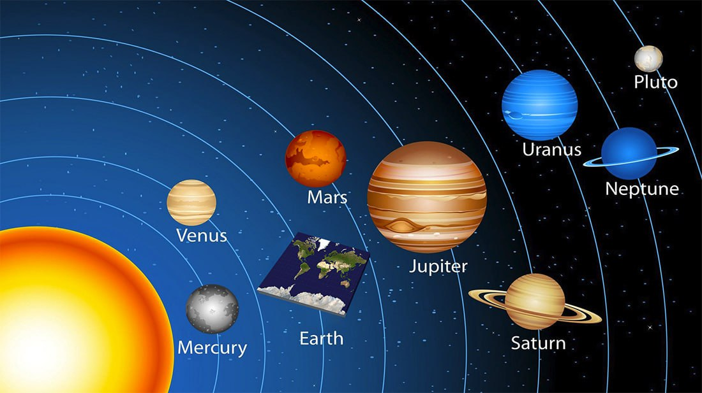{fig-align="center"}

------------------------------------------------------------------------

Все системы координат в ГИС можно поделить на две группы:

-   **географические** - общеземные системы координат, которые используют широту и долготу в качестве координат с градусами как единицами измерения, измерения здесь выполняются на сфере/эллипсоиде;

-   **прямоугольные** - стандартные плоские прямоугольные декартовы координаты, как правило, с метрическими единицами измерения, измерения ведутся на плоскости.

Прямоугольные системы координат в современной литературе могут еще называться спроецированными (калька с английского слова "projected")

# Географическая система координат

::::: columns
::: {.column width="50%"}
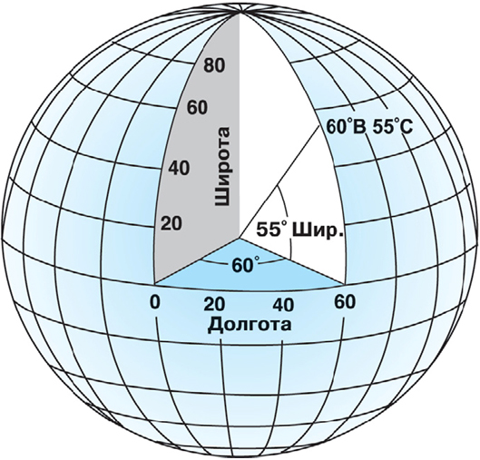{fig-align="center"}
:::

::: {.column width="50%"}
**Широтой** точки называется угол, образованный отвесной линией в данной точке и плоскостью экватора. Этот угол отсчитывается от плоскости экватора на север или на юг, изменяясь от 0 до 90. Широта бывает северная (+) и южная (-).

**Долготой** точки называется двугранный угол, заключенный между плоскостью начального (Гринвичского) меридиана и плоскостью меридиана, проходящего через данную точку. От начального нулевого меридиана долготу отсчитывают на восток и запад, до 180. Соответственно, долгота называется восточной (+) и западной (-).[^1]
:::
:::::

[^1]: <https://portal.tpu.ru/SHARED/p/POCELUEV/ucheba/Geodesy/Lab3.pdf>

# Прямоугольная система координат

::::: columns
::: {.column width="50%"}
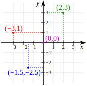{fig-align="center"}
:::

::: {.column width="50%"}
**Прямоуго́льная (дека́ртова) систе́ма координа́т** — прямолинейная система координат с взаимно перпендикулярными координатными осями на плоскости или в пространстве. Часто используемая система координат. Просто обобщается для пространств любой размерности[^2].
:::
:::::

[^2]: Прямоугольная система координат <https://ru.wikipedia.org/wiki/%D0%9F%D1%80%D1%8F%D0%BC%D0%BE%D1%83%D0%B3%D0%BE%D0%BB%D1%8C%D0%BD%D0%B0%D1%8F_%D1%81%D0%B8%D1%81%D1%82%D0%B5%D0%BC%D0%B0_%D0%BA%D0%BE%D0%BE%D1%80%D0%B4%D0%B8%D0%BD%D0%B0%D1%82>

------------------------------------------------------------------------

Любая система координат в ГИС состоит из нескольких компонентов:

-   картографическая проекция, в которую входят:

    -   датум или эллипсоид

    -   поверхность, на которую проецируется изображение

-   оси, их направление;

-   начало системы координат;

-   единицы измерения.

> Система координат базируется на картографической проекции, которая определяет используемый эллипсоид (в иностранной литературе часто называемый датумом) и способ проецирования поверхности Земли на плоскость (используемую поверхность относимости и расположение центра проецирования). К полученному изображению Земли на плоскости добавляется начало системы координат и ее оси.

# Понятие картографической проекции

Картографическая проекция - это математически определенный способ отображения поверхности Земли (либо другого небесного тела) на плоскость.

Основная суть проекций связана с тем, что фигуру небесного тела заменяют на другую, которую легко развернуть на плоскость.

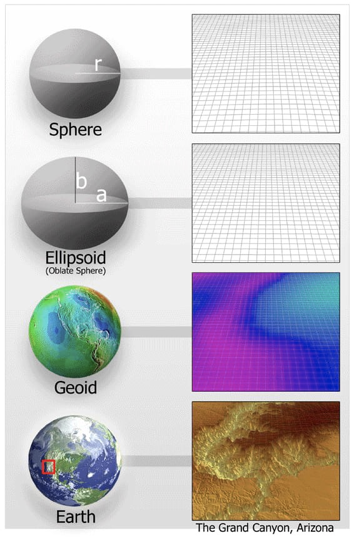{fig-align="center"}

------------------------------------------------------------------------

::::: columns
::: {.column width="40%"}
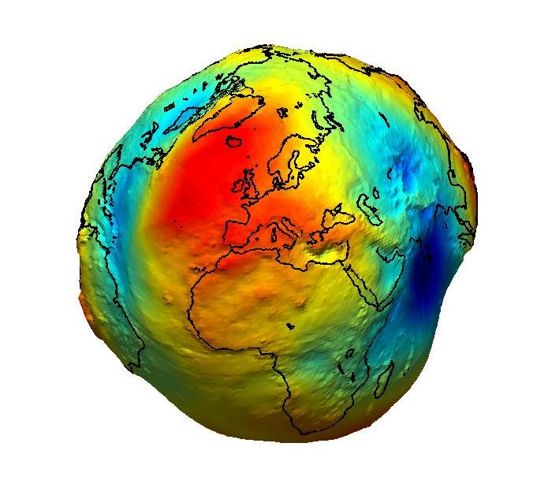{fig-align="center"}
:::

::: {.column width="60%"}
```{=html}
<video width="1000" height="700" controls>
  <source src="images/2103_061_AR_EN.mp4" type="video/mp4">
</video>
```
:::
:::::

------------------------------------------------------------------------

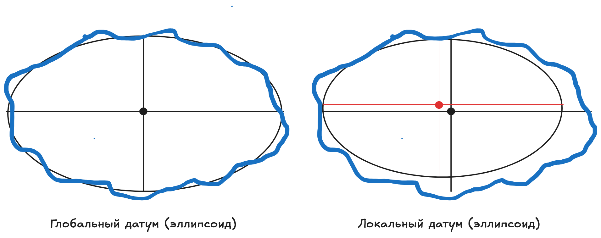

------------------------------------------------------------------------

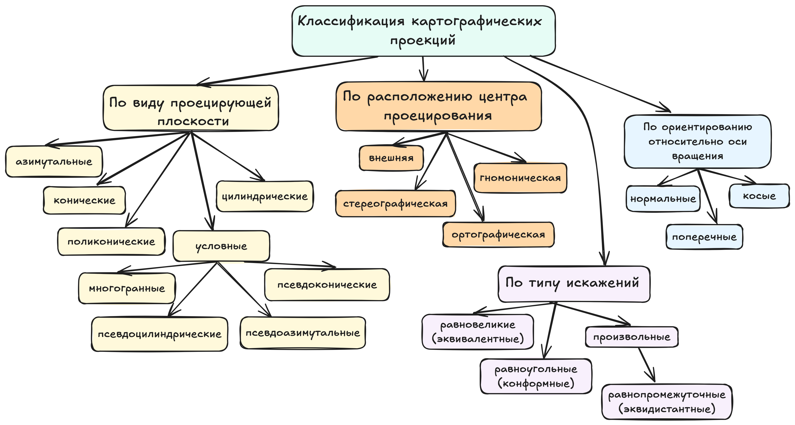

------------------------------------------------------------------------

::: callout-important
## Важно

Картографические проекции могут искажать размеры, форму и углы между линиями. Невозможно получить проекцию без искажений двух из трех величин. Как правило, подбор проекции осуществляется, исходя из того, какой из этих параметров важнее всего сохранить неизменным, пожертвовав остальными двумя.
:::

::::: columns
::: {.column width="70%"}
**Африканский союз призвал отказаться от проекции Меркатора, чтобы увеличить размеры Африки на современных географических картах**

💬Может показаться, что это просто карта, но на самом деле это не так. Проекция Меркатора создает ложное впечатление, будто Африка — „маргинальный“ континент, несмотря на то что это второй по площади континент в мире с населением более 1 млрд человек💬, — приводит [слова Хаддади агентство Reuters](https://www.reuters.com/world/africa/african-union-urges-adoption-world-map-showing-continents-true-size-2025-08-14/).

Хаддади подчеркнула, что использование подобных карт формирует негативные стереотипы об Африке, которые влияют на СМИ, образование и политику.
:::

::: {.column width="30%"}
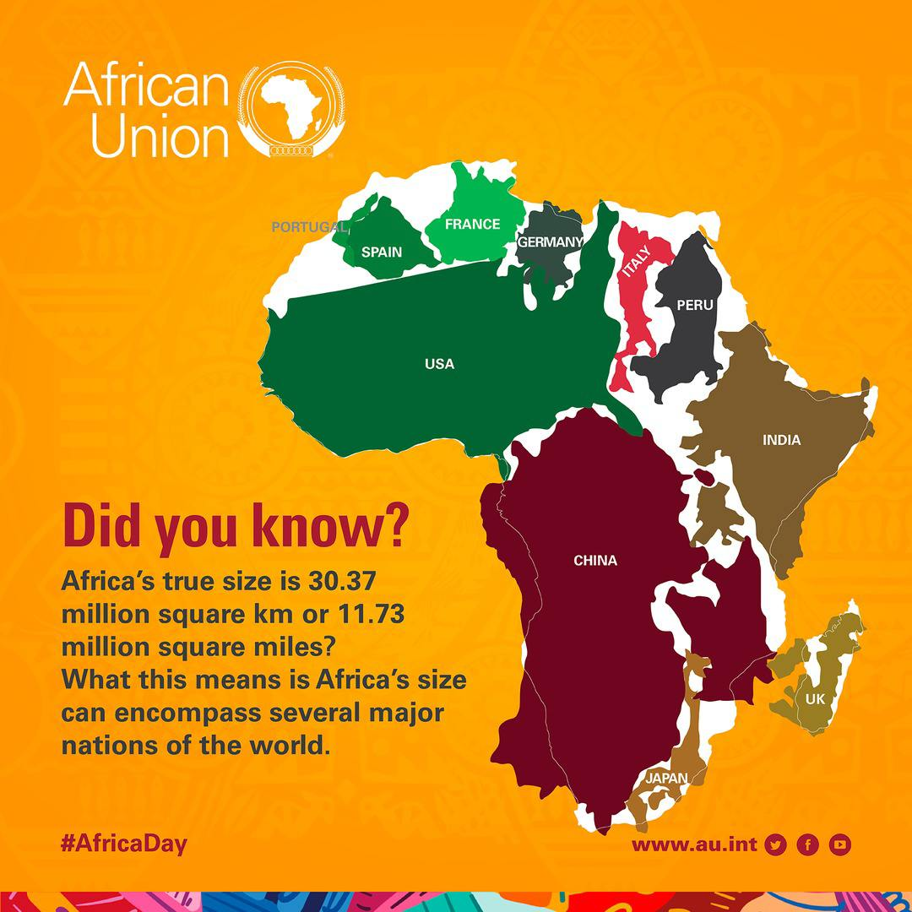{fig-align="center" width="700"}
:::
:::::

------------------------------------------------------------------------

Классификация по виду проецирующей поверхности:

::::: columns
::: {.column width="50%"}
-   ***азимутальные проекции*** используют плоскость, которая касается поверхности Земли в одной точке. Именно эта точка не будет иметь никаких искажений, при отдалении от нее к краю плоскости искажения, как правило, возрастают;
:::

::: {.column width="50%"}
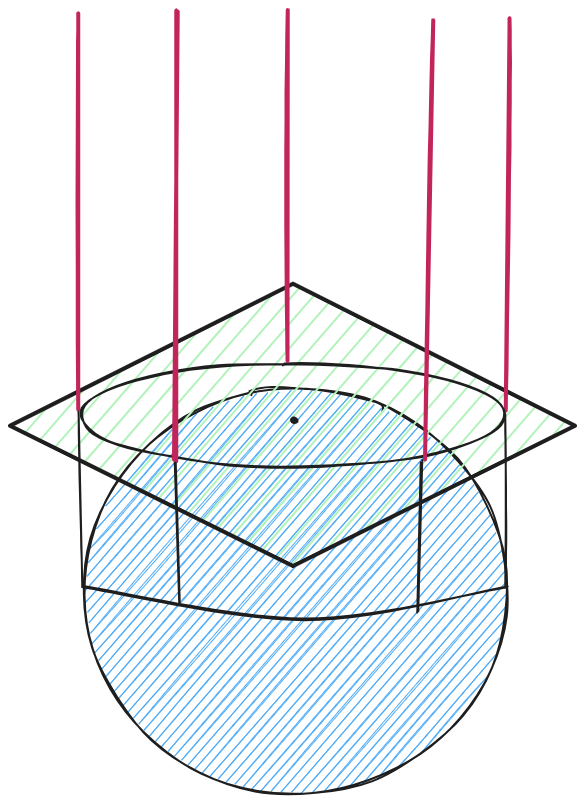{fig-align="center" width="436"}
:::
:::::

------------------------------------------------------------------------

-   ***конические проекции***, которые вписывают объемное тело в конус, касающийся тела по одной линии. Линия касания является линией отсутствия искажений, в то время как при удалении от нее эти искажения возрастают, при этом, при приближении к вершине конуса, искажение происходит в сторону уменьшения, а при приближении к основанию - в сторону увеличения. Впоследствии конус разворачивается на плоскость;

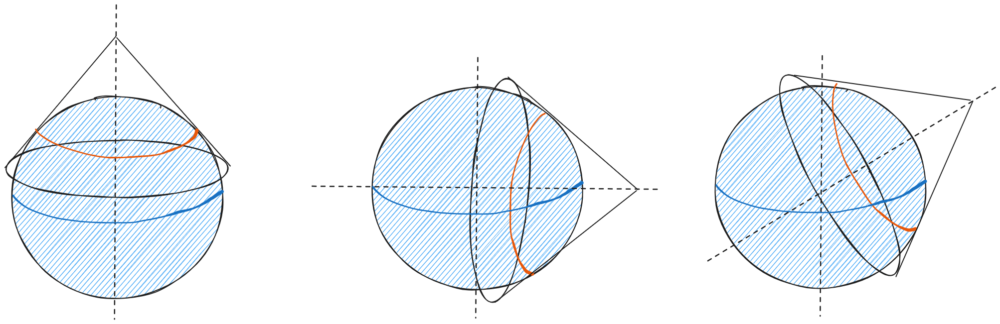

------------------------------------------------------------------------

-   ***цилиндрические проекции*** используют в качестве поверхности проецирования цилиндр, касающийся поверхности объемного тела по одной линии. Эта линия будет определять истинный масштаб карты и будет линией отсутствия искажений, при удалении от которой искажения будут возрастать;

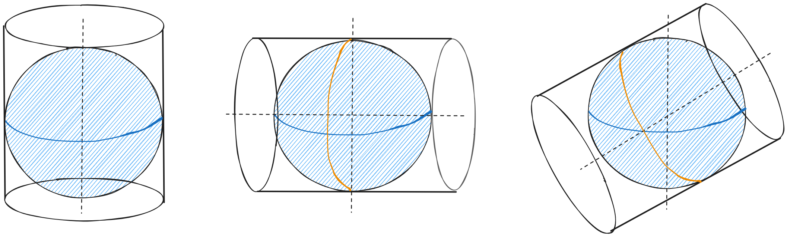

------------------------------------------------------------------------

Классификация по ориентированию относительно оси вращения:

-   ***нормальные или прямые*** (в случае с азимутальными проекциями - ***полярные***) - ось вращения Земли совпадает с осью вращения поверхности проецирования (для азимутальных проекций - точка касания находится на одном из полюсов);

-   ***поперечные*** - ось вращения поверхности проецирования находится в плоскости экватора и перпедикулярна оси вращения Земли (для азимутальных проекций - точка касания находится на линии экватора);

-   ***косые*** - ось вращения повеохности проецирования расположена под произвольным углом по отношению к оси вращения Земли (для азимутальных проекций - расположение точки касания на поверхности Земли произвольно).

------------------------------------------------------------------------

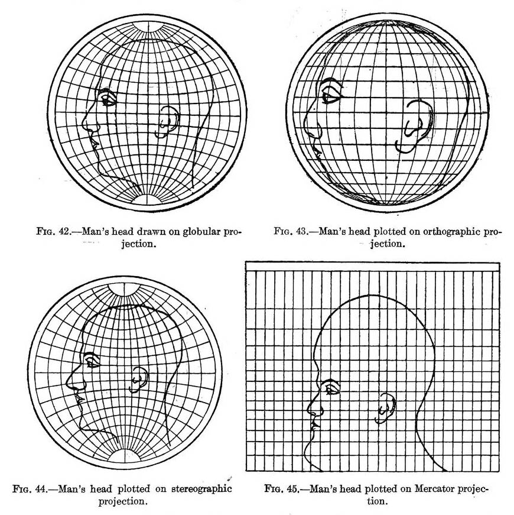{fig-align="center" width="749"}

------------------------------------------------------------------------

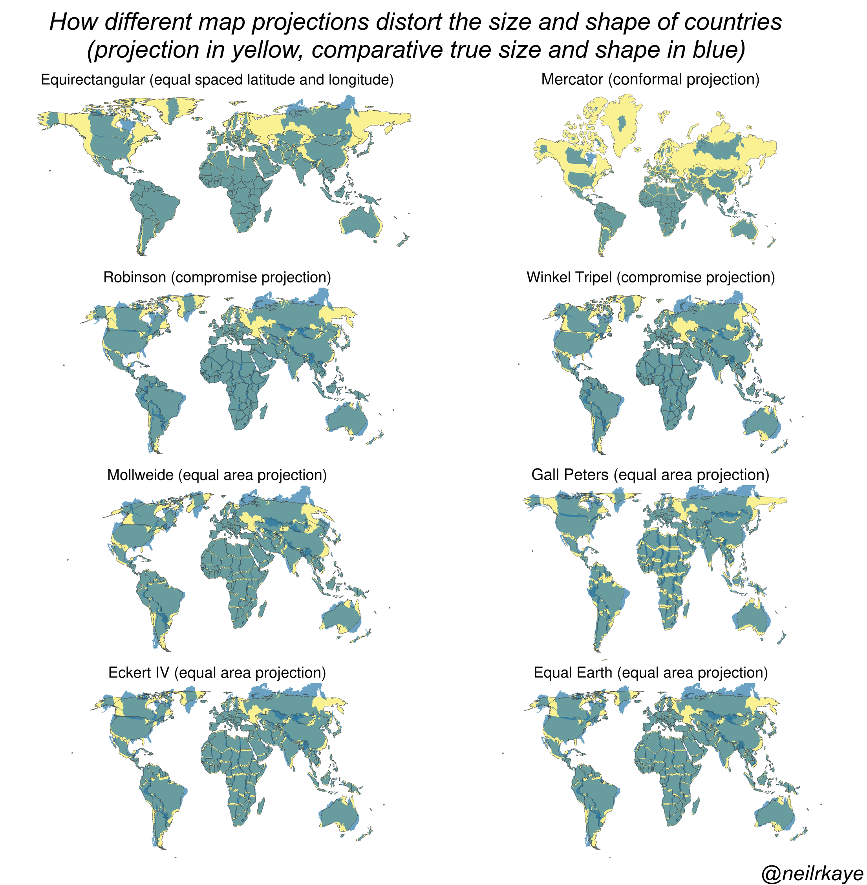{fig-align="center" width="783"}

------------------------------------------------------------------------

::::: columns
::: {.column width="50%"}
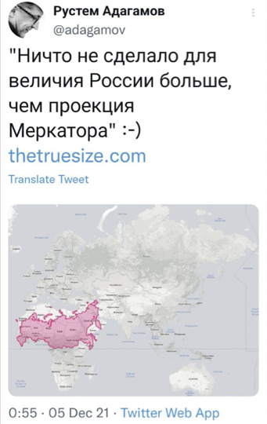{fig-align="center" width="505"}
:::

::: {.column width="50%"}
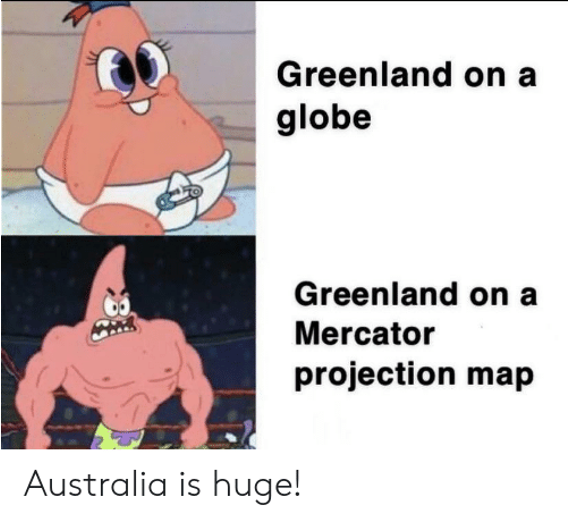{fig-align="center" width="762"}
:::
:::::

# Реестр систем координат

В настоящее время используется единая классификация систем координат в ГИС – ***реестр EPSG***, изначально созданный *European petroleum survey group* и получивший от нее свою аббревиатуру.

Кроме него также могут использоваться данные других реестров систем координат, например, одноименный реестр компании ESRI.

::: callout-tip
Официальный сайт реестра - <https://epsg.org/home.html>

(Неофициальный) сайт реестра -
:::

------------------------------------------------------------------------

-   ***EPSG:4326***

    WGS 84 - WGS84 - World Geodetic System 1984, used in GPS

-   ***EPSG:3857***

    WGS 84 / Pseudo-Mercator - Spherical Mercator, Google Maps, OpenStreetMap, Bing, ArcGIS, ESRI

-   ***ESRI:102025***

    Asia North Albers Equal Area Conic

# Как подобрать систему координат/проекцию?

Однозначного ответа, увы, здесь нет.

. . .

В первую очередь, необходимо понять, какой параметр объектов наиболее важно сохранить: **размеры, длины или углы**? Кроме того, следует учитывать расположение картографируемой области, так как для разных типов проекций искажения будут наименее выраженными в определенных областях.

Если ориентироваться на минимизацию искажений, то можно использовать методику, предложенную в [Атласе картографический проекций для крупных регионов России](https://kartfak.ru/wp-content/uploads/2023/03/%D0%90%D1%82%D0%BB%D0%B0%D1%81_%D0%BF%D1%80%D0%BE%D0%B5%D0%BA%D1%86%D0%B8%D0%B9_%D0%98%D0%B2%D0%B0%D0%BD%D0%BE%D0%B2_%D0%97%D0%B0%D0%B3%D1%80%D0%B5%D0%B1%D0%B8%D0%BD.pdf).

## Экваториальная зона {.smaller}

Если картографируемый участок находится в **экваториальной зоне**:

-   **вытянут вдоль параллелей**, то рекомендуется использовать *нормальную цилиндрическую или нормальную коническую проекции*
    -   равновеликая коническая для азиатской части Северного полушария (ESRI:102026)

    -   равновеликая коническая проекция Альберса для азиатской части Северного полушария (ESRI:102025)

    -   нормальная цилиндрическая равновеликая проекция (ESRI:54034)
-   **компактной формы**, то рекомендуется использовать *нормальную коническую или азимутальную проекцию* с точкой касания к поверхности Земли у центра картографируемого участка (поперечную или косую)
    -   равновеликая коническая для азиатской части Северного полушария (ESRI:102026)

    -   равновеликая коническая проекция Альберса для азиатской части Северного полушария (ESRI:102025)

    -   поперечная азимутальная равновеликая проекция (ESRI:53032)
-   **вытянут в произвольном направлении** (под углом к параллелям и меридианам), то рекомендуется использование *цилиндрической проекции* с таким расположением оси вращения, чтобы линия касания проходила максимально близко к центру участка.

------------------------------------------------------------------------

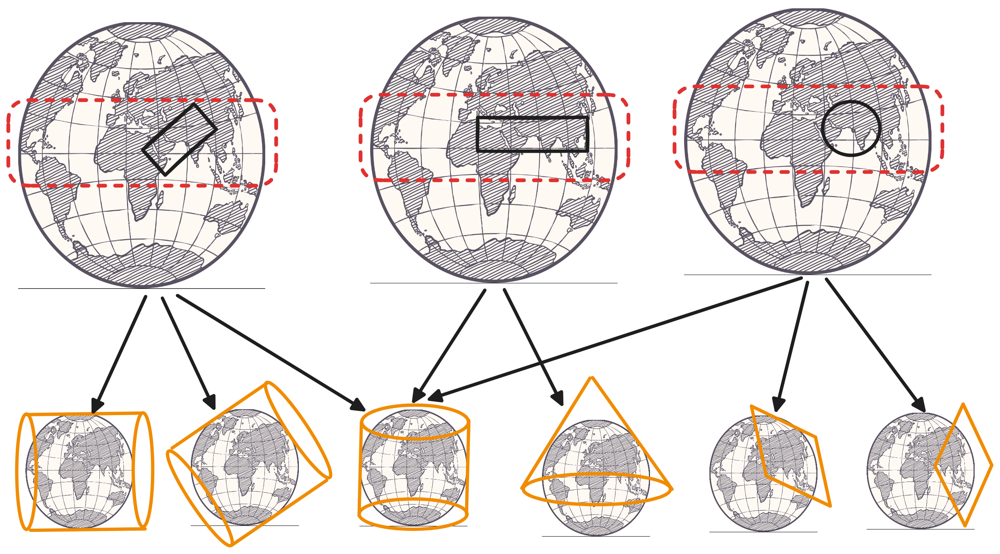

## Средние широты {.smaller}

Если участок исследования расположен в **средних широтах** (применимо как к северному, так и южному полушарию):

-   **вытянут вдоль параллелей**, то рекомендуется использование *прямой конической проекции* для соответствующего полушария (северного или южного)

    -   равновеликая коническая проекция Альберса для азиатской части Северного полушария (ESRI:102025)

-   **компактной формы**, то рекомендуется использование *нормальной конической проекции или азимутальной проекции* с точкой касания в центре участка

    -   равновеликая коническая проекция Альберса для азиатской части Северного полушария (ESRI:102025)

-   **вытянут в произвольном направлении** (под углом к параллелям и меридианам), то рекомендуется использование *поперечной или косой цилиндрической проекции* (расположение оси вращения здесь выбирается так, чтобы минимизировать искажения на участке)

    -   универсальные поперечные проекции Меркатора - аналог проекции Гаусса-Крюгера (с 34 зоны для Северного полушария EPSG:32634 по 60 зону EPSG:32660, а также 1 и 2 зоны - EPSG:32601 и EPSG:32602 соответственно)

------------------------------------------------------------------------

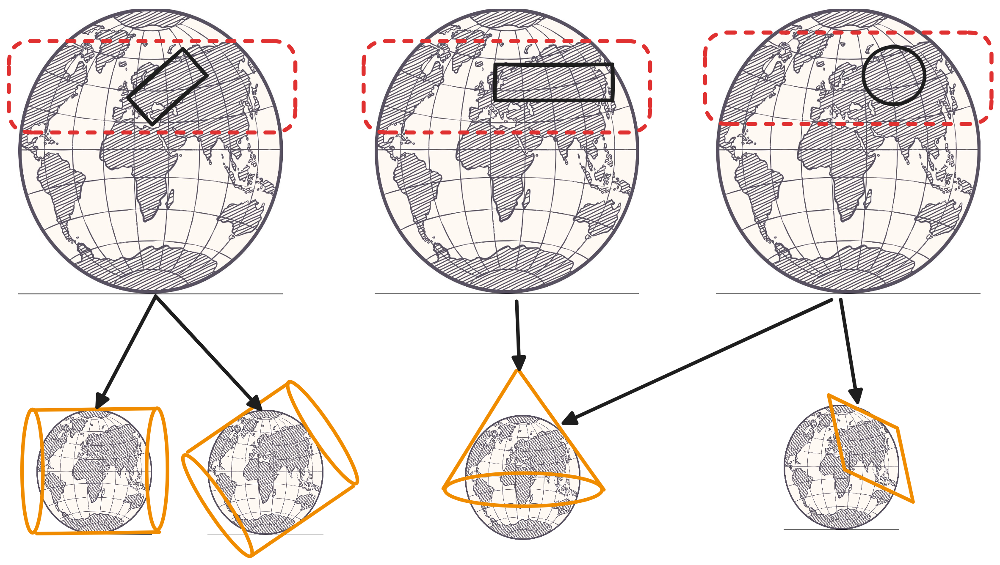

## Приполярные области {.smaller}

Если участок расположен в **приполярной области** (применимо к обоим полушариям):

-   **вытянут вдоль параллелей или вытянут в произвольном направлении**, то рекомендуется использовать *полярную азимутальную проекцию*

    -   полярная азимутальная проекция Ламберта (EPSG:17300)

    -   полярная равнопромежуточная проекция для Северного полюса (ESRI:102016)

    -   полярная равновеликая проекция Ламберта для Северного полюса (ESRI:102017)

-   имеет **компактную форму**, то рекомендуется использование *полярной или косой азимутальной проекции* (в зависимости от конкретного расположения участка для минимизации искажений рекомендуется располагать точку касания по центру отображаемого участка)

    -   полярная азимутальная проекция Ламберта (EPSG:17300)

    -   полярная равнопромежуточная проекция для Северного полюса (ESRI:102016)

    -   полярная равновеликая проекция Ламберта для Северного полюса (ESRI:102017)

------------------------------------------------------------------------

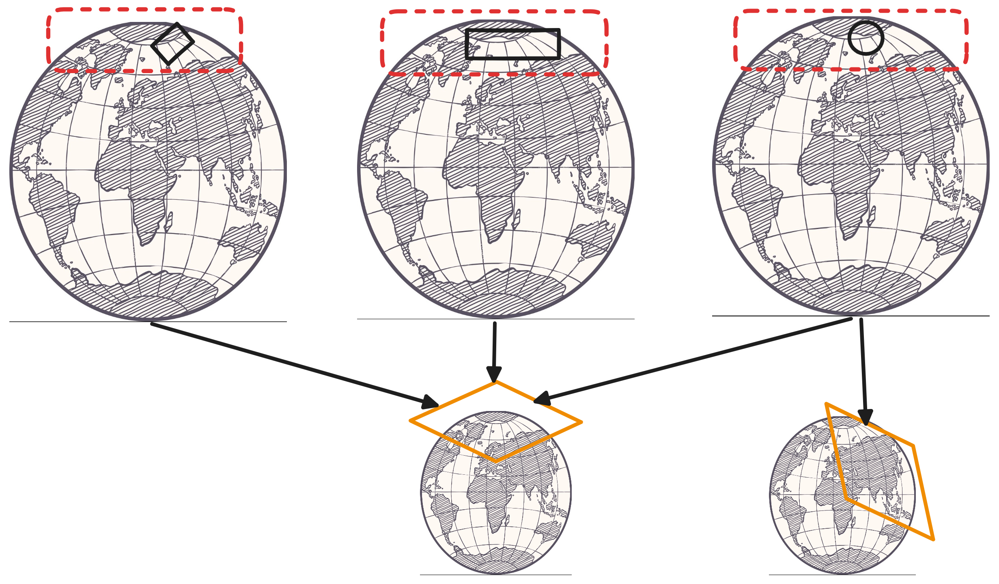

------------------------------------------------------------------------

Для маленьких территорий (например, территория города) лучше брать системы координат UTM (Universal Transverse Mercator - универсальная поперечная проекция Меркатора) – по сути аналог системы координат Гаусса-Крюгера. Особенно, если вы хотите выполнять какие-либо измерения на вашей карте.

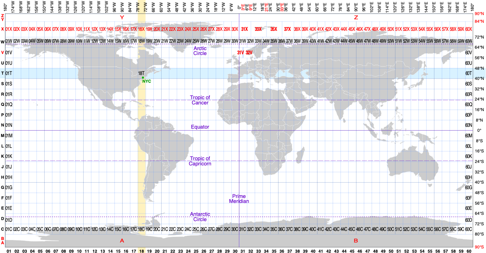{fig-align="center"}

# Универсальная поперечная проекция Меркатора (UTM)

Так как эта система координат зональная, то есть определяется только в пределах конкретных диапазонов долгот, то необходимо определять зону, в которой расположена ваша исследуемая территория.

Определить зону можно по формуле:

$$
Номер\space зоны = (Долгота + 180^\circ)/6
$$

Полученное число нужно округлить в большую сторону.

::: callout-note
Существуют специальные онлайн-калькуляторы для определения номера зоны по координатам. Например, <https://www.latlong.net/lat-long-utm.html>
:::

# Сервисы для поиска и подбора систем координат

-   Projection wizard <https://projectionwizard.org/>

-   World map generator <https://www.worldmapgenerator.com/en/wizard/step/projection/>

-   Map projection explorer <https://www.geo-projections.com/>

-   Compare map projections <https://map-projections.net/singleview.php>

-   Map projections <https://bella-mir.github.io/proj-guesser/#/>

-   <https://spatialreference.org/>

# Форматы описания систем координат в ГИС

Есть два основных формата описания параметров систем координат:

-   WKT (well known text) - текстовый формат описания параметров систем координат и параметров перехода между ними;

Компания ESRI использует несколько иную реализацию формата WKT для описания СК, она обычно называется **ESRI WKT** и используется, в частности, в ArcGIS.

-   proj4 - строковое описание системы координат, базирующее на проекте [proj](https://github.com/OSGeo/PROJ).

::: callout-tip
proj как библиотека широко используется в работе с системами координат в различных языках программирования.
:::

# Формат описания WKT

Международный формат описания WKT закреплен [стандартом Open Geospatial Consortium](https://www.ogc.org/standards/wkt-crs/).

Описание системы координат состоит из **ключевых слов и атрибутов** этих ключевых слов. Ключевые слова указываются перед квадратными скобками, а атрибуты — внутри скобок. Кроме того, атрибуты могут содержать вложенные ключевые слова.

Пример фрагмента описания системы координат: `KEYWORD1[attribute1,KEYWORD2[attribute2,attribute3]]`

------------------------------------------------------------------------

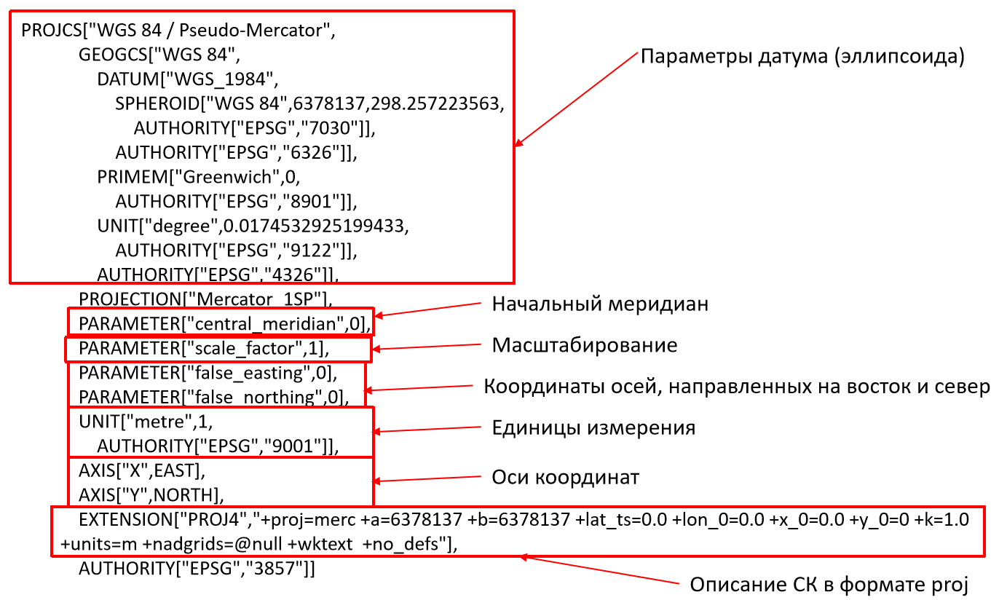

# Формат описания PROJ {.scrollable}

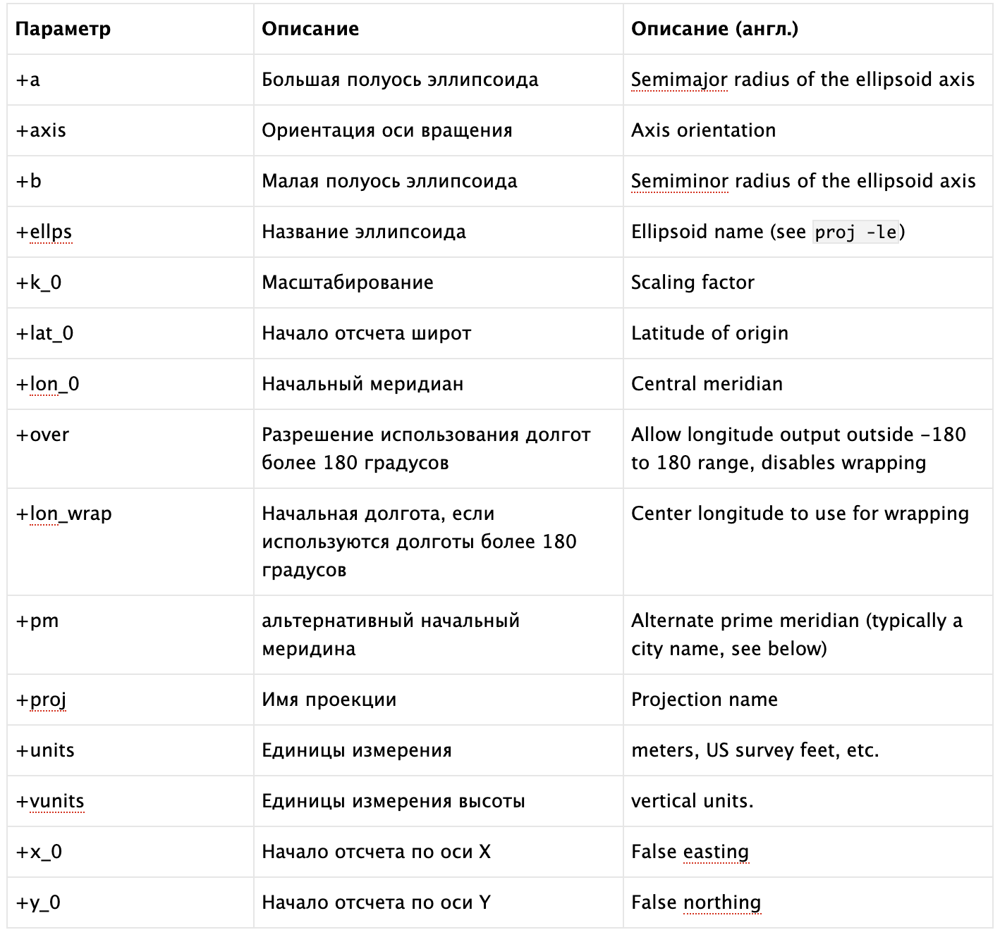{fig-align="center"}

------------------------------------------------------------------------

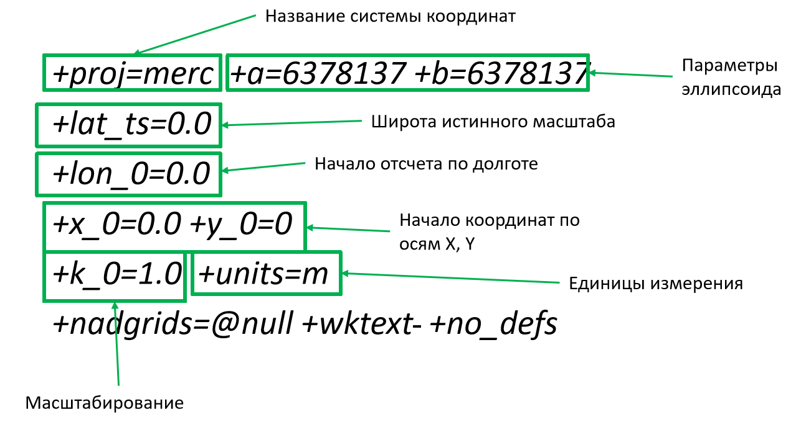

# Есть подвох

. . .

Подвох в том, что значительное количество документов в кадастре и градостроительстве ведутся в ***местных системах координат***.

Местные системы координат определяются в границах субъектов РФ.

. . .

::: callout-warning
Этих систем координат нет ни в каких реестрах, поэтому их параметры необходимо прописывать самостоятельно.
:::

# Немного про местные системы координат

Местные системы координат вообще вводились для ведения кадастра недвижимости.

Все, что вносится в ЕГРН с координатами, должно быть вычислено в местной системе координат, но в силу своей специфики они имеют значительные ошибки и искажения.

Какие могут быть особенности местных систем координат с точки зрения параметров:

-   требуется указать параметры сдвига начала отсчета;

-   необходимо использовать нестандартный датум (эллипсоид);

-   необходимы дополнительные преобразования.

------------------------------------------------------------------------

Первый вариант самый простой, так как необходимость изменения минимальна.

Во втором варианте возможны несколько ситуаций:

-   параметров датума нет в EPSG;

-   в EPSG нет параметров перехода от WGS 84 к нужному датуму;

-   в EPSG есть параметры перехода от WGS 84, но они рассчитаны для другого датума.

::: callout-note
В некоторых случаях может использоваться до 7 параметров преобразования, например, в МСК-33[^3].

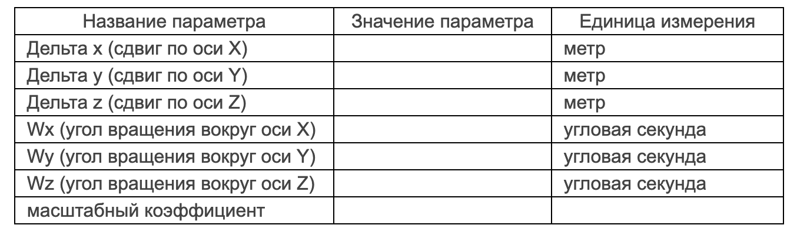
:::

[^3]: Постановление Губернатора Владимирской обл. от 26.10.2009 N 876 «Об утверждении Положения о местной системе координат Владимирской области (МСК-33)» <https://docs.cntd.ru/document/965012231>

# Системы координат в QGIS

В QGIS каждый добавленный слой и набор данных имеет свою собственную систему координат, а также есть система координат проекта, в которой отрисовываются данные на экране и выполняются некоторые расчеты. Эти системы координат могут (а в некоторых случаях для расчетов - должны) совпадать, а могут быть различны и могут изменяться независимо друг от друга.

::: callout-important
Взаимная независимость систем координат позволяет работать одновременно с данными в разных системах, при этом отображая их в той системе координат, которая более удобна пользователю.
:::

------------------------------------------------------------------------

Работа с системами координат в QGIS имеет несколько вариантов:

-   **перепроецирование слоев** (для растровых слоев иногда называемое деформацией) - пересчет слоя из одной системы координат в другую;

-   **присвоение/назначение системы координат** слоям, в которых ее нет или задана некорректно;

-   **создание пользовательских систем координат** - внесение параметров нестандартных систем координат в каталог программы;

-   **перепроецирование на лету** - изменение системы координат проекта, то есть системы координат, в первую очередь используемой для отображения данных на экране, которое не затрагивает системы координат отдельных слоев.

------------------------------------------------------------------------

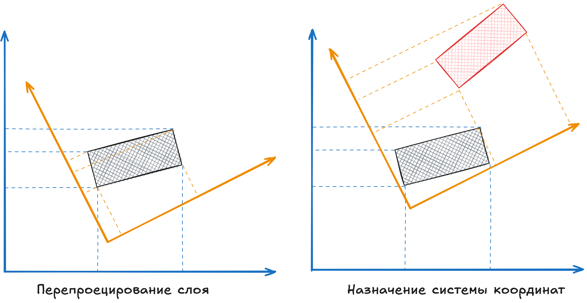

# Литература

1.  Запорожченко А.В. Картографические проекции и методика их выбора для создания карт различных типов <https://gistoolkit.ru/download/doc/projections.pdf>

2.  Мозжерин В.В. Практикум по картографии. Математическая основа карт (учебно-методическое пособие). Казань: Изд-во КГУ, 2005. – 99 с. <https://kpfu.ru/docs/F1435536248/mozzherinmetodichkaofcartography_61.pdf>

3.  Иванов А.Г., Загребин Г.И. Атлас картографических проекций на крупные регионы Российской федерации: учебно-наглядное издание. – М.: МИИГАиК, 2012. – 19 с.: ил. <https://kartfak.ru/2023/03/14/картографические-проекции/>
