# Привязка растров

В качестве исходной информации при векторизации, как правило, выступают растровые изображения. Это могут быть отсканированные оригиналы бумажных карт, выдержки из официальной документации, информация с градостроительных порталов, из градостроительной документации, спутниковые снимки или снимки, полученные с беспилотных летательных аппаратов, даже просто скриншоты экрана, а также тайловые подложки (типа той, что мы подгружаем из OpenStreetMap).

**Геопривязка растра** - это присвоение растровому изображению нужной географической системы координат.

В процессе привязки на растровом изображении для каждого пикселя, у которого есть условные координаты на растре, находится соотвествующая координата в целевой системе координат.

Создадим новый проект (рекомендую либо сразу его создавать в системе координат `EPSG:3857`, либо сразу после создания перепроецировать на лету в эту систему координат).

Для геопривязки растровых изображений в QGIS существует встроенный инструмент [Привязка растров](https://docs.qgis.org/3.28/en/docs/user_manual/working_with_raster/georeferencer.html) (может называться Геопривязка).

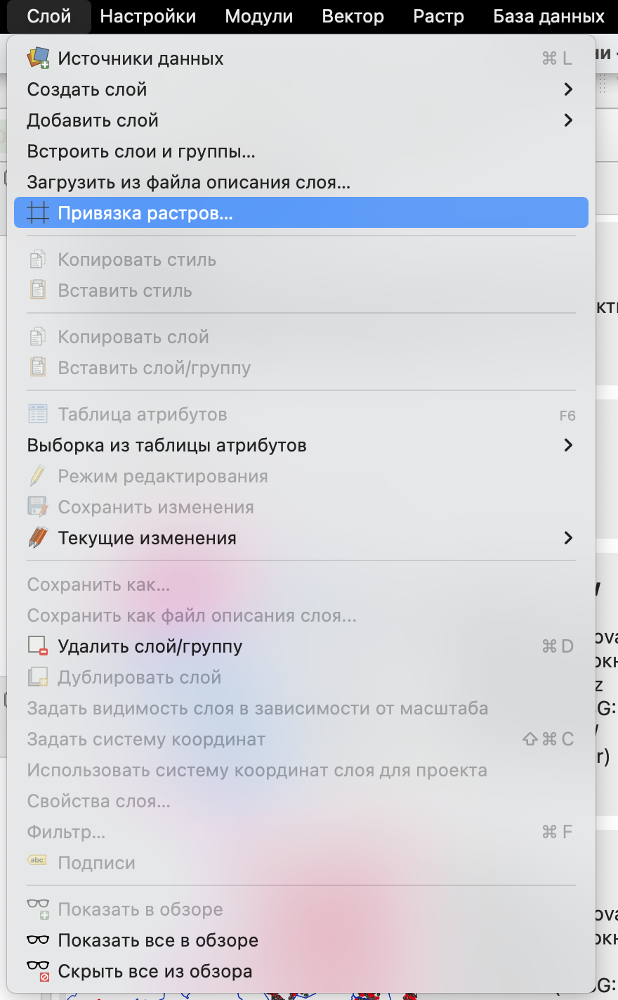{fig-align="center" width="433"}

Далее откроется окно геопривязки растра.

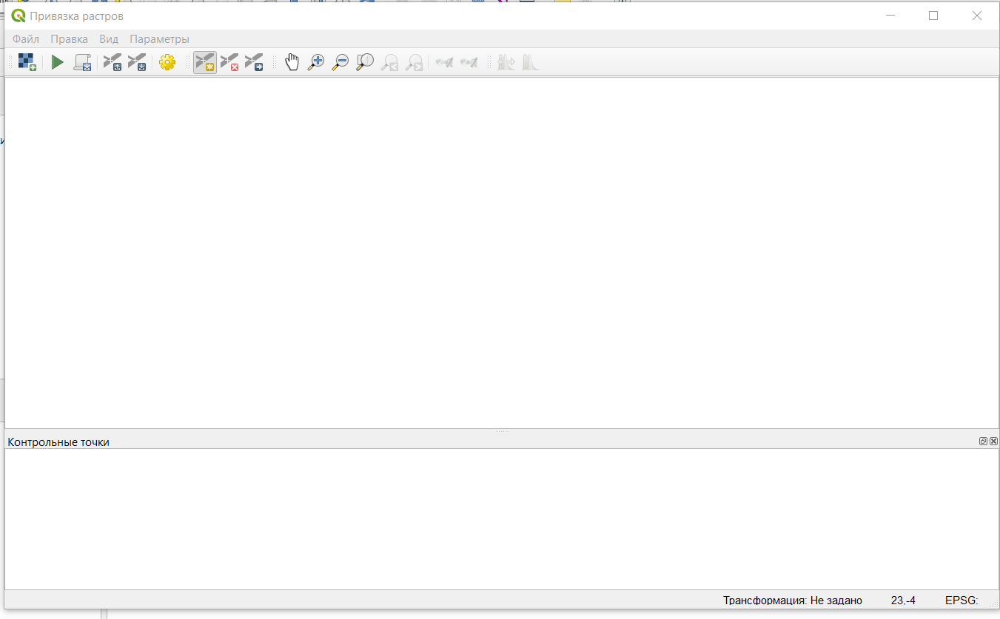{fig-align="center" width="1291"}

В первую очередь нужно задать или проверить параметры трансформации растра (в строке меню *Параметры* $\longrightarrow$ *Параметры трансформации*).

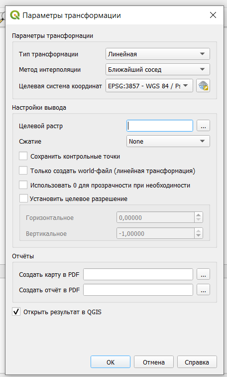{fig-align="center" width="422"}

Основные параметры здесь:

-   тип трансформации - алгоритм преобразования растрового изображения, подробнее [здесь](https://docs.qgis.org/3.28/en/docs/user_manual/working_with_raster/georeferencer.html#available-transformation-algorithms);

-   метод интерполяции;

-   целевая система координат - система координат, которую вы хотите присвоить растру;

-   целевой растр - нужно указать путь и название файла, полученного в результате привязки.

::: callout-note
Тип трансформации будет определять манипуляции, выполняемые с растром: это может быть просто линейный пересчет координат или вместе с масштабированием и растяжением.

Примерно различные варианты типов трансформации показаны ниже.

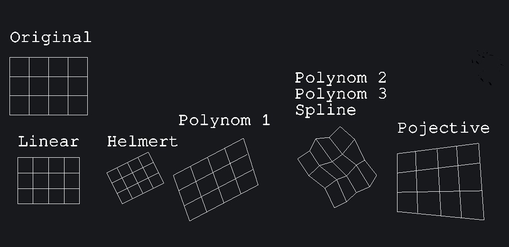{fig-align="center" width="1231"}
:::

Для выполнения привязки нужно открыть растр 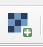, указать контрольные точки и их координаты в целевой системе координат.

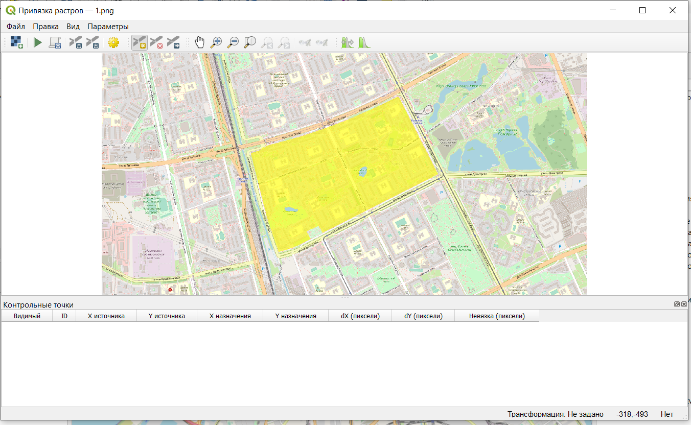{fig-align="center" width="1300"}

Контрольные точки - это точки, по которым будет осуществляться привязка растрового изображения. У этих точек известны координаты на растровом изображении (как правило, в пикселях) и в целевой системе координат, то есть фактически по этим точкам растр "усаживается" в нужное место на карту.

Чтобы поставить контрольную точку, нужно щелкнуть на нее в окне привзяки на растре, а далее указать ее координаты в диалоговом окне.

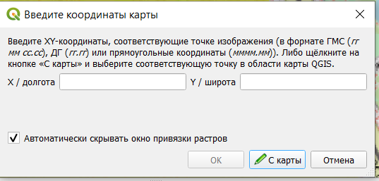{fig-align="center" width="627"}

Координаты можно ввести с клавиатуры (если они у вас есть), либо выбрать вариант **С карты** и просто щеклнуть на ту же самую точку на карте, после чего эти координаты пропишутся в диалоговом окне автоматически.

В качестве контрольных точек лучше всего использовать какие-то жесткие контура, на которых вы однозначно можете указать конкретную точку: угол дома, перекресток, угол парка и что-нибудь подобное.

Для различных вариантов трансформации рекомендуется разное минимальное число контрольных точек, но, как правило, общая рекомендация использовать не менее 3 точек. Желательно, чтобы эти точки не были расположены на одной линии.

После того, как вы укажете все контрольные точки и их координаты на карте, они будут отображены в таблице под растровым изображением в окне привязки.

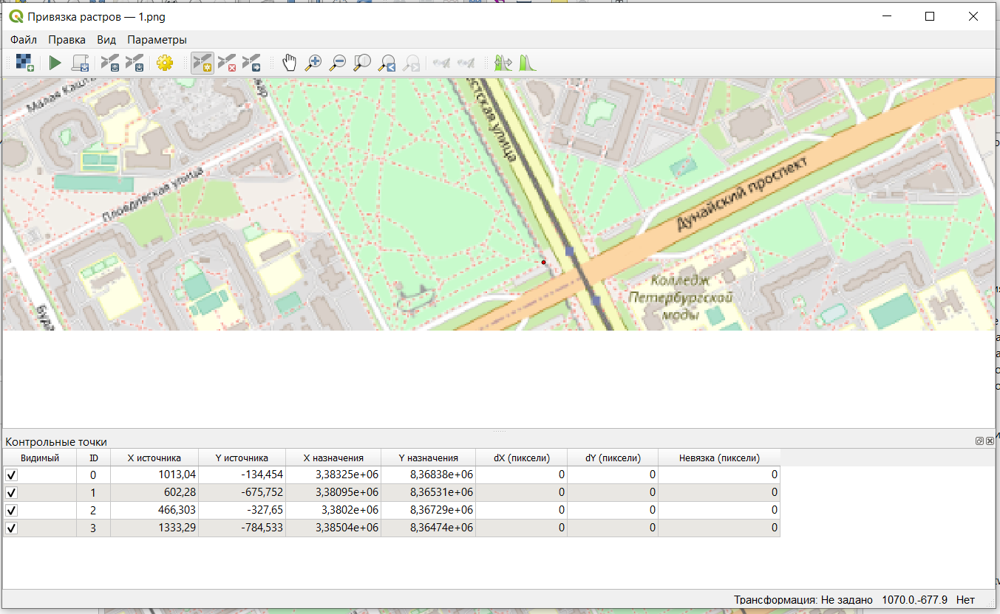{fig-align="center" width="1301"}

Контрольные точки привязки можно сохранить и потом использовать в дальнейшем в других проектах (но только для того же самого растра).

Для завершения процесса привязки нужно нажать **Начать привязку растра** 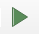 после чего растр будет модифицирован и отобразиться в нужном месте на карте.

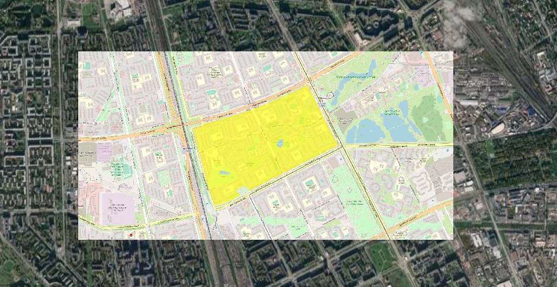{fig-align="center" width="967"}

Этот модифицированный растр уже будет иметь в себе сведения о системе координат и его местоположении, поэтому его потом можно будет использовать в дальнейших проектах уже без процесса привязки.

::: callout-tip
Для ручной привязки существует модуль *Freehand raster georeferencer* <https://github.com/gvellut/FreehandRasterGeoreferencer>

После установки он появится у вас на панели инструментов.

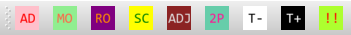{fig-align="center"}

При использовании этого модуля, вы добавляете свой растр напрямую в основное окно проекта на карту, а далее уже манипулируете им так, чтобы добиться оптимального размещения:

-   *move raster* (переместить)

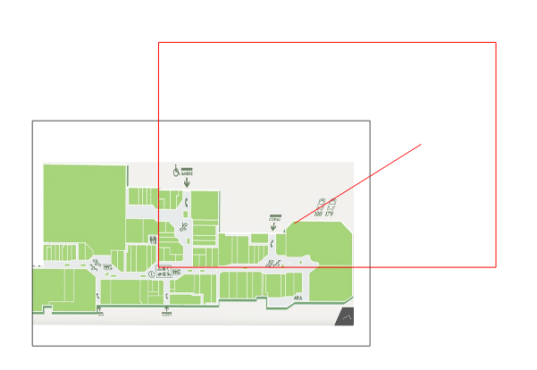{fig-align="center"}

-   *rotate raster* (вращение)

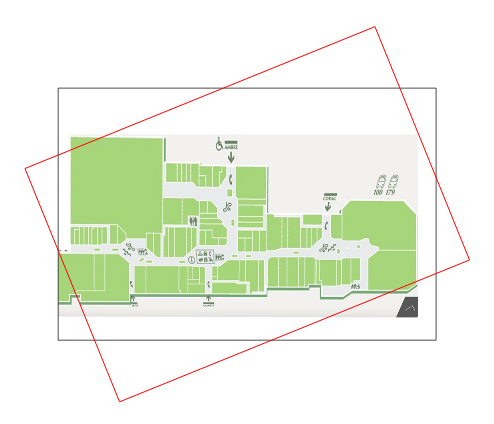{fig-align="center"}

-   *scale raster* (масштабирование)

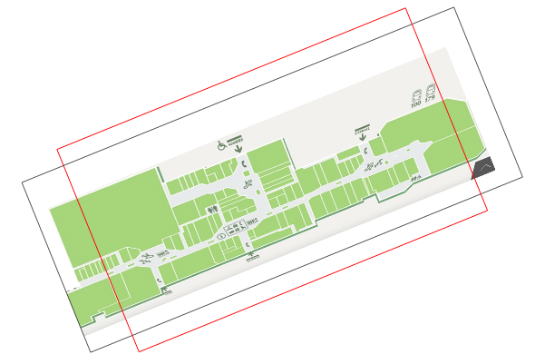{fig-align="center"}

-   *adjust sides of raster* (масштабирование отдельных сторон)

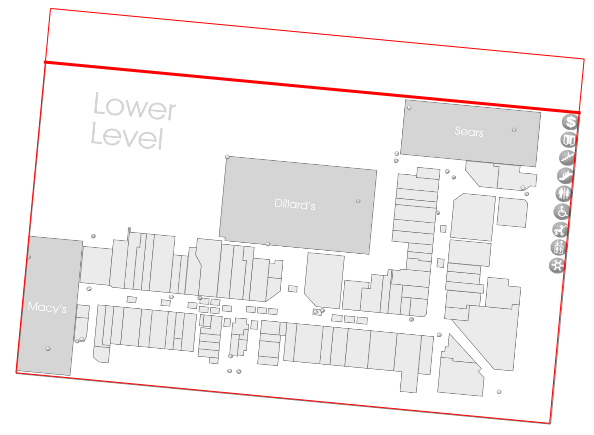{fig-align="center"}

-   *georeference with 2 points* - одноременное перемещение, вращение и масштабирование растра для привязки по двум контрольным точкам.
:::

# Автоматическая векторизация

## Встроенные стредства QGIS

По умолчанию в QGIS есть инструмент преобразования растра в вектор, то есть автоматической векторизации.

Этот инструмент может быть запущен из строки меню *Растр* $\longrightarrow$ *Преобразование* $\longrightarrow$ *Создание полигонов (растр в вектор)*.

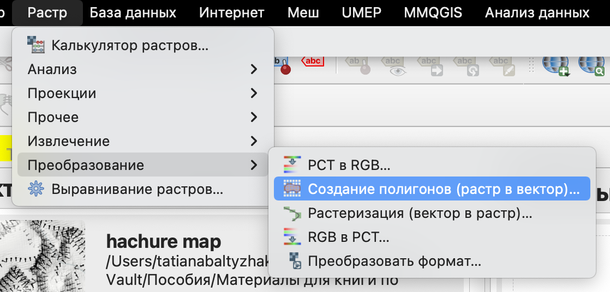{fig-align="center" width="1043"}

С документацией можно ознакомиться по [ссылке](https://docs.qgis.org/3.40/en/docs/training_manual/complete_analysis/raster_to_vector.html).

Пример работы автоматического векторизатора показан ниже.

```{=html}
<iframe width="800" height="400" src="https://www.youtube.com/embed/mQmw3N1dLFo?si=G95HGqiv-xtGZNmg" title="YouTube video player" frameborder="0" allow="accelerometer; autoplay; clipboard-write; encrypted-media; gyroscope; picture-in-picture; web-share" referrerpolicy="strict-origin-when-cross-origin" allowfullscreen></iframe>
```

::: callout-important
Так как автоматическая векторизация здесь осуществляется фактически только по цвету пикселей вашего растра, то идеальным случаем для векторизации будут большие полигоны с равномерной заливкой и без контура, в других случаях вы можете получить слишком много маленьких полигонов, которые будут требовать дополнительной проработки и объединения.

Также следует отметить, что полученные полигоны не будут иметь гладкие и ровные стороны, а будут своеобразными "лесенками", в силу того, что пиксели напрямую преобразовываются в объекты.
:::

## Модуль Bunting labs AI

Страница модуля: <https://plugins.qgis.org/plugins/buntinglabs-qgis-plugin/>

Сайт модуля: <https://buntinglabs.com/solutions/ai-vectorizer-qgis-plugin>

Репозиторий с кодом: <https://github.com/BuntingLabs/buntinglabs-qgis-plugin>

В январе 2024 года компания Bunting Labs выпустила плагин для QGIS Bunting Labs AI Vectorizer, который помогает оцифровывать растры, продолжая линии, начатые пользователем. Разработчики называют это "автозаполнением", потому что плагин не делает всю работу сразу, а дорисовывает части линий на основе контекста, оставляя пользователю возможность в любой момент перехватить контроль.[^1]

[^1]: **Плагин для AI-оцифровки растров в QGIS -** <https://cartetika.ru/tpost/4dta8sa621-plagin-dlya-ai-otsifrovki-rastrov-v-qgis>

Плагин **AI Vectorizer** работает так: когда пользователь начинает отрисовывать векторный объект, модель "смотрит" на его действия и продолжает эту линию, независимо от ее значения.

Пользователь начинает оцифровывать линию или полигон по растру, и как только есть первые две вершины, маленький кусочек карты отправляется на сервер. Модель "смотрит" на нарисованный на карте отрезок и выбирает пиксели, по которым должны проходить следующие вершины, после чего плагин дорисовывает 50 следующих точек линии. Этот процесс подходит для любых линий, даже для пунктирных и тех, которые пересекают другие похожие объекты. А если плагин собьется с пути, можно просто отменить последний шаг и не терять при этом много времени.

Перед работой необходимо зарегистрировать аккаунт по [ссылке](https://buntinglabs.com/account/register). После этого вам на указанную в форме электронную почту придет письмо для активации аккаунта.

Далее следует установить модуль **Bunting Labs AI Vectorizer.**

```{=html}
<iframe width="800" height="400" src="https://www.youtube.com/embed/PKEuQS4sMJE?si=5KlOz7JT4-WM5aPq" title="YouTube video player" frameborder="0" allow="accelerometer; autoplay; clipboard-write; encrypted-media; gyroscope; picture-in-picture; web-share" referrerpolicy="strict-origin-when-cross-origin" allowfullscreen></iframe>
```

::: callout-warning
Судя по всему модуль теперь работает бесплатно только в течение 30 дней с момента активации работы с ним.
:::

```{=html}
<iframe width="800" height="400" src="images/miscgif.mp4" title="YouTube video player" frameborder="0" allow="accelerometer; autoplay; clipboard-write; encrypted-media; gyroscope; picture-in-picture; web-share" referrerpolicy="strict-origin-when-cross-origin" allowfullscreen></iframe>
```

```{=html}
<iframe width="800" height="400" src="images/miscgif3.mp4" title="YouTube video player" frameborder="0" allow="accelerometer; autoplay; clipboard-write; encrypted-media; gyroscope; picture-in-picture; web-share" referrerpolicy="strict-origin-when-cross-origin" allowfullscreen></iframe>
```

::: callout-tip
Также в модуль входит сервис привязки с использованием искусственного интеллекта <https://buntinglabs.com/solutions/ai-georeferencer.>

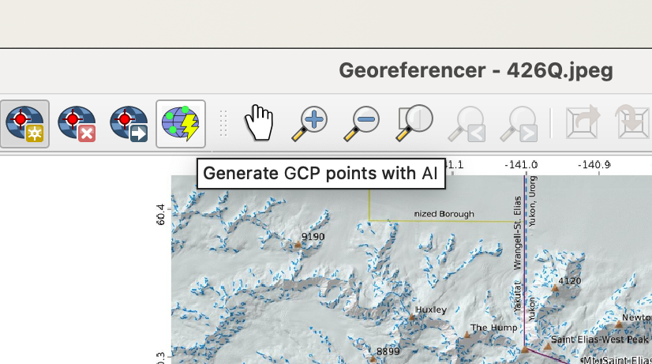{fig-align="center"}
:::

::: callout-tip
В качестве бесплатной альтернативы можно воспользоваться модулем [Raster tracer](https://github.com/mkondratyev85/raster_tracer).

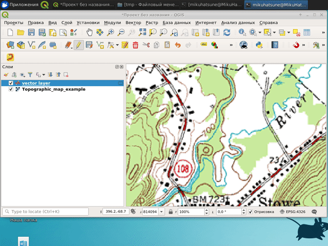{fig-align="center"}

Краткую инструкцию по работе с модулем можно прочитать по [ссылке](https://vk.com/wall62864383_1594) или посмотреть видео.

```{=html}
<iframe width="600" height="400" src="https://www.youtube.com/embed/vHH1dYonmfo?si=l4qfOF3z0PiPMXWh" title="YouTube video player" frameborder="0" allow="accelerometer; autoplay; clipboard-write; encrypted-media; gyroscope; picture-in-picture; web-share" referrerpolicy="strict-origin-when-cross-origin" allowfullscreen></iframe>
```

Этот модуль работает только для линейных объектов, но при необходимости контура можно впоследствии преобразовать в полигоны.

{fig-align="center" width="560"}
:::
