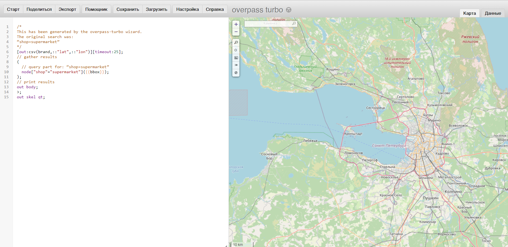
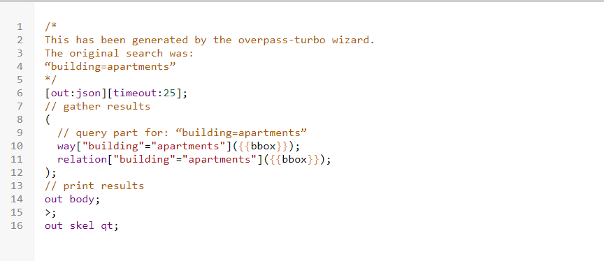
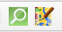
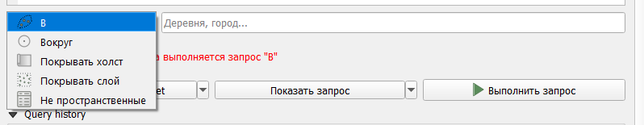
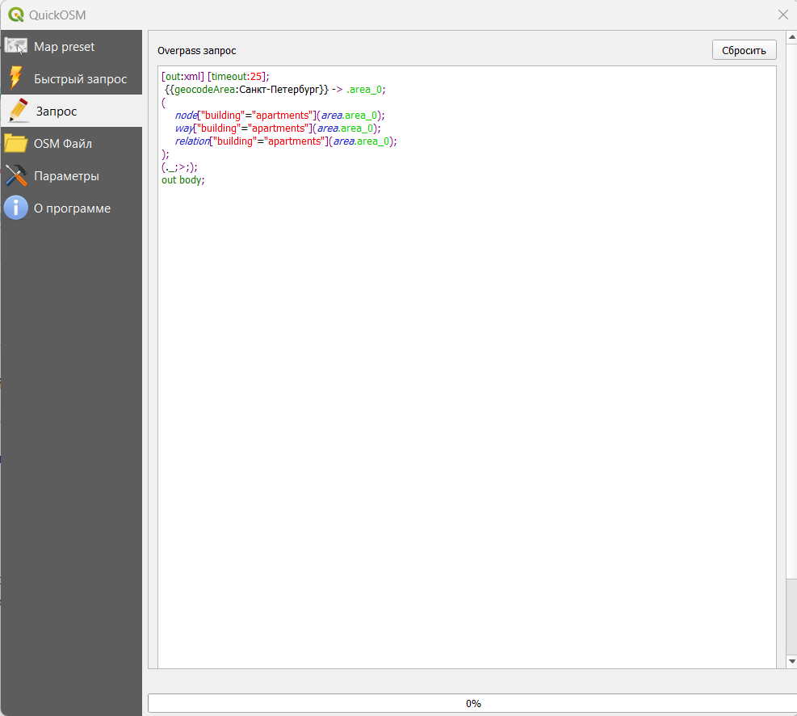
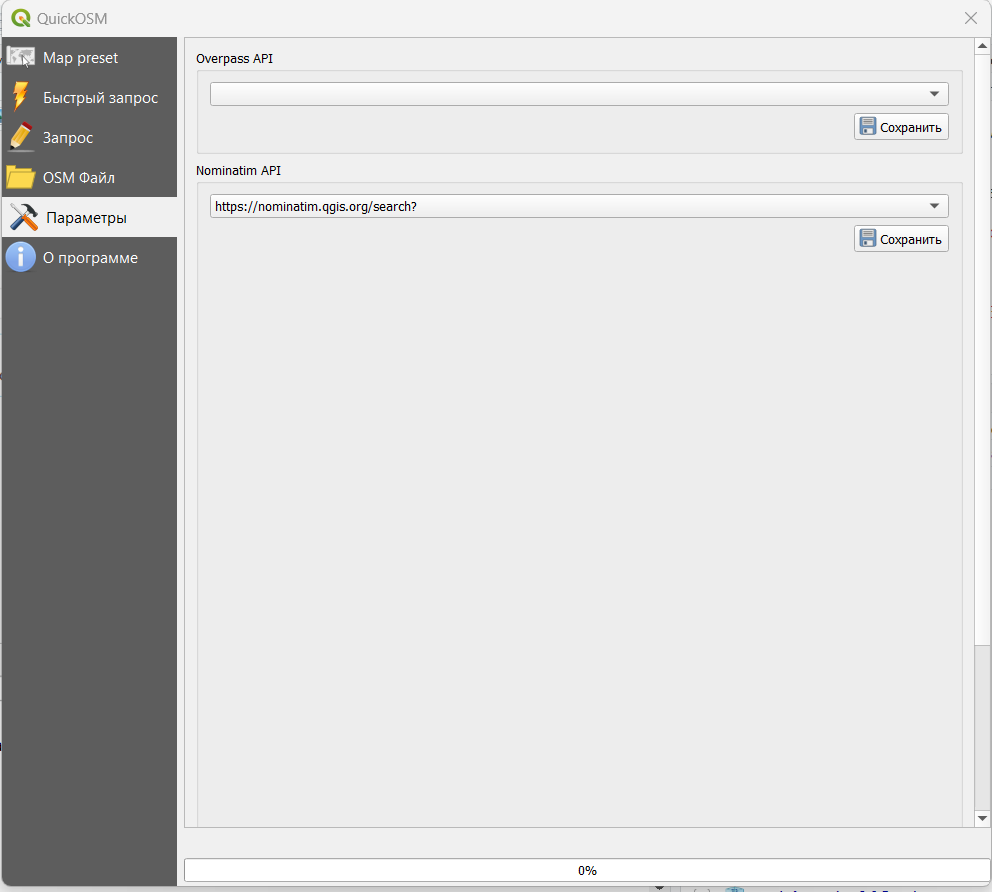
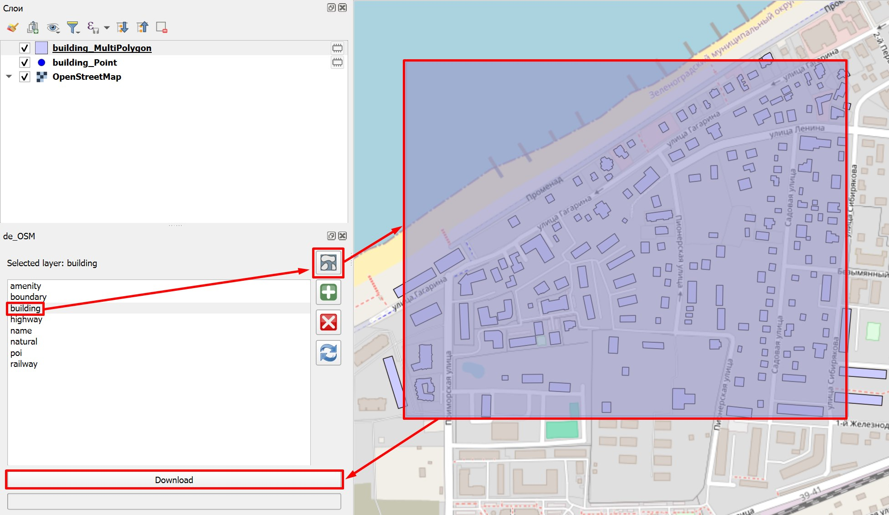
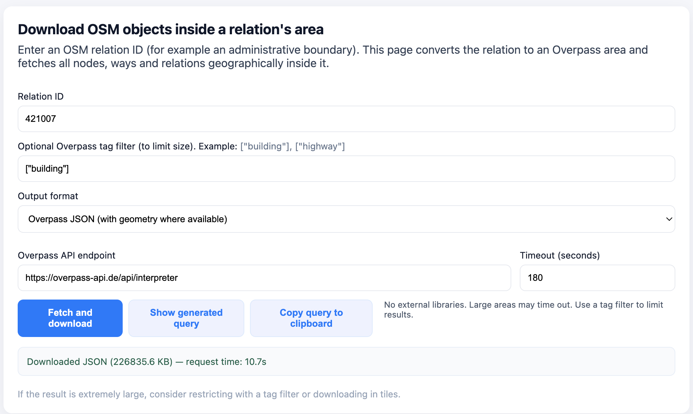
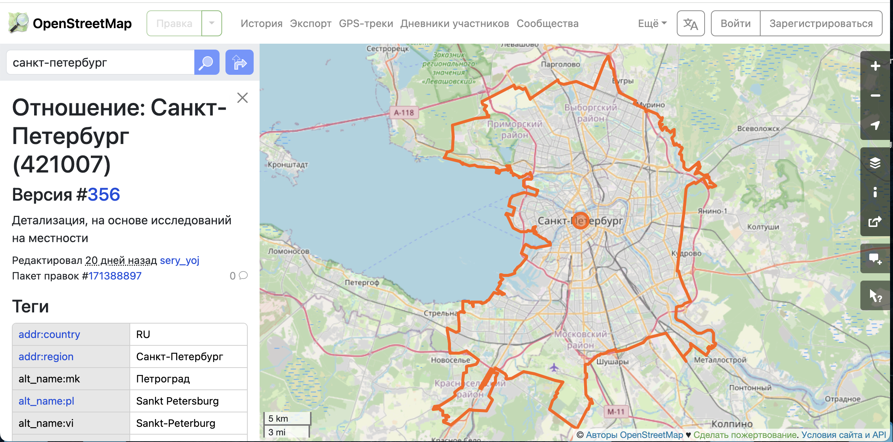

# Загрузка данных OSM

**OpenStreetMap (OSM)** — проект, который создаёт и предоставляет свободные географические данные, дает возможность создавать карты любому пользователю. Каждый желающий может поучаствовать в проекте (загружать свои треки на сервер, дорисовывать общедоступную карту по спутниковым снимкам Bing, MapBox, DigitalGlobe (весь мир), IRS (запад России), SPOT4 (восток России) и SPOT (Белоруссия) от Космоснимки.ру, ASTER (Россия), OrbView-3 и другими) и использовать эти карты совершенно свободно, и бесплатно в отличие от многих других карт, даже бесплатных, свободное использование которых ограничено.

Построен проект по принципу Wikipedia, то есть любой пользователь может внести и отредактировать данные.

Карты этого проекта очень широко используются как в некоммерческих целях, например, для исследовательских проектов, так и для коммерческих проектов, например, создания навигационных приложений.

Вот очень любопытный [прецедент](http://shtosm.ru/all/vserossiyskaya-perepis-pod-ugrozoy/) использования OSM в нашей стране.

## Структура данных OSM

Все объекты в OSM делятся на три типа элементов:

-   ***точки***, которые представляют точечные объекты, у каждого из них есть как минимум идентификатор и пара координат;

-   ***линии*** - это упорядоченный набор точек (не менее двух и не более 2000), которые формируют ломаную линию;

-   ***отношения*** - составной элемент, показывающий связь между двумя и более простыми элементами (точками, линиями, отношениями).

::: callout-important
Обратите внимание, что здесь нет типа элемента "полигон". Полигонами здесь будут являться замкнутые ломаные.
:::

Все объекты имеют идентификатор (он есть всегда), а также так называемые **теги**, которые описывают географические характеристики объекта.

Именно с помощью тегов, как правило, и осуществляется поиск объектов в базе.

Все значения тегов можно посмотреть на странице [Объекты карты](https://wiki.openstreetmap.org/wiki/RU:%D0%9E%D0%B1%D1%8A%D0%B5%D0%BA%D1%82%D1%8B_%D0%BA%D0%B0%D1%80%D1%82%D1%8B), если вам необходимы дополнительные пояснения, то можно обратиться к странице [Как обозначить](https://wiki.openstreetmap.org/wiki/RU:%D0%9A%D0%B0%D0%BA_%D0%BE%D0%B1%D0%BE%D0%B7%D0%BD%D0%B0%D1%87%D0%B8%D1%82%D1%8C).

На русском перечень ключей и значений с пояснениями можно найти в [таблице](https://docs.google.com/spreadsheets/d/1YgTDaw160aZ60DPUxuJrfYGyGykKJQDZE3c0W2O-OSY/edit?usp=sharing), составленной автором ТГ канала [UrbanStudent](https://t.me/urbanstudent).

::: callout-note
Если вам нужно найти какие-то специфичные объекты, то рекомендую внимательно посмотреть страницу вики и пройти по ссылке на страницу интересующего вас тега или его значения, там часто бывают пояснения, как обозначаются те или иные особенности и характеристики объектов.
:::

## Сервис overpass-turbo

Один из самых простых способов скачивания пространственных данных с OSM - это использование сервиса <http://overpass-turbo.eu/>.

Подробная информация о сервисе [[https://wiki.openstreetmap.org/wiki/Overpass_turbo]{.underline}](https://wiki.openstreetmap.org/wiki/Overpass_turbo)



Для создания запросов используется собственный язык запросов **Overpass QL** (Overpass Query Language).

Есть несколько различных типов *формулировок* Overpass QL . Они сгруппированы в:

-   *Параметры,* которые являются необязательными глобальными переменными, устанавливаются в первом операторе запроса. Примерами *настроек* являются тайм-аут сервера для сервера Overpass API и формат вывода запроса Overpass QL.

-   *Операторы блока* : *операторы* блока группируют операторы Overpass QL вместе.

-   *Автономные запросы*: это самостоятельные полные утверждения. Они могут выполнять такие функции, как запрос к серверу Overpass API для создания набора; манипулирование содержимым существующего набора; или отправка конечных результатов запроса в место вывода. Автономные запросы сами по себе состоят из более мелких языковых компонентов Overpass QL, таких как оценщики, фильтры и операторы.

На самом деле, чтобы составить запрос вам не обязательно знать все тонкости языка запросов. Вот основные моменты, которые необходимы для запроса:

-   то, как объекты обозначаются в OSM - ключ и его значение;

-   тип объектов (не обязательно, а только, если вы хотите выгружать конкретный тип объектов - точки, линии или полигоны);

-   охват территории поиска - bounding box (по умолчанию задается по видимой части карты в правой половине окна, но можно задать непосредственно в запросе или выбрать вручную на карте).

Подробная информация о том, какие объекты как [обозначаются в OpenStreetMap](https://wiki.openstreetmap.org/wiki/RU:%D0%9E%D0%B1%D1%8A%D0%B5%D0%BA%D1%82%D1%8B_%D0%BA%D0%B0%D1%80%D1%82%D1%8B). На этой странице можно искать нужный вам тип объектов, чтобы составить запрос.

В левой части окна будет отображаться выполняемый запрос, а в правой результаты этого запроса. По умолчанию поиск осуществляется в той области, которая отображается в правой части окна (это можно скорректировать более сложными запросами, см. справку о сервисе).

Для составления запросов используется помощник. Обратите внимание, что в нем сразу можно использовать логические операторы.

{fig-align="center"}

> Для примера можно найти и загрузить данные по многоквартирным жилым домам (*building=apartments*) и основным магистральным улицам (*highway=primary or highway=secondary or highway=tertiary,* то есть центральные магистрали, основные магистрали районов и основные микрорайонные или межмикрорайонные транзитные улицы) в Санкт-Петербурге.

Первый запрос по поиску жилых домов выглядит примерно так. Обратите внимание, что я убрала пункт ***node***, чтобы у нас не производился поиск точечных объектов.

{fig-align="center"}

Результат запроса будет показан на карте в правой части окна.


::: callout-note
По умолчанию поиск объектов производится внутри видимой области карты в правой части окна, но с помощью кнопок управления, расположенных в этой части окна вы можете выбрать, например, прямоугольную область поиска.
:::

В нижнем правом углу окна видно, сколько объектов какого типа было найдено, а сколько отображено.

Эспортируем результаты себе на компьютер для дальнейшей работы с ними в QGIS. Для этого нужно нажать кнопку **Экспорт**, после чего появится диалоговое окно экспорта.

{fig-align="center" width="637"}

Данные можно сохранить себе в формате *geojson*, кроме этого формата данные также можно скачать в GPX, KML, в виде сырых данных, а также в виде данных для редактирования OSM.

::: callout-tip
При желании более подробно ознакомиться с логикой построения запросов и языком запросов, вы можете воспользоваться интерактивным учебником <https://osmlab.github.io/learnoverpass//en/>

Или взять уже готовые запросы из коллекции запросов <https://osm-queries.ldodds.com/>
:::

## Модуль QuickOSM

Кроме непосредственного использования сервиса можно скачивать данные OSM напрямую из QGIS с помощью модуля **QuickOSM**.

{fig-align="center"}

После установки модуля на панели инструментов появятся два значка , левый из которых запускает окно поиска и загрузки данных из OSM, а правый позволяет удаленно подключаться к редактированию OSM через редактор [JOSM](https://josm.ru/).

На вкладке **Map preset** вы увидите существующие по умолчанию в модуле пресеты, а также свои сохраненные в виде пресетов запросы.

{fig-align="center" width="1110"}

На вкладке **Быстрый запрос** вы можете составить свой запрос на поиск объектов.

{fig-align="center"}

Кнопка **Помощью с ключами/значениями** открывает страницу с документацией модуля <https://docs.3liz.org/QuickOSM/>

На второй строке находятся строка выбора пресетов (**Preset**) - готовый запросов по поиску объектов, поэтому если вы не очень уверены в том, как какие-либо объекты обозначаются, но знаете, какие вам нужны, можно попробовать найти уже готовый запрос здесь.

Сразу под этой строкой находится таблица, где вы можете выбирать конкретные ключи и их значения.

::: callout-important
Запрос может включать в себя сразу несколько пар ключ/значение, но в этом случае части запроса должны быть связаны одним из логических операторов ***AND*** или ***OR***.

Главное отличие в применении этих операторов состоит в том, что при выборе ***AND*** поиск объектов будет осуществляться с учетом того, что все части запроса должны *выполняться одновременно*.

При использовании оператора ***OR*** будет производится поиск объектов, *удовлетворяющих хотя бы одному условию из заданных*.
:::

{fig-align="center"}

-   **В** - поиск в заданном населенном пункте;

-   **Вокруг** - поиск в заданном радиусе вокруг населенного пункта;

-   **Покрывать холст** - поиск в пределах видимой в основном окне программы части карты;

-   **Покрывать слой** - поиск в пределах охвата конкретного слоя (необходимо выбрать нужный слой);

-   **Не пространственные** - не заданная конкретная область, поэтому поиск будет производиться во всех данных OSM вне зависимости от местоположения.

Свой запрос вы можете сохранить в виде пресета (**Save query in a new preset**), просмотреть его (**Показать запрос**) и **Выполнить запрос**.

При нажатии на кнопку **Показать запрос** у вас откроется вкладка **Запрос**, где текст вашего запроса будет показан на языке запросов Overpass.

{fig-align="center"}

В пункте **Query history** на вкладке **Быстрый запрос** у вас будут отображаться уже сделанные вами запросы.

В дополнительных настройках быстрого запроса можно указать:

-   тип объекта для поиска;

-   время ожидания при выполнении запроса;

-   путь к папке для сохранения результатов запроса и формат сохранения данных, а также префикс файла для более простой идентификации.

{fig-align="center"}

Вкладка **OSM файл** позволяет загружать сырые данные из OSM для их редактирования.

В **Параметрах** вы можете выбрать конкретный сервер Overpass для соединения и сервер Nominatim[^1].

[^1]: В данном случае этот сервис нужен для осуществления геокодирования, то есть поиска положения населенного пункта по его названию

{fig-align="center"}

## Дополнительные модули

-   ohsomeTools - https://github.com/GIScience/ohsome-qgis-plugin;

-   OSMDownloader - https://github.com/lcoandrade/OSMDownloader;

-   HCMGIS - https://github.com/opengeoshub/HCMGIS (выгрузка данных от geofabrik напрямую в программе);

-   OSMInfo - <https://docs.nextgis.ru/docs_ngqgis/source/osminfo.html>;

```{=html}
<iframe width="720" height="405" src="https://rutube.ru/play/embed/5b0a57611a033d523fdd3887e9cf808b/" style="border: none;" allow="clipboard-write; autoplay" allowFullScreen></iframe>
```

-   OSM AI Agent - https://github.com/ShogoHirasawa/OSM-AI (требует API ключ от OpenAI).

## Использование готового скрипта

Для этого способа вам потребуется установка модуля Kolba (<https://github.com/pavelpereverzev/kolba>), который позволяет запускать стронние скрипты в программе.

Интерфейс Колбы довольно простой: в верхней части находится панель управления и строка пути к папке со скриптами.

В строке пути есть кнопки:

-   [{alt="Table loook"}](https://camo.githubusercontent.com/4cae908caba11a6ba1dab2cf034c0481f33dac0aad5804be441ea090e0a8299b/68747470733a2f2f676973776f726b732e72752f716769735f746f6f6c732f696d672f6c696e655f64726f70646f776e2e706e67) - выбор сохраненных путей

-   [{alt="Table loook"}](https://camo.githubusercontent.com/5fa6f6f639222e1a95a348b7674a5689675762e2fce7cc769a0208b73cd4be85/68747470733a2f2f676973776f726b732e72752f716769735f746f6f6c732f696d672f6c696e655f726566726573682e706e67) - обновление списка скриптом в текущей папке

-   [{alt="Table loook"}](https://camo.githubusercontent.com/ad7b606919a2bc4ef55c6f24e61eb33677686715d4d7d36193338d293e2523cb/68747470733a2f2f676973776f726b732e72752f716769735f746f6f6c732f696d672f6c696e655f7765627363726970742e706e67) - загрузка скриптов из интернета

-   [{alt="Table loook"}](https://camo.githubusercontent.com/9c2906cd9727dbd78d1f10760c2f3d8278a195daef71dc8a7b6a560b7f8cded2/68747470733a2f2f676973776f726b732e72752f716769735f746f6f6c732f696d672f6c696e655f666f6c6465725f73656c6563742e706e67) - выбор папки

Ниже расположены два блока: слева — список скриптов, справа — описание выбранного скрипта. В дополнение к стандартным (открепить/закрепить, закрыть виджет) кнопкам в заголовке:

-   [{alt="Table loook"}](https://camo.githubusercontent.com/612284e8d8186e35e4e9bebc2b63965c7d0fe6788a67adbdc35a34efa70a5731/68747470733a2f2f676973776f726b732e72752f716769735f746f6f6c732f696d672f69636f6e5f666f6c6465725f6f6e2e706e67) - показать/скрыть строку пути

-   [{alt="Table loook"}](https://camo.githubusercontent.com/78327225b8a540f30ac583b1747b7321e4bc7afbbc457cc8df0945768d5112ec/68747470733a2f2f676973776f726b732e72752f716769735f746f6f6c732f696d672f706174685f6c6973742e706e67) - открыть настройки Колба.

Скрипт для загрузки называется **de_osm** (его можно найти в поиске модуля).



## Загрузка выгрузок по регионам

На портале Geofabrik <https://download.geofabrik.de/> вы можете загрузить данные сразу для всего континента, страны или части страны.

Кроме того, этот портал позволяет вам пользоваться историческими выгрузками данных на нужную вам дату.

Наиболее оптимальным для вас будет загрузка архивов **.gpkg.zip** для нужного вам региона. После их распаковки вы получите файл в формате geopackage, в отдельных слоях которого будут содержаться определенные объекты.

## Загрузка всех объектов в заданных границах

::: callout-caution
Этот метод подойдет тем, кто сможет самостоятельно распарсить JSON файл с объектами.
:::

Сервис <https://altilunium.github.io/osm-region-downloader/> позволяет выгрузить все объекты в заданных границах (например, административно-территориальных).

{fig-align="center" width="1505"}

Для его использования вам достаточно указать ID границ из OSM. Это номер идентификатора объекта из базы данных.

Как его найти? Найти его можно на основном сайте OSM <https://www.openstreetmap.org/> с помощью поиска.

Вы можете ввести в строку поиска название нужного вам города или региона, дождаться загрузки и скопировать идентификатор в сервис.



## OSM-GPT

Кроме непосредственного использования Overpass можно воспользоваться **OSM-GPT** - сервисом на основе ChatGPT, который позволяет делать запросы с использованием естественного языка.

<https://osm-gpt.rohitgautam.com.np/>

```{=html}
<video width="540" height="360" controls>
  <source src="images/255709707-f43a7a5e-3780-4421-a007-96afe55c683c.mp4" type="video/mp4">
</video>
```
