# Создание геометрических объектов

Для создания и работы с пространственными данными в Python существует библиотека `shapely` (https://shapely.readthedocs.io/en/stable/index.html).

> **NB** эта библиотека умеет работать только на плоскости

Каждый объект состоит из *внутреннего, внешнего и граничного* множеств (interior, boundary, and exterior sets of a feature), которые являются взаимоисключающими.

Основные типы объектов, реализованные в библиотеке:

1.  **Point** (точка) - объект с нулевой размерностью, для которого внутреннее множество будет состоять из одной точки, граница - из нулевого количества точек, а внешнее множество представляет собой набор всех остальных возможных точек. Такие объекты относятся к классу `Point`.

2.  **Curve** (кривая) - объект с размерностью 1, для которого внутреннее множество будет состоять из бесконечного количества точек вдоль линии, граница - из двух точек (начальной и конечной), а внешнее множество представляет собой набор всех остальных возможных точек. Такие объекты относятся к классам `Linestring` (разомкнутая кривая) и `LinearRing` (замкнутая кривая).

3.  **Surface** (поверхность) - объект с размерностью 2, для которого внутреннее множество будет состоять из бесконечного множества точек, расположенных внутри, граница - из одной или нескольких кривых, а внешнее множество представляет собой набор всех остальных возможных точек, включая те, которые могут находиться в отверстиях поверхности. Такие объекты относятся к классу `Polygon`.

В библиотеке `shapely` наиболее применяемыми способами создания объектов являются: - создание объектов из списка координат; - создание объектов из словаря (dictionary `dict` [немного о словарях](https://pythonworld.ru/tipy-dannyx-v-python/slovari-dict-funkcii-i-metody-slovarej.html)), в данном случае фактически словари создаются на основе формата описания географических данных `geojson`; - создание объектов из строки, то есть на основе описания в формате `wkt`

Установка библиотеки

``` python
# pip install shapely
```

## Создание объектов из списка координат

### Точки

``` python
from shapely.geometry import Point
```

Создадим точку из списка координат. Для этого нам достаточно всего одной пары координат.

``` python
pin_itmo = Point ([59.944295,30.265266])
```

Проверим тип полученного объекта.

``` python
print(f"Тип объекта: {type(pin_itmo)}")
```

```         
Тип объекта: <class 'shapely.geometry.point.Point'>
```

Кроме того, с помощью одного из [методов, реализованных в пакете для классов](https://shapely.readthedocs.io/en/stable/manual.html#general-attributes-and-methods), можно проверить тип геометрии объекта.

``` python
print(f"Тип геометрии объекта: {pin_itmo.geom_type}")
```

```         
Тип геометрии объекта: Point
```

``` python
pin_itmo
```


### Линии

``` python
from shapely.geometry import LineString
```

Так как линия состоит из множества точек, а границей являются начальная и конечная точки линии, то для ее создания нужно как минимум две пары координат, заданных в виде [кортежа](https://younglinux.info/python/tuple) (`tuple`).

> Линия создается в том порядке, в котором координаты точек перечисляются в кортеже

``` python
pointsList = [[59.929624, 30.268675], [59.936355, 30.257589]]
line = LineString (pointsList)
```

``` python
print(f"Тип объекта: {type(line)}")
```

```         
Тип объекта: <class 'shapely.geometry.linestring.LineString'>
```

``` python
print(f"Тип геометрии объекта: {line.geom_type}")
```

```         
Тип геометрии объекта: LineString
```

``` python
line
```


Если нужно создать ломаную линию, то просто в список нужно внести не только координаты начальной и конечной точки, но и всех промежуточных поворотных точек.

> Линия может пересекать сама себя. Линия без самопересечений является простой (*simple*), а с самопересечениями - комплексной (*complex*).

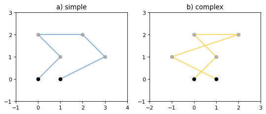

``` python
pointsList1 = [[59.929624, 30.268675], [59.936355, 30.257589], 
               [59.944295,30.265266], [59.943311, 30.268789]]
line1 = LineString (pointsList1)
```

``` python
line1
```


Кроме того, линия может быть создана из нескольких точек или кортежа с парами координат.

``` python
LineString([Point(59.929624, 30.268675), pin_itmo, (59.936355, 30.257589)])
```

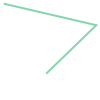

Линии также могут быть замкнутыми. Для их создания используется класс `LinearRing`.

Главное отличие в создании между `LineString` и `LinearRing` в том, что для второго класса обязательно нужно в конце повторить координаты первой точки.

> Замкнутые линии не могут пересекать сами себя и касаться самих себя

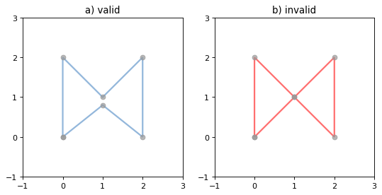

> Важно помнить, что это все еще линия, то есть у нее нулевая площадь и ненулевая длина.

``` python
from shapely.geometry import LinearRing
```

``` python
pointsList2 = [[59.929624, 30.268675], [59.936355, 30.257589], 
               [59.944295,30.265266], [59.943311, 30.268789],
               [59.929624, 30.268675]]
line2 = LinearRing(pointsList2)
```

``` python
line2
```

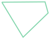

Однако для проверки валидности геометрии объекта, можно модифицировать его таким образом, чтобы при появлении самопересечений выдавалось предупреждение об этом.

``` python
class LinearRing_2(LinearRing):
    
    def __init__(self, *args, **kwargs):
        super().__init__(*args, **kwargs)
        if not self.is_valid:
            raise ValueError("Самопересечение")
```

``` python
pointsList2 = [[59.929624, 30.268675], [59.943311, 30.268789], [59.936355, 30.257589], 
               [59.944295,30.265266],
               [59.929624, 30.268675]]
line2 = LinearRing_2(pointsList2)
```

```         
---------------------------------------------------------------------------

ValueError                                Traceback (most recent call last)

Cell In [28], line 4
      1 pointsList2 = [[59.929624, 30.268675], [59.943311, 30.268789], [59.936355, 30.257589], 
      2                [59.944295,30.265266],
      3                [59.929624, 30.268675]]
----> 4 line2 = LinearRing_2(pointsList2)


Cell In [23], line 6, in LinearRing_2.__init__(self, *args, **kwargs)
      4 super().__init__(*args, **kwargs)
      5 if not self.is_valid:
----> 6     raise ValueError("Самопересечение")


ValueError: Самопересечение
```

``` python
line2
```


### Полигоны

``` python
from shapely.geometry import Polygon
```

При создании полигонов в качестве параметров сначала подается список или кортеж с координатами, а потом неупорядоченная последовательность кольцевых последовательностей, определяющих внутренние границы или "отверстия" объекта.

> Отверстия внутри полигона могут касаться его внешних границ только в одной точке, не могут иметь между собой общие границы и не могут пересекаться. Такие случаи приводят к созданию некорректных полигонов.

> **!** `shapely` не предотвращает создание некорректных объектов, но дальнейшие операции с ними могут быть невозможны.

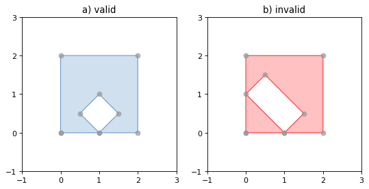

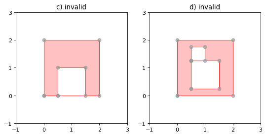

``` python
pointList = [[59.928813,30.268443], [59.931574,30.268144], [59.929816,30.270000]]

poly_mining = Polygon(pointList)
```

``` python
poly_mining
```


``` python
print(f"Тип объекта: {type(poly_mining)}")
```

```         
Тип объекта: <class 'shapely.geometry.polygon.Polygon'>
```

``` python
print(f"Тип геометрии объекта: {poly_mining.geom_type}")
```

```         
Тип геометрии объекта: Polygon
```

Получим список координат границы полигона.

Координаты внешнего контура можно получить через `exterior` свойства, а координаты внутренних контуров через `interior`.

``` python
list(poly_mining.exterior.coords)
```

```         
[(59.928813, 30.268443),
 (59.931574, 30.268144),
 (59.929816, 30.27),
 (59.928813, 30.268443)]
```

Обратите внимание, что в полученном полигоне координаты первой точки повторяются еще и в конце. Таким образом достигается замкнутость полигона.

``` python
print(f'Длина исходного списка координат: {len(list(pointList))},'\
      f' длина списка координат объекта shapely: {len(list(poly_mining.exterior.coords))}'
      )
```

```         
Длина исходного списка координат: 3, длина списка координат объекта shapely: 4
```

## Создание объектов из словаря

При создании словаря, который будет конвертироваться в пространственный объект, фактически используется `geojson`, который является универсальным форматом данных, не привязанным к конкретному языку программирования.

Этот формат основан на JavaScript object notation (JSON).

В GeoJSON объект состоит из набора пар ключ/значение, также называемых свойствами. Имя каждого свойства – строка. Значение свойства может представлять собой строку, число, объект, массив или один из литералов: «true», «false» и «null». Подробнее о формате можно почитать [здесь](https://geojson.org/)

### Точки

При создании точки из словаря, в нем обязательно должны быть два основных свойства: - "type" - тип геометрии объекта; - "coordinates" - перечень координат в виде списков или кортежей.

``` python
from shapely.geometry import shape
```

``` python
pin_itmo_geojson = {"type":"Point",
                   "coordinates":[59.944295,30.265266]
                   }
```

``` python
print(f"Текущий тип объекта: {type(pin_itmo_geojson)}")
```

```         
Текущий тип объекта: <class 'dict'>
```

``` python
pin_itmo1 = shape(pin_itmo_geojson)
```

``` python
pin_itmo1
```


``` python
print(f"Текущий тип объекта: {type(pin_itmo1)}")
```

```         
Текущий тип объекта: <class 'shapely.geometry.point.Point'>
```

### Линии

``` python
line_geojson = {"type":"Linestring",
                "coordinates": [[59.929624, 30.268675],
                                [59.936355, 30.257589]],
                }

line3 = shape(line_geojson)
```

``` python
print(f"Текущий тип объекта: {type(line3)}")
```

```         
Текущий тип объекта: <class 'shapely.geometry.linestring.LineString'>
```

``` python
line3
```


### Полигоны

``` python
poly_mining_geojson ={"type":"Polygon",
                      "coordinates": [[[59.928795, 30.268423],
                                       [59.930972, 30.265923],
                                       [59.931569, 30.268101],
                                       [59.929806, 30.269936],
                                       [59.928795, 30.268423]]],
                       }

poly_mining2 = shape(poly_mining_geojson)
```

``` python
print(f"Текущий тип объекта: {type(poly_mining2)}")
```

```         
Текущий тип объекта: <class 'shapely.geometry.polygon.Polygon'>
```

``` python
poly_mining2
```


## Создание объектов из текстовой строки

В этом случае описание объектов должно строиться на основе формата [WKT](https://ru.wikipedia.org/wiki/WKT)

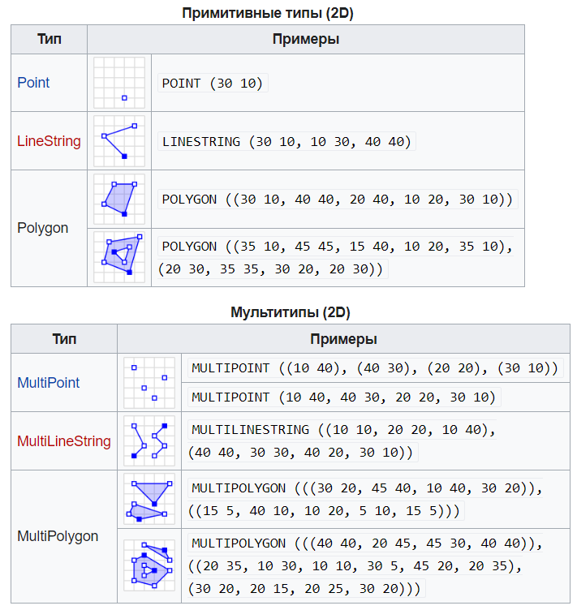

``` python
from shapely import wkt
```

Для того, чтобы строка в формате WKT была преобразована в геометрический пространственный объект нужно воспользоваться функцией `wkt.loads` (load string).

### Точки

``` python
pin_itmo2 = wkt.loads('POINT (59.944295 30.265266)')

print(f"Тип объекта: {type(pin_itmo2)}")
```

```         
Тип объекта: <class 'shapely.geometry.point.Point'>
```

``` python
pin_itmo2
```


### Линии

``` python
line_wkt = 'LINESTRING (59.929624 30.268675, 59.936355 30.257589)'

line4 = wkt.loads(line_wkt)
```

``` python
print(f"Тип объекта: {type(line4)}")
```

```         
Тип объекта: <class 'shapely.geometry.linestring.LineString'>
```

``` python
line4
```


### Полигоны

``` python
poly_mining_str = """POLYGON ((59.928795 30.268423, 59.930972 30.265923, 59.931569 30.268101, 
                     59.929806 30.269936, 59.928795 30.268423))"""

poly_mining4 = wkt.loads(poly_mining_str)
```

``` python
poly_mining4
```


``` python
print(f"Тип объекта: {type(poly_mining4)}")
```

```         
Тип объекта: <class 'shapely.geometry.polygon.Polygon'>
```

Обратите внимание, что при создании полигонов таким способом в строке с перечнем координат координаты первой точки должны обязательно также повторяться в конце.

## Основные свойства объектов

- `object.area` - возвращает площадь объектов в виде числа `float` (у точечных и линейных объектов будет нулевой)

``` python
pin_itmo.area
```

```         
0.0
```

``` python
line.area
```

```         
0.0
```

``` python
poly_mining.area
```

```         
2.299386999998814e-06
```

- `object.length` - возвращает длину объектов в виде числа `float` (у точечных объектов будет нулевой, для линейных объектов будет равна длине линии, а для площадных объектов - периметру)

``` python
pin_itmo.length
```

```         
0.0
```

``` python
line.length
```

```         
0.012969416216625946
```

``` python
poly_mining.length
```

```         
0.007185661628829153
```

- `object.bounds` - возвращает кортеж координат (minx, miny, maxx, maxy) из числовых значений; полученные границы полностью охватывают объект

``` python
pin_itmo.bounds
```

```         
(59.944295, 30.265266, 59.944295, 30.265266)
```

``` python
line.bounds
```

```         
(59.929624, 30.257589, 59.936355, 30.268675)
```

``` python
poly_mining.bounds
```

```         
(59.928813, 30.268144, 59.931574, 30.27)
```

## Геометрические предикаты

Все геометрические предикаты возвращают только **True** или **False**.

### Унарные предикаты

Это атрибуты объектов. При их использовании задействуется только один объект.

- `object.is_empty` - возвращает **True**, если объект является пустым набором

``` python
pin_itmo.is_empty
```

```         
False
```

``` python
Point().is_empty
```

```         
True
```

- `object.is_ring` - проверяет является ли объект замкнутой ломаной линией; имеет значение только для `LineString` и `LinearRing` объектов

``` python
line1.is_ring
```

```         
False
```

``` python
line2.is_ring
```

```         
True
```

``` python
line1
```


``` python
line2
```


- `object.is_simple` - возвращает **True**, если объект не пересекает сам себя; имеет значение только для `LineString` и `LinearRing` объектов

``` python
line1.is_simple
```

```         
True
```

``` python
line2.is_simple
```

```         
True
```

- `object.is_valid` - возвращает **True**, если объект не имеет топологических ошибок; имеет значение только для `Polygon` и `MultiPolygon` объектов, для всех остальных объектов всегда возвращает **True**

``` python
poly_mining.is_valid
```

```         
True
```

### Бинарные предикаты

Эти предикаты реализованы как методы классов. Они исследуют наличие топологических, теоретико-множественных отношений.

- `object.equals(other)` - возвращает **True**, если граничное, внешнее и внутренее множества двух объектов совпадают.

``` python
poly_mining.equals(poly_mining2)
```

```         
False
```

``` python
poly_mining2.equals(poly_mining4)
```

```         
True
```

- `object.contains(other)` - возвращает **True**, если ни одна из точек второго объекта (other) не находится в наружном множества объекта и как минимум одна точка внутреннего множества второго объекта попадает во внутренее множество объекта

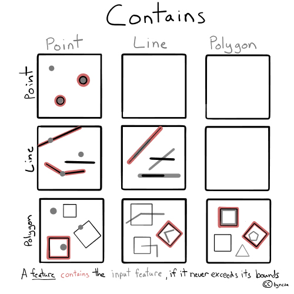

``` python
poly_mining.contains(pin_itmo)
```

```         
False
```

``` python
line1.contains(pin_itmo)
```

```         
True
```

- `object.covers(other)` - возвращает **True**, если каждая точка второго объекта находится во внутреннем или граничном множестве объекта; отличается от предыдущего метода тем, что не требует нахождения точек из внутренного множества второго объекта во внутреннем множестве первого

- `object.covered_by(other)` - возвращает **True**, если каждая точка объекта является точкой внутреннего или граничного множества второго объекта; фактически противоположна предыдущему методу

- `object.crosses(other)` - возвращает **True**, если внутреннее множество объекта пересекает внутреннее множество второго объекта, но не содержит его; размерность пересечения меньше размерности любого из объектов (например, пересечение полигонов, размерность которых 2, - это линия с размерностью 1); линия не может пересекать точку, которую содержит

- `object.intersects(other)` - возвращает **True**, если граничное или внутреннее множество пересекает аналогичные множества второго объекта, то есть объекты пересекаются, если у них есть общая точка на границе или во внутреннем множестве

- `object.overlaps(other)` - возвращает **True**, если у объектов более одной общей точки, но не все, они имеют одинаковую размерность и размерность пересечения такая же, как размерность исходных объектов

- `object.touches(other)` - возвращает **True**, если у объектов есть хотя бы одна общая точка, но их внутренние множества не пересекаются

- `object.within(other)` - возвращает **True**, если граничное или внутреннее множество объекта пересекается с внутренним множеством второго объекта, но не граничным или внешним множеством

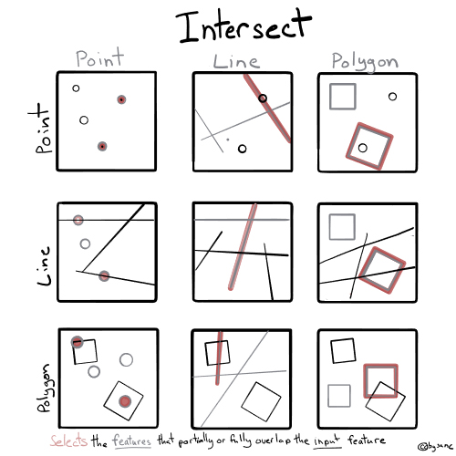

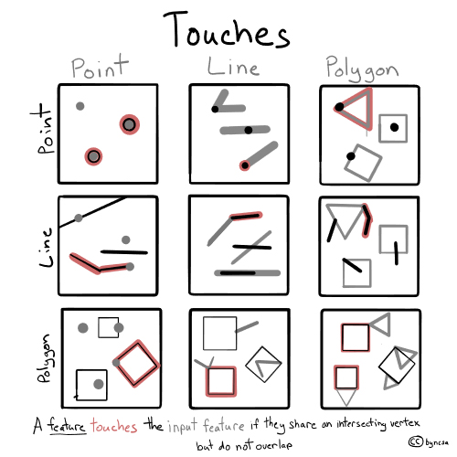

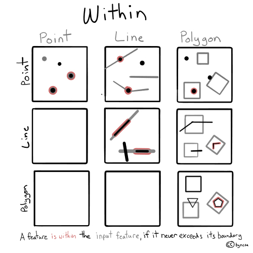

# GeoPandas и геодатафреймы

`GeoPandas` расширяет библиотеку данных `pandas`, добавляя поддержку геопространственных данных (https://geopandas.org/en/stable/index.html).

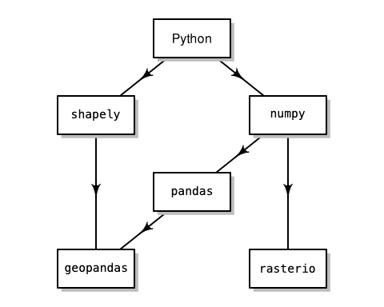

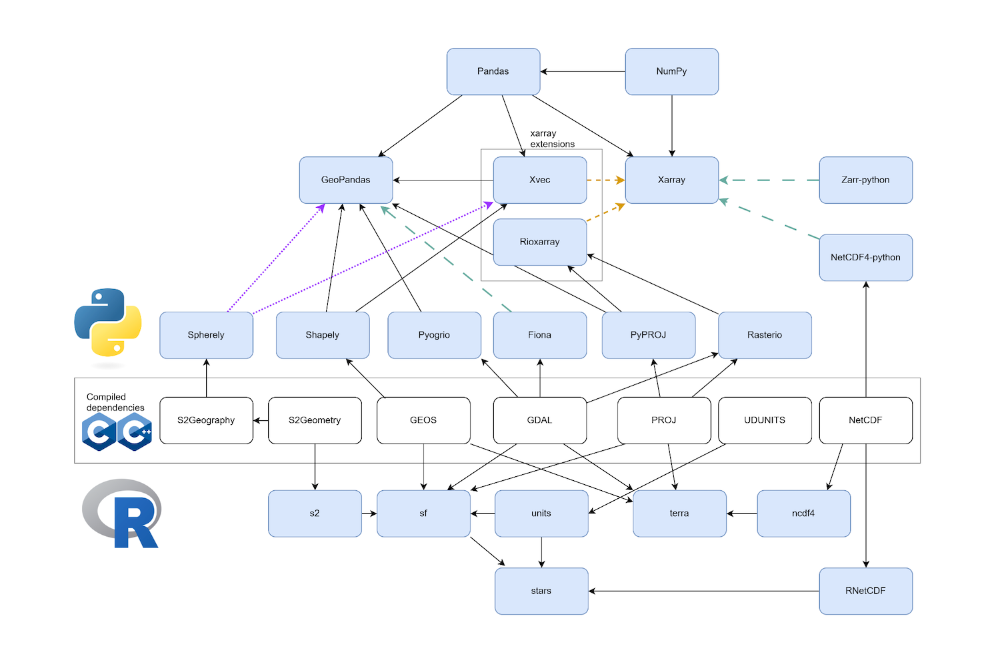

Основной структурой данных в GeoPandas является `geopandas.GeoDataFrame`, подкласс `pandas.DataFrame`, который может хранить геометрические столбцы и выполнять пространственные операции.

`Geopandas.GeoSeries`, подкласс `pandas.Series`, обрабатывает геометрические данные. Таким образом, ваш `GeoDataFrame` - это комбинация `pandas.Series` с традиционными данными (числовыми, булевыми, текстовыми и т.д.) и `geopandas.GeoSeries` с геометрией (точками, полигонами и т.д.). Вы можете иметь столько столбцов с геометриями, сколько пожелаете; нет ограничений, характерных для настольных ГИС-программ.

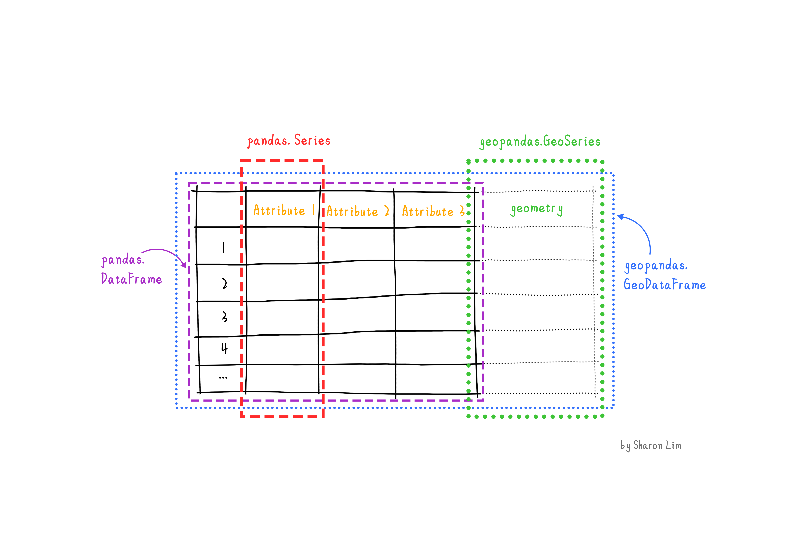

То есть фактически `Geoseries` - это геометрии объектов, а `GeoDataFrame` - аналог векторного слоя в ГИС.

Каждая `Geoseries` может содержать любой тип геометрии (вы можете даже смешивать их в одном массиве) и имеет атрибут `GeoSeries.crs`, который хранит информацию о системе координат (CRS означает Coordinate Reference System). Таким образом, каждая `GeoSeries` в `GeoDataFrame` может быть в разной проекции, что позволяет иметь, например, несколько версий (разных проекций) одной и той же геометрии.

Только одна GeoSeries в `GeoDataFrame` считается активной геометрией, что означает, что все геометрические операции, применяемые к GeoDataFrame, работают с этим активным столбцом.

``` python
 pip install geopandas
```

```         
Requirement already satisfied: geopandas in /Users/tatianabaltyzhakova/.pyenv/versions/3.13.7/lib/python3.13/site-packages (1.1.1)
Requirement already satisfied: numpy>=1.24 in /Users/tatianabaltyzhakova/.pyenv/versions/3.13.7/lib/python3.13/site-packages (from geopandas) (2.3.4)
Requirement already satisfied: pyogrio>=0.7.2 in /Users/tatianabaltyzhakova/.pyenv/versions/3.13.7/lib/python3.13/site-packages (from geopandas) (0.11.1)
Requirement already satisfied: packaging in /Users/tatianabaltyzhakova/.pyenv/versions/3.13.7/lib/python3.13/site-packages (from geopandas) (25.0)
Requirement already satisfied: pandas>=2.0.0 in /Users/tatianabaltyzhakova/.pyenv/versions/3.13.7/lib/python3.13/site-packages (from geopandas) (2.3.3)
Requirement already satisfied: pyproj>=3.5.0 in /Users/tatianabaltyzhakova/.pyenv/versions/3.13.7/lib/python3.13/site-packages (from geopandas) (3.7.2)
Requirement already satisfied: shapely>=2.0.0 in /Users/tatianabaltyzhakova/.pyenv/versions/3.13.7/lib/python3.13/site-packages (from geopandas) (2.1.2)
Requirement already satisfied: python-dateutil>=2.8.2 in /Users/tatianabaltyzhakova/.pyenv/versions/3.13.7/lib/python3.13/site-packages (from pandas>=2.0.0->geopandas) (2.9.0.post0)
Requirement already satisfied: pytz>=2020.1 in /Users/tatianabaltyzhakova/.pyenv/versions/3.13.7/lib/python3.13/site-packages (from pandas>=2.0.0->geopandas) (2025.2)
Requirement already satisfied: tzdata>=2022.7 in /Users/tatianabaltyzhakova/.pyenv/versions/3.13.7/lib/python3.13/site-packages (from pandas>=2.0.0->geopandas) (2025.2)
Requirement already satisfied: certifi in /Users/tatianabaltyzhakova/.pyenv/versions/3.13.7/lib/python3.13/site-packages (from pyogrio>=0.7.2->geopandas) (2025.10.5)
Requirement already satisfied: six>=1.5 in /Users/tatianabaltyzhakova/.pyenv/versions/3.13.7/lib/python3.13/site-packages (from python-dateutil>=2.8.2->pandas>=2.0.0->geopandas) (1.17.0)

[1m[[0m[34;49mnotice[0m[1;39;49m][0m[39;49m A new release of pip is available: [0m[31;49m25.2[0m[39;49m -> [0m[32;49m26.1.2[0m
[1m[[0m[34;49mnotice[0m[1;39;49m][0m[39;49m To update, run: [0m[32;49mpip install --upgrade pip[0m
Note: you may need to restart the kernel to use updated packages.
```

``` python
 pip install geodatasets
```

```         
Collecting geodatasets
  Downloading geodatasets-2026.5.1-py3-none-any.whl.metadata (5.5 kB)
Collecting pooch (from geodatasets)
  Downloading pooch-1.9.0-py3-none-any.whl.metadata (10 kB)
Requirement already satisfied: platformdirs>=2.5.0 in /Users/tatianabaltyzhakova/.pyenv/versions/3.13.7/lib/python3.13/site-packages (from pooch->geodatasets) (4.9.6)
Requirement already satisfied: packaging>=20.0 in /Users/tatianabaltyzhakova/.pyenv/versions/3.13.7/lib/python3.13/site-packages (from pooch->geodatasets) (25.0)
Requirement already satisfied: requests>=2.19.0 in /Users/tatianabaltyzhakova/.pyenv/versions/3.13.7/lib/python3.13/site-packages (from pooch->geodatasets) (2.32.5)
Requirement already satisfied: charset_normalizer<4,>=2 in /Users/tatianabaltyzhakova/.pyenv/versions/3.13.7/lib/python3.13/site-packages (from requests>=2.19.0->pooch->geodatasets) (3.4.4)
Requirement already satisfied: idna<4,>=2.5 in /Users/tatianabaltyzhakova/.pyenv/versions/3.13.7/lib/python3.13/site-packages (from requests>=2.19.0->pooch->geodatasets) (3.11)
Requirement already satisfied: urllib3<3,>=1.21.1 in /Users/tatianabaltyzhakova/.pyenv/versions/3.13.7/lib/python3.13/site-packages (from requests>=2.19.0->pooch->geodatasets) (2.5.0)
Requirement already satisfied: certifi>=2017.4.17 in /Users/tatianabaltyzhakova/.pyenv/versions/3.13.7/lib/python3.13/site-packages (from requests>=2.19.0->pooch->geodatasets) (2025.10.5)
Downloading geodatasets-2026.5.1-py3-none-any.whl (21 kB)
Downloading pooch-1.9.0-py3-none-any.whl (67 kB)
Installing collected packages: pooch, geodatasets
[2K   [90m━━━━━━━━━━━━━━━━━━━━━━━━━━━━━━━━━━━━━━━━[0m [32m2/2[0m [geodatasets]
[1A[2KSuccessfully installed geodatasets-2026.5.1 pooch-1.9.0

[1m[[0m[34;49mnotice[0m[1;39;49m][0m[39;49m A new release of pip is available: [0m[31;49m25.2[0m[39;49m -> [0m[32;49m26.1.2[0m
[1m[[0m[34;49mnotice[0m[1;39;49m][0m[39;49m To update, run: [0m[32;49mpip install --upgrade pip[0m
Note: you may need to restart the kernel to use updated packages.
```

``` python
import geopandas as gpd
import geodatasets
```

Функция `gpd.read_file` позволяет читать основные типы векторных файлов, используемых в ГИС. - Shapefile (.shp)

- GeoJSON (.geojson)

- GeoPackage (.gpkg)

- File Geodatabase (.gdb)

``` python
guerry = gpd.read_file(geodatasets.get_path("geoda.guerry"))
```

```         
Downloading file 'guerry.zip' from 'https://geodacenter.github.io/data-and-lab//data/guerry.zip' to '/Users/tatianabaltyzhakova/Library/Caches/geodatasets'.
Extracting 'guerry/guerry.shp' from '/Users/tatianabaltyzhakova/Library/Caches/geodatasets/guerry.zip' to '/Users/tatianabaltyzhakova/Library/Caches/geodatasets/guerry.zip.unzip'
Extracting 'guerry/guerry.dbf' from '/Users/tatianabaltyzhakova/Library/Caches/geodatasets/guerry.zip' to '/Users/tatianabaltyzhakova/Library/Caches/geodatasets/guerry.zip.unzip'
Extracting 'guerry/guerry.shx' from '/Users/tatianabaltyzhakova/Library/Caches/geodatasets/guerry.zip' to '/Users/tatianabaltyzhakova/Library/Caches/geodatasets/guerry.zip.unzip'
Extracting 'guerry/guerry.prj' from '/Users/tatianabaltyzhakova/Library/Caches/geodatasets/guerry.zip' to '/Users/tatianabaltyzhakova/Library/Caches/geodatasets/guerry.zip.unzip'
```

``` python
type(guerry)
```

```         
geopandas.geodataframe.GeoDataFrame
```

``` python
guerry.plot()
```

```         
<Axes: >
```

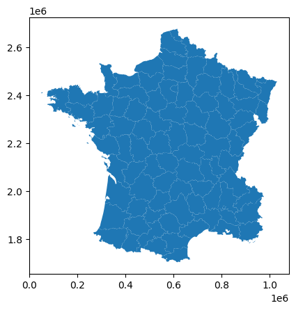

``` python
guerry.head()
```

::: {}
```{=html}
<style scoped>
    .dataframe tbody tr th:only-of-type {
        vertical-align: middle;
    }

    .dataframe tbody tr th {
        vertical-align: top;
    }

    .dataframe thead th {
        text-align: right;
    }
</style>
```

<table>
<thead>
<tr>
<th><p></p></th>
<th><p>dept</p></th>
<th><p>Region</p></th>
<th><p>Dprtmnt</p></th>
<th><p>Crm_prs</p></th>
<th><p>Crm_prp</p></th>
<th><p>Litercy</p></th>
<th><p>Donatns</p></th>
<th><p>Infants</p></th>
<th><p>Suicids</p></th>
<th><p>MainCty</p></th>
<th><p>...</p></th>
<th><p>Infntcd</p></th>
<th><p>Dntn_cl</p></th>
<th><p>Lottery</p></th>
<th><p>Desertn</p></th>
<th><p>Instrct</p></th>
<th><p>Prsttts</p></th>
<th><p>Distanc</p></th>
<th><p>Area</p></th>
<th><p>Pop1831</p></th>
<th><p>geometry</p></th>
</tr>
</thead>
<tbody>
<tr>
<td><p>0</p></td>
<td><p>1.0</p></td>
<td><p>E</p></td>
<td><p>Ain</p></td>
<td><p>28870.0</p></td>
<td><p>15890.0</p></td>
<td><p>37.0</p></td>
<td><p>5098.0</p></td>
<td><p>33120.0</p></td>
<td><p>35039.0</p></td>
<td><p>2.0</p></td>
<td><p>...</p></td>
<td><p>60.0</p></td>
<td><p>69.0</p></td>
<td><p>41.0</p></td>
<td><p>55.0</p></td>
<td><p>46.0</p></td>
<td><p>13.0</p></td>
<td><p>218.372</p></td>
<td><p>5762.0</p></td>
<td><p>346.03</p></td>
<td><p>POLYGON ((801150 2092615, 800669 2093190, 8006...</p></td>
</tr>
<tr>
<td><p>1</p></td>
<td><p>2.0</p></td>
<td><p>N</p></td>
<td><p>Aisne</p></td>
<td><p>26226.0</p></td>
<td><p>5521.0</p></td>
<td><p>51.0</p></td>
<td><p>8901.0</p></td>
<td><p>14572.0</p></td>
<td><p>12831.0</p></td>
<td><p>2.0</p></td>
<td><p>...</p></td>
<td><p>82.0</p></td>
<td><p>36.0</p></td>
<td><p>38.0</p></td>
<td><p>82.0</p></td>
<td><p>24.0</p></td>
<td><p>327.0</p></td>
<td><p>65.945</p></td>
<td><p>7369.0</p></td>
<td><p>513.00</p></td>
<td><p>POLYGON ((729326 2521619, 729320 2521230, 7292...</p></td>
</tr>
<tr>
<td><p>2</p></td>
<td><p>3.0</p></td>
<td><p>C</p></td>
<td><p>Allier</p></td>
<td><p>26747.0</p></td>
<td><p>7925.0</p></td>
<td><p>13.0</p></td>
<td><p>10973.0</p></td>
<td><p>17044.0</p></td>
<td><p>114121.0</p></td>
<td><p>2.0</p></td>
<td><p>...</p></td>
<td><p>42.0</p></td>
<td><p>76.0</p></td>
<td><p>66.0</p></td>
<td><p>16.0</p></td>
<td><p>85.0</p></td>
<td><p>34.0</p></td>
<td><p>161.927</p></td>
<td><p>7340.0</p></td>
<td><p>298.26</p></td>
<td><p>POLYGON ((710830 2137350, 711746 2136617, 7124...</p></td>
</tr>
<tr>
<td><p>3</p></td>
<td><p>4.0</p></td>
<td><p>E</p></td>
<td><p>Basses-Alpes</p></td>
<td><p>12935.0</p></td>
<td><p>7289.0</p></td>
<td><p>46.0</p></td>
<td><p>2733.0</p></td>
<td><p>23018.0</p></td>
<td><p>14238.0</p></td>
<td><p>1.0</p></td>
<td><p>...</p></td>
<td><p>12.0</p></td>
<td><p>37.0</p></td>
<td><p>80.0</p></td>
<td><p>32.0</p></td>
<td><p>29.0</p></td>
<td><p>2.0</p></td>
<td><p>351.399</p></td>
<td><p>6925.0</p></td>
<td><p>155.90</p></td>
<td><p>POLYGON ((882701 1920024, 882408 1920733, 8817...</p></td>
</tr>
<tr>
<td><p>4</p></td>
<td><p>5.0</p></td>
<td><p>E</p></td>
<td><p>Hautes-Alpes</p></td>
<td><p>17488.0</p></td>
<td><p>8174.0</p></td>
<td><p>69.0</p></td>
<td><p>6962.0</p></td>
<td><p>23076.0</p></td>
<td><p>16171.0</p></td>
<td><p>1.0</p></td>
<td><p>...</p></td>
<td><p>23.0</p></td>
<td><p>64.0</p></td>
<td><p>79.0</p></td>
<td><p>35.0</p></td>
<td><p>7.0</p></td>
<td><p>1.0</p></td>
<td><p>320.280</p></td>
<td><p>5549.0</p></td>
<td><p>129.10</p></td>
<td><p>POLYGON ((886504 1922890, 885733 1922978, 8854...</p></td>
</tr>
</tbody>
</table>

<p>5 rows × 24 columns</p>
:::

``` python
guerry
```

::: {}
```{=html}
<style scoped>
    .dataframe tbody tr th:only-of-type {
        vertical-align: middle;
    }

    .dataframe tbody tr th {
        vertical-align: top;
    }

    .dataframe thead th {
        text-align: right;
    }
</style>
```

<table>
<thead>
<tr>
<th><p></p></th>
<th><p>dept</p></th>
<th><p>Region</p></th>
<th><p>Dprtmnt</p></th>
<th><p>Crm_prs</p></th>
<th><p>Crm_prp</p></th>
<th><p>Litercy</p></th>
<th><p>Donatns</p></th>
<th><p>Infants</p></th>
<th><p>Suicids</p></th>
<th><p>MainCty</p></th>
<th><p>...</p></th>
<th><p>Infntcd</p></th>
<th><p>Dntn_cl</p></th>
<th><p>Lottery</p></th>
<th><p>Desertn</p></th>
<th><p>Instrct</p></th>
<th><p>Prsttts</p></th>
<th><p>Distanc</p></th>
<th><p>Area</p></th>
<th><p>Pop1831</p></th>
<th><p>geometry</p></th>
</tr>
</thead>
<tbody>
<tr>
<td><p>0</p></td>
<td><p>1.0</p></td>
<td><p>E</p></td>
<td><p>Ain</p></td>
<td><p>28870.0</p></td>
<td><p>15890.0</p></td>
<td><p>37.0</p></td>
<td><p>5098.0</p></td>
<td><p>33120.0</p></td>
<td><p>35039.0</p></td>
<td><p>2.0</p></td>
<td><p>...</p></td>
<td><p>60.0</p></td>
<td><p>69.0</p></td>
<td><p>41.0</p></td>
<td><p>55.0</p></td>
<td><p>46.0</p></td>
<td><p>13.0</p></td>
<td><p>218.372</p></td>
<td><p>5762.0</p></td>
<td><p>346.03</p></td>
<td><p>POLYGON ((801150 2092615, 800669 2093190, 8006...</p></td>
</tr>
<tr>
<td><p>1</p></td>
<td><p>2.0</p></td>
<td><p>N</p></td>
<td><p>Aisne</p></td>
<td><p>26226.0</p></td>
<td><p>5521.0</p></td>
<td><p>51.0</p></td>
<td><p>8901.0</p></td>
<td><p>14572.0</p></td>
<td><p>12831.0</p></td>
<td><p>2.0</p></td>
<td><p>...</p></td>
<td><p>82.0</p></td>
<td><p>36.0</p></td>
<td><p>38.0</p></td>
<td><p>82.0</p></td>
<td><p>24.0</p></td>
<td><p>327.0</p></td>
<td><p>65.945</p></td>
<td><p>7369.0</p></td>
<td><p>513.00</p></td>
<td><p>POLYGON ((729326 2521619, 729320 2521230, 7292...</p></td>
</tr>
<tr>
<td><p>2</p></td>
<td><p>3.0</p></td>
<td><p>C</p></td>
<td><p>Allier</p></td>
<td><p>26747.0</p></td>
<td><p>7925.0</p></td>
<td><p>13.0</p></td>
<td><p>10973.0</p></td>
<td><p>17044.0</p></td>
<td><p>114121.0</p></td>
<td><p>2.0</p></td>
<td><p>...</p></td>
<td><p>42.0</p></td>
<td><p>76.0</p></td>
<td><p>66.0</p></td>
<td><p>16.0</p></td>
<td><p>85.0</p></td>
<td><p>34.0</p></td>
<td><p>161.927</p></td>
<td><p>7340.0</p></td>
<td><p>298.26</p></td>
<td><p>POLYGON ((710830 2137350, 711746 2136617, 7124...</p></td>
</tr>
<tr>
<td><p>3</p></td>
<td><p>4.0</p></td>
<td><p>E</p></td>
<td><p>Basses-Alpes</p></td>
<td><p>12935.0</p></td>
<td><p>7289.0</p></td>
<td><p>46.0</p></td>
<td><p>2733.0</p></td>
<td><p>23018.0</p></td>
<td><p>14238.0</p></td>
<td><p>1.0</p></td>
<td><p>...</p></td>
<td><p>12.0</p></td>
<td><p>37.0</p></td>
<td><p>80.0</p></td>
<td><p>32.0</p></td>
<td><p>29.0</p></td>
<td><p>2.0</p></td>
<td><p>351.399</p></td>
<td><p>6925.0</p></td>
<td><p>155.90</p></td>
<td><p>POLYGON ((882701 1920024, 882408 1920733, 8817...</p></td>
</tr>
<tr>
<td><p>4</p></td>
<td><p>5.0</p></td>
<td><p>E</p></td>
<td><p>Hautes-Alpes</p></td>
<td><p>17488.0</p></td>
<td><p>8174.0</p></td>
<td><p>69.0</p></td>
<td><p>6962.0</p></td>
<td><p>23076.0</p></td>
<td><p>16171.0</p></td>
<td><p>1.0</p></td>
<td><p>...</p></td>
<td><p>23.0</p></td>
<td><p>64.0</p></td>
<td><p>79.0</p></td>
<td><p>35.0</p></td>
<td><p>7.0</p></td>
<td><p>1.0</p></td>
<td><p>320.280</p></td>
<td><p>5549.0</p></td>
<td><p>129.10</p></td>
<td><p>POLYGON ((886504 1922890, 885733 1922978, 8854...</p></td>
</tr>
<tr>
<td><p>...</p></td>
<td><p>...</p></td>
<td><p>...</p></td>
<td><p>...</p></td>
<td><p>...</p></td>
<td><p>...</p></td>
<td><p>...</p></td>
<td><p>...</p></td>
<td><p>...</p></td>
<td><p>...</p></td>
<td><p>...</p></td>
<td><p>...</p></td>
<td><p>...</p></td>
<td><p>...</p></td>
<td><p>...</p></td>
<td><p>...</p></td>
<td><p>...</p></td>
<td><p>...</p></td>
<td><p>...</p></td>
<td><p>...</p></td>
<td><p>...</p></td>
<td><p>...</p></td>
</tr>
<tr>
<td><p>80</p></td>
<td><p>85.0</p></td>
<td><p>W</p></td>
<td><p>Vendee</p></td>
<td><p>20827.0</p></td>
<td><p>7566.0</p></td>
<td><p>28.0</p></td>
<td><p>14035.0</p></td>
<td><p>62486.0</p></td>
<td><p>67963.0</p></td>
<td><p>1.0</p></td>
<td><p>...</p></td>
<td><p>44.0</p></td>
<td><p>30.0</p></td>
<td><p>68.0</p></td>
<td><p>79.0</p></td>
<td><p>59.0</p></td>
<td><p>4.0</p></td>
<td><p>212.459</p></td>
<td><p>6720.0</p></td>
<td><p>330.36</p></td>
<td><p>MULTIPOLYGON (((243055 2197885, 243019 2198089...</p></td>
</tr>
<tr>
<td><p>81</p></td>
<td><p>86.0</p></td>
<td><p>W</p></td>
<td><p>Vienne</p></td>
<td><p>15010.0</p></td>
<td><p>4710.0</p></td>
<td><p>25.0</p></td>
<td><p>8922.0</p></td>
<td><p>35224.0</p></td>
<td><p>21851.0</p></td>
<td><p>2.0</p></td>
<td><p>...</p></td>
<td><p>1.0</p></td>
<td><p>44.0</p></td>
<td><p>40.0</p></td>
<td><p>38.0</p></td>
<td><p>65.0</p></td>
<td><p>18.0</p></td>
<td><p>170.523</p></td>
<td><p>6990.0</p></td>
<td><p>282.73</p></td>
<td><p>POLYGON ((450395 2119945, 450065 2120124, 4494...</p></td>
</tr>
<tr>
<td><p>82</p></td>
<td><p>87.0</p></td>
<td><p>C</p></td>
<td><p>Haute-Vienne</p></td>
<td><p>16256.0</p></td>
<td><p>6402.0</p></td>
<td><p>13.0</p></td>
<td><p>13817.0</p></td>
<td><p>19940.0</p></td>
<td><p>33497.0</p></td>
<td><p>2.0</p></td>
<td><p>...</p></td>
<td><p>6.0</p></td>
<td><p>78.0</p></td>
<td><p>55.0</p></td>
<td><p>11.0</p></td>
<td><p>84.0</p></td>
<td><p>7.0</p></td>
<td><p>198.874</p></td>
<td><p>5520.0</p></td>
<td><p>285.13</p></td>
<td><p>POLYGON ((515230 2049895, 514990 2049594, 5143...</p></td>
</tr>
<tr>
<td><p>83</p></td>
<td><p>88.0</p></td>
<td><p>E</p></td>
<td><p>Vosges</p></td>
<td><p>18835.0</p></td>
<td><p>9044.0</p></td>
<td><p>62.0</p></td>
<td><p>4040.0</p></td>
<td><p>14978.0</p></td>
<td><p>33029.0</p></td>
<td><p>2.0</p></td>
<td><p>...</p></td>
<td><p>34.0</p></td>
<td><p>5.0</p></td>
<td><p>14.0</p></td>
<td><p>85.0</p></td>
<td><p>11.0</p></td>
<td><p>43.0</p></td>
<td><p>174.477</p></td>
<td><p>5874.0</p></td>
<td><p>397.99</p></td>
<td><p>POLYGON ((951144 2383215, 953082 2382491, 9534...</p></td>
</tr>
<tr>
<td><p>84</p></td>
<td><p>89.0</p></td>
<td><p>C</p></td>
<td><p>Yonne</p></td>
<td><p>18006.0</p></td>
<td><p>6516.0</p></td>
<td><p>47.0</p></td>
<td><p>4276.0</p></td>
<td><p>16616.0</p></td>
<td><p>12789.0</p></td>
<td><p>2.0</p></td>
<td><p>...</p></td>
<td><p>22.0</p></td>
<td><p>35.0</p></td>
<td><p>51.0</p></td>
<td><p>66.0</p></td>
<td><p>27.0</p></td>
<td><p>272.0</p></td>
<td><p>81.797</p></td>
<td><p>7427.0</p></td>
<td><p>352.49</p></td>
<td><p>POLYGON ((650260 2358330, 651712 2361305, 6528...</p></td>
</tr>
</tbody>
</table>

<p>85 rows × 24 columns</p>
:::

Для того, чтобы посмотреть `GeoDataFrame` целиком, нужно установить большее значение в максимальном количестве строк, которое отображается при вызове объекта.

``` python
import pandas as pd
```

``` python
pd.set_option("display.max_rows", 100)
```

``` python
guerry
```

::: {}
```{=html}
<style scoped>
    .dataframe tbody tr th:only-of-type {
        vertical-align: middle;
    }

    .dataframe tbody tr th {
        vertical-align: top;
    }

    .dataframe thead th {
        text-align: right;
    }
</style>
```

<table>
<thead>
<tr>
<th><p></p></th>
<th><p>dept</p></th>
<th><p>Region</p></th>
<th><p>Dprtmnt</p></th>
<th><p>Crm_prs</p></th>
<th><p>Crm_prp</p></th>
<th><p>Litercy</p></th>
<th><p>Donatns</p></th>
<th><p>Infants</p></th>
<th><p>Suicids</p></th>
<th><p>MainCty</p></th>
<th><p>...</p></th>
<th><p>Infntcd</p></th>
<th><p>Dntn_cl</p></th>
<th><p>Lottery</p></th>
<th><p>Desertn</p></th>
<th><p>Instrct</p></th>
<th><p>Prsttts</p></th>
<th><p>Distanc</p></th>
<th><p>Area</p></th>
<th><p>Pop1831</p></th>
<th><p>geometry</p></th>
</tr>
</thead>
<tbody>
<tr>
<td><p>0</p></td>
<td><p>1.0</p></td>
<td><p>E</p></td>
<td><p>Ain</p></td>
<td><p>28870.0</p></td>
<td><p>15890.0</p></td>
<td><p>37.0</p></td>
<td><p>5098.0</p></td>
<td><p>33120.0</p></td>
<td><p>35039.0</p></td>
<td><p>2.0</p></td>
<td><p>...</p></td>
<td><p>60.0</p></td>
<td><p>69.0</p></td>
<td><p>41.0</p></td>
<td><p>55.0</p></td>
<td><p>46.0</p></td>
<td><p>13.0</p></td>
<td><p>218.372</p></td>
<td><p>5762.0</p></td>
<td><p>346.03</p></td>
<td><p>POLYGON ((801150 2092615, 800669 2093190, 8006...</p></td>
</tr>
<tr>
<td><p>1</p></td>
<td><p>2.0</p></td>
<td><p>N</p></td>
<td><p>Aisne</p></td>
<td><p>26226.0</p></td>
<td><p>5521.0</p></td>
<td><p>51.0</p></td>
<td><p>8901.0</p></td>
<td><p>14572.0</p></td>
<td><p>12831.0</p></td>
<td><p>2.0</p></td>
<td><p>...</p></td>
<td><p>82.0</p></td>
<td><p>36.0</p></td>
<td><p>38.0</p></td>
<td><p>82.0</p></td>
<td><p>24.0</p></td>
<td><p>327.0</p></td>
<td><p>65.945</p></td>
<td><p>7369.0</p></td>
<td><p>513.00</p></td>
<td><p>POLYGON ((729326 2521619, 729320 2521230, 7292...</p></td>
</tr>
<tr>
<td><p>2</p></td>
<td><p>3.0</p></td>
<td><p>C</p></td>
<td><p>Allier</p></td>
<td><p>26747.0</p></td>
<td><p>7925.0</p></td>
<td><p>13.0</p></td>
<td><p>10973.0</p></td>
<td><p>17044.0</p></td>
<td><p>114121.0</p></td>
<td><p>2.0</p></td>
<td><p>...</p></td>
<td><p>42.0</p></td>
<td><p>76.0</p></td>
<td><p>66.0</p></td>
<td><p>16.0</p></td>
<td><p>85.0</p></td>
<td><p>34.0</p></td>
<td><p>161.927</p></td>
<td><p>7340.0</p></td>
<td><p>298.26</p></td>
<td><p>POLYGON ((710830 2137350, 711746 2136617, 7124...</p></td>
</tr>
<tr>
<td><p>3</p></td>
<td><p>4.0</p></td>
<td><p>E</p></td>
<td><p>Basses-Alpes</p></td>
<td><p>12935.0</p></td>
<td><p>7289.0</p></td>
<td><p>46.0</p></td>
<td><p>2733.0</p></td>
<td><p>23018.0</p></td>
<td><p>14238.0</p></td>
<td><p>1.0</p></td>
<td><p>...</p></td>
<td><p>12.0</p></td>
<td><p>37.0</p></td>
<td><p>80.0</p></td>
<td><p>32.0</p></td>
<td><p>29.0</p></td>
<td><p>2.0</p></td>
<td><p>351.399</p></td>
<td><p>6925.0</p></td>
<td><p>155.90</p></td>
<td><p>POLYGON ((882701 1920024, 882408 1920733, 8817...</p></td>
</tr>
<tr>
<td><p>4</p></td>
<td><p>5.0</p></td>
<td><p>E</p></td>
<td><p>Hautes-Alpes</p></td>
<td><p>17488.0</p></td>
<td><p>8174.0</p></td>
<td><p>69.0</p></td>
<td><p>6962.0</p></td>
<td><p>23076.0</p></td>
<td><p>16171.0</p></td>
<td><p>1.0</p></td>
<td><p>...</p></td>
<td><p>23.0</p></td>
<td><p>64.0</p></td>
<td><p>79.0</p></td>
<td><p>35.0</p></td>
<td><p>7.0</p></td>
<td><p>1.0</p></td>
<td><p>320.280</p></td>
<td><p>5549.0</p></td>
<td><p>129.10</p></td>
<td><p>POLYGON ((886504 1922890, 885733 1922978, 8854...</p></td>
</tr>
<tr>
<td><p>5</p></td>
<td><p>7.0</p></td>
<td><p>S</p></td>
<td><p>Ardeche</p></td>
<td><p>9474.0</p></td>
<td><p>10263.0</p></td>
<td><p>27.0</p></td>
<td><p>3188.0</p></td>
<td><p>42117.0</p></td>
<td><p>52547.0</p></td>
<td><p>1.0</p></td>
<td><p>...</p></td>
<td><p>47.0</p></td>
<td><p>67.0</p></td>
<td><p>70.0</p></td>
<td><p>19.0</p></td>
<td><p>62.0</p></td>
<td><p>1.0</p></td>
<td><p>279.413</p></td>
<td><p>5529.0</p></td>
<td><p>340.73</p></td>
<td><p>POLYGON ((747008 1925789, 746630 1925762, 7457...</p></td>
</tr>
<tr>
<td><p>6</p></td>
<td><p>8.0</p></td>
<td><p>N</p></td>
<td><p>Ardennes</p></td>
<td><p>35203.0</p></td>
<td><p>8847.0</p></td>
<td><p>67.0</p></td>
<td><p>6400.0</p></td>
<td><p>16106.0</p></td>
<td><p>26198.0</p></td>
<td><p>2.0</p></td>
<td><p>...</p></td>
<td><p>85.0</p></td>
<td><p>49.0</p></td>
<td><p>31.0</p></td>
<td><p>62.0</p></td>
<td><p>9.0</p></td>
<td><p>83.0</p></td>
<td><p>105.694</p></td>
<td><p>5229.0</p></td>
<td><p>289.62</p></td>
<td><p>POLYGON ((818893 2514767, 818614 2514515, 8179...</p></td>
</tr>
<tr>
<td><p>7</p></td>
<td><p>9.0</p></td>
<td><p>S</p></td>
<td><p>Ariege</p></td>
<td><p>6173.0</p></td>
<td><p>9597.0</p></td>
<td><p>18.0</p></td>
<td><p>3542.0</p></td>
<td><p>22916.0</p></td>
<td><p>123625.0</p></td>
<td><p>1.0</p></td>
<td><p>...</p></td>
<td><p>28.0</p></td>
<td><p>63.0</p></td>
<td><p>75.0</p></td>
<td><p>22.0</p></td>
<td><p>77.0</p></td>
<td><p>3.0</p></td>
<td><p>385.313</p></td>
<td><p>4890.0</p></td>
<td><p>253.12</p></td>
<td><p>POLYGON ((509103 1747787, 508820 1747513, 5081...</p></td>
</tr>
<tr>
<td><p>8</p></td>
<td><p>10.0</p></td>
<td><p>E</p></td>
<td><p>Aube</p></td>
<td><p>19602.0</p></td>
<td><p>4086.0</p></td>
<td><p>59.0</p></td>
<td><p>3608.0</p></td>
<td><p>18642.0</p></td>
<td><p>10989.0</p></td>
<td><p>2.0</p></td>
<td><p>...</p></td>
<td><p>54.0</p></td>
<td><p>9.0</p></td>
<td><p>28.0</p></td>
<td><p>86.0</p></td>
<td><p>15.0</p></td>
<td><p>207.0</p></td>
<td><p>83.244</p></td>
<td><p>6004.0</p></td>
<td><p>246.36</p></td>
<td><p>POLYGON ((775400 2345600, 775068 2345397, 7735...</p></td>
</tr>
<tr>
<td><p>9</p></td>
<td><p>11.0</p></td>
<td><p>S</p></td>
<td><p>Aude</p></td>
<td><p>15647.0</p></td>
<td><p>10431.0</p></td>
<td><p>34.0</p></td>
<td><p>2582.0</p></td>
<td><p>20225.0</p></td>
<td><p>66498.0</p></td>
<td><p>2.0</p></td>
<td><p>...</p></td>
<td><p>35.0</p></td>
<td><p>27.0</p></td>
<td><p>50.0</p></td>
<td><p>63.0</p></td>
<td><p>48.0</p></td>
<td><p>1.0</p></td>
<td><p>370.949</p></td>
<td><p>6139.0</p></td>
<td><p>270.13</p></td>
<td><p>POLYGON ((626230 1810121, 626269 1810496, 6274...</p></td>
</tr>
<tr>
<td><p>10</p></td>
<td><p>12.0</p></td>
<td><p>S</p></td>
<td><p>Aveyron</p></td>
<td><p>8236.0</p></td>
<td><p>6731.0</p></td>
<td><p>31.0</p></td>
<td><p>3211.0</p></td>
<td><p>21981.0</p></td>
<td><p>116671.0</p></td>
<td><p>2.0</p></td>
<td><p>...</p></td>
<td><p>5.0</p></td>
<td><p>23.0</p></td>
<td><p>81.0</p></td>
<td><p>10.0</p></td>
<td><p>44.0</p></td>
<td><p>4.0</p></td>
<td><p>296.089</p></td>
<td><p>8735.0</p></td>
<td><p>359.06</p></td>
<td><p>POLYGON ((642972 1978185, 643791 1976549, 6444...</p></td>
</tr>
<tr>
<td><p>11</p></td>
<td><p>13.0</p></td>
<td><p>S</p></td>
<td><p>Bouches-du-Rhone</p></td>
<td><p>13409.0</p></td>
<td><p>5291.0</p></td>
<td><p>38.0</p></td>
<td><p>2314.0</p></td>
<td><p>9325.0</p></td>
<td><p>8107.0</p></td>
<td><p>3.0</p></td>
<td><p>...</p></td>
<td><p>74.0</p></td>
<td><p>55.0</p></td>
<td><p>3.0</p></td>
<td><p>23.0</p></td>
<td><p>43.0</p></td>
<td><p>25.0</p></td>
<td><p>362.568</p></td>
<td><p>5087.0</p></td>
<td><p>359.47</p></td>
<td><p>POLYGON ((824692 1865875, 825615 1865409, 8259...</p></td>
</tr>
<tr>
<td><p>12</p></td>
<td><p>14.0</p></td>
<td><p>N</p></td>
<td><p>Calvados</p></td>
<td><p>17577.0</p></td>
<td><p>4500.0</p></td>
<td><p>52.0</p></td>
<td><p>27830.0</p></td>
<td><p>8983.0</p></td>
<td><p>31807.0</p></td>
<td><p>2.0</p></td>
<td><p>...</p></td>
<td><p>56.0</p></td>
<td><p>11.0</p></td>
<td><p>13.0</p></td>
<td><p>12.0</p></td>
<td><p>22.0</p></td>
<td><p>194.0</p></td>
<td><p>117.487</p></td>
<td><p>5548.0</p></td>
<td><p>494.70</p></td>
<td><p>POLYGON ((345476 2429914, 345299 2430235, 3436...</p></td>
</tr>
<tr>
<td><p>13</p></td>
<td><p>15.0</p></td>
<td><p>C</p></td>
<td><p>Cantal</p></td>
<td><p>18070.0</p></td>
<td><p>11645.0</p></td>
<td><p>31.0</p></td>
<td><p>4093.0</p></td>
<td><p>15335.0</p></td>
<td><p>87338.0</p></td>
<td><p>2.0</p></td>
<td><p>...</p></td>
<td><p>83.0</p></td>
<td><p>66.0</p></td>
<td><p>82.0</p></td>
<td><p>1.0</p></td>
<td><p>51.0</p></td>
<td><p>20.0</p></td>
<td><p>245.849</p></td>
<td><p>5726.0</p></td>
<td><p>258.59</p></td>
<td><p>POLYGON ((591653 2017934, 591727 2018244, 5918...</p></td>
</tr>
<tr>
<td><p>14</p></td>
<td><p>16.0</p></td>
<td><p>W</p></td>
<td><p>Charente</p></td>
<td><p>24964.0</p></td>
<td><p>13018.0</p></td>
<td><p>36.0</p></td>
<td><p>13602.0</p></td>
<td><p>19454.0</p></td>
<td><p>25720.0</p></td>
<td><p>2.0</p></td>
<td><p>...</p></td>
<td><p>7.0</p></td>
<td><p>81.0</p></td>
<td><p>60.0</p></td>
<td><p>61.0</p></td>
<td><p>47.0</p></td>
<td><p>8.0</p></td>
<td><p>224.339</p></td>
<td><p>5956.0</p></td>
<td><p>362.53</p></td>
<td><p>POLYGON ((456425 2120055, 456229 2120382, 4559...</p></td>
</tr>
<tr>
<td><p>15</p></td>
<td><p>17.0</p></td>
<td><p>W</p></td>
<td><p>Charente-Inferieure</p></td>
<td><p>18712.0</p></td>
<td><p>5357.0</p></td>
<td><p>39.0</p></td>
<td><p>13254.0</p></td>
<td><p>23999.0</p></td>
<td><p>16798.0</p></td>
<td><p>2.0</p></td>
<td><p>...</p></td>
<td><p>38.0</p></td>
<td><p>72.0</p></td>
<td><p>35.0</p></td>
<td><p>74.0</p></td>
<td><p>42.0</p></td>
<td><p>27.0</p></td>
<td><p>238.538</p></td>
<td><p>6864.0</p></td>
<td><p>445.25</p></td>
<td><p>MULTIPOLYGON (((328075 2118055, 327916 2118168...</p></td>
</tr>
<tr>
<td><p>16</p></td>
<td><p>18.0</p></td>
<td><p>C</p></td>
<td><p>Cher</p></td>
<td><p>21934.0</p></td>
<td><p>10503.0</p></td>
<td><p>13.0</p></td>
<td><p>9561.0</p></td>
<td><p>23574.0</p></td>
<td><p>19497.0</p></td>
<td><p>2.0</p></td>
<td><p>...</p></td>
<td><p>11.0</p></td>
<td><p>86.0</p></td>
<td><p>44.0</p></td>
<td><p>51.0</p></td>
<td><p>83.0</p></td>
<td><p>26.0</p></td>
<td><p>116.257</p></td>
<td><p>7235.0</p></td>
<td><p>256.06</p></td>
<td><p>POLYGON ((572720 2252955, 574278 2251834, 5753...</p></td>
</tr>
<tr>
<td><p>17</p></td>
<td><p>19.0</p></td>
<td><p>C</p></td>
<td><p>Correze</p></td>
<td><p>15262.0</p></td>
<td><p>12949.0</p></td>
<td><p>12.0</p></td>
<td><p>14993.0</p></td>
<td><p>19330.0</p></td>
<td><p>47480.0</p></td>
<td><p>2.0</p></td>
<td><p>...</p></td>
<td><p>16.0</p></td>
<td><p>82.0</p></td>
<td><p>84.0</p></td>
<td><p>2.0</p></td>
<td><p>86.0</p></td>
<td><p>3.0</p></td>
<td><p>227.899</p></td>
<td><p>5857.0</p></td>
<td><p>294.83</p></td>
<td><p>POLYGON ((608225 2042680, 608101 2042880, 6079...</p></td>
</tr>
<tr>
<td><p>18</p></td>
<td><p>21.0</p></td>
<td><p>E</p></td>
<td><p>Cote-dOr</p></td>
<td><p>32256.0</p></td>
<td><p>9159.0</p></td>
<td><p>60.0</p></td>
<td><p>2540.0</p></td>
<td><p>15599.0</p></td>
<td><p>16128.0</p></td>
<td><p>2.0</p></td>
<td><p>...</p></td>
<td><p>27.0</p></td>
<td><p>18.0</p></td>
<td><p>33.0</p></td>
<td><p>78.0</p></td>
<td><p>13.0</p></td>
<td><p>206.0</p></td>
<td><p>136.109</p></td>
<td><p>8763.0</p></td>
<td><p>375.88</p></td>
<td><p>MULTIPOLYGON (((738935 2236890, 738359 2237343...</p></td>
</tr>
<tr>
<td><p>19</p></td>
<td><p>22.0</p></td>
<td><p>W</p></td>
<td><p>Cotes-du-Nord</p></td>
<td><p>28607.0</p></td>
<td><p>7050.0</p></td>
<td><p>16.0</p></td>
<td><p>10387.0</p></td>
<td><p>36098.0</p></td>
<td><p>75056.0</p></td>
<td><p>2.0</p></td>
<td><p>...</p></td>
<td><p>69.0</p></td>
<td><p>15.0</p></td>
<td><p>72.0</p></td>
<td><p>47.0</p></td>
<td><p>80.0</p></td>
<td><p>16.0</p></td>
<td><p>225.161</p></td>
<td><p>6878.0</p></td>
<td><p>598.87</p></td>
<td><p>MULTIPOLYGON (((208165 2439753, 208131 2439949...</p></td>
</tr>
<tr>
<td><p>20</p></td>
<td><p>23.0</p></td>
<td><p>C</p></td>
<td><p>Creuse</p></td>
<td><p>37014.0</p></td>
<td><p>20235.0</p></td>
<td><p>23.0</p></td>
<td><p>10997.0</p></td>
<td><p>14363.0</p></td>
<td><p>77823.0</p></td>
<td><p>1.0</p></td>
<td><p>...</p></td>
<td><p>24.0</p></td>
<td><p>75.0</p></td>
<td><p>85.0</p></td>
<td><p>4.0</p></td>
<td><p>71.0</p></td>
<td><p>12.0</p></td>
<td><p>180.846</p></td>
<td><p>5565.0</p></td>
<td><p>265.38</p></td>
<td><p>POLYGON ((540175 2111095, 538135 2111105, 5380...</p></td>
</tr>
<tr>
<td><p>21</p></td>
<td><p>24.0</p></td>
<td><p>W</p></td>
<td><p>Dordogne</p></td>
<td><p>21585.0</p></td>
<td><p>10237.0</p></td>
<td><p>18.0</p></td>
<td><p>4687.0</p></td>
<td><p>21375.0</p></td>
<td><p>36024.0</p></td>
<td><p>2.0</p></td>
<td><p>...</p></td>
<td><p>18.0</p></td>
<td><p>79.0</p></td>
<td><p>77.0</p></td>
<td><p>44.0</p></td>
<td><p>78.0</p></td>
<td><p>3.0</p></td>
<td><p>253.776</p></td>
<td><p>9060.0</p></td>
<td><p>482.75</p></td>
<td><p>POLYGON ((527718 1988833, 528808 1988071, 5291...</p></td>
</tr>
<tr>
<td><p>22</p></td>
<td><p>25.0</p></td>
<td><p>E</p></td>
<td><p>Doubs</p></td>
<td><p>11560.0</p></td>
<td><p>5914.0</p></td>
<td><p>73.0</p></td>
<td><p>3436.0</p></td>
<td><p>12512.0</p></td>
<td><p>40690.0</p></td>
<td><p>2.0</p></td>
<td><p>...</p></td>
<td><p>25.0</p></td>
<td><p>6.0</p></td>
<td><p>18.0</p></td>
<td><p>73.0</p></td>
<td><p>2.0</p></td>
<td><p>65.0</p></td>
<td><p>202.065</p></td>
<td><p>5234.0</p></td>
<td><p>265.54</p></td>
<td><p>POLYGON ((886630 2188665, 886948 2188898, 8879...</p></td>
</tr>
<tr>
<td><p>23</p></td>
<td><p>26.0</p></td>
<td><p>E</p></td>
<td><p>Drome</p></td>
<td><p>13396.0</p></td>
<td><p>7759.0</p></td>
<td><p>42.0</p></td>
<td><p>2829.0</p></td>
<td><p>16348.0</p></td>
<td><p>23816.0</p></td>
<td><p>2.0</p></td>
<td><p>...</p></td>
<td><p>13.0</p></td>
<td><p>62.0</p></td>
<td><p>54.0</p></td>
<td><p>46.0</p></td>
<td><p>38.0</p></td>
<td><p>8.0</p></td>
<td><p>295.543</p></td>
<td><p>6530.0</p></td>
<td><p>299.56</p></td>
<td><p>POLYGON ((830803 2010472, 831288 2010361, 8315...</p></td>
</tr>
<tr>
<td><p>24</p></td>
<td><p>27.0</p></td>
<td><p>N</p></td>
<td><p>Eure</p></td>
<td><p>14795.0</p></td>
<td><p>4774.0</p></td>
<td><p>51.0</p></td>
<td><p>11712.0</p></td>
<td><p>16039.0</p></td>
<td><p>13493.0</p></td>
<td><p>2.0</p></td>
<td><p>...</p></td>
<td><p>45.0</p></td>
<td><p>45.0</p></td>
<td><p>47.0</p></td>
<td><p>27.0</p></td>
<td><p>23.0</p></td>
<td><p>179.0</p></td>
<td><p>61.863</p></td>
<td><p>6040.0</p></td>
<td><p>424.25</p></td>
<td><p>POLYGON ((515046 2482676, 515755 2483384, 5160...</p></td>
</tr>
<tr>
<td><p>25</p></td>
<td><p>28.0</p></td>
<td><p>C</p></td>
<td><p>Eure-et-Loir</p></td>
<td><p>21368.0</p></td>
<td><p>4016.0</p></td>
<td><p>54.0</p></td>
<td><p>4553.0</p></td>
<td><p>14475.0</p></td>
<td><p>15015.0</p></td>
<td><p>2.0</p></td>
<td><p>...</p></td>
<td><p>62.0</p></td>
<td><p>14.0</p></td>
<td><p>48.0</p></td>
<td><p>72.0</p></td>
<td><p>18.0</p></td>
<td><p>180.0</p></td>
<td><p>54.558</p></td>
<td><p>5880.0</p></td>
<td><p>278.82</p></td>
<td><p>POLYGON ((562860 2342515, 562499 2342577, 5602...</p></td>
</tr>
<tr>
<td><p>26</p></td>
<td><p>29.0</p></td>
<td><p>W</p></td>
<td><p>Finistere</p></td>
<td><p>29872.0</p></td>
<td><p>6842.0</p></td>
<td><p>15.0</p></td>
<td><p>23945.0</p></td>
<td><p>28392.0</p></td>
<td><p>25143.0</p></td>
<td><p>2.0</p></td>
<td><p>...</p></td>
<td><p>78.0</p></td>
<td><p>25.0</p></td>
<td><p>36.0</p></td>
<td><p>77.0</p></td>
<td><p>81.0</p></td>
<td><p>42.0</p></td>
<td><p>276.210</p></td>
<td><p>6733.0</p></td>
<td><p>524.40</p></td>
<td><p>MULTIPOLYGON (((134794 2434061, 134532 2434541...</p></td>
</tr>
<tr>
<td><p>27</p></td>
<td><p>30.0</p></td>
<td><p>S</p></td>
<td><p>Gard</p></td>
<td><p>13115.0</p></td>
<td><p>7990.0</p></td>
<td><p>40.0</p></td>
<td><p>3048.0</p></td>
<td><p>28726.0</p></td>
<td><p>18292.0</p></td>
<td><p>2.0</p></td>
<td><p>...</p></td>
<td><p>39.0</p></td>
<td><p>59.0</p></td>
<td><p>20.0</p></td>
<td><p>40.0</p></td>
<td><p>40.0</p></td>
<td><p>5.0</p></td>
<td><p>323.004</p></td>
<td><p>5853.0</p></td>
<td><p>357.38</p></td>
<td><p>POLYGON ((719592 1880745, 719924 1881419, 7194...</p></td>
</tr>
<tr>
<td><p>28</p></td>
<td><p>31.0</p></td>
<td><p>S</p></td>
<td><p>Haute-Garonne</p></td>
<td><p>18642.0</p></td>
<td><p>7204.0</p></td>
<td><p>31.0</p></td>
<td><p>2286.0</p></td>
<td><p>15378.0</p></td>
<td><p>56140.0</p></td>
<td><p>3.0</p></td>
<td><p>...</p></td>
<td><p>59.0</p></td>
<td><p>13.0</p></td>
<td><p>25.0</p></td>
<td><p>15.0</p></td>
<td><p>33.0</p></td>
<td><p>8.0</p></td>
<td><p>361.668</p></td>
<td><p>6257.0</p></td>
<td><p>427.86</p></td>
<td><p>POLYGON ((491745 1820323, 491926 1820668, 4914...</p></td>
</tr>
<tr>
<td><p>29</p></td>
<td><p>32.0</p></td>
<td><p>S</p></td>
<td><p>Gers</p></td>
<td><p>18642.0</p></td>
<td><p>10486.0</p></td>
<td><p>38.0</p></td>
<td><p>2848.0</p></td>
<td><p>15250.0</p></td>
<td><p>61510.0</p></td>
<td><p>2.0</p></td>
<td><p>...</p></td>
<td><p>13.0</p></td>
<td><p>32.0</p></td>
<td><p>74.0</p></td>
<td><p>30.0</p></td>
<td><p>44.0</p></td>
<td><p>1.0</p></td>
<td><p>343.569</p></td>
<td><p>6309.0</p></td>
<td><p>312.16</p></td>
<td><p>POLYGON ((447673 1816738, 447362 1816893, 4463...</p></td>
</tr>
<tr>
<td><p>30</p></td>
<td><p>33.0</p></td>
<td><p>W</p></td>
<td><p>Gironde</p></td>
<td><p>24096.0</p></td>
<td><p>7423.0</p></td>
<td><p>40.0</p></td>
<td><p>5076.0</p></td>
<td><p>10676.0</p></td>
<td><p>19220.0</p></td>
<td><p>3.0</p></td>
<td><p>...</p></td>
<td><p>80.0</p></td>
<td><p>48.0</p></td>
<td><p>4.0</p></td>
<td><p>13.0</p></td>
<td><p>41.0</p></td>
<td><p>39.0</p></td>
<td><p>291.624</p></td>
<td><p>10000.0</p></td>
<td><p>554.23</p></td>
<td><p>MULTIPOLYGON (((332874 1966651, 332777 1966980...</p></td>
</tr>
<tr>
<td><p>31</p></td>
<td><p>34.0</p></td>
<td><p>S</p></td>
<td><p>Herault</p></td>
<td><p>12814.0</p></td>
<td><p>10954.0</p></td>
<td><p>45.0</p></td>
<td><p>1680.0</p></td>
<td><p>21346.0</p></td>
<td><p>30869.0</p></td>
<td><p>2.0</p></td>
<td><p>...</p></td>
<td><p>51.0</p></td>
<td><p>28.0</p></td>
<td><p>19.0</p></td>
<td><p>43.0</p></td>
<td><p>32.0</p></td>
<td><p>9.0</p></td>
<td><p>344.030</p></td>
<td><p>6101.0</p></td>
<td><p>346.30</p></td>
<td><p>POLYGON ((739523 1864067, 740853 1864454, 7414...</p></td>
</tr>
<tr>
<td><p>32</p></td>
<td><p>35.0</p></td>
<td><p>W</p></td>
<td><p>Ille-et-Vilaine</p></td>
<td><p>22138.0</p></td>
<td><p>6524.0</p></td>
<td><p>25.0</p></td>
<td><p>7686.0</p></td>
<td><p>40736.0</p></td>
<td><p>45180.0</p></td>
<td><p>2.0</p></td>
<td><p>...</p></td>
<td><p>31.0</p></td>
<td><p>22.0</p></td>
<td><p>37.0</p></td>
<td><p>50.0</p></td>
<td><p>66.0</p></td>
<td><p>77.0</p></td>
<td><p>179.379</p></td>
<td><p>6775.0</p></td>
<td><p>547.05</p></td>
<td><p>MULTIPOLYGON (((271910 2322460, 272047 2322795...</p></td>
</tr>
<tr>
<td><p>33</p></td>
<td><p>36.0</p></td>
<td><p>C</p></td>
<td><p>Indre</p></td>
<td><p>32404.0</p></td>
<td><p>7624.0</p></td>
<td><p>17.0</p></td>
<td><p>11315.0</p></td>
<td><p>20046.0</p></td>
<td><p>25014.0</p></td>
<td><p>2.0</p></td>
<td><p>...</p></td>
<td><p>19.0</p></td>
<td><p>83.0</p></td>
<td><p>69.0</p></td>
<td><p>29.0</p></td>
<td><p>79.0</p></td>
<td><p>14.0</p></td>
<td><p>139.587</p></td>
<td><p>6791.0</p></td>
<td><p>245.29</p></td>
<td><p>POLYGON ((573430 2159520, 573109 2159583, 5726...</p></td>
</tr>
<tr>
<td><p>34</p></td>
<td><p>37.0</p></td>
<td><p>C</p></td>
<td><p>Indre-et-Loire</p></td>
<td><p>19131.0</p></td>
<td><p>6909.0</p></td>
<td><p>27.0</p></td>
<td><p>7254.0</p></td>
<td><p>16601.0</p></td>
<td><p>15272.0</p></td>
<td><p>2.0</p></td>
<td><p>...</p></td>
<td><p>3.0</p></td>
<td><p>41.0</p></td>
<td><p>15.0</p></td>
<td><p>49.0</p></td>
<td><p>63.0</p></td>
<td><p>59.0</p></td>
<td><p>126.468</p></td>
<td><p>6127.0</p></td>
<td><p>297.02</p></td>
<td><p>POLYGON ((505590 2270755, 507478 2268385, 5076...</p></td>
</tr>
<tr>
<td><p>35</p></td>
<td><p>38.0</p></td>
<td><p>E</p></td>
<td><p>Isere</p></td>
<td><p>18785.0</p></td>
<td><p>8326.0</p></td>
<td><p>29.0</p></td>
<td><p>4077.0</p></td>
<td><p>12236.0</p></td>
<td><p>36275.0</p></td>
<td><p>2.0</p></td>
<td><p>...</p></td>
<td><p>27.0</p></td>
<td><p>73.0</p></td>
<td><p>23.0</p></td>
<td><p>26.0</p></td>
<td><p>57.0</p></td>
<td><p>12.0</p></td>
<td><p>268.661</p></td>
<td><p>7431.0</p></td>
<td><p>550.26</p></td>
<td><p>POLYGON ((839825 2094355, 840895 2093318, 8411...</p></td>
</tr>
<tr>
<td><p>36</p></td>
<td><p>39.0</p></td>
<td><p>E</p></td>
<td><p>Jura</p></td>
<td><p>26221.0</p></td>
<td><p>8059.0</p></td>
<td><p>73.0</p></td>
<td><p>3012.0</p></td>
<td><p>20384.0</p></td>
<td><p>34476.0</p></td>
<td><p>2.0</p></td>
<td><p>...</p></td>
<td><p>66.0</p></td>
<td><p>43.0</p></td>
<td><p>39.0</p></td>
<td><p>71.0</p></td>
<td><p>3.0</p></td>
<td><p>32.0</p></td>
<td><p>197.155</p></td>
<td><p>4999.0</p></td>
<td><p>312.50</p></td>
<td><p>MULTIPOLYGON (((836965 2209730, 836855 2209785...</p></td>
</tr>
<tr>
<td><p>37</p></td>
<td><p>40.0</p></td>
<td><p>W</p></td>
<td><p>Landes</p></td>
<td><p>17687.0</p></td>
<td><p>6170.0</p></td>
<td><p>28.0</p></td>
<td><p>12059.0</p></td>
<td><p>15302.0</p></td>
<td><p>35375.0</p></td>
<td><p>1.0</p></td>
<td><p>...</p></td>
<td><p>43.0</p></td>
<td><p>56.0</p></td>
<td><p>73.0</p></td>
<td><p>28.0</p></td>
<td><p>58.0</p></td>
<td><p>3.0</p></td>
<td><p>344.676</p></td>
<td><p>9243.0</p></td>
<td><p>281.50</p></td>
<td><p>POLYGON ((311864 1932711, 314132 1946872, 3141...</p></td>
</tr>
<tr>
<td><p>38</p></td>
<td><p>41.0</p></td>
<td><p>C</p></td>
<td><p>Loir-et-Cher</p></td>
<td><p>21292.0</p></td>
<td><p>6017.0</p></td>
<td><p>27.0</p></td>
<td><p>5626.0</p></td>
<td><p>13364.0</p></td>
<td><p>14417.0</p></td>
<td><p>2.0</p></td>
<td><p>...</p></td>
<td><p>37.0</p></td>
<td><p>70.0</p></td>
<td><p>46.0</p></td>
<td><p>54.0</p></td>
<td><p>61.0</p></td>
<td><p>54.0</p></td>
<td><p>90.735</p></td>
<td><p>6343.0</p></td>
<td><p>235.75</p></td>
<td><p>POLYGON ((519655 2330465, 520005 2329830, 5225...</p></td>
</tr>
<tr>
<td><p>39</p></td>
<td><p>42.0</p></td>
<td><p>C</p></td>
<td><p>Loire</p></td>
<td><p>27491.0</p></td>
<td><p>12665.0</p></td>
<td><p>29.0</p></td>
<td><p>3446.0</p></td>
<td><p>29605.0</p></td>
<td><p>71364.0</p></td>
<td><p>2.0</p></td>
<td><p>...</p></td>
<td><p>77.0</p></td>
<td><p>34.0</p></td>
<td><p>42.0</p></td>
<td><p>6.0</p></td>
<td><p>56.0</p></td>
<td><p>14.0</p></td>
<td><p>215.598</p></td>
<td><p>4781.0</p></td>
<td><p>391.22</p></td>
<td><p>POLYGON ((732285 2132610, 732782 2133196, 7330...</p></td>
</tr>
<tr>
<td><p>40</p></td>
<td><p>43.0</p></td>
<td><p>C</p></td>
<td><p>Haute-Loire</p></td>
<td><p>16170.0</p></td>
<td><p>18043.0</p></td>
<td><p>21.0</p></td>
<td><p>2746.0</p></td>
<td><p>31017.0</p></td>
<td><p>163241.0</p></td>
<td><p>2.0</p></td>
<td><p>...</p></td>
<td><p>17.0</p></td>
<td><p>65.0</p></td>
<td><p>62.0</p></td>
<td><p>3.0</p></td>
<td><p>72.0</p></td>
<td><p>10.0</p></td>
<td><p>248.877</p></td>
<td><p>4977.0</p></td>
<td><p>292.08</p></td>
<td><p>POLYGON ((742975 2044820, 744433 2045165, 7460...</p></td>
</tr>
<tr>
<td><p>41</p></td>
<td><p>44.0</p></td>
<td><p>W</p></td>
<td><p>Loire-Inferieure</p></td>
<td><p>19314.0</p></td>
<td><p>9392.0</p></td>
<td><p>24.0</p></td>
<td><p>8310.0</p></td>
<td><p>14097.0</p></td>
<td><p>27289.0</p></td>
<td><p>3.0</p></td>
<td><p>...</p></td>
<td><p>52.0</p></td>
<td><p>29.0</p></td>
<td><p>12.0</p></td>
<td><p>45.0</p></td>
<td><p>67.0</p></td>
<td><p>63.0</p></td>
<td><p>199.167</p></td>
<td><p>6815.0</p></td>
<td><p>470.09</p></td>
<td><p>POLYGON ((268705 2263645, 268976 2263891, 2710...</p></td>
</tr>
<tr>
<td><p>42</p></td>
<td><p>45.0</p></td>
<td><p>C</p></td>
<td><p>Loiret</p></td>
<td><p>17722.0</p></td>
<td><p>5042.0</p></td>
<td><p>42.0</p></td>
<td><p>4753.0</p></td>
<td><p>9986.0</p></td>
<td><p>11813.0</p></td>
<td><p>2.0</p></td>
<td><p>...</p></td>
<td><p>22.0</p></td>
<td><p>16.0</p></td>
<td><p>17.0</p></td>
<td><p>60.0</p></td>
<td><p>37.0</p></td>
<td><p>256.0</p></td>
<td><p>61.106</p></td>
<td><p>6775.0</p></td>
<td><p>305.28</p></td>
<td><p>POLYGON ((557890 2341355, 558382 2341921, 5598...</p></td>
</tr>
<tr>
<td><p>43</p></td>
<td><p>46.0</p></td>
<td><p>S</p></td>
<td><p>Lot</p></td>
<td><p>5883.0</p></td>
<td><p>9049.0</p></td>
<td><p>24.0</p></td>
<td><p>5194.0</p></td>
<td><p>20383.0</p></td>
<td><p>48783.0</p></td>
<td><p>2.0</p></td>
<td><p>...</p></td>
<td><p>15.0</p></td>
<td><p>68.0</p></td>
<td><p>78.0</p></td>
<td><p>24.0</p></td>
<td><p>68.0</p></td>
<td><p>1.0</p></td>
<td><p>275.725</p></td>
<td><p>5217.0</p></td>
<td><p>283.83</p></td>
<td><p>POLYGON ((503966 1958060, 505528 1959658, 5058...</p></td>
</tr>
<tr>
<td><p>44</p></td>
<td><p>47.0</p></td>
<td><p>W</p></td>
<td><p>Lot-et-Garonne</p></td>
<td><p>22969.0</p></td>
<td><p>8943.0</p></td>
<td><p>31.0</p></td>
<td><p>4432.0</p></td>
<td><p>17681.0</p></td>
<td><p>38501.0</p></td>
<td><p>2.0</p></td>
<td><p>...</p></td>
<td><p>32.0</p></td>
<td><p>46.0</p></td>
<td><p>52.0</p></td>
<td><p>34.0</p></td>
<td><p>50.0</p></td>
<td><p>5.0</p></td>
<td><p>302.345</p></td>
<td><p>5361.0</p></td>
<td><p>346.89</p></td>
<td><p>POLYGON ((413714 1942691, 413362 1942587, 4128...</p></td>
</tr>
<tr>
<td><p>45</p></td>
<td><p>48.0</p></td>
<td><p>S</p></td>
<td><p>Lozere</p></td>
<td><p>7710.0</p></td>
<td><p>5990.0</p></td>
<td><p>27.0</p></td>
<td><p>2040.0</p></td>
<td><p>25157.0</p></td>
<td><p>11092.0</p></td>
<td><p>1.0</p></td>
<td><p>...</p></td>
<td><p>45.0</p></td>
<td><p>42.0</p></td>
<td><p>86.0</p></td>
<td><p>5.0</p></td>
<td><p>60.0</p></td>
<td><p>0.0</p></td>
<td><p>283.810</p></td>
<td><p>5167.0</p></td>
<td><p>140.35</p></td>
<td><p>POLYGON ((702442 1987131, 703082 1987282, 7033...</p></td>
</tr>
<tr>
<td><p>46</p></td>
<td><p>49.0</p></td>
<td><p>W</p></td>
<td><p>Maine-et-Loire</p></td>
<td><p>29692.0</p></td>
<td><p>8520.0</p></td>
<td><p>23.0</p></td>
<td><p>4410.0</p></td>
<td><p>18708.0</p></td>
<td><p>33358.0</p></td>
<td><p>2.0</p></td>
<td><p>...</p></td>
<td><p>36.0</p></td>
<td><p>20.0</p></td>
<td><p>24.0</p></td>
<td><p>76.0</p></td>
<td><p>70.0</p></td>
<td><p>35.0</p></td>
<td><p>157.437</p></td>
<td><p>7166.0</p></td>
<td><p>467.87</p></td>
<td><p>POLYGON ((409765 2298980, 409716 2297568, 4099...</p></td>
</tr>
<tr>
<td><p>47</p></td>
<td><p>50.0</p></td>
<td><p>N</p></td>
<td><p>Manche</p></td>
<td><p>31078.0</p></td>
<td><p>7424.0</p></td>
<td><p>43.0</p></td>
<td><p>5179.0</p></td>
<td><p>14281.0</p></td>
<td><p>55564.0</p></td>
<td><p>2.0</p></td>
<td><p>...</p></td>
<td><p>70.0</p></td>
<td><p>3.0</p></td>
<td><p>59.0</p></td>
<td><p>21.0</p></td>
<td><p>36.0</p></td>
<td><p>98.0</p></td>
<td><p>157.187</p></td>
<td><p>5938.0</p></td>
<td><p>591.28</p></td>
<td><p>MULTIPOLYGON (((316425 2410987, 316287 2411065...</p></td>
</tr>
<tr>
<td><p>48</p></td>
<td><p>51.0</p></td>
<td><p>N</p></td>
<td><p>Marne</p></td>
<td><p>15602.0</p></td>
<td><p>4950.0</p></td>
<td><p>63.0</p></td>
<td><p>3963.0</p></td>
<td><p>11267.0</p></td>
<td><p>8334.0</p></td>
<td><p>2.0</p></td>
<td><p>...</p></td>
<td><p>58.0</p></td>
<td><p>39.0</p></td>
<td><p>22.0</p></td>
<td><p>81.0</p></td>
<td><p>10.0</p></td>
<td><p>262.0</p></td>
<td><p>77.364</p></td>
<td><p>6211.0</p></td>
<td><p>337.08</p></td>
<td><p>POLYGON ((781920 2395187, 781562 2395133, 7809...</p></td>
</tr>
<tr>
<td><p>49</p></td>
<td><p>52.0</p></td>
<td><p>E</p></td>
<td><p>Haute-Marne</p></td>
<td><p>26231.0</p></td>
<td><p>9539.0</p></td>
<td><p>72.0</p></td>
<td><p>4013.0</p></td>
<td><p>17507.0</p></td>
<td><p>19586.0</p></td>
<td><p>1.0</p></td>
<td><p>...</p></td>
<td><p>55.0</p></td>
<td><p>4.0</p></td>
<td><p>56.0</p></td>
<td><p>65.0</p></td>
<td><p>4.0</p></td>
<td><p>138.0</p></td>
<td><p>129.765</p></td>
<td><p>8162.0</p></td>
<td><p>249.83</p></td>
<td><p>POLYGON ((776565 2346640, 776344 2346943, 7780...</p></td>
</tr>
<tr>
<td><p>50</p></td>
<td><p>53.0</p></td>
<td><p>W</p></td>
<td><p>Mayenne</p></td>
<td><p>28331.0</p></td>
<td><p>9198.0</p></td>
<td><p>19.0</p></td>
<td><p>2107.0</p></td>
<td><p>18544.0</p></td>
<td><p>28331.0</p></td>
<td><p>2.0</p></td>
<td><p>...</p></td>
<td><p>40.0</p></td>
<td><p>8.0</p></td>
<td><p>61.0</p></td>
<td><p>58.0</p></td>
<td><p>75.0</p></td>
<td><p>46.0</p></td>
<td><p>139.999</p></td>
<td><p>5175.0</p></td>
<td><p>352.59</p></td>
<td><p>POLYGON ((394355 2321180, 394249 2320876, 3943...</p></td>
</tr>
<tr>
<td><p>51</p></td>
<td><p>54.0</p></td>
<td><p>E</p></td>
<td><p>Meurthe</p></td>
<td><p>26674.0</p></td>
<td><p>6831.0</p></td>
<td><p>68.0</p></td>
<td><p>3912.0</p></td>
<td><p>12355.0</p></td>
<td><p>15652.0</p></td>
<td><p>2.0</p></td>
<td><p>...</p></td>
<td><p>71.0</p></td>
<td><p>1.0</p></td>
<td><p>21.0</p></td>
<td><p>70.0</p></td>
<td><p>8.0</p></td>
<td><p>154.0</p></td>
<td><p>159.648</p></td>
<td><p>5241.0</p></td>
<td><p>415.57</p></td>
<td><p>MULTIPOLYGON (((826186 2502671, 825892 2502926...</p></td>
</tr>
<tr>
<td><p>52</p></td>
<td><p>55.0</p></td>
<td><p>N</p></td>
<td><p>Meuse</p></td>
<td><p>24507.0</p></td>
<td><p>9190.0</p></td>
<td><p>74.0</p></td>
<td><p>4196.0</p></td>
<td><p>17333.0</p></td>
<td><p>13463.0</p></td>
<td><p>2.0</p></td>
<td><p>...</p></td>
<td><p>65.0</p></td>
<td><p>12.0</p></td>
<td><p>58.0</p></td>
<td><p>59.0</p></td>
<td><p>1.0</p></td>
<td><p>131.0</p></td>
<td><p>126.378</p></td>
<td><p>6216.0</p></td>
<td><p>314.59</p></td>
<td><p>POLYGON ((853530 2462643, 853898 2462654, 8542...</p></td>
</tr>
<tr>
<td><p>53</p></td>
<td><p>56.0</p></td>
<td><p>W</p></td>
<td><p>Morbihan</p></td>
<td><p>23316.0</p></td>
<td><p>7940.0</p></td>
<td><p>14.0</p></td>
<td><p>14739.0</p></td>
<td><p>31754.0</p></td>
<td><p>34196.0</p></td>
<td><p>2.0</p></td>
<td><p>...</p></td>
<td><p>29.0</p></td>
<td><p>7.0</p></td>
<td><p>32.0</p></td>
<td><p>69.0</p></td>
<td><p>82.0</p></td>
<td><p>38.0</p></td>
<td><p>230.531</p></td>
<td><p>6823.0</p></td>
<td><p>433.52</p></td>
<td><p>MULTIPOLYGON (((167530 2307010, 167140 2307457...</p></td>
</tr>
<tr>
<td><p>54</p></td>
<td><p>57.0</p></td>
<td><p>N</p></td>
<td><p>Moselle</p></td>
<td><p>12153.0</p></td>
<td><p>4529.0</p></td>
<td><p>57.0</p></td>
<td><p>9515.0</p></td>
<td><p>13877.0</p></td>
<td><p>25572.0</p></td>
<td><p>3.0</p></td>
<td><p>...</p></td>
<td><p>9.0</p></td>
<td><p>2.0</p></td>
<td><p>16.0</p></td>
<td><p>68.0</p></td>
<td><p>16.0</p></td>
<td><p>165.0</p></td>
<td><p>180.462</p></td>
<td><p>6216.0</p></td>
<td><p>417.00</p></td>
<td><p>POLYGON ((929062 2475639, 929093 2476415, 9280...</p></td>
</tr>
<tr>
<td><p>55</p></td>
<td><p>58.0</p></td>
<td><p>C</p></td>
<td><p>Nievre</p></td>
<td><p>25087.0</p></td>
<td><p>8236.0</p></td>
<td><p>20.0</p></td>
<td><p>10452.0</p></td>
<td><p>19747.0</p></td>
<td><p>29381.0</p></td>
<td><p>2.0</p></td>
<td><p>...</p></td>
<td><p>20.0</p></td>
<td><p>80.0</p></td>
<td><p>63.0</p></td>
<td><p>37.0</p></td>
<td><p>74.0</p></td>
<td><p>39.0</p></td>
<td><p>119.718</p></td>
<td><p>6817.0</p></td>
<td><p>282.52</p></td>
<td><p>POLYGON ((715920 2264185, 717135 2264065, 7172...</p></td>
</tr>
<tr>
<td><p>56</p></td>
<td><p>59.0</p></td>
<td><p>N</p></td>
<td><p>Nord</p></td>
<td><p>26740.0</p></td>
<td><p>6175.0</p></td>
<td><p>45.0</p></td>
<td><p>6092.0</p></td>
<td><p>8926.0</p></td>
<td><p>13851.0</p></td>
<td><p>3.0</p></td>
<td><p>...</p></td>
<td><p>81.0</p></td>
<td><p>38.0</p></td>
<td><p>7.0</p></td>
<td><p>64.0</p></td>
<td><p>30.0</p></td>
<td><p>308.0</p></td>
<td><p>106.335</p></td>
<td><p>5743.0</p></td>
<td><p>989.94</p></td>
<td><p>MULTIPOLYGON (((664166 2630647, 664342 2629299...</p></td>
</tr>
<tr>
<td><p>57</p></td>
<td><p>60.0</p></td>
<td><p>N</p></td>
<td><p>Oise</p></td>
<td><p>28180.0</p></td>
<td><p>6659.0</p></td>
<td><p>54.0</p></td>
<td><p>5501.0</p></td>
<td><p>18021.0</p></td>
<td><p>5994.0</p></td>
<td><p>2.0</p></td>
<td><p>...</p></td>
<td><p>86.0</p></td>
<td><p>50.0</p></td>
<td><p>43.0</p></td>
<td><p>57.0</p></td>
<td><p>20.0</p></td>
<td><p>337.0</p></td>
<td><p>33.768</p></td>
<td><p>5860.0</p></td>
<td><p>397.73</p></td>
<td><p>MULTIPOLYGON (((647667 2468296, 647542 2468371...</p></td>
</tr>
<tr>
<td><p>58</p></td>
<td><p>61.0</p></td>
<td><p>N</p></td>
<td><p>Orne</p></td>
<td><p>28329.0</p></td>
<td><p>8248.0</p></td>
<td><p>45.0</p></td>
<td><p>9242.0</p></td>
<td><p>20852.0</p></td>
<td><p>34069.0</p></td>
<td><p>2.0</p></td>
<td><p>...</p></td>
<td><p>50.0</p></td>
<td><p>31.0</p></td>
<td><p>57.0</p></td>
<td><p>25.0</p></td>
<td><p>33.0</p></td>
<td><p>117.0</p></td>
<td><p>97.554</p></td>
<td><p>6103.0</p></td>
<td><p>441.88</p></td>
<td><p>POLYGON ((469173 2432434, 470681 2434059, 4709...</p></td>
</tr>
<tr>
<td><p>59</p></td>
<td><p>62.0</p></td>
<td><p>N</p></td>
<td><p>Pas-de-Calais</p></td>
<td><p>23101.0</p></td>
<td><p>4040.0</p></td>
<td><p>49.0</p></td>
<td><p>5740.0</p></td>
<td><p>10575.0</p></td>
<td><p>15400.0</p></td>
<td><p>2.0</p></td>
<td><p>...</p></td>
<td><p>79.0</p></td>
<td><p>10.0</p></td>
<td><p>27.0</p></td>
<td><p>48.0</p></td>
<td><p>26.0</p></td>
<td><p>163.0</p></td>
<td><p>104.400</p></td>
<td><p>6671.0</p></td>
<td><p>655.22</p></td>
<td><p>POLYGON ((629822 2560555, 629583 2560843, 6291...</p></td>
</tr>
<tr>
<td><p>60</p></td>
<td><p>63.0</p></td>
<td><p>C</p></td>
<td><p>Puy-de-Dome</p></td>
<td><p>17256.0</p></td>
<td><p>12141.0</p></td>
<td><p>19.0</p></td>
<td><p>5963.0</p></td>
<td><p>22948.0</p></td>
<td><p>78148.0</p></td>
<td><p>2.0</p></td>
<td><p>...</p></td>
<td><p>63.0</p></td>
<td><p>61.0</p></td>
<td><p>53.0</p></td>
<td><p>8.0</p></td>
<td><p>76.0</p></td>
<td><p>62.0</p></td>
<td><p>205.218</p></td>
<td><p>7970.0</p></td>
<td><p>573.11</p></td>
<td><p>POLYGON ((615585 2050805, 615649 2051154, 6162...</p></td>
</tr>
<tr>
<td><p>61</p></td>
<td><p>64.0</p></td>
<td><p>W</p></td>
<td><p>Basses-Pyrenees</p></td>
<td><p>16722.0</p></td>
<td><p>8533.0</p></td>
<td><p>47.0</p></td>
<td><p>3299.0</p></td>
<td><p>12393.0</p></td>
<td><p>65995.0</p></td>
<td><p>2.0</p></td>
<td><p>...</p></td>
<td><p>72.0</p></td>
<td><p>60.0</p></td>
<td><p>34.0</p></td>
<td><p>7.0</p></td>
<td><p>28.0</p></td>
<td><p>12.0</p></td>
<td><p>387.935</p></td>
<td><p>7645.0</p></td>
<td><p>428.40</p></td>
<td><p>POLYGON ((386095 1774604, 386085 1774237, 3855...</p></td>
</tr>
<tr>
<td><p>62</p></td>
<td><p>65.0</p></td>
<td><p>S</p></td>
<td><p>Hautes-Pyrenees</p></td>
<td><p>12223.0</p></td>
<td><p>9797.0</p></td>
<td><p>53.0</p></td>
<td><p>6001.0</p></td>
<td><p>12125.0</p></td>
<td><p>148039.0</p></td>
<td><p>2.0</p></td>
<td><p>...</p></td>
<td><p>75.0</p></td>
<td><p>71.0</p></td>
<td><p>76.0</p></td>
<td><p>20.0</p></td>
<td><p>21.0</p></td>
<td><p>5.0</p></td>
<td><p>386.559</p></td>
<td><p>4464.0</p></td>
<td><p>233.03</p></td>
<td><p>MULTIPOLYGON (((406987 1826038, 405019 1826121...</p></td>
</tr>
<tr>
<td><p>63</p></td>
<td><p>66.0</p></td>
<td><p>S</p></td>
<td><p>Pyrenees-Orientales</p></td>
<td><p>6728.0</p></td>
<td><p>7632.0</p></td>
<td><p>31.0</p></td>
<td><p>11644.0</p></td>
<td><p>15167.0</p></td>
<td><p>37843.0</p></td>
<td><p>2.0</p></td>
<td><p>...</p></td>
<td><p>84.0</p></td>
<td><p>77.0</p></td>
<td><p>11.0</p></td>
<td><p>18.0</p></td>
<td><p>52.0</p></td>
<td><p>5.0</p></td>
<td><p>403.445</p></td>
<td><p>4116.0</p></td>
<td><p>157.05</p></td>
<td><p>POLYGON ((658127 1733192, 658228 1732843, 6582...</p></td>
</tr>
<tr>
<td><p>64</p></td>
<td><p>67.0</p></td>
<td><p>E</p></td>
<td><p>Bas-Rhin</p></td>
<td><p>12309.0</p></td>
<td><p>4920.0</p></td>
<td><p>62.0</p></td>
<td><p>14472.0</p></td>
<td><p>14356.0</p></td>
<td><p>18623.0</p></td>
<td><p>3.0</p></td>
<td><p>...</p></td>
<td><p>48.0</p></td>
<td><p>51.0</p></td>
<td><p>5.0</p></td>
<td><p>53.0</p></td>
<td><p>12.0</p></td>
<td><p>101.0</p></td>
<td><p>217.752</p></td>
<td><p>4755.0</p></td>
<td><p>540.21</p></td>
<td><p>POLYGON ((946663 2460717, 946292 2461188, 9461...</p></td>
</tr>
<tr>
<td><p>65</p></td>
<td><p>68.0</p></td>
<td><p>E</p></td>
<td><p>Haut-Rhin</p></td>
<td><p>7343.0</p></td>
<td><p>4915.0</p></td>
<td><p>71.0</p></td>
<td><p>6001.0</p></td>
<td><p>14783.0</p></td>
<td><p>21233.0</p></td>
<td><p>2.0</p></td>
<td><p>...</p></td>
<td><p>53.0</p></td>
<td><p>17.0</p></td>
<td><p>10.0</p></td>
<td><p>56.0</p></td>
<td><p>5.0</p></td>
<td><p>26.0</p></td>
<td><p>217.971</p></td>
<td><p>3525.0</p></td>
<td><p>424.26</p></td>
<td><p>POLYGON ((989865 2319005, 990659 2316949, 9900...</p></td>
</tr>
<tr>
<td><p>66</p></td>
<td><p>69.0</p></td>
<td><p>E</p></td>
<td><p>Rhone</p></td>
<td><p>18793.0</p></td>
<td><p>4504.0</p></td>
<td><p>45.0</p></td>
<td><p>1983.0</p></td>
<td><p>3910.0</p></td>
<td><p>17003.0</p></td>
<td><p>3.0</p></td>
<td><p>...</p></td>
<td><p>33.0</p></td>
<td><p>21.0</p></td>
<td><p>2.0</p></td>
<td><p>14.0</p></td>
<td><p>31.0</p></td>
<td><p>104.0</p></td>
<td><p>213.032</p></td>
<td><p>3249.0</p></td>
<td><p>434.43</p></td>
<td><p>POLYGON ((752410 2115380, 752067 2115294, 7510...</p></td>
</tr>
<tr>
<td><p>67</p></td>
<td><p>70.0</p></td>
<td><p>E</p></td>
<td><p>Haute-Saone</p></td>
<td><p>22339.0</p></td>
<td><p>7770.0</p></td>
<td><p>59.0</p></td>
<td><p>11701.0</p></td>
<td><p>11850.0</p></td>
<td><p>39714.0</p></td>
<td><p>1.0</p></td>
<td><p>...</p></td>
<td><p>68.0</p></td>
<td><p>57.0</p></td>
<td><p>65.0</p></td>
<td><p>83.0</p></td>
<td><p>14.0</p></td>
<td><p>99.0</p></td>
<td><p>176.135</p></td>
<td><p>5360.0</p></td>
<td><p>338.91</p></td>
<td><p>POLYGON ((933555 2291420, 933269 2291556, 9326...</p></td>
</tr>
<tr>
<td><p>68</p></td>
<td><p>71.0</p></td>
<td><p>E</p></td>
<td><p>Saone-et-Loire</p></td>
<td><p>28391.0</p></td>
<td><p>10708.0</p></td>
<td><p>32.0</p></td>
<td><p>3710.0</p></td>
<td><p>20442.0</p></td>
<td><p>22184.0</p></td>
<td><p>2.0</p></td>
<td><p>...</p></td>
<td><p>10.0</p></td>
<td><p>58.0</p></td>
<td><p>45.0</p></td>
<td><p>31.0</p></td>
<td><p>49.0</p></td>
<td><p>40.0</p></td>
<td><p>168.713</p></td>
<td><p>8575.0</p></td>
<td><p>523.97</p></td>
<td><p>POLYGON ((834930 2207585, 834681 2207740, 8344...</p></td>
</tr>
<tr>
<td><p>69</p></td>
<td><p>72.0</p></td>
<td><p>C</p></td>
<td><p>Sarthe</p></td>
<td><p>33913.0</p></td>
<td><p>8294.0</p></td>
<td><p>30.0</p></td>
<td><p>3357.0</p></td>
<td><p>10779.0</p></td>
<td><p>29280.0</p></td>
<td><p>2.0</p></td>
<td><p>...</p></td>
<td><p>57.0</p></td>
<td><p>19.0</p></td>
<td><p>49.0</p></td>
<td><p>75.0</p></td>
<td><p>35.0</p></td>
<td><p>79.0</p></td>
<td><p>108.294</p></td>
<td><p>6206.0</p></td>
<td><p>457.37</p></td>
<td><p>POLYGON ((470543 2362046, 471980 2361813, 4726...</p></td>
</tr>
<tr>
<td><p>70</p></td>
<td><p>75.0</p></td>
<td><p>N</p></td>
<td><p>Seine</p></td>
<td><p>13945.0</p></td>
<td><p>1368.0</p></td>
<td><p>71.0</p></td>
<td><p>4204.0</p></td>
<td><p>2660.0</p></td>
<td><p>3632.0</p></td>
<td><p>3.0</p></td>
<td><p>...</p></td>
<td><p>67.0</p></td>
<td><p>53.0</p></td>
<td><p>1.0</p></td>
<td><p>33.0</p></td>
<td><p>6.0</p></td>
<td><p>4744.0</p></td>
<td><p>0.000</p></td>
<td><p>762.0</p></td>
<td><p>935.11</p></td>
<td><p>POLYGON ((615302 2411120, 615000 2411180, 6143...</p></td>
</tr>
<tr>
<td><p>71</p></td>
<td><p>76.0</p></td>
<td><p>N</p></td>
<td><p>Seine-Inferieure</p></td>
<td><p>18355.0</p></td>
<td><p>2906.0</p></td>
<td><p>43.0</p></td>
<td><p>7245.0</p></td>
<td><p>7506.0</p></td>
<td><p>9523.0</p></td>
<td><p>3.0</p></td>
<td><p>...</p></td>
<td><p>61.0</p></td>
<td><p>74.0</p></td>
<td><p>9.0</p></td>
<td><p>36.0</p></td>
<td><p>35.0</p></td>
<td><p>546.0</p></td>
<td><p>75.658</p></td>
<td><p>6278.0</p></td>
<td><p>693.68</p></td>
<td><p>POLYGON ((438965 2512493, 440124 2514448, 4402...</p></td>
</tr>
<tr>
<td><p>72</p></td>
<td><p>77.0</p></td>
<td><p>N</p></td>
<td><p>Seine-et-Marne</p></td>
<td><p>22201.0</p></td>
<td><p>5786.0</p></td>
<td><p>54.0</p></td>
<td><p>5303.0</p></td>
<td><p>16324.0</p></td>
<td><p>7315.0</p></td>
<td><p>2.0</p></td>
<td><p>...</p></td>
<td><p>73.0</p></td>
<td><p>26.0</p></td>
<td><p>29.0</p></td>
<td><p>67.0</p></td>
<td><p>37.0</p></td>
<td><p>453.0</p></td>
<td><p>27.647</p></td>
<td><p>5915.0</p></td>
<td><p>323.89</p></td>
<td><p>POLYGON ((675580 2375994, 675218 2376008, 6748...</p></td>
</tr>
<tr>
<td><p>73</p></td>
<td><p>78.0</p></td>
<td><p>N</p></td>
<td><p>Seine-et-Oise</p></td>
<td><p>12477.0</p></td>
<td><p>3879.0</p></td>
<td><p>56.0</p></td>
<td><p>4007.0</p></td>
<td><p>16303.0</p></td>
<td><p>3460.0</p></td>
<td><p>2.0</p></td>
<td><p>...</p></td>
<td><p>30.0</p></td>
<td><p>24.0</p></td>
<td><p>6.0</p></td>
<td><p>42.0</p></td>
<td><p>17.0</p></td>
<td><p>874.0</p></td>
<td><p>16.888</p></td>
<td><p>5334.0</p></td>
<td><p>448.18</p></td>
<td><p>POLYGON ((546799 2453567, 547588 2454258, 5478...</p></td>
</tr>
<tr>
<td><p>74</p></td>
<td><p>79.0</p></td>
<td><p>W</p></td>
<td><p>Deux-Sevres</p></td>
<td><p>18400.0</p></td>
<td><p>6863.0</p></td>
<td><p>41.0</p></td>
<td><p>16956.0</p></td>
<td><p>25461.0</p></td>
<td><p>24533.0</p></td>
<td><p>2.0</p></td>
<td><p>...</p></td>
<td><p>4.0</p></td>
<td><p>85.0</p></td>
<td><p>71.0</p></td>
<td><p>84.0</p></td>
<td><p>39.0</p></td>
<td><p>6.0</p></td>
<td><p>188.474</p></td>
<td><p>5999.0</p></td>
<td><p>297.85</p></td>
<td><p>POLYGON ((419808 2218480, 420449 2218054, 4209...</p></td>
</tr>
<tr>
<td><p>75</p></td>
<td><p>80.0</p></td>
<td><p>N</p></td>
<td><p>Somme</p></td>
<td><p>33592.0</p></td>
<td><p>7144.0</p></td>
<td><p>44.0</p></td>
<td><p>4964.0</p></td>
<td><p>12447.0</p></td>
<td><p>12836.0</p></td>
<td><p>2.0</p></td>
<td><p>...</p></td>
<td><p>64.0</p></td>
<td><p>33.0</p></td>
<td><p>30.0</p></td>
<td><p>80.0</p></td>
<td><p>34.0</p></td>
<td><p>302.0</p></td>
<td><p>69.520</p></td>
<td><p>6170.0</p></td>
<td><p>543.70</p></td>
<td><p>POLYGON ((543667 2592806, 544247 2596216, 5451...</p></td>
</tr>
<tr>
<td><p>76</p></td>
<td><p>81.0</p></td>
<td><p>S</p></td>
<td><p>Tarn</p></td>
<td><p>13019.0</p></td>
<td><p>6241.0</p></td>
<td><p>20.0</p></td>
<td><p>3449.0</p></td>
<td><p>29305.0</p></td>
<td><p>68980.0</p></td>
<td><p>2.0</p></td>
<td><p>...</p></td>
<td><p>9.0</p></td>
<td><p>47.0</p></td>
<td><p>67.0</p></td>
<td><p>17.0</p></td>
<td><p>73.0</p></td>
<td><p>3.0</p></td>
<td><p>328.146</p></td>
<td><p>5758.0</p></td>
<td><p>333.84</p></td>
<td><p>POLYGON ((548083 1858875, 547740 1858741, 5469...</p></td>
</tr>
<tr>
<td><p>77</p></td>
<td><p>82.0</p></td>
<td><p>S</p></td>
<td><p>Tarn-et-Garonne</p></td>
<td><p>14790.0</p></td>
<td><p>8680.0</p></td>
<td><p>25.0</p></td>
<td><p>4558.0</p></td>
<td><p>23771.0</p></td>
<td><p>48317.0</p></td>
<td><p>2.0</p></td>
<td><p>...</p></td>
<td><p>41.0</p></td>
<td><p>52.0</p></td>
<td><p>64.0</p></td>
<td><p>39.0</p></td>
<td><p>64.0</p></td>
<td><p>4.0</p></td>
<td><p>313.090</p></td>
<td><p>3718.0</p></td>
<td><p>242.51</p></td>
<td><p>POLYGON ((572261 1905414, 571717 1905736, 5705...</p></td>
</tr>
<tr>
<td><p>78</p></td>
<td><p>83.0</p></td>
<td><p>S</p></td>
<td><p>Var</p></td>
<td><p>13145.0</p></td>
<td><p>9572.0</p></td>
<td><p>23.0</p></td>
<td><p>2449.0</p></td>
<td><p>14800.0</p></td>
<td><p>13380.0</p></td>
<td><p>2.0</p></td>
<td><p>...</p></td>
<td><p>49.0</p></td>
<td><p>40.0</p></td>
<td><p>26.0</p></td>
<td><p>52.0</p></td>
<td><p>69.0</p></td>
<td><p>6.0</p></td>
<td><p>389.512</p></td>
<td><p>5973.0</p></td>
<td><p>317.50</p></td>
<td><p>MULTIPOLYGON (((937679 1788572, 937646 1788379...</p></td>
</tr>
<tr>
<td><p>79</p></td>
<td><p>84.0</p></td>
<td><p>S</p></td>
<td><p>Vaucluse</p></td>
<td><p>13576.0</p></td>
<td><p>5731.0</p></td>
<td><p>37.0</p></td>
<td><p>1246.0</p></td>
<td><p>17239.0</p></td>
<td><p>19024.0</p></td>
<td><p>2.0</p></td>
<td><p>...</p></td>
<td><p>76.0</p></td>
<td><p>54.0</p></td>
<td><p>8.0</p></td>
<td><p>41.0</p></td>
<td><p>45.0</p></td>
<td><p>2.0</p></td>
<td><p>337.215</p></td>
<td><p>3567.0</p></td>
<td><p>239.11</p></td>
<td><p>MULTIPOLYGON (((811669 1924852, 811384 1925100...</p></td>
</tr>
<tr>
<td><p>80</p></td>
<td><p>85.0</p></td>
<td><p>W</p></td>
<td><p>Vendee</p></td>
<td><p>20827.0</p></td>
<td><p>7566.0</p></td>
<td><p>28.0</p></td>
<td><p>14035.0</p></td>
<td><p>62486.0</p></td>
<td><p>67963.0</p></td>
<td><p>1.0</p></td>
<td><p>...</p></td>
<td><p>44.0</p></td>
<td><p>30.0</p></td>
<td><p>68.0</p></td>
<td><p>79.0</p></td>
<td><p>59.0</p></td>
<td><p>4.0</p></td>
<td><p>212.459</p></td>
<td><p>6720.0</p></td>
<td><p>330.36</p></td>
<td><p>MULTIPOLYGON (((243055 2197885, 243019 2198089...</p></td>
</tr>
<tr>
<td><p>81</p></td>
<td><p>86.0</p></td>
<td><p>W</p></td>
<td><p>Vienne</p></td>
<td><p>15010.0</p></td>
<td><p>4710.0</p></td>
<td><p>25.0</p></td>
<td><p>8922.0</p></td>
<td><p>35224.0</p></td>
<td><p>21851.0</p></td>
<td><p>2.0</p></td>
<td><p>...</p></td>
<td><p>1.0</p></td>
<td><p>44.0</p></td>
<td><p>40.0</p></td>
<td><p>38.0</p></td>
<td><p>65.0</p></td>
<td><p>18.0</p></td>
<td><p>170.523</p></td>
<td><p>6990.0</p></td>
<td><p>282.73</p></td>
<td><p>POLYGON ((450395 2119945, 450065 2120124, 4494...</p></td>
</tr>
<tr>
<td><p>82</p></td>
<td><p>87.0</p></td>
<td><p>C</p></td>
<td><p>Haute-Vienne</p></td>
<td><p>16256.0</p></td>
<td><p>6402.0</p></td>
<td><p>13.0</p></td>
<td><p>13817.0</p></td>
<td><p>19940.0</p></td>
<td><p>33497.0</p></td>
<td><p>2.0</p></td>
<td><p>...</p></td>
<td><p>6.0</p></td>
<td><p>78.0</p></td>
<td><p>55.0</p></td>
<td><p>11.0</p></td>
<td><p>84.0</p></td>
<td><p>7.0</p></td>
<td><p>198.874</p></td>
<td><p>5520.0</p></td>
<td><p>285.13</p></td>
<td><p>POLYGON ((515230 2049895, 514990 2049594, 5143...</p></td>
</tr>
<tr>
<td><p>83</p></td>
<td><p>88.0</p></td>
<td><p>E</p></td>
<td><p>Vosges</p></td>
<td><p>18835.0</p></td>
<td><p>9044.0</p></td>
<td><p>62.0</p></td>
<td><p>4040.0</p></td>
<td><p>14978.0</p></td>
<td><p>33029.0</p></td>
<td><p>2.0</p></td>
<td><p>...</p></td>
<td><p>34.0</p></td>
<td><p>5.0</p></td>
<td><p>14.0</p></td>
<td><p>85.0</p></td>
<td><p>11.0</p></td>
<td><p>43.0</p></td>
<td><p>174.477</p></td>
<td><p>5874.0</p></td>
<td><p>397.99</p></td>
<td><p>POLYGON ((951144 2383215, 953082 2382491, 9534...</p></td>
</tr>
<tr>
<td><p>84</p></td>
<td><p>89.0</p></td>
<td><p>C</p></td>
<td><p>Yonne</p></td>
<td><p>18006.0</p></td>
<td><p>6516.0</p></td>
<td><p>47.0</p></td>
<td><p>4276.0</p></td>
<td><p>16616.0</p></td>
<td><p>12789.0</p></td>
<td><p>2.0</p></td>
<td><p>...</p></td>
<td><p>22.0</p></td>
<td><p>35.0</p></td>
<td><p>51.0</p></td>
<td><p>66.0</p></td>
<td><p>27.0</p></td>
<td><p>272.0</p></td>
<td><p>81.797</p></td>
<td><p>7427.0</p></td>
<td><p>352.49</p></td>
<td><p>POLYGON ((650260 2358330, 651712 2361305, 6528...</p></td>
</tr>
</tbody>
</table>

<p>85 rows × 24 columns</p>
:::

``` python
guerry.plot(column = 'Litercy')
```

```         
<Axes: >
```

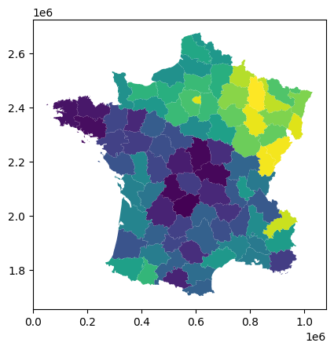

``` python
guerry.plot(column = 'Litercy', legend = True)
```

```         
<Axes: >
```

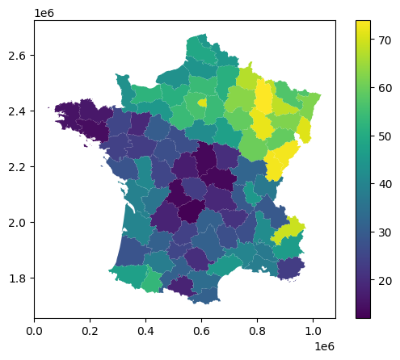

Геометрии объектов являются объектами библиотеки `shapely`

``` python
guerry.geometry
```

```         
0     POLYGON ((801150 2092615, 800669 2093190, 8006...
1     POLYGON ((729326 2521619, 729320 2521230, 7292...
2     POLYGON ((710830 2137350, 711746 2136617, 7124...
3     POLYGON ((882701 1920024, 882408 1920733, 8817...
4     POLYGON ((886504 1922890, 885733 1922978, 8854...
5     POLYGON ((747008 1925789, 746630 1925762, 7457...
6     POLYGON ((818893 2514767, 818614 2514515, 8179...
7     POLYGON ((509103 1747787, 508820 1747513, 5081...
8     POLYGON ((775400 2345600, 775068 2345397, 7735...
9     POLYGON ((626230 1810121, 626269 1810496, 6274...
10    POLYGON ((642972 1978185, 643791 1976549, 6444...
11    POLYGON ((824692 1865875, 825615 1865409, 8259...
12    POLYGON ((345476 2429914, 345299 2430235, 3436...
13    POLYGON ((591653 2017934, 591727 2018244, 5918...
14    POLYGON ((456425 2120055, 456229 2120382, 4559...
15    MULTIPOLYGON (((328075 2118055, 327916 2118168...
16    POLYGON ((572720 2252955, 574278 2251834, 5753...
17    POLYGON ((608225 2042680, 608101 2042880, 6079...
18    MULTIPOLYGON (((738935 2236890, 738359 2237343...
19    MULTIPOLYGON (((208165 2439753, 208131 2439949...
20    POLYGON ((540175 2111095, 538135 2111105, 5380...
21    POLYGON ((527718 1988833, 528808 1988071, 5291...
22    POLYGON ((886630 2188665, 886948 2188898, 8879...
23    POLYGON ((830803 2010472, 831288 2010361, 8315...
24    POLYGON ((515046 2482676, 515755 2483384, 5160...
25    POLYGON ((562860 2342515, 562499 2342577, 5602...
26    MULTIPOLYGON (((134794 2434061, 134532 2434541...
27    POLYGON ((719592 1880745, 719924 1881419, 7194...
28    POLYGON ((491745 1820323, 491926 1820668, 4914...
29    POLYGON ((447673 1816738, 447362 1816893, 4463...
30    MULTIPOLYGON (((332874 1966651, 332777 1966980...
31    POLYGON ((739523 1864067, 740853 1864454, 7414...
32    MULTIPOLYGON (((271910 2322460, 272047 2322795...
33    POLYGON ((573430 2159520, 573109 2159583, 5726...
34    POLYGON ((505590 2270755, 507478 2268385, 5076...
35    POLYGON ((839825 2094355, 840895 2093318, 8411...
36    MULTIPOLYGON (((836965 2209730, 836855 2209785...
37    POLYGON ((311864 1932711, 314132 1946872, 3141...
38    POLYGON ((519655 2330465, 520005 2329830, 5225...
39    POLYGON ((732285 2132610, 732782 2133196, 7330...
40    POLYGON ((742975 2044820, 744433 2045165, 7460...
41    POLYGON ((268705 2263645, 268976 2263891, 2710...
42    POLYGON ((557890 2341355, 558382 2341921, 5598...
43    POLYGON ((503966 1958060, 505528 1959658, 5058...
44    POLYGON ((413714 1942691, 413362 1942587, 4128...
45    POLYGON ((702442 1987131, 703082 1987282, 7033...
46    POLYGON ((409765 2298980, 409716 2297568, 4099...
47    MULTIPOLYGON (((316425 2410987, 316287 2411065...
48    POLYGON ((781920 2395187, 781562 2395133, 7809...
49    POLYGON ((776565 2346640, 776344 2346943, 7780...
50    POLYGON ((394355 2321180, 394249 2320876, 3943...
51    MULTIPOLYGON (((826186 2502671, 825892 2502926...
52    POLYGON ((853530 2462643, 853898 2462654, 8542...
53    MULTIPOLYGON (((167530 2307010, 167140 2307457...
54    POLYGON ((929062 2475639, 929093 2476415, 9280...
55    POLYGON ((715920 2264185, 717135 2264065, 7172...
56    MULTIPOLYGON (((664166 2630647, 664342 2629299...
57    MULTIPOLYGON (((647667 2468296, 647542 2468371...
58    POLYGON ((469173 2432434, 470681 2434059, 4709...
59    POLYGON ((629822 2560555, 629583 2560843, 6291...
60    POLYGON ((615585 2050805, 615649 2051154, 6162...
61    POLYGON ((386095 1774604, 386085 1774237, 3855...
62    MULTIPOLYGON (((406987 1826038, 405019 1826121...
63    POLYGON ((658127 1733192, 658228 1732843, 6582...
64    POLYGON ((946663 2460717, 946292 2461188, 9461...
65    POLYGON ((989865 2319005, 990659 2316949, 9900...
66    POLYGON ((752410 2115380, 752067 2115294, 7510...
67    POLYGON ((933555 2291420, 933269 2291556, 9326...
68    POLYGON ((834930 2207585, 834681 2207740, 8344...
69    POLYGON ((470543 2362046, 471980 2361813, 4726...
70    POLYGON ((615302 2411120, 615000 2411180, 6143...
71    POLYGON ((438965 2512493, 440124 2514448, 4402...
72    POLYGON ((675580 2375994, 675218 2376008, 6748...
73    POLYGON ((546799 2453567, 547588 2454258, 5478...
74    POLYGON ((419808 2218480, 420449 2218054, 4209...
75    POLYGON ((543667 2592806, 544247 2596216, 5451...
76    POLYGON ((548083 1858875, 547740 1858741, 5469...
77    POLYGON ((572261 1905414, 571717 1905736, 5705...
78    MULTIPOLYGON (((937679 1788572, 937646 1788379...
79    MULTIPOLYGON (((811669 1924852, 811384 1925100...
80    MULTIPOLYGON (((243055 2197885, 243019 2198089...
81    POLYGON ((450395 2119945, 450065 2120124, 4494...
82    POLYGON ((515230 2049895, 514990 2049594, 5143...
83    POLYGON ((951144 2383215, 953082 2382491, 9534...
84    POLYGON ((650260 2358330, 651712 2361305, 6528...
Name: geometry, dtype: geometry
```

``` python
guerry['geometry']
```

```         
0     POLYGON ((801150 2092615, 800669 2093190, 8006...
1     POLYGON ((729326 2521619, 729320 2521230, 7292...
2     POLYGON ((710830 2137350, 711746 2136617, 7124...
3     POLYGON ((882701 1920024, 882408 1920733, 8817...
4     POLYGON ((886504 1922890, 885733 1922978, 8854...
5     POLYGON ((747008 1925789, 746630 1925762, 7457...
6     POLYGON ((818893 2514767, 818614 2514515, 8179...
7     POLYGON ((509103 1747787, 508820 1747513, 5081...
8     POLYGON ((775400 2345600, 775068 2345397, 7735...
9     POLYGON ((626230 1810121, 626269 1810496, 6274...
10    POLYGON ((642972 1978185, 643791 1976549, 6444...
11    POLYGON ((824692 1865875, 825615 1865409, 8259...
12    POLYGON ((345476 2429914, 345299 2430235, 3436...
13    POLYGON ((591653 2017934, 591727 2018244, 5918...
14    POLYGON ((456425 2120055, 456229 2120382, 4559...
15    MULTIPOLYGON (((328075 2118055, 327916 2118168...
16    POLYGON ((572720 2252955, 574278 2251834, 5753...
17    POLYGON ((608225 2042680, 608101 2042880, 6079...
18    MULTIPOLYGON (((738935 2236890, 738359 2237343...
19    MULTIPOLYGON (((208165 2439753, 208131 2439949...
20    POLYGON ((540175 2111095, 538135 2111105, 5380...
21    POLYGON ((527718 1988833, 528808 1988071, 5291...
22    POLYGON ((886630 2188665, 886948 2188898, 8879...
23    POLYGON ((830803 2010472, 831288 2010361, 8315...
24    POLYGON ((515046 2482676, 515755 2483384, 5160...
25    POLYGON ((562860 2342515, 562499 2342577, 5602...
26    MULTIPOLYGON (((134794 2434061, 134532 2434541...
27    POLYGON ((719592 1880745, 719924 1881419, 7194...
28    POLYGON ((491745 1820323, 491926 1820668, 4914...
29    POLYGON ((447673 1816738, 447362 1816893, 4463...
30    MULTIPOLYGON (((332874 1966651, 332777 1966980...
31    POLYGON ((739523 1864067, 740853 1864454, 7414...
32    MULTIPOLYGON (((271910 2322460, 272047 2322795...
33    POLYGON ((573430 2159520, 573109 2159583, 5726...
34    POLYGON ((505590 2270755, 507478 2268385, 5076...
35    POLYGON ((839825 2094355, 840895 2093318, 8411...
36    MULTIPOLYGON (((836965 2209730, 836855 2209785...
37    POLYGON ((311864 1932711, 314132 1946872, 3141...
38    POLYGON ((519655 2330465, 520005 2329830, 5225...
39    POLYGON ((732285 2132610, 732782 2133196, 7330...
40    POLYGON ((742975 2044820, 744433 2045165, 7460...
41    POLYGON ((268705 2263645, 268976 2263891, 2710...
42    POLYGON ((557890 2341355, 558382 2341921, 5598...
43    POLYGON ((503966 1958060, 505528 1959658, 5058...
44    POLYGON ((413714 1942691, 413362 1942587, 4128...
45    POLYGON ((702442 1987131, 703082 1987282, 7033...
46    POLYGON ((409765 2298980, 409716 2297568, 4099...
47    MULTIPOLYGON (((316425 2410987, 316287 2411065...
48    POLYGON ((781920 2395187, 781562 2395133, 7809...
49    POLYGON ((776565 2346640, 776344 2346943, 7780...
50    POLYGON ((394355 2321180, 394249 2320876, 3943...
51    MULTIPOLYGON (((826186 2502671, 825892 2502926...
52    POLYGON ((853530 2462643, 853898 2462654, 8542...
53    MULTIPOLYGON (((167530 2307010, 167140 2307457...
54    POLYGON ((929062 2475639, 929093 2476415, 9280...
55    POLYGON ((715920 2264185, 717135 2264065, 7172...
56    MULTIPOLYGON (((664166 2630647, 664342 2629299...
57    MULTIPOLYGON (((647667 2468296, 647542 2468371...
58    POLYGON ((469173 2432434, 470681 2434059, 4709...
59    POLYGON ((629822 2560555, 629583 2560843, 6291...
60    POLYGON ((615585 2050805, 615649 2051154, 6162...
61    POLYGON ((386095 1774604, 386085 1774237, 3855...
62    MULTIPOLYGON (((406987 1826038, 405019 1826121...
63    POLYGON ((658127 1733192, 658228 1732843, 6582...
64    POLYGON ((946663 2460717, 946292 2461188, 9461...
65    POLYGON ((989865 2319005, 990659 2316949, 9900...
66    POLYGON ((752410 2115380, 752067 2115294, 7510...
67    POLYGON ((933555 2291420, 933269 2291556, 9326...
68    POLYGON ((834930 2207585, 834681 2207740, 8344...
69    POLYGON ((470543 2362046, 471980 2361813, 4726...
70    POLYGON ((615302 2411120, 615000 2411180, 6143...
71    POLYGON ((438965 2512493, 440124 2514448, 4402...
72    POLYGON ((675580 2375994, 675218 2376008, 6748...
73    POLYGON ((546799 2453567, 547588 2454258, 5478...
74    POLYGON ((419808 2218480, 420449 2218054, 4209...
75    POLYGON ((543667 2592806, 544247 2596216, 5451...
76    POLYGON ((548083 1858875, 547740 1858741, 5469...
77    POLYGON ((572261 1905414, 571717 1905736, 5705...
78    MULTIPOLYGON (((937679 1788572, 937646 1788379...
79    MULTIPOLYGON (((811669 1924852, 811384 1925100...
80    MULTIPOLYGON (((243055 2197885, 243019 2198089...
81    POLYGON ((450395 2119945, 450065 2120124, 4494...
82    POLYGON ((515230 2049895, 514990 2049594, 5143...
83    POLYGON ((951144 2383215, 953082 2382491, 9534...
84    POLYGON ((650260 2358330, 651712 2361305, 6528...
Name: geometry, dtype: geometry
```

Фактически колонка `geometry` представляет собой объект `GeoSeries`. Именно эта колонка то, что отличает `GeoDataFrame` от `DataFrame`

``` python
type(guerry['geometry'])
```

```         
geopandas.geoseries.GeoSeries
```

Так как в нашем `GeoDataFrame` хранится целый набор объектов, мы можем обращаться к каждому из них отдельно

``` python
guerry['geometry'].iloc[20]
```

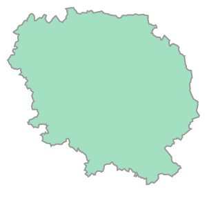

Кроме того, что у объектов есть геометрия, у них еще есть и система координат CRS (coordinate reference system) описанная в соответствии с реестром **EPSG**. Про системы координат и их преобразования будет чуть ниже.

``` python
guerry.crs
```

```         
<Projected CRS: EPSG:27572>
Name: NTF (Paris) / Lambert zone II
Axis Info [cartesian]:
- X[east]: Easting (metre)
- Y[north]: Northing (metre)
Area of Use:
- name: France mainland onshore between 50.5 grads and 53.5 grads North (45°27'N to 48°09'N). Also used over all onshore mainland France.
- bounds: (-4.87, 42.33, 8.23, 51.14)
Coordinate Operation:
- name: Lambert zone II
- method: Lambert Conic Conformal (1SP)
Datum: Nouvelle Triangulation Francaise (Paris)
- Ellipsoid: Clarke 1880 (IGN)
- Prime Meridian: Paris
```

Так как каждый пространственный объект занимает определенную часть поверхности, мы можем знать охват каждого элемента `GeoDataFrame`.

``` python
guerry.bounds
```

::: {}
```{=html}
<style scoped>
    .dataframe tbody tr th:only-of-type {
        vertical-align: middle;
    }

    .dataframe tbody tr th {
        vertical-align: top;
    }

    .dataframe thead th {
        text-align: right;
    }
</style>
```

+---------+----------+-----------+-----------+-----------+
|         | minx     | miny      | maxx      | maxy      |
+=========+==========+===========+===========+===========+
| 0       | 785562.0 | 2073221.0 | 894622.0  | 2172530.0 |
+---------+----------+-----------+-----------+-----------+
| 1       | 645357.0 | 2427270.0 | 738049.0  | 2564568.0 |
+---------+----------+-----------+-----------+-----------+
| 2       | 595532.0 | 2104320.0 | 728480.0  | 2200625.0 |
+---------+----------+-----------+-----------+-----------+
| 3       | 853311.0 | 1858801.0 | 970310.0  | 1972682.0 |
+---------+----------+-----------+-----------+-----------+
| 4       | 845528.0 | 1915176.0 | 975716.0  | 2022608.0 |
+---------+----------+-----------+-----------+-----------+
| 5       | 720908.0 | 1920016.0 | 801330.0  | 2043510.0 |
+---------+----------+-----------+-----------+-----------+
| 6       | 722230.0 | 2472836.0 | 821101.0  | 2577475.0 |
+---------+----------+-----------+-----------+-----------+
| 7       | 476458.0 | 1729992.0 | 586665.0  | 1813083.0 |
+---------+----------+-----------+-----------+-----------+
| 8       | 677472.0 | 2326409.0 | 787769.0  | 2414830.0 |
+---------+----------+-----------+-----------+-----------+
| 9       | 547293.0 | 1738382.0 | 673587.0  | 1828670.0 |
+---------+----------+-----------+-----------+-----------+
| 10      | 560428.0 | 1854631.0 | 689438.0  | 1993474.0 |
+---------+----------+-----------+-----------+-----------+
| 11      | 753479.0 | 1801065.0 | 880584.0  | 1883210.0 |
+---------+----------+-----------+-----------+-----------+
| 12      | 343281.0 | 2421791.0 | 461649.0  | 2494418.0 |
+---------+----------+-----------+-----------+-----------+
| 13      | 578407.0 | 1957191.0 | 681624.0  | 2053570.0 |
+---------+----------+-----------+-----------+-----------+
| 14      | 382200.0 | 2023953.0 | 492036.0  | 2127830.0 |
+---------+----------+-----------+-----------+-----------+
| 15      | 299524.0 | 2012956.0 | 416924.0  | 2157530.0 |
+---------+----------+-----------+-----------+-----------+
| 16      | 557360.0 | 2157815.0 | 656530.0  | 2292170.0 |
+---------+----------+-----------+-----------+-----------+
| 17      | 512915.0 | 1991211.0 | 614970.0  | 2084866.0 |
+---------+----------+-----------+-----------+-----------+
| 18      | 730455.0 | 2213900.0 | 840550.0  | 2339370.0 |
+---------+----------+-----------+-----------+-----------+
| 19      | 158177.0 | 2348855.0 | 286218.0  | 2444887.0 |
+---------+----------+-----------+-----------+-----------+
| 20      | 525780.0 | 2073768.0 | 621254.0  | 2161816.0 |
+---------+----------+-----------+-----------+-----------+
| 21      | 412537.0 | 1953083.0 | 529961.0  | 2080805.0 |
+---------+----------+-----------+-----------+-----------+
| 22      | 854350.0 | 2179635.0 | 956561.0  | 2295645.0 |
+---------+----------+-----------+-----------+-----------+
| 23      | 784328.0 | 1906647.0 | 876891.0  | 2041614.0 |
+---------+----------+-----------+-----------+-----------+
| 24      | 451680.0 | 2408681.0 | 561119.0  | 2500185.0 |
+---------+----------+-----------+-----------+-----------+
| 25      | 482816.0 | 2328715.0 | 574582.0  | 2438418.0 |
+---------+----------+-----------+-----------+-----------+
| 26      | 47680.0  | 2323751.0 | 172543.0  | 2436033.0 |
+---------+----------+-----------+-----------+-----------+
| 27      | 674291.0 | 1830522.0 | 801413.0  | 1941263.0 |
+---------+----------+-----------+-----------+-----------+
| 28      | 445263.0 | 1744543.0 | 576643.0  | 1880284.0 |
+---------+----------+-----------+-----------+-----------+
| 29      | 388461.0 | 1813610.0 | 508221.0  | 1899093.0 |
+---------+----------+-----------+-----------+-----------+
| 30      | 314116.0 | 1913779.0 | 440128.0  | 2069014.0 |
+---------+----------+-----------+-----------+-----------+
| 31      | 616528.0 | 1801568.0 | 750021.0  | 1886461.0 |
+---------+----------+-----------+-----------+-----------+
| 32      | 255035.0 | 2301820.0 | 349781.0  | 2420371.0 |
+---------+----------+-----------+-----------+-----------+
| 33      | 487765.0 | 2150095.0 | 589810.0  | 2253298.0 |
+---------+----------+-----------+-----------+-----------+
| 34      | 426955.0 | 2193900.0 | 526245.0  | 2302342.0 |
+---------+----------+-----------+-----------+-----------+
| 35      | 788362.0 | 1972129.0 | 917741.0  | 2102554.0 |
+---------+----------+-----------+-----------+-----------+
| 36      | 821840.0 | 2145394.0 | 895467.0  | 2261060.0 |
+---------+----------+-----------+-----------+-----------+
| 37      | 287519.0 | 1838086.0 | 423747.0  | 1953842.0 |
+---------+----------+-----------+-----------+-----------+
| 38      | 468225.0 | 2243430.0 | 593310.0  | 2348995.0 |
+---------+----------+-----------+-----------+-----------+
| 39      | 705258.0 | 2028059.0 | 789713.0  | 2142950.0 |
+---------+----------+-----------+-----------+-----------+
| 40      | 658752.0 | 1972624.0 | 769100.0  | 2048140.0 |
+---------+----------+-----------+-----------+-----------+
| 41      | 230711.0 | 2214005.0 | 353995.0  | 2321981.0 |
+---------+----------+-----------+-----------+-----------+
| 42      | 538649.0 | 2276010.0 | 659129.0  | 2371784.0 |
+---------+----------+-----------+-----------+-----------+
| 43      | 492252.0 | 1911800.0 | 589888.0  | 2005212.0 |
+---------+----------+-----------+-----------+-----------+
| 44      | 401927.0 | 1888135.0 | 499975.0  | 1975953.0 |
+---------+----------+-----------+-----------+-----------+
| 45      | 651208.0 | 1902123.0 | 732320.0  | 1997767.0 |
+---------+----------+-----------+-----------+-----------+
| 46      | 321020.0 | 2223897.0 | 441890.0  | 2318375.0 |
+---------+----------+-----------+-----------+-----------+
| 47      | 290741.0 | 2390737.0 | 373680.0  | 2533863.0 |
+---------+----------+-----------+-----------+-----------+
| 48      | 678219.0 | 2391754.0 | 797839.0  | 2491197.0 |
+---------+----------+-----------+-----------+-----------+
| 49      | 769392.0 | 2290410.0 | 865605.0  | 2413138.0 |
+---------+----------+-----------+-----------+-----------+
| 50      | 332335.0 | 2308035.0 | 423374.0  | 2399712.0 |
+---------+----------+-----------+-----------+-----------+
| 51      | 824020.0 | 2378553.0 | 953547.0  | 2512709.0 |
+---------+----------+-----------+-----------+-----------+
| 52      | 787497.0 | 2383743.0 | 857296.0  | 2517642.0 |
+---------+----------+-----------+-----------+-----------+
| 53      | 148290.0 | 2267645.0 | 272800.0  | 2370649.0 |
+---------+----------+-----------+-----------+-----------+
| 54      | 857837.0 | 2402961.0 | 987605.0  | 2508696.0 |
+---------+----------+-----------+-----------+-----------+
| 55      | 638290.0 | 2184105.0 | 743520.0  | 2287762.0 |
+---------+----------+-----------+-----------+-----------+
| 56      | 581084.0 | 2554112.0 | 735799.0  | 2677441.0 |
+---------+----------+-----------+-----------+-----------+
| 57      | 553200.0 | 2451453.0 | 660220.0  | 2529648.0 |
+---------+----------+-----------+-----------+-----------+
| 58      | 363740.0 | 2354620.0 | 499340.0  | 2443388.0 |
+---------+----------+-----------+-----------+-----------+
| 59      | 544398.0 | 2558462.0 | 660799.0  | 2668207.0 |
+---------+----------+-----------+-----------+-----------+
| 60      | 604000.0 | 2032072.0 | 728930.0  | 2139740.0 |
+---------+----------+-----------+-----------+-----------+
| 61      | 265360.0 | 1757230.0 | 412520.0  | 1847811.0 |
+---------+----------+-----------+-----------+-----------+
| 62      | 382108.0 | 1743459.0 | 461744.0  | 1848393.0 |
+---------+----------+-----------+-----------+-----------+
| 63      | 549532.0 | 1703258.0 | 669196.0  | 1768513.0 |
+---------+----------+-----------+-----------+-----------+
| 64      | 937463.0 | 2359888.0 | 1031401.0 | 2465672.0 |
+---------+----------+-----------+-----------+-----------+
| 65      | 937334.0 | 2280516.0 | 994987.0  | 2379232.0 |
+---------+----------+-----------+-----------+-----------+
| 66      | 747910.0 | 2053380.0 | 819740.0  | 2147622.0 |
+---------+----------+-----------+-----------+-----------+
| 67      | 828336.0 | 2255412.0 | 937270.0  | 2342925.0 |
+---------+----------+-----------+-----------+-----------+
| 68      | 698284.0 | 2130343.0 | 838497.0  | 2241205.0 |
+---------+----------+-----------+-----------+-----------+
| 69      | 391570.0 | 2287275.0 | 494315.0  | 2389324.0 |
+---------+----------+-----------+-----------+-----------+
| 70      | 585997.0 | 2410080.0 | 620470.0  | 2446056.0 |
+---------+----------+-----------+-----------+-----------+
| 71      | 435461.0 | 2473524.0 | 560272.0  | 2564284.0 |
+---------+----------+-----------+-----------+-----------+
| 72      | 604141.0 | 2346870.0 | 689984.0  | 2457985.0 |
+---------+----------+-----------+-----------+-----------+
| 73      | 534961.0 | 2365196.0 | 618869.0  | 2471252.0 |
+---------+----------+-----------+-----------+-----------+
| 74      | 353635.0 | 2110650.0 | 436452.0  | 2237360.0 |
+---------+----------+-----------+-----------+-----------+
| 75      | 531390.0 | 2508339.0 | 662211.0  | 2596807.0 |
+---------+----------+-----------+-----------+-----------+
| 76      | 535618.0 | 1820051.0 | 648303.0  | 1911053.0 |
+---------+----------+-----------+-----------+-----------+
| 77      | 471821.0 | 1863598.0 | 572816.0  | 1933271.0 |
+---------+----------+-----------+-----------+-----------+
| 78      | 868544.0 | 1783206.0 | 972280.0  | 1876406.0 |
+---------+----------+-----------+-----------+-----------+
| 79      | 784690.0 | 1856067.0 | 875879.0  | 1940082.0 |
+---------+----------+-----------+-----------+-----------+
| 80      | 238257.0 | 2147245.0 | 378970.0  | 2237880.0 |
+---------+----------+-----------+-----------+-----------+
| 81      | 414673.0 | 2118365.0 | 513665.0  | 2244365.0 |
+---------+----------+-----------+-----------+-----------+
| 82      | 467110.0 | 2049172.0 | 566733.0  | 2156205.0 |
+---------+----------+-----------+-----------+-----------+
| 83      | 826426.0 | 2322215.0 | 960485.0  | 2401303.0 |
+---------+----------+-----------+-----------+-----------+
| 84      | 638420.0 | 2258284.0 | 750100.0  | 2378276.0 |
+---------+----------+-----------+-----------+-----------+
:::

Или охват всего `GeoDataFrame`

``` python
guerry.total_bounds
```

```         
array([  47680., 1703258., 1031401., 2677441.])
```

Подход работы с данными в `GeoDataFrame` позволяет, например, выбирать только определенные колонки из набора данных.

``` python
print(guerry.columns.tolist())
```

```         
['dept', 'Region', 'Dprtmnt', 'Crm_prs', 'Crm_prp', 'Litercy', 'Donatns', 'Infants', 'Suicids', 'MainCty', 'Wealth', 'Commerc', 'Clergy', 'Crm_prn', 'Infntcd', 'Dntn_cl', 'Lottery', 'Desertn', 'Instrct', 'Prsttts', 'Distanc', 'Area', 'Pop1831', 'geometry']
```

``` python
guerry[["Region","Dprtmnt", "Litercy", "MainCty","geometry"]]
```

::: {}
```{=html}
<style scoped>
    .dataframe tbody tr th:only-of-type {
        vertical-align: middle;
    }

    .dataframe tbody tr th {
        vertical-align: top;
    }

    .dataframe thead th {
        text-align: right;
    }
</style>
```

+-------+--------+---------------------+---------+---------+---------------------------------------------------+
|       | Region | Dprtmnt             | Litercy | MainCty | geometry                                          |
+=======+========+=====================+=========+=========+===================================================+
| 0     | E      | Ain                 | 37.0    | 2.0     | POLYGON ((801150 2092615, 800669 2093190, 8006... |
+-------+--------+---------------------+---------+---------+---------------------------------------------------+
| 1     | N      | Aisne               | 51.0    | 2.0     | POLYGON ((729326 2521619, 729320 2521230, 7292... |
+-------+--------+---------------------+---------+---------+---------------------------------------------------+
| 2     | C      | Allier              | 13.0    | 2.0     | POLYGON ((710830 2137350, 711746 2136617, 7124... |
+-------+--------+---------------------+---------+---------+---------------------------------------------------+
| 3     | E      | Basses-Alpes        | 46.0    | 1.0     | POLYGON ((882701 1920024, 882408 1920733, 8817... |
+-------+--------+---------------------+---------+---------+---------------------------------------------------+
| 4     | E      | Hautes-Alpes        | 69.0    | 1.0     | POLYGON ((886504 1922890, 885733 1922978, 8854... |
+-------+--------+---------------------+---------+---------+---------------------------------------------------+
| 5     | S      | Ardeche             | 27.0    | 1.0     | POLYGON ((747008 1925789, 746630 1925762, 7457... |
+-------+--------+---------------------+---------+---------+---------------------------------------------------+
| 6     | N      | Ardennes            | 67.0    | 2.0     | POLYGON ((818893 2514767, 818614 2514515, 8179... |
+-------+--------+---------------------+---------+---------+---------------------------------------------------+
| 7     | S      | Ariege              | 18.0    | 1.0     | POLYGON ((509103 1747787, 508820 1747513, 5081... |
+-------+--------+---------------------+---------+---------+---------------------------------------------------+
| 8     | E      | Aube                | 59.0    | 2.0     | POLYGON ((775400 2345600, 775068 2345397, 7735... |
+-------+--------+---------------------+---------+---------+---------------------------------------------------+
| 9     | S      | Aude                | 34.0    | 2.0     | POLYGON ((626230 1810121, 626269 1810496, 6274... |
+-------+--------+---------------------+---------+---------+---------------------------------------------------+
| 10    | S      | Aveyron             | 31.0    | 2.0     | POLYGON ((642972 1978185, 643791 1976549, 6444... |
+-------+--------+---------------------+---------+---------+---------------------------------------------------+
| 11    | S      | Bouches-du-Rhone    | 38.0    | 3.0     | POLYGON ((824692 1865875, 825615 1865409, 8259... |
+-------+--------+---------------------+---------+---------+---------------------------------------------------+
| 12    | N      | Calvados            | 52.0    | 2.0     | POLYGON ((345476 2429914, 345299 2430235, 3436... |
+-------+--------+---------------------+---------+---------+---------------------------------------------------+
| 13    | C      | Cantal              | 31.0    | 2.0     | POLYGON ((591653 2017934, 591727 2018244, 5918... |
+-------+--------+---------------------+---------+---------+---------------------------------------------------+
| 14    | W      | Charente            | 36.0    | 2.0     | POLYGON ((456425 2120055, 456229 2120382, 4559... |
+-------+--------+---------------------+---------+---------+---------------------------------------------------+
| 15    | W      | Charente-Inferieure | 39.0    | 2.0     | MULTIPOLYGON (((328075 2118055, 327916 2118168... |
+-------+--------+---------------------+---------+---------+---------------------------------------------------+
| 16    | C      | Cher                | 13.0    | 2.0     | POLYGON ((572720 2252955, 574278 2251834, 5753... |
+-------+--------+---------------------+---------+---------+---------------------------------------------------+
| 17    | C      | Correze             | 12.0    | 2.0     | POLYGON ((608225 2042680, 608101 2042880, 6079... |
+-------+--------+---------------------+---------+---------+---------------------------------------------------+
| 18    | E      | Cote-d'Or           | 60.0    | 2.0     | MULTIPOLYGON (((738935 2236890, 738359 2237343... |
+-------+--------+---------------------+---------+---------+---------------------------------------------------+
| 19    | W      | Cotes-du-Nord       | 16.0    | 2.0     | MULTIPOLYGON (((208165 2439753, 208131 2439949... |
+-------+--------+---------------------+---------+---------+---------------------------------------------------+
| 20    | C      | Creuse              | 23.0    | 1.0     | POLYGON ((540175 2111095, 538135 2111105, 5380... |
+-------+--------+---------------------+---------+---------+---------------------------------------------------+
| 21    | W      | Dordogne            | 18.0    | 2.0     | POLYGON ((527718 1988833, 528808 1988071, 5291... |
+-------+--------+---------------------+---------+---------+---------------------------------------------------+
| 22    | E      | Doubs               | 73.0    | 2.0     | POLYGON ((886630 2188665, 886948 2188898, 8879... |
+-------+--------+---------------------+---------+---------+---------------------------------------------------+
| 23    | E      | Drome               | 42.0    | 2.0     | POLYGON ((830803 2010472, 831288 2010361, 8315... |
+-------+--------+---------------------+---------+---------+---------------------------------------------------+
| 24    | N      | Eure                | 51.0    | 2.0     | POLYGON ((515046 2482676, 515755 2483384, 5160... |
+-------+--------+---------------------+---------+---------+---------------------------------------------------+
| 25    | C      | Eure-et-Loir        | 54.0    | 2.0     | POLYGON ((562860 2342515, 562499 2342577, 5602... |
+-------+--------+---------------------+---------+---------+---------------------------------------------------+
| 26    | W      | Finistere           | 15.0    | 2.0     | MULTIPOLYGON (((134794 2434061, 134532 2434541... |
+-------+--------+---------------------+---------+---------+---------------------------------------------------+
| 27    | S      | Gard                | 40.0    | 2.0     | POLYGON ((719592 1880745, 719924 1881419, 7194... |
+-------+--------+---------------------+---------+---------+---------------------------------------------------+
| 28    | S      | Haute-Garonne       | 31.0    | 3.0     | POLYGON ((491745 1820323, 491926 1820668, 4914... |
+-------+--------+---------------------+---------+---------+---------------------------------------------------+
| 29    | S      | Gers                | 38.0    | 2.0     | POLYGON ((447673 1816738, 447362 1816893, 4463... |
+-------+--------+---------------------+---------+---------+---------------------------------------------------+
| 30    | W      | Gironde             | 40.0    | 3.0     | MULTIPOLYGON (((332874 1966651, 332777 1966980... |
+-------+--------+---------------------+---------+---------+---------------------------------------------------+
| 31    | S      | Herault             | 45.0    | 2.0     | POLYGON ((739523 1864067, 740853 1864454, 7414... |
+-------+--------+---------------------+---------+---------+---------------------------------------------------+
| 32    | W      | Ille-et-Vilaine     | 25.0    | 2.0     | MULTIPOLYGON (((271910 2322460, 272047 2322795... |
+-------+--------+---------------------+---------+---------+---------------------------------------------------+
| 33    | C      | Indre               | 17.0    | 2.0     | POLYGON ((573430 2159520, 573109 2159583, 5726... |
+-------+--------+---------------------+---------+---------+---------------------------------------------------+
| 34    | C      | Indre-et-Loire      | 27.0    | 2.0     | POLYGON ((505590 2270755, 507478 2268385, 5076... |
+-------+--------+---------------------+---------+---------+---------------------------------------------------+
| 35    | E      | Isere               | 29.0    | 2.0     | POLYGON ((839825 2094355, 840895 2093318, 8411... |
+-------+--------+---------------------+---------+---------+---------------------------------------------------+
| 36    | E      | Jura                | 73.0    | 2.0     | MULTIPOLYGON (((836965 2209730, 836855 2209785... |
+-------+--------+---------------------+---------+---------+---------------------------------------------------+
| 37    | W      | Landes              | 28.0    | 1.0     | POLYGON ((311864 1932711, 314132 1946872, 3141... |
+-------+--------+---------------------+---------+---------+---------------------------------------------------+
| 38    | C      | Loir-et-Cher        | 27.0    | 2.0     | POLYGON ((519655 2330465, 520005 2329830, 5225... |
+-------+--------+---------------------+---------+---------+---------------------------------------------------+
| 39    | C      | Loire               | 29.0    | 2.0     | POLYGON ((732285 2132610, 732782 2133196, 7330... |
+-------+--------+---------------------+---------+---------+---------------------------------------------------+
| 40    | C      | Haute-Loire         | 21.0    | 2.0     | POLYGON ((742975 2044820, 744433 2045165, 7460... |
+-------+--------+---------------------+---------+---------+---------------------------------------------------+
| 41    | W      | Loire-Inferieure    | 24.0    | 3.0     | POLYGON ((268705 2263645, 268976 2263891, 2710... |
+-------+--------+---------------------+---------+---------+---------------------------------------------------+
| 42    | C      | Loiret              | 42.0    | 2.0     | POLYGON ((557890 2341355, 558382 2341921, 5598... |
+-------+--------+---------------------+---------+---------+---------------------------------------------------+
| 43    | S      | Lot                 | 24.0    | 2.0     | POLYGON ((503966 1958060, 505528 1959658, 5058... |
+-------+--------+---------------------+---------+---------+---------------------------------------------------+
| 44    | W      | Lot-et-Garonne      | 31.0    | 2.0     | POLYGON ((413714 1942691, 413362 1942587, 4128... |
+-------+--------+---------------------+---------+---------+---------------------------------------------------+
| 45    | S      | Lozere              | 27.0    | 1.0     | POLYGON ((702442 1987131, 703082 1987282, 7033... |
+-------+--------+---------------------+---------+---------+---------------------------------------------------+
| 46    | W      | Maine-et-Loire      | 23.0    | 2.0     | POLYGON ((409765 2298980, 409716 2297568, 4099... |
+-------+--------+---------------------+---------+---------+---------------------------------------------------+
| 47    | N      | Manche              | 43.0    | 2.0     | MULTIPOLYGON (((316425 2410987, 316287 2411065... |
+-------+--------+---------------------+---------+---------+---------------------------------------------------+
| 48    | N      | Marne               | 63.0    | 2.0     | POLYGON ((781920 2395187, 781562 2395133, 7809... |
+-------+--------+---------------------+---------+---------+---------------------------------------------------+
| 49    | E      | Haute-Marne         | 72.0    | 1.0     | POLYGON ((776565 2346640, 776344 2346943, 7780... |
+-------+--------+---------------------+---------+---------+---------------------------------------------------+
| 50    | W      | Mayenne             | 19.0    | 2.0     | POLYGON ((394355 2321180, 394249 2320876, 3943... |
+-------+--------+---------------------+---------+---------+---------------------------------------------------+
| 51    | E      | Meurthe             | 68.0    | 2.0     | MULTIPOLYGON (((826186 2502671, 825892 2502926... |
+-------+--------+---------------------+---------+---------+---------------------------------------------------+
| 52    | N      | Meuse               | 74.0    | 2.0     | POLYGON ((853530 2462643, 853898 2462654, 8542... |
+-------+--------+---------------------+---------+---------+---------------------------------------------------+
| 53    | W      | Morbihan            | 14.0    | 2.0     | MULTIPOLYGON (((167530 2307010, 167140 2307457... |
+-------+--------+---------------------+---------+---------+---------------------------------------------------+
| 54    | N      | Moselle             | 57.0    | 3.0     | POLYGON ((929062 2475639, 929093 2476415, 9280... |
+-------+--------+---------------------+---------+---------+---------------------------------------------------+
| 55    | C      | Nievre              | 20.0    | 2.0     | POLYGON ((715920 2264185, 717135 2264065, 7172... |
+-------+--------+---------------------+---------+---------+---------------------------------------------------+
| 56    | N      | Nord                | 45.0    | 3.0     | MULTIPOLYGON (((664166 2630647, 664342 2629299... |
+-------+--------+---------------------+---------+---------+---------------------------------------------------+
| 57    | N      | Oise                | 54.0    | 2.0     | MULTIPOLYGON (((647667 2468296, 647542 2468371... |
+-------+--------+---------------------+---------+---------+---------------------------------------------------+
| 58    | N      | Orne                | 45.0    | 2.0     | POLYGON ((469173 2432434, 470681 2434059, 4709... |
+-------+--------+---------------------+---------+---------+---------------------------------------------------+
| 59    | N      | Pas-de-Calais       | 49.0    | 2.0     | POLYGON ((629822 2560555, 629583 2560843, 6291... |
+-------+--------+---------------------+---------+---------+---------------------------------------------------+
| 60    | C      | Puy-de-Dome         | 19.0    | 2.0     | POLYGON ((615585 2050805, 615649 2051154, 6162... |
+-------+--------+---------------------+---------+---------+---------------------------------------------------+
| 61    | W      | Basses-Pyrenees     | 47.0    | 2.0     | POLYGON ((386095 1774604, 386085 1774237, 3855... |
+-------+--------+---------------------+---------+---------+---------------------------------------------------+
| 62    | S      | Hautes-Pyrenees     | 53.0    | 2.0     | MULTIPOLYGON (((406987 1826038, 405019 1826121... |
+-------+--------+---------------------+---------+---------+---------------------------------------------------+
| 63    | S      | Pyrenees-Orientales | 31.0    | 2.0     | POLYGON ((658127 1733192, 658228 1732843, 6582... |
+-------+--------+---------------------+---------+---------+---------------------------------------------------+
| 64    | E      | Bas-Rhin            | 62.0    | 3.0     | POLYGON ((946663 2460717, 946292 2461188, 9461... |
+-------+--------+---------------------+---------+---------+---------------------------------------------------+
| 65    | E      | Haut-Rhin           | 71.0    | 2.0     | POLYGON ((989865 2319005, 990659 2316949, 9900... |
+-------+--------+---------------------+---------+---------+---------------------------------------------------+
| 66    | E      | Rhone               | 45.0    | 3.0     | POLYGON ((752410 2115380, 752067 2115294, 7510... |
+-------+--------+---------------------+---------+---------+---------------------------------------------------+
| 67    | E      | Haute-Saone         | 59.0    | 1.0     | POLYGON ((933555 2291420, 933269 2291556, 9326... |
+-------+--------+---------------------+---------+---------+---------------------------------------------------+
| 68    | E      | Saone-et-Loire      | 32.0    | 2.0     | POLYGON ((834930 2207585, 834681 2207740, 8344... |
+-------+--------+---------------------+---------+---------+---------------------------------------------------+
| 69    | C      | Sarthe              | 30.0    | 2.0     | POLYGON ((470543 2362046, 471980 2361813, 4726... |
+-------+--------+---------------------+---------+---------+---------------------------------------------------+
| 70    | N      | Seine               | 71.0    | 3.0     | POLYGON ((615302 2411120, 615000 2411180, 6143... |
+-------+--------+---------------------+---------+---------+---------------------------------------------------+
| 71    | N      | Seine-Inferieure    | 43.0    | 3.0     | POLYGON ((438965 2512493, 440124 2514448, 4402... |
+-------+--------+---------------------+---------+---------+---------------------------------------------------+
| 72    | N      | Seine-et-Marne      | 54.0    | 2.0     | POLYGON ((675580 2375994, 675218 2376008, 6748... |
+-------+--------+---------------------+---------+---------+---------------------------------------------------+
| 73    | N      | Seine-et-Oise       | 56.0    | 2.0     | POLYGON ((546799 2453567, 547588 2454258, 5478... |
+-------+--------+---------------------+---------+---------+---------------------------------------------------+
| 74    | W      | Deux-Sevres         | 41.0    | 2.0     | POLYGON ((419808 2218480, 420449 2218054, 4209... |
+-------+--------+---------------------+---------+---------+---------------------------------------------------+
| 75    | N      | Somme               | 44.0    | 2.0     | POLYGON ((543667 2592806, 544247 2596216, 5451... |
+-------+--------+---------------------+---------+---------+---------------------------------------------------+
| 76    | S      | Tarn                | 20.0    | 2.0     | POLYGON ((548083 1858875, 547740 1858741, 5469... |
+-------+--------+---------------------+---------+---------+---------------------------------------------------+
| 77    | S      | Tarn-et-Garonne     | 25.0    | 2.0     | POLYGON ((572261 1905414, 571717 1905736, 5705... |
+-------+--------+---------------------+---------+---------+---------------------------------------------------+
| 78    | S      | Var                 | 23.0    | 2.0     | MULTIPOLYGON (((937679 1788572, 937646 1788379... |
+-------+--------+---------------------+---------+---------+---------------------------------------------------+
| 79    | S      | Vaucluse            | 37.0    | 2.0     | MULTIPOLYGON (((811669 1924852, 811384 1925100... |
+-------+--------+---------------------+---------+---------+---------------------------------------------------+
| 80    | W      | Vendee              | 28.0    | 1.0     | MULTIPOLYGON (((243055 2197885, 243019 2198089... |
+-------+--------+---------------------+---------+---------+---------------------------------------------------+
| 81    | W      | Vienne              | 25.0    | 2.0     | POLYGON ((450395 2119945, 450065 2120124, 4494... |
+-------+--------+---------------------+---------+---------+---------------------------------------------------+
| 82    | C      | Haute-Vienne        | 13.0    | 2.0     | POLYGON ((515230 2049895, 514990 2049594, 5143... |
+-------+--------+---------------------+---------+---------+---------------------------------------------------+
| 83    | E      | Vosges              | 62.0    | 2.0     | POLYGON ((951144 2383215, 953082 2382491, 9534... |
+-------+--------+---------------------+---------+---------+---------------------------------------------------+
| 84    | C      | Yonne               | 47.0    | 2.0     | POLYGON ((650260 2358330, 651712 2361305, 6528... |
+-------+--------+---------------------+---------+---------+---------------------------------------------------+
:::

При необходимости мы можем отфильтровать объекты нашего `GeoDataFrame` по значению атрибутов.

``` python
region_literate = guerry["Litercy"] > 30

region_literate
```

```         
0      True
1      True
2     False
3      True
4      True
5     False
6      True
7     False
8      True
9      True
10     True
11     True
12     True
13     True
14     True
15     True
16    False
17    False
18     True
19    False
20    False
21    False
22     True
23     True
24     True
25     True
26    False
27     True
28     True
29     True
30     True
31     True
32    False
33    False
34    False
35    False
36     True
37    False
38    False
39    False
40    False
41    False
42     True
43    False
44     True
45    False
46    False
47     True
48     True
49     True
50    False
51     True
52     True
53    False
54     True
55    False
56     True
57     True
58     True
59     True
60    False
61     True
62     True
63     True
64     True
65     True
66     True
67     True
68     True
69    False
70     True
71     True
72     True
73     True
74     True
75     True
76    False
77    False
78    False
79     True
80    False
81    False
82    False
83     True
84     True
Name: Litercy, dtype: bool
```

``` python
guerry_literate = guerry[region_literate]

guerry_literate
```

::: {}
```{=html}
<style scoped>
    .dataframe tbody tr th:only-of-type {
        vertical-align: middle;
    }

    .dataframe tbody tr th {
        vertical-align: top;
    }

    .dataframe thead th {
        text-align: right;
    }
</style>
```

<table>
<thead>
<tr>
<th><p></p></th>
<th><p>dept</p></th>
<th><p>Region</p></th>
<th><p>Dprtmnt</p></th>
<th><p>Crm_prs</p></th>
<th><p>Crm_prp</p></th>
<th><p>Litercy</p></th>
<th><p>Donatns</p></th>
<th><p>Infants</p></th>
<th><p>Suicids</p></th>
<th><p>MainCty</p></th>
<th><p>...</p></th>
<th><p>Infntcd</p></th>
<th><p>Dntn_cl</p></th>
<th><p>Lottery</p></th>
<th><p>Desertn</p></th>
<th><p>Instrct</p></th>
<th><p>Prsttts</p></th>
<th><p>Distanc</p></th>
<th><p>Area</p></th>
<th><p>Pop1831</p></th>
<th><p>geometry</p></th>
</tr>
</thead>
<tbody>
<tr>
<td><p>0</p></td>
<td><p>1.0</p></td>
<td><p>S</p></td>
<td><p>Ain</p></td>
<td><p>28870.0</p></td>
<td><p>15890.0</p></td>
<td><p>37.0</p></td>
<td><p>5098.0</p></td>
<td><p>33120.0</p></td>
<td><p>35039.0</p></td>
<td><p>2.0</p></td>
<td><p>...</p></td>
<td><p>60.0</p></td>
<td><p>69.0</p></td>
<td><p>41.0</p></td>
<td><p>55.0</p></td>
<td><p>46.0</p></td>
<td><p>13.0</p></td>
<td><p>218.372</p></td>
<td><p>5762.0</p></td>
<td><p>346.03</p></td>
<td><p>POLYGON ((801150 2092615, 800669 2093190, 8006...</p></td>
</tr>
<tr>
<td><p>1</p></td>
<td><p>2.0</p></td>
<td><p>S</p></td>
<td><p>Aisne</p></td>
<td><p>26226.0</p></td>
<td><p>5521.0</p></td>
<td><p>51.0</p></td>
<td><p>8901.0</p></td>
<td><p>14572.0</p></td>
<td><p>12831.0</p></td>
<td><p>2.0</p></td>
<td><p>...</p></td>
<td><p>82.0</p></td>
<td><p>36.0</p></td>
<td><p>38.0</p></td>
<td><p>82.0</p></td>
<td><p>24.0</p></td>
<td><p>327.0</p></td>
<td><p>65.945</p></td>
<td><p>7369.0</p></td>
<td><p>513.00</p></td>
<td><p>POLYGON ((729326 2521619, 729320 2521230, 7292...</p></td>
</tr>
<tr>
<td><p>3</p></td>
<td><p>4.0</p></td>
<td><p>S</p></td>
<td><p>Basses-Alpes</p></td>
<td><p>12935.0</p></td>
<td><p>7289.0</p></td>
<td><p>46.0</p></td>
<td><p>2733.0</p></td>
<td><p>23018.0</p></td>
<td><p>14238.0</p></td>
<td><p>1.0</p></td>
<td><p>...</p></td>
<td><p>12.0</p></td>
<td><p>37.0</p></td>
<td><p>80.0</p></td>
<td><p>32.0</p></td>
<td><p>29.0</p></td>
<td><p>2.0</p></td>
<td><p>351.399</p></td>
<td><p>6925.0</p></td>
<td><p>155.90</p></td>
<td><p>POLYGON ((882701 1920024, 882408 1920733, 8817...</p></td>
</tr>
<tr>
<td><p>4</p></td>
<td><p>5.0</p></td>
<td><p>S</p></td>
<td><p>Hautes-Alpes</p></td>
<td><p>17488.0</p></td>
<td><p>8174.0</p></td>
<td><p>69.0</p></td>
<td><p>6962.0</p></td>
<td><p>23076.0</p></td>
<td><p>16171.0</p></td>
<td><p>1.0</p></td>
<td><p>...</p></td>
<td><p>23.0</p></td>
<td><p>64.0</p></td>
<td><p>79.0</p></td>
<td><p>35.0</p></td>
<td><p>7.0</p></td>
<td><p>1.0</p></td>
<td><p>320.280</p></td>
<td><p>5549.0</p></td>
<td><p>129.10</p></td>
<td><p>POLYGON ((886504 1922890, 885733 1922978, 8854...</p></td>
</tr>
<tr>
<td><p>6</p></td>
<td><p>8.0</p></td>
<td><p>S</p></td>
<td><p>Ardennes</p></td>
<td><p>35203.0</p></td>
<td><p>8847.0</p></td>
<td><p>67.0</p></td>
<td><p>6400.0</p></td>
<td><p>16106.0</p></td>
<td><p>26198.0</p></td>
<td><p>2.0</p></td>
<td><p>...</p></td>
<td><p>85.0</p></td>
<td><p>49.0</p></td>
<td><p>31.0</p></td>
<td><p>62.0</p></td>
<td><p>9.0</p></td>
<td><p>83.0</p></td>
<td><p>105.694</p></td>
<td><p>5229.0</p></td>
<td><p>289.62</p></td>
<td><p>POLYGON ((818893 2514767, 818614 2514515, 8179...</p></td>
</tr>
<tr>
<td><p>8</p></td>
<td><p>10.0</p></td>
<td><p>S</p></td>
<td><p>Aube</p></td>
<td><p>19602.0</p></td>
<td><p>4086.0</p></td>
<td><p>59.0</p></td>
<td><p>3608.0</p></td>
<td><p>18642.0</p></td>
<td><p>10989.0</p></td>
<td><p>2.0</p></td>
<td><p>...</p></td>
<td><p>54.0</p></td>
<td><p>9.0</p></td>
<td><p>28.0</p></td>
<td><p>86.0</p></td>
<td><p>15.0</p></td>
<td><p>207.0</p></td>
<td><p>83.244</p></td>
<td><p>6004.0</p></td>
<td><p>246.36</p></td>
<td><p>POLYGON ((775400 2345600, 775068 2345397, 7735...</p></td>
</tr>
<tr>
<td><p>9</p></td>
<td><p>11.0</p></td>
<td><p>S</p></td>
<td><p>Aude</p></td>
<td><p>15647.0</p></td>
<td><p>10431.0</p></td>
<td><p>34.0</p></td>
<td><p>2582.0</p></td>
<td><p>20225.0</p></td>
<td><p>66498.0</p></td>
<td><p>2.0</p></td>
<td><p>...</p></td>
<td><p>35.0</p></td>
<td><p>27.0</p></td>
<td><p>50.0</p></td>
<td><p>63.0</p></td>
<td><p>48.0</p></td>
<td><p>1.0</p></td>
<td><p>370.949</p></td>
<td><p>6139.0</p></td>
<td><p>270.13</p></td>
<td><p>POLYGON ((626230 1810121, 626269 1810496, 6274...</p></td>
</tr>
<tr>
<td><p>10</p></td>
<td><p>12.0</p></td>
<td><p>S</p></td>
<td><p>Aveyron</p></td>
<td><p>8236.0</p></td>
<td><p>6731.0</p></td>
<td><p>31.0</p></td>
<td><p>3211.0</p></td>
<td><p>21981.0</p></td>
<td><p>116671.0</p></td>
<td><p>2.0</p></td>
<td><p>...</p></td>
<td><p>5.0</p></td>
<td><p>23.0</p></td>
<td><p>81.0</p></td>
<td><p>10.0</p></td>
<td><p>44.0</p></td>
<td><p>4.0</p></td>
<td><p>296.089</p></td>
<td><p>8735.0</p></td>
<td><p>359.06</p></td>
<td><p>POLYGON ((642972 1978185, 643791 1976549, 6444...</p></td>
</tr>
<tr>
<td><p>11</p></td>
<td><p>13.0</p></td>
<td><p>S</p></td>
<td><p>Bouches-du-Rhone</p></td>
<td><p>13409.0</p></td>
<td><p>5291.0</p></td>
<td><p>38.0</p></td>
<td><p>2314.0</p></td>
<td><p>9325.0</p></td>
<td><p>8107.0</p></td>
<td><p>3.0</p></td>
<td><p>...</p></td>
<td><p>74.0</p></td>
<td><p>55.0</p></td>
<td><p>3.0</p></td>
<td><p>23.0</p></td>
<td><p>43.0</p></td>
<td><p>25.0</p></td>
<td><p>362.568</p></td>
<td><p>5087.0</p></td>
<td><p>359.47</p></td>
<td><p>POLYGON ((824692 1865875, 825615 1865409, 8259...</p></td>
</tr>
<tr>
<td><p>12</p></td>
<td><p>14.0</p></td>
<td><p>S</p></td>
<td><p>Calvados</p></td>
<td><p>17577.0</p></td>
<td><p>4500.0</p></td>
<td><p>52.0</p></td>
<td><p>27830.0</p></td>
<td><p>8983.0</p></td>
<td><p>31807.0</p></td>
<td><p>2.0</p></td>
<td><p>...</p></td>
<td><p>56.0</p></td>
<td><p>11.0</p></td>
<td><p>13.0</p></td>
<td><p>12.0</p></td>
<td><p>22.0</p></td>
<td><p>194.0</p></td>
<td><p>117.487</p></td>
<td><p>5548.0</p></td>
<td><p>494.70</p></td>
<td><p>POLYGON ((345476 2429914, 345299 2430235, 3436...</p></td>
</tr>
<tr>
<td><p>13</p></td>
<td><p>15.0</p></td>
<td><p>S</p></td>
<td><p>Cantal</p></td>
<td><p>18070.0</p></td>
<td><p>11645.0</p></td>
<td><p>31.0</p></td>
<td><p>4093.0</p></td>
<td><p>15335.0</p></td>
<td><p>87338.0</p></td>
<td><p>2.0</p></td>
<td><p>...</p></td>
<td><p>83.0</p></td>
<td><p>66.0</p></td>
<td><p>82.0</p></td>
<td><p>1.0</p></td>
<td><p>51.0</p></td>
<td><p>20.0</p></td>
<td><p>245.849</p></td>
<td><p>5726.0</p></td>
<td><p>258.59</p></td>
<td><p>POLYGON ((591653 2017934, 591727 2018244, 5918...</p></td>
</tr>
<tr>
<td><p>14</p></td>
<td><p>16.0</p></td>
<td><p>S</p></td>
<td><p>Charente</p></td>
<td><p>24964.0</p></td>
<td><p>13018.0</p></td>
<td><p>36.0</p></td>
<td><p>13602.0</p></td>
<td><p>19454.0</p></td>
<td><p>25720.0</p></td>
<td><p>2.0</p></td>
<td><p>...</p></td>
<td><p>7.0</p></td>
<td><p>81.0</p></td>
<td><p>60.0</p></td>
<td><p>61.0</p></td>
<td><p>47.0</p></td>
<td><p>8.0</p></td>
<td><p>224.339</p></td>
<td><p>5956.0</p></td>
<td><p>362.53</p></td>
<td><p>POLYGON ((456425 2120055, 456229 2120382, 4559...</p></td>
</tr>
<tr>
<td><p>15</p></td>
<td><p>17.0</p></td>
<td><p>S</p></td>
<td><p>Charente-Inferieure</p></td>
<td><p>18712.0</p></td>
<td><p>5357.0</p></td>
<td><p>39.0</p></td>
<td><p>13254.0</p></td>
<td><p>23999.0</p></td>
<td><p>16798.0</p></td>
<td><p>2.0</p></td>
<td><p>...</p></td>
<td><p>38.0</p></td>
<td><p>72.0</p></td>
<td><p>35.0</p></td>
<td><p>74.0</p></td>
<td><p>42.0</p></td>
<td><p>27.0</p></td>
<td><p>238.538</p></td>
<td><p>6864.0</p></td>
<td><p>445.25</p></td>
<td><p>MULTIPOLYGON (((328075 2118055, 327916 2118168...</p></td>
</tr>
<tr>
<td><p>18</p></td>
<td><p>21.0</p></td>
<td><p>S</p></td>
<td><p>Cote-dOr</p></td>
<td><p>32256.0</p></td>
<td><p>9159.0</p></td>
<td><p>60.0</p></td>
<td><p>2540.0</p></td>
<td><p>15599.0</p></td>
<td><p>16128.0</p></td>
<td><p>2.0</p></td>
<td><p>...</p></td>
<td><p>27.0</p></td>
<td><p>18.0</p></td>
<td><p>33.0</p></td>
<td><p>78.0</p></td>
<td><p>13.0</p></td>
<td><p>206.0</p></td>
<td><p>136.109</p></td>
<td><p>8763.0</p></td>
<td><p>375.88</p></td>
<td><p>MULTIPOLYGON (((738935 2236890, 738359 2237343...</p></td>
</tr>
<tr>
<td><p>22</p></td>
<td><p>25.0</p></td>
<td><p>S</p></td>
<td><p>Doubs</p></td>
<td><p>11560.0</p></td>
<td><p>5914.0</p></td>
<td><p>73.0</p></td>
<td><p>3436.0</p></td>
<td><p>12512.0</p></td>
<td><p>40690.0</p></td>
<td><p>2.0</p></td>
<td><p>...</p></td>
<td><p>25.0</p></td>
<td><p>6.0</p></td>
<td><p>18.0</p></td>
<td><p>73.0</p></td>
<td><p>2.0</p></td>
<td><p>65.0</p></td>
<td><p>202.065</p></td>
<td><p>5234.0</p></td>
<td><p>265.54</p></td>
<td><p>POLYGON ((886630 2188665, 886948 2188898, 8879...</p></td>
</tr>
<tr>
<td><p>23</p></td>
<td><p>26.0</p></td>
<td><p>S</p></td>
<td><p>Drome</p></td>
<td><p>13396.0</p></td>
<td><p>7759.0</p></td>
<td><p>42.0</p></td>
<td><p>2829.0</p></td>
<td><p>16348.0</p></td>
<td><p>23816.0</p></td>
<td><p>2.0</p></td>
<td><p>...</p></td>
<td><p>13.0</p></td>
<td><p>62.0</p></td>
<td><p>54.0</p></td>
<td><p>46.0</p></td>
<td><p>38.0</p></td>
<td><p>8.0</p></td>
<td><p>295.543</p></td>
<td><p>6530.0</p></td>
<td><p>299.56</p></td>
<td><p>POLYGON ((830803 2010472, 831288 2010361, 8315...</p></td>
</tr>
<tr>
<td><p>24</p></td>
<td><p>27.0</p></td>
<td><p>S</p></td>
<td><p>Eure</p></td>
<td><p>14795.0</p></td>
<td><p>4774.0</p></td>
<td><p>51.0</p></td>
<td><p>11712.0</p></td>
<td><p>16039.0</p></td>
<td><p>13493.0</p></td>
<td><p>2.0</p></td>
<td><p>...</p></td>
<td><p>45.0</p></td>
<td><p>45.0</p></td>
<td><p>47.0</p></td>
<td><p>27.0</p></td>
<td><p>23.0</p></td>
<td><p>179.0</p></td>
<td><p>61.863</p></td>
<td><p>6040.0</p></td>
<td><p>424.25</p></td>
<td><p>POLYGON ((515046 2482676, 515755 2483384, 5160...</p></td>
</tr>
<tr>
<td><p>25</p></td>
<td><p>28.0</p></td>
<td><p>S</p></td>
<td><p>Eure-et-Loir</p></td>
<td><p>21368.0</p></td>
<td><p>4016.0</p></td>
<td><p>54.0</p></td>
<td><p>4553.0</p></td>
<td><p>14475.0</p></td>
<td><p>15015.0</p></td>
<td><p>2.0</p></td>
<td><p>...</p></td>
<td><p>62.0</p></td>
<td><p>14.0</p></td>
<td><p>48.0</p></td>
<td><p>72.0</p></td>
<td><p>18.0</p></td>
<td><p>180.0</p></td>
<td><p>54.558</p></td>
<td><p>5880.0</p></td>
<td><p>278.82</p></td>
<td><p>POLYGON ((562860 2342515, 562499 2342577, 5602...</p></td>
</tr>
<tr>
<td><p>27</p></td>
<td><p>30.0</p></td>
<td><p>S</p></td>
<td><p>Gard</p></td>
<td><p>13115.0</p></td>
<td><p>7990.0</p></td>
<td><p>40.0</p></td>
<td><p>3048.0</p></td>
<td><p>28726.0</p></td>
<td><p>18292.0</p></td>
<td><p>2.0</p></td>
<td><p>...</p></td>
<td><p>39.0</p></td>
<td><p>59.0</p></td>
<td><p>20.0</p></td>
<td><p>40.0</p></td>
<td><p>40.0</p></td>
<td><p>5.0</p></td>
<td><p>323.004</p></td>
<td><p>5853.0</p></td>
<td><p>357.38</p></td>
<td><p>POLYGON ((719592 1880745, 719924 1881419, 7194...</p></td>
</tr>
<tr>
<td><p>28</p></td>
<td><p>31.0</p></td>
<td><p>S</p></td>
<td><p>Haute-Garonne</p></td>
<td><p>18642.0</p></td>
<td><p>7204.0</p></td>
<td><p>31.0</p></td>
<td><p>2286.0</p></td>
<td><p>15378.0</p></td>
<td><p>56140.0</p></td>
<td><p>3.0</p></td>
<td><p>...</p></td>
<td><p>59.0</p></td>
<td><p>13.0</p></td>
<td><p>25.0</p></td>
<td><p>15.0</p></td>
<td><p>33.0</p></td>
<td><p>8.0</p></td>
<td><p>361.668</p></td>
<td><p>6257.0</p></td>
<td><p>427.86</p></td>
<td><p>POLYGON ((491745 1820323, 491926 1820668, 4914...</p></td>
</tr>
<tr>
<td><p>29</p></td>
<td><p>32.0</p></td>
<td><p>S</p></td>
<td><p>Gers</p></td>
<td><p>18642.0</p></td>
<td><p>10486.0</p></td>
<td><p>38.0</p></td>
<td><p>2848.0</p></td>
<td><p>15250.0</p></td>
<td><p>61510.0</p></td>
<td><p>2.0</p></td>
<td><p>...</p></td>
<td><p>13.0</p></td>
<td><p>32.0</p></td>
<td><p>74.0</p></td>
<td><p>30.0</p></td>
<td><p>44.0</p></td>
<td><p>1.0</p></td>
<td><p>343.569</p></td>
<td><p>6309.0</p></td>
<td><p>312.16</p></td>
<td><p>POLYGON ((447673 1816738, 447362 1816893, 4463...</p></td>
</tr>
<tr>
<td><p>30</p></td>
<td><p>33.0</p></td>
<td><p>S</p></td>
<td><p>Gironde</p></td>
<td><p>24096.0</p></td>
<td><p>7423.0</p></td>
<td><p>40.0</p></td>
<td><p>5076.0</p></td>
<td><p>10676.0</p></td>
<td><p>19220.0</p></td>
<td><p>3.0</p></td>
<td><p>...</p></td>
<td><p>80.0</p></td>
<td><p>48.0</p></td>
<td><p>4.0</p></td>
<td><p>13.0</p></td>
<td><p>41.0</p></td>
<td><p>39.0</p></td>
<td><p>291.624</p></td>
<td><p>10000.0</p></td>
<td><p>554.23</p></td>
<td><p>MULTIPOLYGON (((332874 1966651, 332777 1966980...</p></td>
</tr>
<tr>
<td><p>31</p></td>
<td><p>34.0</p></td>
<td><p>S</p></td>
<td><p>Herault</p></td>
<td><p>12814.0</p></td>
<td><p>10954.0</p></td>
<td><p>45.0</p></td>
<td><p>1680.0</p></td>
<td><p>21346.0</p></td>
<td><p>30869.0</p></td>
<td><p>2.0</p></td>
<td><p>...</p></td>
<td><p>51.0</p></td>
<td><p>28.0</p></td>
<td><p>19.0</p></td>
<td><p>43.0</p></td>
<td><p>32.0</p></td>
<td><p>9.0</p></td>
<td><p>344.030</p></td>
<td><p>6101.0</p></td>
<td><p>346.30</p></td>
<td><p>POLYGON ((739523 1864067, 740853 1864454, 7414...</p></td>
</tr>
<tr>
<td><p>36</p></td>
<td><p>39.0</p></td>
<td><p>S</p></td>
<td><p>Jura</p></td>
<td><p>26221.0</p></td>
<td><p>8059.0</p></td>
<td><p>73.0</p></td>
<td><p>3012.0</p></td>
<td><p>20384.0</p></td>
<td><p>34476.0</p></td>
<td><p>2.0</p></td>
<td><p>...</p></td>
<td><p>66.0</p></td>
<td><p>43.0</p></td>
<td><p>39.0</p></td>
<td><p>71.0</p></td>
<td><p>3.0</p></td>
<td><p>32.0</p></td>
<td><p>197.155</p></td>
<td><p>4999.0</p></td>
<td><p>312.50</p></td>
<td><p>MULTIPOLYGON (((836965 2209730, 836855 2209785...</p></td>
</tr>
<tr>
<td><p>42</p></td>
<td><p>45.0</p></td>
<td><p>S</p></td>
<td><p>Loiret</p></td>
<td><p>17722.0</p></td>
<td><p>5042.0</p></td>
<td><p>42.0</p></td>
<td><p>4753.0</p></td>
<td><p>9986.0</p></td>
<td><p>11813.0</p></td>
<td><p>2.0</p></td>
<td><p>...</p></td>
<td><p>22.0</p></td>
<td><p>16.0</p></td>
<td><p>17.0</p></td>
<td><p>60.0</p></td>
<td><p>37.0</p></td>
<td><p>256.0</p></td>
<td><p>61.106</p></td>
<td><p>6775.0</p></td>
<td><p>305.28</p></td>
<td><p>POLYGON ((557890 2341355, 558382 2341921, 5598...</p></td>
</tr>
<tr>
<td><p>44</p></td>
<td><p>47.0</p></td>
<td><p>S</p></td>
<td><p>Lot-et-Garonne</p></td>
<td><p>22969.0</p></td>
<td><p>8943.0</p></td>
<td><p>31.0</p></td>
<td><p>4432.0</p></td>
<td><p>17681.0</p></td>
<td><p>38501.0</p></td>
<td><p>2.0</p></td>
<td><p>...</p></td>
<td><p>32.0</p></td>
<td><p>46.0</p></td>
<td><p>52.0</p></td>
<td><p>34.0</p></td>
<td><p>50.0</p></td>
<td><p>5.0</p></td>
<td><p>302.345</p></td>
<td><p>5361.0</p></td>
<td><p>346.89</p></td>
<td><p>POLYGON ((413714 1942691, 413362 1942587, 4128...</p></td>
</tr>
<tr>
<td><p>47</p></td>
<td><p>50.0</p></td>
<td><p>S</p></td>
<td><p>Manche</p></td>
<td><p>31078.0</p></td>
<td><p>7424.0</p></td>
<td><p>43.0</p></td>
<td><p>5179.0</p></td>
<td><p>14281.0</p></td>
<td><p>55564.0</p></td>
<td><p>2.0</p></td>
<td><p>...</p></td>
<td><p>70.0</p></td>
<td><p>3.0</p></td>
<td><p>59.0</p></td>
<td><p>21.0</p></td>
<td><p>36.0</p></td>
<td><p>98.0</p></td>
<td><p>157.187</p></td>
<td><p>5938.0</p></td>
<td><p>591.28</p></td>
<td><p>MULTIPOLYGON (((316425 2410987, 316287 2411065...</p></td>
</tr>
<tr>
<td><p>48</p></td>
<td><p>51.0</p></td>
<td><p>S</p></td>
<td><p>Marne</p></td>
<td><p>15602.0</p></td>
<td><p>4950.0</p></td>
<td><p>63.0</p></td>
<td><p>3963.0</p></td>
<td><p>11267.0</p></td>
<td><p>8334.0</p></td>
<td><p>2.0</p></td>
<td><p>...</p></td>
<td><p>58.0</p></td>
<td><p>39.0</p></td>
<td><p>22.0</p></td>
<td><p>81.0</p></td>
<td><p>10.0</p></td>
<td><p>262.0</p></td>
<td><p>77.364</p></td>
<td><p>6211.0</p></td>
<td><p>337.08</p></td>
<td><p>POLYGON ((781920 2395187, 781562 2395133, 7809...</p></td>
</tr>
<tr>
<td><p>49</p></td>
<td><p>52.0</p></td>
<td><p>S</p></td>
<td><p>Haute-Marne</p></td>
<td><p>26231.0</p></td>
<td><p>9539.0</p></td>
<td><p>72.0</p></td>
<td><p>4013.0</p></td>
<td><p>17507.0</p></td>
<td><p>19586.0</p></td>
<td><p>1.0</p></td>
<td><p>...</p></td>
<td><p>55.0</p></td>
<td><p>4.0</p></td>
<td><p>56.0</p></td>
<td><p>65.0</p></td>
<td><p>4.0</p></td>
<td><p>138.0</p></td>
<td><p>129.765</p></td>
<td><p>8162.0</p></td>
<td><p>249.83</p></td>
<td><p>POLYGON ((776565 2346640, 776344 2346943, 7780...</p></td>
</tr>
<tr>
<td><p>51</p></td>
<td><p>54.0</p></td>
<td><p>S</p></td>
<td><p>Meurthe</p></td>
<td><p>26674.0</p></td>
<td><p>6831.0</p></td>
<td><p>68.0</p></td>
<td><p>3912.0</p></td>
<td><p>12355.0</p></td>
<td><p>15652.0</p></td>
<td><p>2.0</p></td>
<td><p>...</p></td>
<td><p>71.0</p></td>
<td><p>1.0</p></td>
<td><p>21.0</p></td>
<td><p>70.0</p></td>
<td><p>8.0</p></td>
<td><p>154.0</p></td>
<td><p>159.648</p></td>
<td><p>5241.0</p></td>
<td><p>415.57</p></td>
<td><p>MULTIPOLYGON (((826186 2502671, 825892 2502926...</p></td>
</tr>
<tr>
<td><p>52</p></td>
<td><p>55.0</p></td>
<td><p>S</p></td>
<td><p>Meuse</p></td>
<td><p>24507.0</p></td>
<td><p>9190.0</p></td>
<td><p>74.0</p></td>
<td><p>4196.0</p></td>
<td><p>17333.0</p></td>
<td><p>13463.0</p></td>
<td><p>2.0</p></td>
<td><p>...</p></td>
<td><p>65.0</p></td>
<td><p>12.0</p></td>
<td><p>58.0</p></td>
<td><p>59.0</p></td>
<td><p>1.0</p></td>
<td><p>131.0</p></td>
<td><p>126.378</p></td>
<td><p>6216.0</p></td>
<td><p>314.59</p></td>
<td><p>POLYGON ((853530 2462643, 853898 2462654, 8542...</p></td>
</tr>
<tr>
<td><p>54</p></td>
<td><p>57.0</p></td>
<td><p>S</p></td>
<td><p>Moselle</p></td>
<td><p>12153.0</p></td>
<td><p>4529.0</p></td>
<td><p>57.0</p></td>
<td><p>9515.0</p></td>
<td><p>13877.0</p></td>
<td><p>25572.0</p></td>
<td><p>3.0</p></td>
<td><p>...</p></td>
<td><p>9.0</p></td>
<td><p>2.0</p></td>
<td><p>16.0</p></td>
<td><p>68.0</p></td>
<td><p>16.0</p></td>
<td><p>165.0</p></td>
<td><p>180.462</p></td>
<td><p>6216.0</p></td>
<td><p>417.00</p></td>
<td><p>POLYGON ((929062 2475639, 929093 2476415, 9280...</p></td>
</tr>
<tr>
<td><p>56</p></td>
<td><p>59.0</p></td>
<td><p>S</p></td>
<td><p>Nord</p></td>
<td><p>26740.0</p></td>
<td><p>6175.0</p></td>
<td><p>45.0</p></td>
<td><p>6092.0</p></td>
<td><p>8926.0</p></td>
<td><p>13851.0</p></td>
<td><p>3.0</p></td>
<td><p>...</p></td>
<td><p>81.0</p></td>
<td><p>38.0</p></td>
<td><p>7.0</p></td>
<td><p>64.0</p></td>
<td><p>30.0</p></td>
<td><p>308.0</p></td>
<td><p>106.335</p></td>
<td><p>5743.0</p></td>
<td><p>989.94</p></td>
<td><p>MULTIPOLYGON (((664166 2630647, 664342 2629299...</p></td>
</tr>
<tr>
<td><p>57</p></td>
<td><p>60.0</p></td>
<td><p>S</p></td>
<td><p>Oise</p></td>
<td><p>28180.0</p></td>
<td><p>6659.0</p></td>
<td><p>54.0</p></td>
<td><p>5501.0</p></td>
<td><p>18021.0</p></td>
<td><p>5994.0</p></td>
<td><p>2.0</p></td>
<td><p>...</p></td>
<td><p>86.0</p></td>
<td><p>50.0</p></td>
<td><p>43.0</p></td>
<td><p>57.0</p></td>
<td><p>20.0</p></td>
<td><p>337.0</p></td>
<td><p>33.768</p></td>
<td><p>5860.0</p></td>
<td><p>397.73</p></td>
<td><p>MULTIPOLYGON (((647667 2468296, 647542 2468371...</p></td>
</tr>
<tr>
<td><p>58</p></td>
<td><p>61.0</p></td>
<td><p>S</p></td>
<td><p>Orne</p></td>
<td><p>28329.0</p></td>
<td><p>8248.0</p></td>
<td><p>45.0</p></td>
<td><p>9242.0</p></td>
<td><p>20852.0</p></td>
<td><p>34069.0</p></td>
<td><p>2.0</p></td>
<td><p>...</p></td>
<td><p>50.0</p></td>
<td><p>31.0</p></td>
<td><p>57.0</p></td>
<td><p>25.0</p></td>
<td><p>33.0</p></td>
<td><p>117.0</p></td>
<td><p>97.554</p></td>
<td><p>6103.0</p></td>
<td><p>441.88</p></td>
<td><p>POLYGON ((469173 2432434, 470681 2434059, 4709...</p></td>
</tr>
<tr>
<td><p>59</p></td>
<td><p>62.0</p></td>
<td><p>S</p></td>
<td><p>Pas-de-Calais</p></td>
<td><p>23101.0</p></td>
<td><p>4040.0</p></td>
<td><p>49.0</p></td>
<td><p>5740.0</p></td>
<td><p>10575.0</p></td>
<td><p>15400.0</p></td>
<td><p>2.0</p></td>
<td><p>...</p></td>
<td><p>79.0</p></td>
<td><p>10.0</p></td>
<td><p>27.0</p></td>
<td><p>48.0</p></td>
<td><p>26.0</p></td>
<td><p>163.0</p></td>
<td><p>104.400</p></td>
<td><p>6671.0</p></td>
<td><p>655.22</p></td>
<td><p>POLYGON ((629822 2560555, 629583 2560843, 6291...</p></td>
</tr>
<tr>
<td><p>61</p></td>
<td><p>64.0</p></td>
<td><p>S</p></td>
<td><p>Basses-Pyrenees</p></td>
<td><p>16722.0</p></td>
<td><p>8533.0</p></td>
<td><p>47.0</p></td>
<td><p>3299.0</p></td>
<td><p>12393.0</p></td>
<td><p>65995.0</p></td>
<td><p>2.0</p></td>
<td><p>...</p></td>
<td><p>72.0</p></td>
<td><p>60.0</p></td>
<td><p>34.0</p></td>
<td><p>7.0</p></td>
<td><p>28.0</p></td>
<td><p>12.0</p></td>
<td><p>387.935</p></td>
<td><p>7645.0</p></td>
<td><p>428.40</p></td>
<td><p>POLYGON ((386095 1774604, 386085 1774237, 3855...</p></td>
</tr>
<tr>
<td><p>62</p></td>
<td><p>65.0</p></td>
<td><p>S</p></td>
<td><p>Hautes-Pyrenees</p></td>
<td><p>12223.0</p></td>
<td><p>9797.0</p></td>
<td><p>53.0</p></td>
<td><p>6001.0</p></td>
<td><p>12125.0</p></td>
<td><p>148039.0</p></td>
<td><p>2.0</p></td>
<td><p>...</p></td>
<td><p>75.0</p></td>
<td><p>71.0</p></td>
<td><p>76.0</p></td>
<td><p>20.0</p></td>
<td><p>21.0</p></td>
<td><p>5.0</p></td>
<td><p>386.559</p></td>
<td><p>4464.0</p></td>
<td><p>233.03</p></td>
<td><p>MULTIPOLYGON (((406987 1826038, 405019 1826121...</p></td>
</tr>
<tr>
<td><p>63</p></td>
<td><p>66.0</p></td>
<td><p>S</p></td>
<td><p>Pyrenees-Orientales</p></td>
<td><p>6728.0</p></td>
<td><p>7632.0</p></td>
<td><p>31.0</p></td>
<td><p>11644.0</p></td>
<td><p>15167.0</p></td>
<td><p>37843.0</p></td>
<td><p>2.0</p></td>
<td><p>...</p></td>
<td><p>84.0</p></td>
<td><p>77.0</p></td>
<td><p>11.0</p></td>
<td><p>18.0</p></td>
<td><p>52.0</p></td>
<td><p>5.0</p></td>
<td><p>403.445</p></td>
<td><p>4116.0</p></td>
<td><p>157.05</p></td>
<td><p>POLYGON ((658127 1733192, 658228 1732843, 6582...</p></td>
</tr>
<tr>
<td><p>64</p></td>
<td><p>67.0</p></td>
<td><p>S</p></td>
<td><p>Bas-Rhin</p></td>
<td><p>12309.0</p></td>
<td><p>4920.0</p></td>
<td><p>62.0</p></td>
<td><p>14472.0</p></td>
<td><p>14356.0</p></td>
<td><p>18623.0</p></td>
<td><p>3.0</p></td>
<td><p>...</p></td>
<td><p>48.0</p></td>
<td><p>51.0</p></td>
<td><p>5.0</p></td>
<td><p>53.0</p></td>
<td><p>12.0</p></td>
<td><p>101.0</p></td>
<td><p>217.752</p></td>
<td><p>4755.0</p></td>
<td><p>540.21</p></td>
<td><p>POLYGON ((946663 2460717, 946292 2461188, 9461...</p></td>
</tr>
<tr>
<td><p>65</p></td>
<td><p>68.0</p></td>
<td><p>S</p></td>
<td><p>Haut-Rhin</p></td>
<td><p>7343.0</p></td>
<td><p>4915.0</p></td>
<td><p>71.0</p></td>
<td><p>6001.0</p></td>
<td><p>14783.0</p></td>
<td><p>21233.0</p></td>
<td><p>2.0</p></td>
<td><p>...</p></td>
<td><p>53.0</p></td>
<td><p>17.0</p></td>
<td><p>10.0</p></td>
<td><p>56.0</p></td>
<td><p>5.0</p></td>
<td><p>26.0</p></td>
<td><p>217.971</p></td>
<td><p>3525.0</p></td>
<td><p>424.26</p></td>
<td><p>POLYGON ((989865 2319005, 990659 2316949, 9900...</p></td>
</tr>
<tr>
<td><p>66</p></td>
<td><p>69.0</p></td>
<td><p>S</p></td>
<td><p>Rhone</p></td>
<td><p>18793.0</p></td>
<td><p>4504.0</p></td>
<td><p>45.0</p></td>
<td><p>1983.0</p></td>
<td><p>3910.0</p></td>
<td><p>17003.0</p></td>
<td><p>3.0</p></td>
<td><p>...</p></td>
<td><p>33.0</p></td>
<td><p>21.0</p></td>
<td><p>2.0</p></td>
<td><p>14.0</p></td>
<td><p>31.0</p></td>
<td><p>104.0</p></td>
<td><p>213.032</p></td>
<td><p>3249.0</p></td>
<td><p>434.43</p></td>
<td><p>POLYGON ((752410 2115380, 752067 2115294, 7510...</p></td>
</tr>
<tr>
<td><p>67</p></td>
<td><p>70.0</p></td>
<td><p>S</p></td>
<td><p>Haute-Saone</p></td>
<td><p>22339.0</p></td>
<td><p>7770.0</p></td>
<td><p>59.0</p></td>
<td><p>11701.0</p></td>
<td><p>11850.0</p></td>
<td><p>39714.0</p></td>
<td><p>1.0</p></td>
<td><p>...</p></td>
<td><p>68.0</p></td>
<td><p>57.0</p></td>
<td><p>65.0</p></td>
<td><p>83.0</p></td>
<td><p>14.0</p></td>
<td><p>99.0</p></td>
<td><p>176.135</p></td>
<td><p>5360.0</p></td>
<td><p>338.91</p></td>
<td><p>POLYGON ((933555 2291420, 933269 2291556, 9326...</p></td>
</tr>
<tr>
<td><p>68</p></td>
<td><p>71.0</p></td>
<td><p>S</p></td>
<td><p>Saone-et-Loire</p></td>
<td><p>28391.0</p></td>
<td><p>10708.0</p></td>
<td><p>32.0</p></td>
<td><p>3710.0</p></td>
<td><p>20442.0</p></td>
<td><p>22184.0</p></td>
<td><p>2.0</p></td>
<td><p>...</p></td>
<td><p>10.0</p></td>
<td><p>58.0</p></td>
<td><p>45.0</p></td>
<td><p>31.0</p></td>
<td><p>49.0</p></td>
<td><p>40.0</p></td>
<td><p>168.713</p></td>
<td><p>8575.0</p></td>
<td><p>523.97</p></td>
<td><p>POLYGON ((834930 2207585, 834681 2207740, 8344...</p></td>
</tr>
<tr>
<td><p>70</p></td>
<td><p>75.0</p></td>
<td><p>S</p></td>
<td><p>Seine</p></td>
<td><p>13945.0</p></td>
<td><p>1368.0</p></td>
<td><p>71.0</p></td>
<td><p>4204.0</p></td>
<td><p>2660.0</p></td>
<td><p>3632.0</p></td>
<td><p>3.0</p></td>
<td><p>...</p></td>
<td><p>67.0</p></td>
<td><p>53.0</p></td>
<td><p>1.0</p></td>
<td><p>33.0</p></td>
<td><p>6.0</p></td>
<td><p>4744.0</p></td>
<td><p>0.000</p></td>
<td><p>762.0</p></td>
<td><p>935.11</p></td>
<td><p>POLYGON ((615302 2411120, 615000 2411180, 6143...</p></td>
</tr>
<tr>
<td><p>71</p></td>
<td><p>76.0</p></td>
<td><p>S</p></td>
<td><p>Seine-Inferieure</p></td>
<td><p>18355.0</p></td>
<td><p>2906.0</p></td>
<td><p>43.0</p></td>
<td><p>7245.0</p></td>
<td><p>7506.0</p></td>
<td><p>9523.0</p></td>
<td><p>3.0</p></td>
<td><p>...</p></td>
<td><p>61.0</p></td>
<td><p>74.0</p></td>
<td><p>9.0</p></td>
<td><p>36.0</p></td>
<td><p>35.0</p></td>
<td><p>546.0</p></td>
<td><p>75.658</p></td>
<td><p>6278.0</p></td>
<td><p>693.68</p></td>
<td><p>POLYGON ((438965 2512493, 440124 2514448, 4402...</p></td>
</tr>
<tr>
<td><p>72</p></td>
<td><p>77.0</p></td>
<td><p>S</p></td>
<td><p>Seine-et-Marne</p></td>
<td><p>22201.0</p></td>
<td><p>5786.0</p></td>
<td><p>54.0</p></td>
<td><p>5303.0</p></td>
<td><p>16324.0</p></td>
<td><p>7315.0</p></td>
<td><p>2.0</p></td>
<td><p>...</p></td>
<td><p>73.0</p></td>
<td><p>26.0</p></td>
<td><p>29.0</p></td>
<td><p>67.0</p></td>
<td><p>37.0</p></td>
<td><p>453.0</p></td>
<td><p>27.647</p></td>
<td><p>5915.0</p></td>
<td><p>323.89</p></td>
<td><p>POLYGON ((675580 2375994, 675218 2376008, 6748...</p></td>
</tr>
<tr>
<td><p>73</p></td>
<td><p>78.0</p></td>
<td><p>S</p></td>
<td><p>Seine-et-Oise</p></td>
<td><p>12477.0</p></td>
<td><p>3879.0</p></td>
<td><p>56.0</p></td>
<td><p>4007.0</p></td>
<td><p>16303.0</p></td>
<td><p>3460.0</p></td>
<td><p>2.0</p></td>
<td><p>...</p></td>
<td><p>30.0</p></td>
<td><p>24.0</p></td>
<td><p>6.0</p></td>
<td><p>42.0</p></td>
<td><p>17.0</p></td>
<td><p>874.0</p></td>
<td><p>16.888</p></td>
<td><p>5334.0</p></td>
<td><p>448.18</p></td>
<td><p>POLYGON ((546799 2453567, 547588 2454258, 5478...</p></td>
</tr>
<tr>
<td><p>74</p></td>
<td><p>79.0</p></td>
<td><p>S</p></td>
<td><p>Deux-Sevres</p></td>
<td><p>18400.0</p></td>
<td><p>6863.0</p></td>
<td><p>41.0</p></td>
<td><p>16956.0</p></td>
<td><p>25461.0</p></td>
<td><p>24533.0</p></td>
<td><p>2.0</p></td>
<td><p>...</p></td>
<td><p>4.0</p></td>
<td><p>85.0</p></td>
<td><p>71.0</p></td>
<td><p>84.0</p></td>
<td><p>39.0</p></td>
<td><p>6.0</p></td>
<td><p>188.474</p></td>
<td><p>5999.0</p></td>
<td><p>297.85</p></td>
<td><p>POLYGON ((419808 2218480, 420449 2218054, 4209...</p></td>
</tr>
<tr>
<td><p>75</p></td>
<td><p>80.0</p></td>
<td><p>S</p></td>
<td><p>Somme</p></td>
<td><p>33592.0</p></td>
<td><p>7144.0</p></td>
<td><p>44.0</p></td>
<td><p>4964.0</p></td>
<td><p>12447.0</p></td>
<td><p>12836.0</p></td>
<td><p>2.0</p></td>
<td><p>...</p></td>
<td><p>64.0</p></td>
<td><p>33.0</p></td>
<td><p>30.0</p></td>
<td><p>80.0</p></td>
<td><p>34.0</p></td>
<td><p>302.0</p></td>
<td><p>69.520</p></td>
<td><p>6170.0</p></td>
<td><p>543.70</p></td>
<td><p>POLYGON ((543667 2592806, 544247 2596216, 5451...</p></td>
</tr>
<tr>
<td><p>79</p></td>
<td><p>84.0</p></td>
<td><p>S</p></td>
<td><p>Vaucluse</p></td>
<td><p>13576.0</p></td>
<td><p>5731.0</p></td>
<td><p>37.0</p></td>
<td><p>1246.0</p></td>
<td><p>17239.0</p></td>
<td><p>19024.0</p></td>
<td><p>2.0</p></td>
<td><p>...</p></td>
<td><p>76.0</p></td>
<td><p>54.0</p></td>
<td><p>8.0</p></td>
<td><p>41.0</p></td>
<td><p>45.0</p></td>
<td><p>2.0</p></td>
<td><p>337.215</p></td>
<td><p>3567.0</p></td>
<td><p>239.11</p></td>
<td><p>MULTIPOLYGON (((811669 1924852, 811384 1925100...</p></td>
</tr>
<tr>
<td><p>83</p></td>
<td><p>88.0</p></td>
<td><p>S</p></td>
<td><p>Vosges</p></td>
<td><p>18835.0</p></td>
<td><p>9044.0</p></td>
<td><p>62.0</p></td>
<td><p>4040.0</p></td>
<td><p>14978.0</p></td>
<td><p>33029.0</p></td>
<td><p>2.0</p></td>
<td><p>...</p></td>
<td><p>34.0</p></td>
<td><p>5.0</p></td>
<td><p>14.0</p></td>
<td><p>85.0</p></td>
<td><p>11.0</p></td>
<td><p>43.0</p></td>
<td><p>174.477</p></td>
<td><p>5874.0</p></td>
<td><p>397.99</p></td>
<td><p>POLYGON ((951144 2383215, 953082 2382491, 9534...</p></td>
</tr>
<tr>
<td><p>84</p></td>
<td><p>89.0</p></td>
<td><p>S</p></td>
<td><p>Yonne</p></td>
<td><p>18006.0</p></td>
<td><p>6516.0</p></td>
<td><p>47.0</p></td>
<td><p>4276.0</p></td>
<td><p>16616.0</p></td>
<td><p>12789.0</p></td>
<td><p>2.0</p></td>
<td><p>...</p></td>
<td><p>22.0</p></td>
<td><p>35.0</p></td>
<td><p>51.0</p></td>
<td><p>66.0</p></td>
<td><p>27.0</p></td>
<td><p>272.0</p></td>
<td><p>81.797</p></td>
<td><p>7427.0</p></td>
<td><p>352.49</p></td>
<td><p>POLYGON ((650260 2358330, 651712 2361305, 6528...</p></td>
</tr>
</tbody>
</table>

<p>53 rows × 24 columns</p>
:::

``` python
guerry_literate = guerry[guerry["Litercy"] > 30]

guerry_literate
```

::: {}
```{=html}
<style scoped>
    .dataframe tbody tr th:only-of-type {
        vertical-align: middle;
    }

    .dataframe tbody tr th {
        vertical-align: top;
    }

    .dataframe thead th {
        text-align: right;
    }
</style>
```

<table>
<thead>
<tr>
<th><p></p></th>
<th><p>dept</p></th>
<th><p>Region</p></th>
<th><p>Dprtmnt</p></th>
<th><p>Crm_prs</p></th>
<th><p>Crm_prp</p></th>
<th><p>Litercy</p></th>
<th><p>Donatns</p></th>
<th><p>Infants</p></th>
<th><p>Suicids</p></th>
<th><p>MainCty</p></th>
<th><p>...</p></th>
<th><p>Infntcd</p></th>
<th><p>Dntn_cl</p></th>
<th><p>Lottery</p></th>
<th><p>Desertn</p></th>
<th><p>Instrct</p></th>
<th><p>Prsttts</p></th>
<th><p>Distanc</p></th>
<th><p>Area</p></th>
<th><p>Pop1831</p></th>
<th><p>geometry</p></th>
</tr>
</thead>
<tbody>
<tr>
<td><p>0</p></td>
<td><p>1.0</p></td>
<td><p>S</p></td>
<td><p>Ain</p></td>
<td><p>28870.0</p></td>
<td><p>15890.0</p></td>
<td><p>37.0</p></td>
<td><p>5098.0</p></td>
<td><p>33120.0</p></td>
<td><p>35039.0</p></td>
<td><p>2.0</p></td>
<td><p>...</p></td>
<td><p>60.0</p></td>
<td><p>69.0</p></td>
<td><p>41.0</p></td>
<td><p>55.0</p></td>
<td><p>46.0</p></td>
<td><p>13.0</p></td>
<td><p>218.372</p></td>
<td><p>5762.0</p></td>
<td><p>346.03</p></td>
<td><p>POLYGON ((801150 2092615, 800669 2093190, 8006...</p></td>
</tr>
<tr>
<td><p>1</p></td>
<td><p>2.0</p></td>
<td><p>S</p></td>
<td><p>Aisne</p></td>
<td><p>26226.0</p></td>
<td><p>5521.0</p></td>
<td><p>51.0</p></td>
<td><p>8901.0</p></td>
<td><p>14572.0</p></td>
<td><p>12831.0</p></td>
<td><p>2.0</p></td>
<td><p>...</p></td>
<td><p>82.0</p></td>
<td><p>36.0</p></td>
<td><p>38.0</p></td>
<td><p>82.0</p></td>
<td><p>24.0</p></td>
<td><p>327.0</p></td>
<td><p>65.945</p></td>
<td><p>7369.0</p></td>
<td><p>513.00</p></td>
<td><p>POLYGON ((729326 2521619, 729320 2521230, 7292...</p></td>
</tr>
<tr>
<td><p>3</p></td>
<td><p>4.0</p></td>
<td><p>S</p></td>
<td><p>Basses-Alpes</p></td>
<td><p>12935.0</p></td>
<td><p>7289.0</p></td>
<td><p>46.0</p></td>
<td><p>2733.0</p></td>
<td><p>23018.0</p></td>
<td><p>14238.0</p></td>
<td><p>1.0</p></td>
<td><p>...</p></td>
<td><p>12.0</p></td>
<td><p>37.0</p></td>
<td><p>80.0</p></td>
<td><p>32.0</p></td>
<td><p>29.0</p></td>
<td><p>2.0</p></td>
<td><p>351.399</p></td>
<td><p>6925.0</p></td>
<td><p>155.90</p></td>
<td><p>POLYGON ((882701 1920024, 882408 1920733, 8817...</p></td>
</tr>
<tr>
<td><p>4</p></td>
<td><p>5.0</p></td>
<td><p>S</p></td>
<td><p>Hautes-Alpes</p></td>
<td><p>17488.0</p></td>
<td><p>8174.0</p></td>
<td><p>69.0</p></td>
<td><p>6962.0</p></td>
<td><p>23076.0</p></td>
<td><p>16171.0</p></td>
<td><p>1.0</p></td>
<td><p>...</p></td>
<td><p>23.0</p></td>
<td><p>64.0</p></td>
<td><p>79.0</p></td>
<td><p>35.0</p></td>
<td><p>7.0</p></td>
<td><p>1.0</p></td>
<td><p>320.280</p></td>
<td><p>5549.0</p></td>
<td><p>129.10</p></td>
<td><p>POLYGON ((886504 1922890, 885733 1922978, 8854...</p></td>
</tr>
<tr>
<td><p>6</p></td>
<td><p>8.0</p></td>
<td><p>S</p></td>
<td><p>Ardennes</p></td>
<td><p>35203.0</p></td>
<td><p>8847.0</p></td>
<td><p>67.0</p></td>
<td><p>6400.0</p></td>
<td><p>16106.0</p></td>
<td><p>26198.0</p></td>
<td><p>2.0</p></td>
<td><p>...</p></td>
<td><p>85.0</p></td>
<td><p>49.0</p></td>
<td><p>31.0</p></td>
<td><p>62.0</p></td>
<td><p>9.0</p></td>
<td><p>83.0</p></td>
<td><p>105.694</p></td>
<td><p>5229.0</p></td>
<td><p>289.62</p></td>
<td><p>POLYGON ((818893 2514767, 818614 2514515, 8179...</p></td>
</tr>
<tr>
<td><p>8</p></td>
<td><p>10.0</p></td>
<td><p>S</p></td>
<td><p>Aube</p></td>
<td><p>19602.0</p></td>
<td><p>4086.0</p></td>
<td><p>59.0</p></td>
<td><p>3608.0</p></td>
<td><p>18642.0</p></td>
<td><p>10989.0</p></td>
<td><p>2.0</p></td>
<td><p>...</p></td>
<td><p>54.0</p></td>
<td><p>9.0</p></td>
<td><p>28.0</p></td>
<td><p>86.0</p></td>
<td><p>15.0</p></td>
<td><p>207.0</p></td>
<td><p>83.244</p></td>
<td><p>6004.0</p></td>
<td><p>246.36</p></td>
<td><p>POLYGON ((775400 2345600, 775068 2345397, 7735...</p></td>
</tr>
<tr>
<td><p>9</p></td>
<td><p>11.0</p></td>
<td><p>S</p></td>
<td><p>Aude</p></td>
<td><p>15647.0</p></td>
<td><p>10431.0</p></td>
<td><p>34.0</p></td>
<td><p>2582.0</p></td>
<td><p>20225.0</p></td>
<td><p>66498.0</p></td>
<td><p>2.0</p></td>
<td><p>...</p></td>
<td><p>35.0</p></td>
<td><p>27.0</p></td>
<td><p>50.0</p></td>
<td><p>63.0</p></td>
<td><p>48.0</p></td>
<td><p>1.0</p></td>
<td><p>370.949</p></td>
<td><p>6139.0</p></td>
<td><p>270.13</p></td>
<td><p>POLYGON ((626230 1810121, 626269 1810496, 6274...</p></td>
</tr>
<tr>
<td><p>10</p></td>
<td><p>12.0</p></td>
<td><p>S</p></td>
<td><p>Aveyron</p></td>
<td><p>8236.0</p></td>
<td><p>6731.0</p></td>
<td><p>31.0</p></td>
<td><p>3211.0</p></td>
<td><p>21981.0</p></td>
<td><p>116671.0</p></td>
<td><p>2.0</p></td>
<td><p>...</p></td>
<td><p>5.0</p></td>
<td><p>23.0</p></td>
<td><p>81.0</p></td>
<td><p>10.0</p></td>
<td><p>44.0</p></td>
<td><p>4.0</p></td>
<td><p>296.089</p></td>
<td><p>8735.0</p></td>
<td><p>359.06</p></td>
<td><p>POLYGON ((642972 1978185, 643791 1976549, 6444...</p></td>
</tr>
<tr>
<td><p>11</p></td>
<td><p>13.0</p></td>
<td><p>S</p></td>
<td><p>Bouches-du-Rhone</p></td>
<td><p>13409.0</p></td>
<td><p>5291.0</p></td>
<td><p>38.0</p></td>
<td><p>2314.0</p></td>
<td><p>9325.0</p></td>
<td><p>8107.0</p></td>
<td><p>3.0</p></td>
<td><p>...</p></td>
<td><p>74.0</p></td>
<td><p>55.0</p></td>
<td><p>3.0</p></td>
<td><p>23.0</p></td>
<td><p>43.0</p></td>
<td><p>25.0</p></td>
<td><p>362.568</p></td>
<td><p>5087.0</p></td>
<td><p>359.47</p></td>
<td><p>POLYGON ((824692 1865875, 825615 1865409, 8259...</p></td>
</tr>
<tr>
<td><p>12</p></td>
<td><p>14.0</p></td>
<td><p>S</p></td>
<td><p>Calvados</p></td>
<td><p>17577.0</p></td>
<td><p>4500.0</p></td>
<td><p>52.0</p></td>
<td><p>27830.0</p></td>
<td><p>8983.0</p></td>
<td><p>31807.0</p></td>
<td><p>2.0</p></td>
<td><p>...</p></td>
<td><p>56.0</p></td>
<td><p>11.0</p></td>
<td><p>13.0</p></td>
<td><p>12.0</p></td>
<td><p>22.0</p></td>
<td><p>194.0</p></td>
<td><p>117.487</p></td>
<td><p>5548.0</p></td>
<td><p>494.70</p></td>
<td><p>POLYGON ((345476 2429914, 345299 2430235, 3436...</p></td>
</tr>
<tr>
<td><p>13</p></td>
<td><p>15.0</p></td>
<td><p>S</p></td>
<td><p>Cantal</p></td>
<td><p>18070.0</p></td>
<td><p>11645.0</p></td>
<td><p>31.0</p></td>
<td><p>4093.0</p></td>
<td><p>15335.0</p></td>
<td><p>87338.0</p></td>
<td><p>2.0</p></td>
<td><p>...</p></td>
<td><p>83.0</p></td>
<td><p>66.0</p></td>
<td><p>82.0</p></td>
<td><p>1.0</p></td>
<td><p>51.0</p></td>
<td><p>20.0</p></td>
<td><p>245.849</p></td>
<td><p>5726.0</p></td>
<td><p>258.59</p></td>
<td><p>POLYGON ((591653 2017934, 591727 2018244, 5918...</p></td>
</tr>
<tr>
<td><p>14</p></td>
<td><p>16.0</p></td>
<td><p>S</p></td>
<td><p>Charente</p></td>
<td><p>24964.0</p></td>
<td><p>13018.0</p></td>
<td><p>36.0</p></td>
<td><p>13602.0</p></td>
<td><p>19454.0</p></td>
<td><p>25720.0</p></td>
<td><p>2.0</p></td>
<td><p>...</p></td>
<td><p>7.0</p></td>
<td><p>81.0</p></td>
<td><p>60.0</p></td>
<td><p>61.0</p></td>
<td><p>47.0</p></td>
<td><p>8.0</p></td>
<td><p>224.339</p></td>
<td><p>5956.0</p></td>
<td><p>362.53</p></td>
<td><p>POLYGON ((456425 2120055, 456229 2120382, 4559...</p></td>
</tr>
<tr>
<td><p>15</p></td>
<td><p>17.0</p></td>
<td><p>S</p></td>
<td><p>Charente-Inferieure</p></td>
<td><p>18712.0</p></td>
<td><p>5357.0</p></td>
<td><p>39.0</p></td>
<td><p>13254.0</p></td>
<td><p>23999.0</p></td>
<td><p>16798.0</p></td>
<td><p>2.0</p></td>
<td><p>...</p></td>
<td><p>38.0</p></td>
<td><p>72.0</p></td>
<td><p>35.0</p></td>
<td><p>74.0</p></td>
<td><p>42.0</p></td>
<td><p>27.0</p></td>
<td><p>238.538</p></td>
<td><p>6864.0</p></td>
<td><p>445.25</p></td>
<td><p>MULTIPOLYGON (((328075 2118055, 327916 2118168...</p></td>
</tr>
<tr>
<td><p>18</p></td>
<td><p>21.0</p></td>
<td><p>S</p></td>
<td><p>Cote-dOr</p></td>
<td><p>32256.0</p></td>
<td><p>9159.0</p></td>
<td><p>60.0</p></td>
<td><p>2540.0</p></td>
<td><p>15599.0</p></td>
<td><p>16128.0</p></td>
<td><p>2.0</p></td>
<td><p>...</p></td>
<td><p>27.0</p></td>
<td><p>18.0</p></td>
<td><p>33.0</p></td>
<td><p>78.0</p></td>
<td><p>13.0</p></td>
<td><p>206.0</p></td>
<td><p>136.109</p></td>
<td><p>8763.0</p></td>
<td><p>375.88</p></td>
<td><p>MULTIPOLYGON (((738935 2236890, 738359 2237343...</p></td>
</tr>
<tr>
<td><p>22</p></td>
<td><p>25.0</p></td>
<td><p>S</p></td>
<td><p>Doubs</p></td>
<td><p>11560.0</p></td>
<td><p>5914.0</p></td>
<td><p>73.0</p></td>
<td><p>3436.0</p></td>
<td><p>12512.0</p></td>
<td><p>40690.0</p></td>
<td><p>2.0</p></td>
<td><p>...</p></td>
<td><p>25.0</p></td>
<td><p>6.0</p></td>
<td><p>18.0</p></td>
<td><p>73.0</p></td>
<td><p>2.0</p></td>
<td><p>65.0</p></td>
<td><p>202.065</p></td>
<td><p>5234.0</p></td>
<td><p>265.54</p></td>
<td><p>POLYGON ((886630 2188665, 886948 2188898, 8879...</p></td>
</tr>
<tr>
<td><p>23</p></td>
<td><p>26.0</p></td>
<td><p>S</p></td>
<td><p>Drome</p></td>
<td><p>13396.0</p></td>
<td><p>7759.0</p></td>
<td><p>42.0</p></td>
<td><p>2829.0</p></td>
<td><p>16348.0</p></td>
<td><p>23816.0</p></td>
<td><p>2.0</p></td>
<td><p>...</p></td>
<td><p>13.0</p></td>
<td><p>62.0</p></td>
<td><p>54.0</p></td>
<td><p>46.0</p></td>
<td><p>38.0</p></td>
<td><p>8.0</p></td>
<td><p>295.543</p></td>
<td><p>6530.0</p></td>
<td><p>299.56</p></td>
<td><p>POLYGON ((830803 2010472, 831288 2010361, 8315...</p></td>
</tr>
<tr>
<td><p>24</p></td>
<td><p>27.0</p></td>
<td><p>S</p></td>
<td><p>Eure</p></td>
<td><p>14795.0</p></td>
<td><p>4774.0</p></td>
<td><p>51.0</p></td>
<td><p>11712.0</p></td>
<td><p>16039.0</p></td>
<td><p>13493.0</p></td>
<td><p>2.0</p></td>
<td><p>...</p></td>
<td><p>45.0</p></td>
<td><p>45.0</p></td>
<td><p>47.0</p></td>
<td><p>27.0</p></td>
<td><p>23.0</p></td>
<td><p>179.0</p></td>
<td><p>61.863</p></td>
<td><p>6040.0</p></td>
<td><p>424.25</p></td>
<td><p>POLYGON ((515046 2482676, 515755 2483384, 5160...</p></td>
</tr>
<tr>
<td><p>25</p></td>
<td><p>28.0</p></td>
<td><p>S</p></td>
<td><p>Eure-et-Loir</p></td>
<td><p>21368.0</p></td>
<td><p>4016.0</p></td>
<td><p>54.0</p></td>
<td><p>4553.0</p></td>
<td><p>14475.0</p></td>
<td><p>15015.0</p></td>
<td><p>2.0</p></td>
<td><p>...</p></td>
<td><p>62.0</p></td>
<td><p>14.0</p></td>
<td><p>48.0</p></td>
<td><p>72.0</p></td>
<td><p>18.0</p></td>
<td><p>180.0</p></td>
<td><p>54.558</p></td>
<td><p>5880.0</p></td>
<td><p>278.82</p></td>
<td><p>POLYGON ((562860 2342515, 562499 2342577, 5602...</p></td>
</tr>
<tr>
<td><p>27</p></td>
<td><p>30.0</p></td>
<td><p>S</p></td>
<td><p>Gard</p></td>
<td><p>13115.0</p></td>
<td><p>7990.0</p></td>
<td><p>40.0</p></td>
<td><p>3048.0</p></td>
<td><p>28726.0</p></td>
<td><p>18292.0</p></td>
<td><p>2.0</p></td>
<td><p>...</p></td>
<td><p>39.0</p></td>
<td><p>59.0</p></td>
<td><p>20.0</p></td>
<td><p>40.0</p></td>
<td><p>40.0</p></td>
<td><p>5.0</p></td>
<td><p>323.004</p></td>
<td><p>5853.0</p></td>
<td><p>357.38</p></td>
<td><p>POLYGON ((719592 1880745, 719924 1881419, 7194...</p></td>
</tr>
<tr>
<td><p>28</p></td>
<td><p>31.0</p></td>
<td><p>S</p></td>
<td><p>Haute-Garonne</p></td>
<td><p>18642.0</p></td>
<td><p>7204.0</p></td>
<td><p>31.0</p></td>
<td><p>2286.0</p></td>
<td><p>15378.0</p></td>
<td><p>56140.0</p></td>
<td><p>3.0</p></td>
<td><p>...</p></td>
<td><p>59.0</p></td>
<td><p>13.0</p></td>
<td><p>25.0</p></td>
<td><p>15.0</p></td>
<td><p>33.0</p></td>
<td><p>8.0</p></td>
<td><p>361.668</p></td>
<td><p>6257.0</p></td>
<td><p>427.86</p></td>
<td><p>POLYGON ((491745 1820323, 491926 1820668, 4914...</p></td>
</tr>
<tr>
<td><p>29</p></td>
<td><p>32.0</p></td>
<td><p>S</p></td>
<td><p>Gers</p></td>
<td><p>18642.0</p></td>
<td><p>10486.0</p></td>
<td><p>38.0</p></td>
<td><p>2848.0</p></td>
<td><p>15250.0</p></td>
<td><p>61510.0</p></td>
<td><p>2.0</p></td>
<td><p>...</p></td>
<td><p>13.0</p></td>
<td><p>32.0</p></td>
<td><p>74.0</p></td>
<td><p>30.0</p></td>
<td><p>44.0</p></td>
<td><p>1.0</p></td>
<td><p>343.569</p></td>
<td><p>6309.0</p></td>
<td><p>312.16</p></td>
<td><p>POLYGON ((447673 1816738, 447362 1816893, 4463...</p></td>
</tr>
<tr>
<td><p>30</p></td>
<td><p>33.0</p></td>
<td><p>S</p></td>
<td><p>Gironde</p></td>
<td><p>24096.0</p></td>
<td><p>7423.0</p></td>
<td><p>40.0</p></td>
<td><p>5076.0</p></td>
<td><p>10676.0</p></td>
<td><p>19220.0</p></td>
<td><p>3.0</p></td>
<td><p>...</p></td>
<td><p>80.0</p></td>
<td><p>48.0</p></td>
<td><p>4.0</p></td>
<td><p>13.0</p></td>
<td><p>41.0</p></td>
<td><p>39.0</p></td>
<td><p>291.624</p></td>
<td><p>10000.0</p></td>
<td><p>554.23</p></td>
<td><p>MULTIPOLYGON (((332874 1966651, 332777 1966980...</p></td>
</tr>
<tr>
<td><p>31</p></td>
<td><p>34.0</p></td>
<td><p>S</p></td>
<td><p>Herault</p></td>
<td><p>12814.0</p></td>
<td><p>10954.0</p></td>
<td><p>45.0</p></td>
<td><p>1680.0</p></td>
<td><p>21346.0</p></td>
<td><p>30869.0</p></td>
<td><p>2.0</p></td>
<td><p>...</p></td>
<td><p>51.0</p></td>
<td><p>28.0</p></td>
<td><p>19.0</p></td>
<td><p>43.0</p></td>
<td><p>32.0</p></td>
<td><p>9.0</p></td>
<td><p>344.030</p></td>
<td><p>6101.0</p></td>
<td><p>346.30</p></td>
<td><p>POLYGON ((739523 1864067, 740853 1864454, 7414...</p></td>
</tr>
<tr>
<td><p>36</p></td>
<td><p>39.0</p></td>
<td><p>S</p></td>
<td><p>Jura</p></td>
<td><p>26221.0</p></td>
<td><p>8059.0</p></td>
<td><p>73.0</p></td>
<td><p>3012.0</p></td>
<td><p>20384.0</p></td>
<td><p>34476.0</p></td>
<td><p>2.0</p></td>
<td><p>...</p></td>
<td><p>66.0</p></td>
<td><p>43.0</p></td>
<td><p>39.0</p></td>
<td><p>71.0</p></td>
<td><p>3.0</p></td>
<td><p>32.0</p></td>
<td><p>197.155</p></td>
<td><p>4999.0</p></td>
<td><p>312.50</p></td>
<td><p>MULTIPOLYGON (((836965 2209730, 836855 2209785...</p></td>
</tr>
<tr>
<td><p>42</p></td>
<td><p>45.0</p></td>
<td><p>S</p></td>
<td><p>Loiret</p></td>
<td><p>17722.0</p></td>
<td><p>5042.0</p></td>
<td><p>42.0</p></td>
<td><p>4753.0</p></td>
<td><p>9986.0</p></td>
<td><p>11813.0</p></td>
<td><p>2.0</p></td>
<td><p>...</p></td>
<td><p>22.0</p></td>
<td><p>16.0</p></td>
<td><p>17.0</p></td>
<td><p>60.0</p></td>
<td><p>37.0</p></td>
<td><p>256.0</p></td>
<td><p>61.106</p></td>
<td><p>6775.0</p></td>
<td><p>305.28</p></td>
<td><p>POLYGON ((557890 2341355, 558382 2341921, 5598...</p></td>
</tr>
<tr>
<td><p>44</p></td>
<td><p>47.0</p></td>
<td><p>S</p></td>
<td><p>Lot-et-Garonne</p></td>
<td><p>22969.0</p></td>
<td><p>8943.0</p></td>
<td><p>31.0</p></td>
<td><p>4432.0</p></td>
<td><p>17681.0</p></td>
<td><p>38501.0</p></td>
<td><p>2.0</p></td>
<td><p>...</p></td>
<td><p>32.0</p></td>
<td><p>46.0</p></td>
<td><p>52.0</p></td>
<td><p>34.0</p></td>
<td><p>50.0</p></td>
<td><p>5.0</p></td>
<td><p>302.345</p></td>
<td><p>5361.0</p></td>
<td><p>346.89</p></td>
<td><p>POLYGON ((413714 1942691, 413362 1942587, 4128...</p></td>
</tr>
<tr>
<td><p>47</p></td>
<td><p>50.0</p></td>
<td><p>S</p></td>
<td><p>Manche</p></td>
<td><p>31078.0</p></td>
<td><p>7424.0</p></td>
<td><p>43.0</p></td>
<td><p>5179.0</p></td>
<td><p>14281.0</p></td>
<td><p>55564.0</p></td>
<td><p>2.0</p></td>
<td><p>...</p></td>
<td><p>70.0</p></td>
<td><p>3.0</p></td>
<td><p>59.0</p></td>
<td><p>21.0</p></td>
<td><p>36.0</p></td>
<td><p>98.0</p></td>
<td><p>157.187</p></td>
<td><p>5938.0</p></td>
<td><p>591.28</p></td>
<td><p>MULTIPOLYGON (((316425 2410987, 316287 2411065...</p></td>
</tr>
<tr>
<td><p>48</p></td>
<td><p>51.0</p></td>
<td><p>S</p></td>
<td><p>Marne</p></td>
<td><p>15602.0</p></td>
<td><p>4950.0</p></td>
<td><p>63.0</p></td>
<td><p>3963.0</p></td>
<td><p>11267.0</p></td>
<td><p>8334.0</p></td>
<td><p>2.0</p></td>
<td><p>...</p></td>
<td><p>58.0</p></td>
<td><p>39.0</p></td>
<td><p>22.0</p></td>
<td><p>81.0</p></td>
<td><p>10.0</p></td>
<td><p>262.0</p></td>
<td><p>77.364</p></td>
<td><p>6211.0</p></td>
<td><p>337.08</p></td>
<td><p>POLYGON ((781920 2395187, 781562 2395133, 7809...</p></td>
</tr>
<tr>
<td><p>49</p></td>
<td><p>52.0</p></td>
<td><p>S</p></td>
<td><p>Haute-Marne</p></td>
<td><p>26231.0</p></td>
<td><p>9539.0</p></td>
<td><p>72.0</p></td>
<td><p>4013.0</p></td>
<td><p>17507.0</p></td>
<td><p>19586.0</p></td>
<td><p>1.0</p></td>
<td><p>...</p></td>
<td><p>55.0</p></td>
<td><p>4.0</p></td>
<td><p>56.0</p></td>
<td><p>65.0</p></td>
<td><p>4.0</p></td>
<td><p>138.0</p></td>
<td><p>129.765</p></td>
<td><p>8162.0</p></td>
<td><p>249.83</p></td>
<td><p>POLYGON ((776565 2346640, 776344 2346943, 7780...</p></td>
</tr>
<tr>
<td><p>51</p></td>
<td><p>54.0</p></td>
<td><p>S</p></td>
<td><p>Meurthe</p></td>
<td><p>26674.0</p></td>
<td><p>6831.0</p></td>
<td><p>68.0</p></td>
<td><p>3912.0</p></td>
<td><p>12355.0</p></td>
<td><p>15652.0</p></td>
<td><p>2.0</p></td>
<td><p>...</p></td>
<td><p>71.0</p></td>
<td><p>1.0</p></td>
<td><p>21.0</p></td>
<td><p>70.0</p></td>
<td><p>8.0</p></td>
<td><p>154.0</p></td>
<td><p>159.648</p></td>
<td><p>5241.0</p></td>
<td><p>415.57</p></td>
<td><p>MULTIPOLYGON (((826186 2502671, 825892 2502926...</p></td>
</tr>
<tr>
<td><p>52</p></td>
<td><p>55.0</p></td>
<td><p>S</p></td>
<td><p>Meuse</p></td>
<td><p>24507.0</p></td>
<td><p>9190.0</p></td>
<td><p>74.0</p></td>
<td><p>4196.0</p></td>
<td><p>17333.0</p></td>
<td><p>13463.0</p></td>
<td><p>2.0</p></td>
<td><p>...</p></td>
<td><p>65.0</p></td>
<td><p>12.0</p></td>
<td><p>58.0</p></td>
<td><p>59.0</p></td>
<td><p>1.0</p></td>
<td><p>131.0</p></td>
<td><p>126.378</p></td>
<td><p>6216.0</p></td>
<td><p>314.59</p></td>
<td><p>POLYGON ((853530 2462643, 853898 2462654, 8542...</p></td>
</tr>
<tr>
<td><p>54</p></td>
<td><p>57.0</p></td>
<td><p>S</p></td>
<td><p>Moselle</p></td>
<td><p>12153.0</p></td>
<td><p>4529.0</p></td>
<td><p>57.0</p></td>
<td><p>9515.0</p></td>
<td><p>13877.0</p></td>
<td><p>25572.0</p></td>
<td><p>3.0</p></td>
<td><p>...</p></td>
<td><p>9.0</p></td>
<td><p>2.0</p></td>
<td><p>16.0</p></td>
<td><p>68.0</p></td>
<td><p>16.0</p></td>
<td><p>165.0</p></td>
<td><p>180.462</p></td>
<td><p>6216.0</p></td>
<td><p>417.00</p></td>
<td><p>POLYGON ((929062 2475639, 929093 2476415, 9280...</p></td>
</tr>
<tr>
<td><p>56</p></td>
<td><p>59.0</p></td>
<td><p>S</p></td>
<td><p>Nord</p></td>
<td><p>26740.0</p></td>
<td><p>6175.0</p></td>
<td><p>45.0</p></td>
<td><p>6092.0</p></td>
<td><p>8926.0</p></td>
<td><p>13851.0</p></td>
<td><p>3.0</p></td>
<td><p>...</p></td>
<td><p>81.0</p></td>
<td><p>38.0</p></td>
<td><p>7.0</p></td>
<td><p>64.0</p></td>
<td><p>30.0</p></td>
<td><p>308.0</p></td>
<td><p>106.335</p></td>
<td><p>5743.0</p></td>
<td><p>989.94</p></td>
<td><p>MULTIPOLYGON (((664166 2630647, 664342 2629299...</p></td>
</tr>
<tr>
<td><p>57</p></td>
<td><p>60.0</p></td>
<td><p>S</p></td>
<td><p>Oise</p></td>
<td><p>28180.0</p></td>
<td><p>6659.0</p></td>
<td><p>54.0</p></td>
<td><p>5501.0</p></td>
<td><p>18021.0</p></td>
<td><p>5994.0</p></td>
<td><p>2.0</p></td>
<td><p>...</p></td>
<td><p>86.0</p></td>
<td><p>50.0</p></td>
<td><p>43.0</p></td>
<td><p>57.0</p></td>
<td><p>20.0</p></td>
<td><p>337.0</p></td>
<td><p>33.768</p></td>
<td><p>5860.0</p></td>
<td><p>397.73</p></td>
<td><p>MULTIPOLYGON (((647667 2468296, 647542 2468371...</p></td>
</tr>
<tr>
<td><p>58</p></td>
<td><p>61.0</p></td>
<td><p>S</p></td>
<td><p>Orne</p></td>
<td><p>28329.0</p></td>
<td><p>8248.0</p></td>
<td><p>45.0</p></td>
<td><p>9242.0</p></td>
<td><p>20852.0</p></td>
<td><p>34069.0</p></td>
<td><p>2.0</p></td>
<td><p>...</p></td>
<td><p>50.0</p></td>
<td><p>31.0</p></td>
<td><p>57.0</p></td>
<td><p>25.0</p></td>
<td><p>33.0</p></td>
<td><p>117.0</p></td>
<td><p>97.554</p></td>
<td><p>6103.0</p></td>
<td><p>441.88</p></td>
<td><p>POLYGON ((469173 2432434, 470681 2434059, 4709...</p></td>
</tr>
<tr>
<td><p>59</p></td>
<td><p>62.0</p></td>
<td><p>S</p></td>
<td><p>Pas-de-Calais</p></td>
<td><p>23101.0</p></td>
<td><p>4040.0</p></td>
<td><p>49.0</p></td>
<td><p>5740.0</p></td>
<td><p>10575.0</p></td>
<td><p>15400.0</p></td>
<td><p>2.0</p></td>
<td><p>...</p></td>
<td><p>79.0</p></td>
<td><p>10.0</p></td>
<td><p>27.0</p></td>
<td><p>48.0</p></td>
<td><p>26.0</p></td>
<td><p>163.0</p></td>
<td><p>104.400</p></td>
<td><p>6671.0</p></td>
<td><p>655.22</p></td>
<td><p>POLYGON ((629822 2560555, 629583 2560843, 6291...</p></td>
</tr>
<tr>
<td><p>61</p></td>
<td><p>64.0</p></td>
<td><p>S</p></td>
<td><p>Basses-Pyrenees</p></td>
<td><p>16722.0</p></td>
<td><p>8533.0</p></td>
<td><p>47.0</p></td>
<td><p>3299.0</p></td>
<td><p>12393.0</p></td>
<td><p>65995.0</p></td>
<td><p>2.0</p></td>
<td><p>...</p></td>
<td><p>72.0</p></td>
<td><p>60.0</p></td>
<td><p>34.0</p></td>
<td><p>7.0</p></td>
<td><p>28.0</p></td>
<td><p>12.0</p></td>
<td><p>387.935</p></td>
<td><p>7645.0</p></td>
<td><p>428.40</p></td>
<td><p>POLYGON ((386095 1774604, 386085 1774237, 3855...</p></td>
</tr>
<tr>
<td><p>62</p></td>
<td><p>65.0</p></td>
<td><p>S</p></td>
<td><p>Hautes-Pyrenees</p></td>
<td><p>12223.0</p></td>
<td><p>9797.0</p></td>
<td><p>53.0</p></td>
<td><p>6001.0</p></td>
<td><p>12125.0</p></td>
<td><p>148039.0</p></td>
<td><p>2.0</p></td>
<td><p>...</p></td>
<td><p>75.0</p></td>
<td><p>71.0</p></td>
<td><p>76.0</p></td>
<td><p>20.0</p></td>
<td><p>21.0</p></td>
<td><p>5.0</p></td>
<td><p>386.559</p></td>
<td><p>4464.0</p></td>
<td><p>233.03</p></td>
<td><p>MULTIPOLYGON (((406987 1826038, 405019 1826121...</p></td>
</tr>
<tr>
<td><p>63</p></td>
<td><p>66.0</p></td>
<td><p>S</p></td>
<td><p>Pyrenees-Orientales</p></td>
<td><p>6728.0</p></td>
<td><p>7632.0</p></td>
<td><p>31.0</p></td>
<td><p>11644.0</p></td>
<td><p>15167.0</p></td>
<td><p>37843.0</p></td>
<td><p>2.0</p></td>
<td><p>...</p></td>
<td><p>84.0</p></td>
<td><p>77.0</p></td>
<td><p>11.0</p></td>
<td><p>18.0</p></td>
<td><p>52.0</p></td>
<td><p>5.0</p></td>
<td><p>403.445</p></td>
<td><p>4116.0</p></td>
<td><p>157.05</p></td>
<td><p>POLYGON ((658127 1733192, 658228 1732843, 6582...</p></td>
</tr>
<tr>
<td><p>64</p></td>
<td><p>67.0</p></td>
<td><p>S</p></td>
<td><p>Bas-Rhin</p></td>
<td><p>12309.0</p></td>
<td><p>4920.0</p></td>
<td><p>62.0</p></td>
<td><p>14472.0</p></td>
<td><p>14356.0</p></td>
<td><p>18623.0</p></td>
<td><p>3.0</p></td>
<td><p>...</p></td>
<td><p>48.0</p></td>
<td><p>51.0</p></td>
<td><p>5.0</p></td>
<td><p>53.0</p></td>
<td><p>12.0</p></td>
<td><p>101.0</p></td>
<td><p>217.752</p></td>
<td><p>4755.0</p></td>
<td><p>540.21</p></td>
<td><p>POLYGON ((946663 2460717, 946292 2461188, 9461...</p></td>
</tr>
<tr>
<td><p>65</p></td>
<td><p>68.0</p></td>
<td><p>S</p></td>
<td><p>Haut-Rhin</p></td>
<td><p>7343.0</p></td>
<td><p>4915.0</p></td>
<td><p>71.0</p></td>
<td><p>6001.0</p></td>
<td><p>14783.0</p></td>
<td><p>21233.0</p></td>
<td><p>2.0</p></td>
<td><p>...</p></td>
<td><p>53.0</p></td>
<td><p>17.0</p></td>
<td><p>10.0</p></td>
<td><p>56.0</p></td>
<td><p>5.0</p></td>
<td><p>26.0</p></td>
<td><p>217.971</p></td>
<td><p>3525.0</p></td>
<td><p>424.26</p></td>
<td><p>POLYGON ((989865 2319005, 990659 2316949, 9900...</p></td>
</tr>
<tr>
<td><p>66</p></td>
<td><p>69.0</p></td>
<td><p>S</p></td>
<td><p>Rhone</p></td>
<td><p>18793.0</p></td>
<td><p>4504.0</p></td>
<td><p>45.0</p></td>
<td><p>1983.0</p></td>
<td><p>3910.0</p></td>
<td><p>17003.0</p></td>
<td><p>3.0</p></td>
<td><p>...</p></td>
<td><p>33.0</p></td>
<td><p>21.0</p></td>
<td><p>2.0</p></td>
<td><p>14.0</p></td>
<td><p>31.0</p></td>
<td><p>104.0</p></td>
<td><p>213.032</p></td>
<td><p>3249.0</p></td>
<td><p>434.43</p></td>
<td><p>POLYGON ((752410 2115380, 752067 2115294, 7510...</p></td>
</tr>
<tr>
<td><p>67</p></td>
<td><p>70.0</p></td>
<td><p>S</p></td>
<td><p>Haute-Saone</p></td>
<td><p>22339.0</p></td>
<td><p>7770.0</p></td>
<td><p>59.0</p></td>
<td><p>11701.0</p></td>
<td><p>11850.0</p></td>
<td><p>39714.0</p></td>
<td><p>1.0</p></td>
<td><p>...</p></td>
<td><p>68.0</p></td>
<td><p>57.0</p></td>
<td><p>65.0</p></td>
<td><p>83.0</p></td>
<td><p>14.0</p></td>
<td><p>99.0</p></td>
<td><p>176.135</p></td>
<td><p>5360.0</p></td>
<td><p>338.91</p></td>
<td><p>POLYGON ((933555 2291420, 933269 2291556, 9326...</p></td>
</tr>
<tr>
<td><p>68</p></td>
<td><p>71.0</p></td>
<td><p>S</p></td>
<td><p>Saone-et-Loire</p></td>
<td><p>28391.0</p></td>
<td><p>10708.0</p></td>
<td><p>32.0</p></td>
<td><p>3710.0</p></td>
<td><p>20442.0</p></td>
<td><p>22184.0</p></td>
<td><p>2.0</p></td>
<td><p>...</p></td>
<td><p>10.0</p></td>
<td><p>58.0</p></td>
<td><p>45.0</p></td>
<td><p>31.0</p></td>
<td><p>49.0</p></td>
<td><p>40.0</p></td>
<td><p>168.713</p></td>
<td><p>8575.0</p></td>
<td><p>523.97</p></td>
<td><p>POLYGON ((834930 2207585, 834681 2207740, 8344...</p></td>
</tr>
<tr>
<td><p>70</p></td>
<td><p>75.0</p></td>
<td><p>S</p></td>
<td><p>Seine</p></td>
<td><p>13945.0</p></td>
<td><p>1368.0</p></td>
<td><p>71.0</p></td>
<td><p>4204.0</p></td>
<td><p>2660.0</p></td>
<td><p>3632.0</p></td>
<td><p>3.0</p></td>
<td><p>...</p></td>
<td><p>67.0</p></td>
<td><p>53.0</p></td>
<td><p>1.0</p></td>
<td><p>33.0</p></td>
<td><p>6.0</p></td>
<td><p>4744.0</p></td>
<td><p>0.000</p></td>
<td><p>762.0</p></td>
<td><p>935.11</p></td>
<td><p>POLYGON ((615302 2411120, 615000 2411180, 6143...</p></td>
</tr>
<tr>
<td><p>71</p></td>
<td><p>76.0</p></td>
<td><p>S</p></td>
<td><p>Seine-Inferieure</p></td>
<td><p>18355.0</p></td>
<td><p>2906.0</p></td>
<td><p>43.0</p></td>
<td><p>7245.0</p></td>
<td><p>7506.0</p></td>
<td><p>9523.0</p></td>
<td><p>3.0</p></td>
<td><p>...</p></td>
<td><p>61.0</p></td>
<td><p>74.0</p></td>
<td><p>9.0</p></td>
<td><p>36.0</p></td>
<td><p>35.0</p></td>
<td><p>546.0</p></td>
<td><p>75.658</p></td>
<td><p>6278.0</p></td>
<td><p>693.68</p></td>
<td><p>POLYGON ((438965 2512493, 440124 2514448, 4402...</p></td>
</tr>
<tr>
<td><p>72</p></td>
<td><p>77.0</p></td>
<td><p>S</p></td>
<td><p>Seine-et-Marne</p></td>
<td><p>22201.0</p></td>
<td><p>5786.0</p></td>
<td><p>54.0</p></td>
<td><p>5303.0</p></td>
<td><p>16324.0</p></td>
<td><p>7315.0</p></td>
<td><p>2.0</p></td>
<td><p>...</p></td>
<td><p>73.0</p></td>
<td><p>26.0</p></td>
<td><p>29.0</p></td>
<td><p>67.0</p></td>
<td><p>37.0</p></td>
<td><p>453.0</p></td>
<td><p>27.647</p></td>
<td><p>5915.0</p></td>
<td><p>323.89</p></td>
<td><p>POLYGON ((675580 2375994, 675218 2376008, 6748...</p></td>
</tr>
<tr>
<td><p>73</p></td>
<td><p>78.0</p></td>
<td><p>S</p></td>
<td><p>Seine-et-Oise</p></td>
<td><p>12477.0</p></td>
<td><p>3879.0</p></td>
<td><p>56.0</p></td>
<td><p>4007.0</p></td>
<td><p>16303.0</p></td>
<td><p>3460.0</p></td>
<td><p>2.0</p></td>
<td><p>...</p></td>
<td><p>30.0</p></td>
<td><p>24.0</p></td>
<td><p>6.0</p></td>
<td><p>42.0</p></td>
<td><p>17.0</p></td>
<td><p>874.0</p></td>
<td><p>16.888</p></td>
<td><p>5334.0</p></td>
<td><p>448.18</p></td>
<td><p>POLYGON ((546799 2453567, 547588 2454258, 5478...</p></td>
</tr>
<tr>
<td><p>74</p></td>
<td><p>79.0</p></td>
<td><p>S</p></td>
<td><p>Deux-Sevres</p></td>
<td><p>18400.0</p></td>
<td><p>6863.0</p></td>
<td><p>41.0</p></td>
<td><p>16956.0</p></td>
<td><p>25461.0</p></td>
<td><p>24533.0</p></td>
<td><p>2.0</p></td>
<td><p>...</p></td>
<td><p>4.0</p></td>
<td><p>85.0</p></td>
<td><p>71.0</p></td>
<td><p>84.0</p></td>
<td><p>39.0</p></td>
<td><p>6.0</p></td>
<td><p>188.474</p></td>
<td><p>5999.0</p></td>
<td><p>297.85</p></td>
<td><p>POLYGON ((419808 2218480, 420449 2218054, 4209...</p></td>
</tr>
<tr>
<td><p>75</p></td>
<td><p>80.0</p></td>
<td><p>S</p></td>
<td><p>Somme</p></td>
<td><p>33592.0</p></td>
<td><p>7144.0</p></td>
<td><p>44.0</p></td>
<td><p>4964.0</p></td>
<td><p>12447.0</p></td>
<td><p>12836.0</p></td>
<td><p>2.0</p></td>
<td><p>...</p></td>
<td><p>64.0</p></td>
<td><p>33.0</p></td>
<td><p>30.0</p></td>
<td><p>80.0</p></td>
<td><p>34.0</p></td>
<td><p>302.0</p></td>
<td><p>69.520</p></td>
<td><p>6170.0</p></td>
<td><p>543.70</p></td>
<td><p>POLYGON ((543667 2592806, 544247 2596216, 5451...</p></td>
</tr>
<tr>
<td><p>79</p></td>
<td><p>84.0</p></td>
<td><p>S</p></td>
<td><p>Vaucluse</p></td>
<td><p>13576.0</p></td>
<td><p>5731.0</p></td>
<td><p>37.0</p></td>
<td><p>1246.0</p></td>
<td><p>17239.0</p></td>
<td><p>19024.0</p></td>
<td><p>2.0</p></td>
<td><p>...</p></td>
<td><p>76.0</p></td>
<td><p>54.0</p></td>
<td><p>8.0</p></td>
<td><p>41.0</p></td>
<td><p>45.0</p></td>
<td><p>2.0</p></td>
<td><p>337.215</p></td>
<td><p>3567.0</p></td>
<td><p>239.11</p></td>
<td><p>MULTIPOLYGON (((811669 1924852, 811384 1925100...</p></td>
</tr>
<tr>
<td><p>83</p></td>
<td><p>88.0</p></td>
<td><p>S</p></td>
<td><p>Vosges</p></td>
<td><p>18835.0</p></td>
<td><p>9044.0</p></td>
<td><p>62.0</p></td>
<td><p>4040.0</p></td>
<td><p>14978.0</p></td>
<td><p>33029.0</p></td>
<td><p>2.0</p></td>
<td><p>...</p></td>
<td><p>34.0</p></td>
<td><p>5.0</p></td>
<td><p>14.0</p></td>
<td><p>85.0</p></td>
<td><p>11.0</p></td>
<td><p>43.0</p></td>
<td><p>174.477</p></td>
<td><p>5874.0</p></td>
<td><p>397.99</p></td>
<td><p>POLYGON ((951144 2383215, 953082 2382491, 9534...</p></td>
</tr>
<tr>
<td><p>84</p></td>
<td><p>89.0</p></td>
<td><p>S</p></td>
<td><p>Yonne</p></td>
<td><p>18006.0</p></td>
<td><p>6516.0</p></td>
<td><p>47.0</p></td>
<td><p>4276.0</p></td>
<td><p>16616.0</p></td>
<td><p>12789.0</p></td>
<td><p>2.0</p></td>
<td><p>...</p></td>
<td><p>22.0</p></td>
<td><p>35.0</p></td>
<td><p>51.0</p></td>
<td><p>66.0</p></td>
<td><p>27.0</p></td>
<td><p>272.0</p></td>
<td><p>81.797</p></td>
<td><p>7427.0</p></td>
<td><p>352.49</p></td>
<td><p>POLYGON ((650260 2358330, 651712 2361305, 6528...</p></td>
</tr>
</tbody>
</table>

<p>53 rows × 24 columns</p>
:::

## Создание объектов из таблицы

Кроме того, что объекты `GeoDataFrame` могут быть прочитаны из какого-то распространненого формата векторных данных, применемых в ГИС, они могут быть созданы, например, из таблиц формата `DataFrame` или преобразованием других объектов.

``` python
# pip install pandas
```

``` python
import pandas as pd
```

``` python
points_gdf = gpd.GeoDataFrame({
    'geometry': [Point(0, 1), Point(2, 2)],
    'attribute1': [1, 2],
    'attribute2': [0.1, 0.2],
    'attribute3': ['точка 1', 'точка 2']})
```

``` python
points_gdf
```

::: {}
```{=html}
<style scoped>
    .dataframe tbody tr th:only-of-type {
        vertical-align: middle;
    }

    .dataframe tbody tr th {
        vertical-align: top;
    }

    .dataframe thead th {
        text-align: right;
    }
</style>
```

+----------+-------------+------------+------------+------------+
|          | geometry    | attribute1 | attribute2 | attribute3 |
+==========+=============+============+============+============+
| 0        | POINT (0 1) | 1          | 0.1        | точка 1    |
+----------+-------------+------------+------------+------------+
| 1        | POINT (2 2) | 2          | 0.2        | точка 2    |
+----------+-------------+------------+------------+------------+
:::

``` python
points_gdf.plot()
```

```         
<Axes: >
```

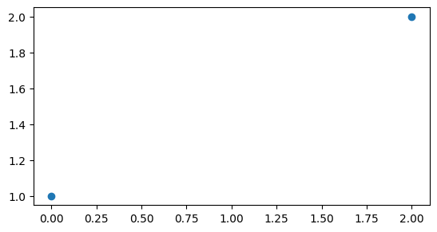

# Преобразования систем координат

Ответы на самые часто задаваемые вопросы про системы координат в ГИС https://gis-lab.info/qa/proj-sk-faq.html

Все основные системы координат есть в общем [реестре EPSG](https://epsg.io/)

Существует два основных типа систем координат, применяемых в ГИС и пространственном анализе: 1. географические - в этих системах координаты определяются широтой и долготой на сфере/эллипсоиде; 2. прямоугольные (иногда их как кальку с английского называют спроецированными) - в этих система координаты определяются в метрических единицах (метры, километры и т.д.) на плоскости.

Следует учитывать, что, если вы работаете с географическими системами координат, все измерения будут происходить в градусах и на сфере. Если вы хотите измерять расстояния и площади на плоскости, то нужно использовать прямоугольные системы координат.

Для работы с метровым расстоянием рекомендуется использовать зональную систему координат **UTM**. Кратко про эту систему координат можно почитать [здесь](https://ru.wikipedia.org/wiki/%D0%A3%D0%BD%D0%B8%D0%B2%D0%B5%D1%80%D1%81%D0%B0%D0%BB%D1%8C%D0%BD%D0%B0%D1%8F_%D0%BF%D0%BE%D0%BF%D0%B5%D1%80%D0%B5%D1%87%D0%BD%D0%B0%D1%8F_%D0%BF%D1%80%D0%BE%D0%B5%D0%BA%D1%86%D0%B8%D1%8F_%D0%9C%D0%B5%D1%80%D0%BA%D0%B0%D1%82%D0%BE%D1%80%D0%B0), а подробнее [здесь](https://www.gislounge.com/universal-transverse-mercator/).

Система координат **UTM (Universal Transverse Mercator )** представляет собой набор зональных систем координат. Фактически UTM представляет собой набор из 60 отдельных «поперечных проекций Меркатора», покрывающих 60 продольных зон шириной 6° каждая. Он охватывает широты от 80 ° южной широты до 84 ° северной широты (полюса покрыты отдельной системой «UPS»). Эта система координат аналогична системе координат Гаусса-Крюгера, возможно знакомой вам, если вы изучали геодезию. Главное отличие между ними в том, как рассчитываются номера зон.

Для работы с системами координат существует библиотека [pyproj](https://pypi.org/project/pyproj/) Фактически эта библиотека является питоновским интерфейсом для взаимодействия с программой PROJ, которая используется во всех современных ГИС.

``` python
# pip install pyproj
```

``` python
from pyproj import CRS
```

Систему координат можно задать несколькими способами: - просто по номеру из реестра, - по названию реестра и номеру системы координат в нем (единая строка), - по строке в формате proj4, - записав отдельно строками название реестра и номер системы координат в нем.

``` python
crs1 = CRS.from_epsg(4326)

crs2 = CRS.from_string('epsg:4326')

crs3 = CRS.from_proj4("+proj=latlon")

crs4 = CRS.from_user_input(('epsg', '4326'))
```

``` python
print(f'crs1: {crs1}\ncrs2: {crs2}\ncrs3: {crs3}\ncrs4: {crs4}')
```

```         
crs1: EPSG:4326
crs2: epsg:4326
crs3: +proj=latlon +type=crs
crs4: epsg:4326
```

## Перепроецирование объектов `shapely`

Для перепроецирования и пересчета координат из одной системы в другую для таких объектов следует использовать так называемые объекты-трансформеры из пакета `pyproj`, создаваемые функцией `Transformer.from_crs`. Эти объекты рассчитывают параметры перехода от одной системы координат к другой и хранят их в себе. Однако для создания трансформера нужно указать как исходную, так и целевую системы координат.

Перепроецируем одну из созданных нами ранее точек в систему координат **UTM**. Для этого нужно сначала рассчитать необходимый номер зоны и определить номер системы координат в реестре.

``` python
import math
```

``` python
def get_utm_zone(lon, lat):
    zone = int((lon + 180) / 6) + 1
    return f'EPSG:326{zone}' if lat >= 0 else f'EPSG:327{zone}'
```

``` python
get_utm_zone(lon=pin_itmo.y , lat=pin_itmo.x)
```

```         
'EPSG:326417968'
```

``` python
crs_itmo = CRS.from_epsg(32636)
```

Далее создадим объект трансформер.

``` python
from pyproj import Transformer
```

``` python
transformer = Transformer.from_crs(CRS.from_string("epsg:4326"), crs_itmo)

transformer
```

```         
<Conversion Transformer: pipeline>
Description: UTM zone 36N
Area of Use:
- name: Between 30°E and 36°E, northern hemisphere between equator and 84°N, onshore and offshore.
- bounds: (30.0, 0.0, 36.0, 84.0)
```

Рассчитаем новые координаты точки

``` python
coords_utm_itmo = transformer.transform(pin_itmo.x, pin_itmo.y )
print(f'coords_utm_itmo: {coords_utm_itmo}. Тип объекта: {type(coords_utm_itmo)}')
```

```         
coords_utm_itmo: (347235.4179799134, 6648363.905023121). Тип объекта: <class 'tuple'>
```

В результате мы получили кортеж с координатами нашей точки, из которого уже можно создать пространственный объект.

``` python
pin_itmo_utm = Point(coords_utm_itmo)

pin_itmo_utm.xy
```

```         
(array('d', [347235.4179799134]), array('d', [6648363.905023121]))
```

## Перепроецирование объектов `GeoDataFrame`

У объектов `GeoDataFrame` система координат является свойством самих объектов, как было уже показано выше.

``` python
guerry.crs
```

```         
<Projected CRS: EPSG:27572>
Name: NTF (Paris) / Lambert zone II
Axis Info [cartesian]:
- X[east]: Easting (metre)
- Y[north]: Northing (metre)
Area of Use:
- name: France mainland onshore between 50.5 grads and 53.5 grads North (45°27'N to 48°09'N). Also used over all onshore mainland France.
- bounds: (-4.87, 42.33, 8.23, 51.14)
Coordinate Operation:
- name: Lambert zone II
- method: Lambert Conic Conformal (1SP)
Datum: Nouvelle Triangulation Francaise (Paris)
- Ellipsoid: Clarke 1880 (IGN)
- Prime Meridian: Paris
```

Мы можем *назначить* новую систему координат, используя метод `.set_crs`. Если у объекта уже есть система координат, тогда нужно использовать параметр `allow_override=True`, который позволить принудительно назначить новую систему координат. Если эту опцию не использовать в нашем случае мы получим ошибку.

``` python
guerry.set_crs(4326)
```

```         
---------------------------------------------------------------------------

ValueError                                Traceback (most recent call last)

Cell In[70], line 1
----> 1 guerry.set_crs(4326)


File ~/.pyenv/versions/3.13.7/lib/python3.13/site-packages/geopandas/geodataframe.py:1741, in GeoDataFrame.set_crs(self, crs, epsg, inplace, allow_override)
   1739 else:
   1740     df = self
-> 1741 df.geometry = df.geometry.set_crs(
   1742     crs=crs, epsg=epsg, allow_override=allow_override, inplace=True
   1743 )
   1744 return df


File ~/.pyenv/versions/3.13.7/lib/python3.13/site-packages/geopandas/_compat.py:85, in requires_pyproj.<locals>.wrapper(*args, **kwargs)
     79 if not HAS_PYPROJ:
     80     raise ImportError(
     81         f"The 'pyproj' package is required for {func.__name__} to work. "
     82         "Install it and initialize the object with a CRS before using it."
     83         f"\nImporting pyproj resulted in: {pyproj_import_error}"
     84     )
---> 85 return func(*args, **kwargs)


File ~/.pyenv/versions/3.13.7/lib/python3.13/site-packages/geopandas/geoseries.py:1161, in GeoSeries.set_crs(self, crs, epsg, inplace, allow_override)
   1158     crs = CRS.from_epsg(epsg)
   1160 if not allow_override and self.crs is not None and not self.crs == crs:
-> 1161     raise ValueError(
   1162         "The GeoSeries already has a CRS which is not equal to the passed "
   1163         "CRS. Specify 'allow_override=True' to allow replacing the existing "
   1164         "CRS without doing any transformation. If you actually want to "
   1165         "transform the geometries, use 'GeoSeries.to_crs' instead."
   1166     )
   1167 if not inplace:
   1168     result = self.copy()


ValueError: The GeoSeries already has a CRS which is not equal to the passed CRS. Specify 'allow_override=True' to allow replacing the existing CRS without doing any transformation. If you actually want to transform the geometries, use 'GeoSeries.to_crs' instead.
```

``` python
guerry.set_crs(4326, allow_override=True)
```

::: {}
```{=html}
<style scoped>
    .dataframe tbody tr th:only-of-type {
        vertical-align: middle;
    }

    .dataframe tbody tr th {
        vertical-align: top;
    }

    .dataframe thead th {
        text-align: right;
    }
</style>
```

<table>
<thead>
<tr>
<th><p></p></th>
<th><p>dept</p></th>
<th><p>Region</p></th>
<th><p>Dprtmnt</p></th>
<th><p>Crm_prs</p></th>
<th><p>Crm_prp</p></th>
<th><p>Litercy</p></th>
<th><p>Donatns</p></th>
<th><p>Infants</p></th>
<th><p>Suicids</p></th>
<th><p>MainCty</p></th>
<th><p>...</p></th>
<th><p>Infntcd</p></th>
<th><p>Dntn_cl</p></th>
<th><p>Lottery</p></th>
<th><p>Desertn</p></th>
<th><p>Instrct</p></th>
<th><p>Prsttts</p></th>
<th><p>Distanc</p></th>
<th><p>Area</p></th>
<th><p>Pop1831</p></th>
<th><p>geometry</p></th>
</tr>
</thead>
<tbody>
<tr>
<td><p>0</p></td>
<td><p>1.0</p></td>
<td><p>S</p></td>
<td><p>Ain</p></td>
<td><p>28870.0</p></td>
<td><p>15890.0</p></td>
<td><p>37.0</p></td>
<td><p>5098.0</p></td>
<td><p>33120.0</p></td>
<td><p>35039.0</p></td>
<td><p>2.0</p></td>
<td><p>...</p></td>
<td><p>60.0</p></td>
<td><p>69.0</p></td>
<td><p>41.0</p></td>
<td><p>55.0</p></td>
<td><p>46.0</p></td>
<td><p>13.0</p></td>
<td><p>218.372</p></td>
<td><p>5762.0</p></td>
<td><p>346.03</p></td>
<td><p>POLYGON ((801150 2092615, 800669 2093190, 8006...</p></td>
</tr>
<tr>
<td><p>1</p></td>
<td><p>2.0</p></td>
<td><p>S</p></td>
<td><p>Aisne</p></td>
<td><p>26226.0</p></td>
<td><p>5521.0</p></td>
<td><p>51.0</p></td>
<td><p>8901.0</p></td>
<td><p>14572.0</p></td>
<td><p>12831.0</p></td>
<td><p>2.0</p></td>
<td><p>...</p></td>
<td><p>82.0</p></td>
<td><p>36.0</p></td>
<td><p>38.0</p></td>
<td><p>82.0</p></td>
<td><p>24.0</p></td>
<td><p>327.0</p></td>
<td><p>65.945</p></td>
<td><p>7369.0</p></td>
<td><p>513.00</p></td>
<td><p>POLYGON ((729326 2521619, 729320 2521230, 7292...</p></td>
</tr>
<tr>
<td><p>2</p></td>
<td><p>3.0</p></td>
<td><p>S</p></td>
<td><p>Allier</p></td>
<td><p>26747.0</p></td>
<td><p>7925.0</p></td>
<td><p>13.0</p></td>
<td><p>10973.0</p></td>
<td><p>17044.0</p></td>
<td><p>114121.0</p></td>
<td><p>2.0</p></td>
<td><p>...</p></td>
<td><p>42.0</p></td>
<td><p>76.0</p></td>
<td><p>66.0</p></td>
<td><p>16.0</p></td>
<td><p>85.0</p></td>
<td><p>34.0</p></td>
<td><p>161.927</p></td>
<td><p>7340.0</p></td>
<td><p>298.26</p></td>
<td><p>POLYGON ((710830 2137350, 711746 2136617, 7124...</p></td>
</tr>
<tr>
<td><p>3</p></td>
<td><p>4.0</p></td>
<td><p>S</p></td>
<td><p>Basses-Alpes</p></td>
<td><p>12935.0</p></td>
<td><p>7289.0</p></td>
<td><p>46.0</p></td>
<td><p>2733.0</p></td>
<td><p>23018.0</p></td>
<td><p>14238.0</p></td>
<td><p>1.0</p></td>
<td><p>...</p></td>
<td><p>12.0</p></td>
<td><p>37.0</p></td>
<td><p>80.0</p></td>
<td><p>32.0</p></td>
<td><p>29.0</p></td>
<td><p>2.0</p></td>
<td><p>351.399</p></td>
<td><p>6925.0</p></td>
<td><p>155.90</p></td>
<td><p>POLYGON ((882701 1920024, 882408 1920733, 8817...</p></td>
</tr>
<tr>
<td><p>4</p></td>
<td><p>5.0</p></td>
<td><p>S</p></td>
<td><p>Hautes-Alpes</p></td>
<td><p>17488.0</p></td>
<td><p>8174.0</p></td>
<td><p>69.0</p></td>
<td><p>6962.0</p></td>
<td><p>23076.0</p></td>
<td><p>16171.0</p></td>
<td><p>1.0</p></td>
<td><p>...</p></td>
<td><p>23.0</p></td>
<td><p>64.0</p></td>
<td><p>79.0</p></td>
<td><p>35.0</p></td>
<td><p>7.0</p></td>
<td><p>1.0</p></td>
<td><p>320.280</p></td>
<td><p>5549.0</p></td>
<td><p>129.10</p></td>
<td><p>POLYGON ((886504 1922890, 885733 1922978, 8854...</p></td>
</tr>
<tr>
<td><p>5</p></td>
<td><p>7.0</p></td>
<td><p>S</p></td>
<td><p>Ardeche</p></td>
<td><p>9474.0</p></td>
<td><p>10263.0</p></td>
<td><p>27.0</p></td>
<td><p>3188.0</p></td>
<td><p>42117.0</p></td>
<td><p>52547.0</p></td>
<td><p>1.0</p></td>
<td><p>...</p></td>
<td><p>47.0</p></td>
<td><p>67.0</p></td>
<td><p>70.0</p></td>
<td><p>19.0</p></td>
<td><p>62.0</p></td>
<td><p>1.0</p></td>
<td><p>279.413</p></td>
<td><p>5529.0</p></td>
<td><p>340.73</p></td>
<td><p>POLYGON ((747008 1925789, 746630 1925762, 7457...</p></td>
</tr>
<tr>
<td><p>6</p></td>
<td><p>8.0</p></td>
<td><p>S</p></td>
<td><p>Ardennes</p></td>
<td><p>35203.0</p></td>
<td><p>8847.0</p></td>
<td><p>67.0</p></td>
<td><p>6400.0</p></td>
<td><p>16106.0</p></td>
<td><p>26198.0</p></td>
<td><p>2.0</p></td>
<td><p>...</p></td>
<td><p>85.0</p></td>
<td><p>49.0</p></td>
<td><p>31.0</p></td>
<td><p>62.0</p></td>
<td><p>9.0</p></td>
<td><p>83.0</p></td>
<td><p>105.694</p></td>
<td><p>5229.0</p></td>
<td><p>289.62</p></td>
<td><p>POLYGON ((818893 2514767, 818614 2514515, 8179...</p></td>
</tr>
<tr>
<td><p>7</p></td>
<td><p>9.0</p></td>
<td><p>S</p></td>
<td><p>Ariege</p></td>
<td><p>6173.0</p></td>
<td><p>9597.0</p></td>
<td><p>18.0</p></td>
<td><p>3542.0</p></td>
<td><p>22916.0</p></td>
<td><p>123625.0</p></td>
<td><p>1.0</p></td>
<td><p>...</p></td>
<td><p>28.0</p></td>
<td><p>63.0</p></td>
<td><p>75.0</p></td>
<td><p>22.0</p></td>
<td><p>77.0</p></td>
<td><p>3.0</p></td>
<td><p>385.313</p></td>
<td><p>4890.0</p></td>
<td><p>253.12</p></td>
<td><p>POLYGON ((509103 1747787, 508820 1747513, 5081...</p></td>
</tr>
<tr>
<td><p>8</p></td>
<td><p>10.0</p></td>
<td><p>S</p></td>
<td><p>Aube</p></td>
<td><p>19602.0</p></td>
<td><p>4086.0</p></td>
<td><p>59.0</p></td>
<td><p>3608.0</p></td>
<td><p>18642.0</p></td>
<td><p>10989.0</p></td>
<td><p>2.0</p></td>
<td><p>...</p></td>
<td><p>54.0</p></td>
<td><p>9.0</p></td>
<td><p>28.0</p></td>
<td><p>86.0</p></td>
<td><p>15.0</p></td>
<td><p>207.0</p></td>
<td><p>83.244</p></td>
<td><p>6004.0</p></td>
<td><p>246.36</p></td>
<td><p>POLYGON ((775400 2345600, 775068 2345397, 7735...</p></td>
</tr>
<tr>
<td><p>9</p></td>
<td><p>11.0</p></td>
<td><p>S</p></td>
<td><p>Aude</p></td>
<td><p>15647.0</p></td>
<td><p>10431.0</p></td>
<td><p>34.0</p></td>
<td><p>2582.0</p></td>
<td><p>20225.0</p></td>
<td><p>66498.0</p></td>
<td><p>2.0</p></td>
<td><p>...</p></td>
<td><p>35.0</p></td>
<td><p>27.0</p></td>
<td><p>50.0</p></td>
<td><p>63.0</p></td>
<td><p>48.0</p></td>
<td><p>1.0</p></td>
<td><p>370.949</p></td>
<td><p>6139.0</p></td>
<td><p>270.13</p></td>
<td><p>POLYGON ((626230 1810121, 626269 1810496, 6274...</p></td>
</tr>
<tr>
<td><p>10</p></td>
<td><p>12.0</p></td>
<td><p>S</p></td>
<td><p>Aveyron</p></td>
<td><p>8236.0</p></td>
<td><p>6731.0</p></td>
<td><p>31.0</p></td>
<td><p>3211.0</p></td>
<td><p>21981.0</p></td>
<td><p>116671.0</p></td>
<td><p>2.0</p></td>
<td><p>...</p></td>
<td><p>5.0</p></td>
<td><p>23.0</p></td>
<td><p>81.0</p></td>
<td><p>10.0</p></td>
<td><p>44.0</p></td>
<td><p>4.0</p></td>
<td><p>296.089</p></td>
<td><p>8735.0</p></td>
<td><p>359.06</p></td>
<td><p>POLYGON ((642972 1978185, 643791 1976549, 6444...</p></td>
</tr>
<tr>
<td><p>11</p></td>
<td><p>13.0</p></td>
<td><p>S</p></td>
<td><p>Bouches-du-Rhone</p></td>
<td><p>13409.0</p></td>
<td><p>5291.0</p></td>
<td><p>38.0</p></td>
<td><p>2314.0</p></td>
<td><p>9325.0</p></td>
<td><p>8107.0</p></td>
<td><p>3.0</p></td>
<td><p>...</p></td>
<td><p>74.0</p></td>
<td><p>55.0</p></td>
<td><p>3.0</p></td>
<td><p>23.0</p></td>
<td><p>43.0</p></td>
<td><p>25.0</p></td>
<td><p>362.568</p></td>
<td><p>5087.0</p></td>
<td><p>359.47</p></td>
<td><p>POLYGON ((824692 1865875, 825615 1865409, 8259...</p></td>
</tr>
<tr>
<td><p>12</p></td>
<td><p>14.0</p></td>
<td><p>S</p></td>
<td><p>Calvados</p></td>
<td><p>17577.0</p></td>
<td><p>4500.0</p></td>
<td><p>52.0</p></td>
<td><p>27830.0</p></td>
<td><p>8983.0</p></td>
<td><p>31807.0</p></td>
<td><p>2.0</p></td>
<td><p>...</p></td>
<td><p>56.0</p></td>
<td><p>11.0</p></td>
<td><p>13.0</p></td>
<td><p>12.0</p></td>
<td><p>22.0</p></td>
<td><p>194.0</p></td>
<td><p>117.487</p></td>
<td><p>5548.0</p></td>
<td><p>494.70</p></td>
<td><p>POLYGON ((345476 2429914, 345299 2430235, 3436...</p></td>
</tr>
<tr>
<td><p>13</p></td>
<td><p>15.0</p></td>
<td><p>S</p></td>
<td><p>Cantal</p></td>
<td><p>18070.0</p></td>
<td><p>11645.0</p></td>
<td><p>31.0</p></td>
<td><p>4093.0</p></td>
<td><p>15335.0</p></td>
<td><p>87338.0</p></td>
<td><p>2.0</p></td>
<td><p>...</p></td>
<td><p>83.0</p></td>
<td><p>66.0</p></td>
<td><p>82.0</p></td>
<td><p>1.0</p></td>
<td><p>51.0</p></td>
<td><p>20.0</p></td>
<td><p>245.849</p></td>
<td><p>5726.0</p></td>
<td><p>258.59</p></td>
<td><p>POLYGON ((591653 2017934, 591727 2018244, 5918...</p></td>
</tr>
<tr>
<td><p>14</p></td>
<td><p>16.0</p></td>
<td><p>S</p></td>
<td><p>Charente</p></td>
<td><p>24964.0</p></td>
<td><p>13018.0</p></td>
<td><p>36.0</p></td>
<td><p>13602.0</p></td>
<td><p>19454.0</p></td>
<td><p>25720.0</p></td>
<td><p>2.0</p></td>
<td><p>...</p></td>
<td><p>7.0</p></td>
<td><p>81.0</p></td>
<td><p>60.0</p></td>
<td><p>61.0</p></td>
<td><p>47.0</p></td>
<td><p>8.0</p></td>
<td><p>224.339</p></td>
<td><p>5956.0</p></td>
<td><p>362.53</p></td>
<td><p>POLYGON ((456425 2120055, 456229 2120382, 4559...</p></td>
</tr>
<tr>
<td><p>15</p></td>
<td><p>17.0</p></td>
<td><p>S</p></td>
<td><p>Charente-Inferieure</p></td>
<td><p>18712.0</p></td>
<td><p>5357.0</p></td>
<td><p>39.0</p></td>
<td><p>13254.0</p></td>
<td><p>23999.0</p></td>
<td><p>16798.0</p></td>
<td><p>2.0</p></td>
<td><p>...</p></td>
<td><p>38.0</p></td>
<td><p>72.0</p></td>
<td><p>35.0</p></td>
<td><p>74.0</p></td>
<td><p>42.0</p></td>
<td><p>27.0</p></td>
<td><p>238.538</p></td>
<td><p>6864.0</p></td>
<td><p>445.25</p></td>
<td><p>MULTIPOLYGON (((328075 2118055, 327916 2118168...</p></td>
</tr>
<tr>
<td><p>16</p></td>
<td><p>18.0</p></td>
<td><p>S</p></td>
<td><p>Cher</p></td>
<td><p>21934.0</p></td>
<td><p>10503.0</p></td>
<td><p>13.0</p></td>
<td><p>9561.0</p></td>
<td><p>23574.0</p></td>
<td><p>19497.0</p></td>
<td><p>2.0</p></td>
<td><p>...</p></td>
<td><p>11.0</p></td>
<td><p>86.0</p></td>
<td><p>44.0</p></td>
<td><p>51.0</p></td>
<td><p>83.0</p></td>
<td><p>26.0</p></td>
<td><p>116.257</p></td>
<td><p>7235.0</p></td>
<td><p>256.06</p></td>
<td><p>POLYGON ((572720 2252955, 574278 2251834, 5753...</p></td>
</tr>
<tr>
<td><p>17</p></td>
<td><p>19.0</p></td>
<td><p>S</p></td>
<td><p>Correze</p></td>
<td><p>15262.0</p></td>
<td><p>12949.0</p></td>
<td><p>12.0</p></td>
<td><p>14993.0</p></td>
<td><p>19330.0</p></td>
<td><p>47480.0</p></td>
<td><p>2.0</p></td>
<td><p>...</p></td>
<td><p>16.0</p></td>
<td><p>82.0</p></td>
<td><p>84.0</p></td>
<td><p>2.0</p></td>
<td><p>86.0</p></td>
<td><p>3.0</p></td>
<td><p>227.899</p></td>
<td><p>5857.0</p></td>
<td><p>294.83</p></td>
<td><p>POLYGON ((608225 2042680, 608101 2042880, 6079...</p></td>
</tr>
<tr>
<td><p>18</p></td>
<td><p>21.0</p></td>
<td><p>S</p></td>
<td><p>Cote-dOr</p></td>
<td><p>32256.0</p></td>
<td><p>9159.0</p></td>
<td><p>60.0</p></td>
<td><p>2540.0</p></td>
<td><p>15599.0</p></td>
<td><p>16128.0</p></td>
<td><p>2.0</p></td>
<td><p>...</p></td>
<td><p>27.0</p></td>
<td><p>18.0</p></td>
<td><p>33.0</p></td>
<td><p>78.0</p></td>
<td><p>13.0</p></td>
<td><p>206.0</p></td>
<td><p>136.109</p></td>
<td><p>8763.0</p></td>
<td><p>375.88</p></td>
<td><p>MULTIPOLYGON (((738935 2236890, 738359 2237343...</p></td>
</tr>
<tr>
<td><p>19</p></td>
<td><p>22.0</p></td>
<td><p>S</p></td>
<td><p>Cotes-du-Nord</p></td>
<td><p>28607.0</p></td>
<td><p>7050.0</p></td>
<td><p>16.0</p></td>
<td><p>10387.0</p></td>
<td><p>36098.0</p></td>
<td><p>75056.0</p></td>
<td><p>2.0</p></td>
<td><p>...</p></td>
<td><p>69.0</p></td>
<td><p>15.0</p></td>
<td><p>72.0</p></td>
<td><p>47.0</p></td>
<td><p>80.0</p></td>
<td><p>16.0</p></td>
<td><p>225.161</p></td>
<td><p>6878.0</p></td>
<td><p>598.87</p></td>
<td><p>MULTIPOLYGON (((208165 2439753, 208131 2439949...</p></td>
</tr>
<tr>
<td><p>20</p></td>
<td><p>23.0</p></td>
<td><p>S</p></td>
<td><p>Creuse</p></td>
<td><p>37014.0</p></td>
<td><p>20235.0</p></td>
<td><p>23.0</p></td>
<td><p>10997.0</p></td>
<td><p>14363.0</p></td>
<td><p>77823.0</p></td>
<td><p>1.0</p></td>
<td><p>...</p></td>
<td><p>24.0</p></td>
<td><p>75.0</p></td>
<td><p>85.0</p></td>
<td><p>4.0</p></td>
<td><p>71.0</p></td>
<td><p>12.0</p></td>
<td><p>180.846</p></td>
<td><p>5565.0</p></td>
<td><p>265.38</p></td>
<td><p>POLYGON ((540175 2111095, 538135 2111105, 5380...</p></td>
</tr>
<tr>
<td><p>21</p></td>
<td><p>24.0</p></td>
<td><p>S</p></td>
<td><p>Dordogne</p></td>
<td><p>21585.0</p></td>
<td><p>10237.0</p></td>
<td><p>18.0</p></td>
<td><p>4687.0</p></td>
<td><p>21375.0</p></td>
<td><p>36024.0</p></td>
<td><p>2.0</p></td>
<td><p>...</p></td>
<td><p>18.0</p></td>
<td><p>79.0</p></td>
<td><p>77.0</p></td>
<td><p>44.0</p></td>
<td><p>78.0</p></td>
<td><p>3.0</p></td>
<td><p>253.776</p></td>
<td><p>9060.0</p></td>
<td><p>482.75</p></td>
<td><p>POLYGON ((527718 1988833, 528808 1988071, 5291...</p></td>
</tr>
<tr>
<td><p>22</p></td>
<td><p>25.0</p></td>
<td><p>S</p></td>
<td><p>Doubs</p></td>
<td><p>11560.0</p></td>
<td><p>5914.0</p></td>
<td><p>73.0</p></td>
<td><p>3436.0</p></td>
<td><p>12512.0</p></td>
<td><p>40690.0</p></td>
<td><p>2.0</p></td>
<td><p>...</p></td>
<td><p>25.0</p></td>
<td><p>6.0</p></td>
<td><p>18.0</p></td>
<td><p>73.0</p></td>
<td><p>2.0</p></td>
<td><p>65.0</p></td>
<td><p>202.065</p></td>
<td><p>5234.0</p></td>
<td><p>265.54</p></td>
<td><p>POLYGON ((886630 2188665, 886948 2188898, 8879...</p></td>
</tr>
<tr>
<td><p>23</p></td>
<td><p>26.0</p></td>
<td><p>S</p></td>
<td><p>Drome</p></td>
<td><p>13396.0</p></td>
<td><p>7759.0</p></td>
<td><p>42.0</p></td>
<td><p>2829.0</p></td>
<td><p>16348.0</p></td>
<td><p>23816.0</p></td>
<td><p>2.0</p></td>
<td><p>...</p></td>
<td><p>13.0</p></td>
<td><p>62.0</p></td>
<td><p>54.0</p></td>
<td><p>46.0</p></td>
<td><p>38.0</p></td>
<td><p>8.0</p></td>
<td><p>295.543</p></td>
<td><p>6530.0</p></td>
<td><p>299.56</p></td>
<td><p>POLYGON ((830803 2010472, 831288 2010361, 8315...</p></td>
</tr>
<tr>
<td><p>24</p></td>
<td><p>27.0</p></td>
<td><p>S</p></td>
<td><p>Eure</p></td>
<td><p>14795.0</p></td>
<td><p>4774.0</p></td>
<td><p>51.0</p></td>
<td><p>11712.0</p></td>
<td><p>16039.0</p></td>
<td><p>13493.0</p></td>
<td><p>2.0</p></td>
<td><p>...</p></td>
<td><p>45.0</p></td>
<td><p>45.0</p></td>
<td><p>47.0</p></td>
<td><p>27.0</p></td>
<td><p>23.0</p></td>
<td><p>179.0</p></td>
<td><p>61.863</p></td>
<td><p>6040.0</p></td>
<td><p>424.25</p></td>
<td><p>POLYGON ((515046 2482676, 515755 2483384, 5160...</p></td>
</tr>
<tr>
<td><p>25</p></td>
<td><p>28.0</p></td>
<td><p>S</p></td>
<td><p>Eure-et-Loir</p></td>
<td><p>21368.0</p></td>
<td><p>4016.0</p></td>
<td><p>54.0</p></td>
<td><p>4553.0</p></td>
<td><p>14475.0</p></td>
<td><p>15015.0</p></td>
<td><p>2.0</p></td>
<td><p>...</p></td>
<td><p>62.0</p></td>
<td><p>14.0</p></td>
<td><p>48.0</p></td>
<td><p>72.0</p></td>
<td><p>18.0</p></td>
<td><p>180.0</p></td>
<td><p>54.558</p></td>
<td><p>5880.0</p></td>
<td><p>278.82</p></td>
<td><p>POLYGON ((562860 2342515, 562499 2342577, 5602...</p></td>
</tr>
<tr>
<td><p>26</p></td>
<td><p>29.0</p></td>
<td><p>S</p></td>
<td><p>Finistere</p></td>
<td><p>29872.0</p></td>
<td><p>6842.0</p></td>
<td><p>15.0</p></td>
<td><p>23945.0</p></td>
<td><p>28392.0</p></td>
<td><p>25143.0</p></td>
<td><p>2.0</p></td>
<td><p>...</p></td>
<td><p>78.0</p></td>
<td><p>25.0</p></td>
<td><p>36.0</p></td>
<td><p>77.0</p></td>
<td><p>81.0</p></td>
<td><p>42.0</p></td>
<td><p>276.210</p></td>
<td><p>6733.0</p></td>
<td><p>524.40</p></td>
<td><p>MULTIPOLYGON (((134794 2434061, 134532 2434541...</p></td>
</tr>
<tr>
<td><p>27</p></td>
<td><p>30.0</p></td>
<td><p>S</p></td>
<td><p>Gard</p></td>
<td><p>13115.0</p></td>
<td><p>7990.0</p></td>
<td><p>40.0</p></td>
<td><p>3048.0</p></td>
<td><p>28726.0</p></td>
<td><p>18292.0</p></td>
<td><p>2.0</p></td>
<td><p>...</p></td>
<td><p>39.0</p></td>
<td><p>59.0</p></td>
<td><p>20.0</p></td>
<td><p>40.0</p></td>
<td><p>40.0</p></td>
<td><p>5.0</p></td>
<td><p>323.004</p></td>
<td><p>5853.0</p></td>
<td><p>357.38</p></td>
<td><p>POLYGON ((719592 1880745, 719924 1881419, 7194...</p></td>
</tr>
<tr>
<td><p>28</p></td>
<td><p>31.0</p></td>
<td><p>S</p></td>
<td><p>Haute-Garonne</p></td>
<td><p>18642.0</p></td>
<td><p>7204.0</p></td>
<td><p>31.0</p></td>
<td><p>2286.0</p></td>
<td><p>15378.0</p></td>
<td><p>56140.0</p></td>
<td><p>3.0</p></td>
<td><p>...</p></td>
<td><p>59.0</p></td>
<td><p>13.0</p></td>
<td><p>25.0</p></td>
<td><p>15.0</p></td>
<td><p>33.0</p></td>
<td><p>8.0</p></td>
<td><p>361.668</p></td>
<td><p>6257.0</p></td>
<td><p>427.86</p></td>
<td><p>POLYGON ((491745 1820323, 491926 1820668, 4914...</p></td>
</tr>
<tr>
<td><p>29</p></td>
<td><p>32.0</p></td>
<td><p>S</p></td>
<td><p>Gers</p></td>
<td><p>18642.0</p></td>
<td><p>10486.0</p></td>
<td><p>38.0</p></td>
<td><p>2848.0</p></td>
<td><p>15250.0</p></td>
<td><p>61510.0</p></td>
<td><p>2.0</p></td>
<td><p>...</p></td>
<td><p>13.0</p></td>
<td><p>32.0</p></td>
<td><p>74.0</p></td>
<td><p>30.0</p></td>
<td><p>44.0</p></td>
<td><p>1.0</p></td>
<td><p>343.569</p></td>
<td><p>6309.0</p></td>
<td><p>312.16</p></td>
<td><p>POLYGON ((447673 1816738, 447362 1816893, 4463...</p></td>
</tr>
<tr>
<td><p>30</p></td>
<td><p>33.0</p></td>
<td><p>S</p></td>
<td><p>Gironde</p></td>
<td><p>24096.0</p></td>
<td><p>7423.0</p></td>
<td><p>40.0</p></td>
<td><p>5076.0</p></td>
<td><p>10676.0</p></td>
<td><p>19220.0</p></td>
<td><p>3.0</p></td>
<td><p>...</p></td>
<td><p>80.0</p></td>
<td><p>48.0</p></td>
<td><p>4.0</p></td>
<td><p>13.0</p></td>
<td><p>41.0</p></td>
<td><p>39.0</p></td>
<td><p>291.624</p></td>
<td><p>10000.0</p></td>
<td><p>554.23</p></td>
<td><p>MULTIPOLYGON (((332874 1966651, 332777 1966980...</p></td>
</tr>
<tr>
<td><p>31</p></td>
<td><p>34.0</p></td>
<td><p>S</p></td>
<td><p>Herault</p></td>
<td><p>12814.0</p></td>
<td><p>10954.0</p></td>
<td><p>45.0</p></td>
<td><p>1680.0</p></td>
<td><p>21346.0</p></td>
<td><p>30869.0</p></td>
<td><p>2.0</p></td>
<td><p>...</p></td>
<td><p>51.0</p></td>
<td><p>28.0</p></td>
<td><p>19.0</p></td>
<td><p>43.0</p></td>
<td><p>32.0</p></td>
<td><p>9.0</p></td>
<td><p>344.030</p></td>
<td><p>6101.0</p></td>
<td><p>346.30</p></td>
<td><p>POLYGON ((739523 1864067, 740853 1864454, 7414...</p></td>
</tr>
<tr>
<td><p>32</p></td>
<td><p>35.0</p></td>
<td><p>S</p></td>
<td><p>Ille-et-Vilaine</p></td>
<td><p>22138.0</p></td>
<td><p>6524.0</p></td>
<td><p>25.0</p></td>
<td><p>7686.0</p></td>
<td><p>40736.0</p></td>
<td><p>45180.0</p></td>
<td><p>2.0</p></td>
<td><p>...</p></td>
<td><p>31.0</p></td>
<td><p>22.0</p></td>
<td><p>37.0</p></td>
<td><p>50.0</p></td>
<td><p>66.0</p></td>
<td><p>77.0</p></td>
<td><p>179.379</p></td>
<td><p>6775.0</p></td>
<td><p>547.05</p></td>
<td><p>MULTIPOLYGON (((271910 2322460, 272047 2322795...</p></td>
</tr>
<tr>
<td><p>33</p></td>
<td><p>36.0</p></td>
<td><p>S</p></td>
<td><p>Indre</p></td>
<td><p>32404.0</p></td>
<td><p>7624.0</p></td>
<td><p>17.0</p></td>
<td><p>11315.0</p></td>
<td><p>20046.0</p></td>
<td><p>25014.0</p></td>
<td><p>2.0</p></td>
<td><p>...</p></td>
<td><p>19.0</p></td>
<td><p>83.0</p></td>
<td><p>69.0</p></td>
<td><p>29.0</p></td>
<td><p>79.0</p></td>
<td><p>14.0</p></td>
<td><p>139.587</p></td>
<td><p>6791.0</p></td>
<td><p>245.29</p></td>
<td><p>POLYGON ((573430 2159520, 573109 2159583, 5726...</p></td>
</tr>
<tr>
<td><p>34</p></td>
<td><p>37.0</p></td>
<td><p>S</p></td>
<td><p>Indre-et-Loire</p></td>
<td><p>19131.0</p></td>
<td><p>6909.0</p></td>
<td><p>27.0</p></td>
<td><p>7254.0</p></td>
<td><p>16601.0</p></td>
<td><p>15272.0</p></td>
<td><p>2.0</p></td>
<td><p>...</p></td>
<td><p>3.0</p></td>
<td><p>41.0</p></td>
<td><p>15.0</p></td>
<td><p>49.0</p></td>
<td><p>63.0</p></td>
<td><p>59.0</p></td>
<td><p>126.468</p></td>
<td><p>6127.0</p></td>
<td><p>297.02</p></td>
<td><p>POLYGON ((505590 2270755, 507478 2268385, 5076...</p></td>
</tr>
<tr>
<td><p>35</p></td>
<td><p>38.0</p></td>
<td><p>S</p></td>
<td><p>Isere</p></td>
<td><p>18785.0</p></td>
<td><p>8326.0</p></td>
<td><p>29.0</p></td>
<td><p>4077.0</p></td>
<td><p>12236.0</p></td>
<td><p>36275.0</p></td>
<td><p>2.0</p></td>
<td><p>...</p></td>
<td><p>27.0</p></td>
<td><p>73.0</p></td>
<td><p>23.0</p></td>
<td><p>26.0</p></td>
<td><p>57.0</p></td>
<td><p>12.0</p></td>
<td><p>268.661</p></td>
<td><p>7431.0</p></td>
<td><p>550.26</p></td>
<td><p>POLYGON ((839825 2094355, 840895 2093318, 8411...</p></td>
</tr>
<tr>
<td><p>36</p></td>
<td><p>39.0</p></td>
<td><p>S</p></td>
<td><p>Jura</p></td>
<td><p>26221.0</p></td>
<td><p>8059.0</p></td>
<td><p>73.0</p></td>
<td><p>3012.0</p></td>
<td><p>20384.0</p></td>
<td><p>34476.0</p></td>
<td><p>2.0</p></td>
<td><p>...</p></td>
<td><p>66.0</p></td>
<td><p>43.0</p></td>
<td><p>39.0</p></td>
<td><p>71.0</p></td>
<td><p>3.0</p></td>
<td><p>32.0</p></td>
<td><p>197.155</p></td>
<td><p>4999.0</p></td>
<td><p>312.50</p></td>
<td><p>MULTIPOLYGON (((836965 2209730, 836855 2209785...</p></td>
</tr>
<tr>
<td><p>37</p></td>
<td><p>40.0</p></td>
<td><p>S</p></td>
<td><p>Landes</p></td>
<td><p>17687.0</p></td>
<td><p>6170.0</p></td>
<td><p>28.0</p></td>
<td><p>12059.0</p></td>
<td><p>15302.0</p></td>
<td><p>35375.0</p></td>
<td><p>1.0</p></td>
<td><p>...</p></td>
<td><p>43.0</p></td>
<td><p>56.0</p></td>
<td><p>73.0</p></td>
<td><p>28.0</p></td>
<td><p>58.0</p></td>
<td><p>3.0</p></td>
<td><p>344.676</p></td>
<td><p>9243.0</p></td>
<td><p>281.50</p></td>
<td><p>POLYGON ((311864 1932711, 314132 1946872, 3141...</p></td>
</tr>
<tr>
<td><p>38</p></td>
<td><p>41.0</p></td>
<td><p>S</p></td>
<td><p>Loir-et-Cher</p></td>
<td><p>21292.0</p></td>
<td><p>6017.0</p></td>
<td><p>27.0</p></td>
<td><p>5626.0</p></td>
<td><p>13364.0</p></td>
<td><p>14417.0</p></td>
<td><p>2.0</p></td>
<td><p>...</p></td>
<td><p>37.0</p></td>
<td><p>70.0</p></td>
<td><p>46.0</p></td>
<td><p>54.0</p></td>
<td><p>61.0</p></td>
<td><p>54.0</p></td>
<td><p>90.735</p></td>
<td><p>6343.0</p></td>
<td><p>235.75</p></td>
<td><p>POLYGON ((519655 2330465, 520005 2329830, 5225...</p></td>
</tr>
<tr>
<td><p>39</p></td>
<td><p>42.0</p></td>
<td><p>S</p></td>
<td><p>Loire</p></td>
<td><p>27491.0</p></td>
<td><p>12665.0</p></td>
<td><p>29.0</p></td>
<td><p>3446.0</p></td>
<td><p>29605.0</p></td>
<td><p>71364.0</p></td>
<td><p>2.0</p></td>
<td><p>...</p></td>
<td><p>77.0</p></td>
<td><p>34.0</p></td>
<td><p>42.0</p></td>
<td><p>6.0</p></td>
<td><p>56.0</p></td>
<td><p>14.0</p></td>
<td><p>215.598</p></td>
<td><p>4781.0</p></td>
<td><p>391.22</p></td>
<td><p>POLYGON ((732285 2132610, 732782 2133196, 7330...</p></td>
</tr>
<tr>
<td><p>40</p></td>
<td><p>43.0</p></td>
<td><p>S</p></td>
<td><p>Haute-Loire</p></td>
<td><p>16170.0</p></td>
<td><p>18043.0</p></td>
<td><p>21.0</p></td>
<td><p>2746.0</p></td>
<td><p>31017.0</p></td>
<td><p>163241.0</p></td>
<td><p>2.0</p></td>
<td><p>...</p></td>
<td><p>17.0</p></td>
<td><p>65.0</p></td>
<td><p>62.0</p></td>
<td><p>3.0</p></td>
<td><p>72.0</p></td>
<td><p>10.0</p></td>
<td><p>248.877</p></td>
<td><p>4977.0</p></td>
<td><p>292.08</p></td>
<td><p>POLYGON ((742975 2044820, 744433 2045165, 7460...</p></td>
</tr>
<tr>
<td><p>41</p></td>
<td><p>44.0</p></td>
<td><p>S</p></td>
<td><p>Loire-Inferieure</p></td>
<td><p>19314.0</p></td>
<td><p>9392.0</p></td>
<td><p>24.0</p></td>
<td><p>8310.0</p></td>
<td><p>14097.0</p></td>
<td><p>27289.0</p></td>
<td><p>3.0</p></td>
<td><p>...</p></td>
<td><p>52.0</p></td>
<td><p>29.0</p></td>
<td><p>12.0</p></td>
<td><p>45.0</p></td>
<td><p>67.0</p></td>
<td><p>63.0</p></td>
<td><p>199.167</p></td>
<td><p>6815.0</p></td>
<td><p>470.09</p></td>
<td><p>POLYGON ((268705 2263645, 268976 2263891, 2710...</p></td>
</tr>
<tr>
<td><p>42</p></td>
<td><p>45.0</p></td>
<td><p>S</p></td>
<td><p>Loiret</p></td>
<td><p>17722.0</p></td>
<td><p>5042.0</p></td>
<td><p>42.0</p></td>
<td><p>4753.0</p></td>
<td><p>9986.0</p></td>
<td><p>11813.0</p></td>
<td><p>2.0</p></td>
<td><p>...</p></td>
<td><p>22.0</p></td>
<td><p>16.0</p></td>
<td><p>17.0</p></td>
<td><p>60.0</p></td>
<td><p>37.0</p></td>
<td><p>256.0</p></td>
<td><p>61.106</p></td>
<td><p>6775.0</p></td>
<td><p>305.28</p></td>
<td><p>POLYGON ((557890 2341355, 558382 2341921, 5598...</p></td>
</tr>
<tr>
<td><p>43</p></td>
<td><p>46.0</p></td>
<td><p>S</p></td>
<td><p>Lot</p></td>
<td><p>5883.0</p></td>
<td><p>9049.0</p></td>
<td><p>24.0</p></td>
<td><p>5194.0</p></td>
<td><p>20383.0</p></td>
<td><p>48783.0</p></td>
<td><p>2.0</p></td>
<td><p>...</p></td>
<td><p>15.0</p></td>
<td><p>68.0</p></td>
<td><p>78.0</p></td>
<td><p>24.0</p></td>
<td><p>68.0</p></td>
<td><p>1.0</p></td>
<td><p>275.725</p></td>
<td><p>5217.0</p></td>
<td><p>283.83</p></td>
<td><p>POLYGON ((503966 1958060, 505528 1959658, 5058...</p></td>
</tr>
<tr>
<td><p>44</p></td>
<td><p>47.0</p></td>
<td><p>S</p></td>
<td><p>Lot-et-Garonne</p></td>
<td><p>22969.0</p></td>
<td><p>8943.0</p></td>
<td><p>31.0</p></td>
<td><p>4432.0</p></td>
<td><p>17681.0</p></td>
<td><p>38501.0</p></td>
<td><p>2.0</p></td>
<td><p>...</p></td>
<td><p>32.0</p></td>
<td><p>46.0</p></td>
<td><p>52.0</p></td>
<td><p>34.0</p></td>
<td><p>50.0</p></td>
<td><p>5.0</p></td>
<td><p>302.345</p></td>
<td><p>5361.0</p></td>
<td><p>346.89</p></td>
<td><p>POLYGON ((413714 1942691, 413362 1942587, 4128...</p></td>
</tr>
<tr>
<td><p>45</p></td>
<td><p>48.0</p></td>
<td><p>S</p></td>
<td><p>Lozere</p></td>
<td><p>7710.0</p></td>
<td><p>5990.0</p></td>
<td><p>27.0</p></td>
<td><p>2040.0</p></td>
<td><p>25157.0</p></td>
<td><p>11092.0</p></td>
<td><p>1.0</p></td>
<td><p>...</p></td>
<td><p>45.0</p></td>
<td><p>42.0</p></td>
<td><p>86.0</p></td>
<td><p>5.0</p></td>
<td><p>60.0</p></td>
<td><p>0.0</p></td>
<td><p>283.810</p></td>
<td><p>5167.0</p></td>
<td><p>140.35</p></td>
<td><p>POLYGON ((702442 1987131, 703082 1987282, 7033...</p></td>
</tr>
<tr>
<td><p>46</p></td>
<td><p>49.0</p></td>
<td><p>S</p></td>
<td><p>Maine-et-Loire</p></td>
<td><p>29692.0</p></td>
<td><p>8520.0</p></td>
<td><p>23.0</p></td>
<td><p>4410.0</p></td>
<td><p>18708.0</p></td>
<td><p>33358.0</p></td>
<td><p>2.0</p></td>
<td><p>...</p></td>
<td><p>36.0</p></td>
<td><p>20.0</p></td>
<td><p>24.0</p></td>
<td><p>76.0</p></td>
<td><p>70.0</p></td>
<td><p>35.0</p></td>
<td><p>157.437</p></td>
<td><p>7166.0</p></td>
<td><p>467.87</p></td>
<td><p>POLYGON ((409765 2298980, 409716 2297568, 4099...</p></td>
</tr>
<tr>
<td><p>47</p></td>
<td><p>50.0</p></td>
<td><p>S</p></td>
<td><p>Manche</p></td>
<td><p>31078.0</p></td>
<td><p>7424.0</p></td>
<td><p>43.0</p></td>
<td><p>5179.0</p></td>
<td><p>14281.0</p></td>
<td><p>55564.0</p></td>
<td><p>2.0</p></td>
<td><p>...</p></td>
<td><p>70.0</p></td>
<td><p>3.0</p></td>
<td><p>59.0</p></td>
<td><p>21.0</p></td>
<td><p>36.0</p></td>
<td><p>98.0</p></td>
<td><p>157.187</p></td>
<td><p>5938.0</p></td>
<td><p>591.28</p></td>
<td><p>MULTIPOLYGON (((316425 2410987, 316287 2411065...</p></td>
</tr>
<tr>
<td><p>48</p></td>
<td><p>51.0</p></td>
<td><p>S</p></td>
<td><p>Marne</p></td>
<td><p>15602.0</p></td>
<td><p>4950.0</p></td>
<td><p>63.0</p></td>
<td><p>3963.0</p></td>
<td><p>11267.0</p></td>
<td><p>8334.0</p></td>
<td><p>2.0</p></td>
<td><p>...</p></td>
<td><p>58.0</p></td>
<td><p>39.0</p></td>
<td><p>22.0</p></td>
<td><p>81.0</p></td>
<td><p>10.0</p></td>
<td><p>262.0</p></td>
<td><p>77.364</p></td>
<td><p>6211.0</p></td>
<td><p>337.08</p></td>
<td><p>POLYGON ((781920 2395187, 781562 2395133, 7809...</p></td>
</tr>
<tr>
<td><p>49</p></td>
<td><p>52.0</p></td>
<td><p>S</p></td>
<td><p>Haute-Marne</p></td>
<td><p>26231.0</p></td>
<td><p>9539.0</p></td>
<td><p>72.0</p></td>
<td><p>4013.0</p></td>
<td><p>17507.0</p></td>
<td><p>19586.0</p></td>
<td><p>1.0</p></td>
<td><p>...</p></td>
<td><p>55.0</p></td>
<td><p>4.0</p></td>
<td><p>56.0</p></td>
<td><p>65.0</p></td>
<td><p>4.0</p></td>
<td><p>138.0</p></td>
<td><p>129.765</p></td>
<td><p>8162.0</p></td>
<td><p>249.83</p></td>
<td><p>POLYGON ((776565 2346640, 776344 2346943, 7780...</p></td>
</tr>
<tr>
<td><p>50</p></td>
<td><p>53.0</p></td>
<td><p>S</p></td>
<td><p>Mayenne</p></td>
<td><p>28331.0</p></td>
<td><p>9198.0</p></td>
<td><p>19.0</p></td>
<td><p>2107.0</p></td>
<td><p>18544.0</p></td>
<td><p>28331.0</p></td>
<td><p>2.0</p></td>
<td><p>...</p></td>
<td><p>40.0</p></td>
<td><p>8.0</p></td>
<td><p>61.0</p></td>
<td><p>58.0</p></td>
<td><p>75.0</p></td>
<td><p>46.0</p></td>
<td><p>139.999</p></td>
<td><p>5175.0</p></td>
<td><p>352.59</p></td>
<td><p>POLYGON ((394355 2321180, 394249 2320876, 3943...</p></td>
</tr>
<tr>
<td><p>51</p></td>
<td><p>54.0</p></td>
<td><p>S</p></td>
<td><p>Meurthe</p></td>
<td><p>26674.0</p></td>
<td><p>6831.0</p></td>
<td><p>68.0</p></td>
<td><p>3912.0</p></td>
<td><p>12355.0</p></td>
<td><p>15652.0</p></td>
<td><p>2.0</p></td>
<td><p>...</p></td>
<td><p>71.0</p></td>
<td><p>1.0</p></td>
<td><p>21.0</p></td>
<td><p>70.0</p></td>
<td><p>8.0</p></td>
<td><p>154.0</p></td>
<td><p>159.648</p></td>
<td><p>5241.0</p></td>
<td><p>415.57</p></td>
<td><p>MULTIPOLYGON (((826186 2502671, 825892 2502926...</p></td>
</tr>
<tr>
<td><p>52</p></td>
<td><p>55.0</p></td>
<td><p>S</p></td>
<td><p>Meuse</p></td>
<td><p>24507.0</p></td>
<td><p>9190.0</p></td>
<td><p>74.0</p></td>
<td><p>4196.0</p></td>
<td><p>17333.0</p></td>
<td><p>13463.0</p></td>
<td><p>2.0</p></td>
<td><p>...</p></td>
<td><p>65.0</p></td>
<td><p>12.0</p></td>
<td><p>58.0</p></td>
<td><p>59.0</p></td>
<td><p>1.0</p></td>
<td><p>131.0</p></td>
<td><p>126.378</p></td>
<td><p>6216.0</p></td>
<td><p>314.59</p></td>
<td><p>POLYGON ((853530 2462643, 853898 2462654, 8542...</p></td>
</tr>
<tr>
<td><p>53</p></td>
<td><p>56.0</p></td>
<td><p>S</p></td>
<td><p>Morbihan</p></td>
<td><p>23316.0</p></td>
<td><p>7940.0</p></td>
<td><p>14.0</p></td>
<td><p>14739.0</p></td>
<td><p>31754.0</p></td>
<td><p>34196.0</p></td>
<td><p>2.0</p></td>
<td><p>...</p></td>
<td><p>29.0</p></td>
<td><p>7.0</p></td>
<td><p>32.0</p></td>
<td><p>69.0</p></td>
<td><p>82.0</p></td>
<td><p>38.0</p></td>
<td><p>230.531</p></td>
<td><p>6823.0</p></td>
<td><p>433.52</p></td>
<td><p>MULTIPOLYGON (((167530 2307010, 167140 2307457...</p></td>
</tr>
<tr>
<td><p>54</p></td>
<td><p>57.0</p></td>
<td><p>S</p></td>
<td><p>Moselle</p></td>
<td><p>12153.0</p></td>
<td><p>4529.0</p></td>
<td><p>57.0</p></td>
<td><p>9515.0</p></td>
<td><p>13877.0</p></td>
<td><p>25572.0</p></td>
<td><p>3.0</p></td>
<td><p>...</p></td>
<td><p>9.0</p></td>
<td><p>2.0</p></td>
<td><p>16.0</p></td>
<td><p>68.0</p></td>
<td><p>16.0</p></td>
<td><p>165.0</p></td>
<td><p>180.462</p></td>
<td><p>6216.0</p></td>
<td><p>417.00</p></td>
<td><p>POLYGON ((929062 2475639, 929093 2476415, 9280...</p></td>
</tr>
<tr>
<td><p>55</p></td>
<td><p>58.0</p></td>
<td><p>S</p></td>
<td><p>Nievre</p></td>
<td><p>25087.0</p></td>
<td><p>8236.0</p></td>
<td><p>20.0</p></td>
<td><p>10452.0</p></td>
<td><p>19747.0</p></td>
<td><p>29381.0</p></td>
<td><p>2.0</p></td>
<td><p>...</p></td>
<td><p>20.0</p></td>
<td><p>80.0</p></td>
<td><p>63.0</p></td>
<td><p>37.0</p></td>
<td><p>74.0</p></td>
<td><p>39.0</p></td>
<td><p>119.718</p></td>
<td><p>6817.0</p></td>
<td><p>282.52</p></td>
<td><p>POLYGON ((715920 2264185, 717135 2264065, 7172...</p></td>
</tr>
<tr>
<td><p>56</p></td>
<td><p>59.0</p></td>
<td><p>S</p></td>
<td><p>Nord</p></td>
<td><p>26740.0</p></td>
<td><p>6175.0</p></td>
<td><p>45.0</p></td>
<td><p>6092.0</p></td>
<td><p>8926.0</p></td>
<td><p>13851.0</p></td>
<td><p>3.0</p></td>
<td><p>...</p></td>
<td><p>81.0</p></td>
<td><p>38.0</p></td>
<td><p>7.0</p></td>
<td><p>64.0</p></td>
<td><p>30.0</p></td>
<td><p>308.0</p></td>
<td><p>106.335</p></td>
<td><p>5743.0</p></td>
<td><p>989.94</p></td>
<td><p>MULTIPOLYGON (((664166 2630647, 664342 2629299...</p></td>
</tr>
<tr>
<td><p>57</p></td>
<td><p>60.0</p></td>
<td><p>S</p></td>
<td><p>Oise</p></td>
<td><p>28180.0</p></td>
<td><p>6659.0</p></td>
<td><p>54.0</p></td>
<td><p>5501.0</p></td>
<td><p>18021.0</p></td>
<td><p>5994.0</p></td>
<td><p>2.0</p></td>
<td><p>...</p></td>
<td><p>86.0</p></td>
<td><p>50.0</p></td>
<td><p>43.0</p></td>
<td><p>57.0</p></td>
<td><p>20.0</p></td>
<td><p>337.0</p></td>
<td><p>33.768</p></td>
<td><p>5860.0</p></td>
<td><p>397.73</p></td>
<td><p>MULTIPOLYGON (((647667 2468296, 647542 2468371...</p></td>
</tr>
<tr>
<td><p>58</p></td>
<td><p>61.0</p></td>
<td><p>S</p></td>
<td><p>Orne</p></td>
<td><p>28329.0</p></td>
<td><p>8248.0</p></td>
<td><p>45.0</p></td>
<td><p>9242.0</p></td>
<td><p>20852.0</p></td>
<td><p>34069.0</p></td>
<td><p>2.0</p></td>
<td><p>...</p></td>
<td><p>50.0</p></td>
<td><p>31.0</p></td>
<td><p>57.0</p></td>
<td><p>25.0</p></td>
<td><p>33.0</p></td>
<td><p>117.0</p></td>
<td><p>97.554</p></td>
<td><p>6103.0</p></td>
<td><p>441.88</p></td>
<td><p>POLYGON ((469173 2432434, 470681 2434059, 4709...</p></td>
</tr>
<tr>
<td><p>59</p></td>
<td><p>62.0</p></td>
<td><p>S</p></td>
<td><p>Pas-de-Calais</p></td>
<td><p>23101.0</p></td>
<td><p>4040.0</p></td>
<td><p>49.0</p></td>
<td><p>5740.0</p></td>
<td><p>10575.0</p></td>
<td><p>15400.0</p></td>
<td><p>2.0</p></td>
<td><p>...</p></td>
<td><p>79.0</p></td>
<td><p>10.0</p></td>
<td><p>27.0</p></td>
<td><p>48.0</p></td>
<td><p>26.0</p></td>
<td><p>163.0</p></td>
<td><p>104.400</p></td>
<td><p>6671.0</p></td>
<td><p>655.22</p></td>
<td><p>POLYGON ((629822 2560555, 629583 2560843, 6291...</p></td>
</tr>
<tr>
<td><p>60</p></td>
<td><p>63.0</p></td>
<td><p>S</p></td>
<td><p>Puy-de-Dome</p></td>
<td><p>17256.0</p></td>
<td><p>12141.0</p></td>
<td><p>19.0</p></td>
<td><p>5963.0</p></td>
<td><p>22948.0</p></td>
<td><p>78148.0</p></td>
<td><p>2.0</p></td>
<td><p>...</p></td>
<td><p>63.0</p></td>
<td><p>61.0</p></td>
<td><p>53.0</p></td>
<td><p>8.0</p></td>
<td><p>76.0</p></td>
<td><p>62.0</p></td>
<td><p>205.218</p></td>
<td><p>7970.0</p></td>
<td><p>573.11</p></td>
<td><p>POLYGON ((615585 2050805, 615649 2051154, 6162...</p></td>
</tr>
<tr>
<td><p>61</p></td>
<td><p>64.0</p></td>
<td><p>S</p></td>
<td><p>Basses-Pyrenees</p></td>
<td><p>16722.0</p></td>
<td><p>8533.0</p></td>
<td><p>47.0</p></td>
<td><p>3299.0</p></td>
<td><p>12393.0</p></td>
<td><p>65995.0</p></td>
<td><p>2.0</p></td>
<td><p>...</p></td>
<td><p>72.0</p></td>
<td><p>60.0</p></td>
<td><p>34.0</p></td>
<td><p>7.0</p></td>
<td><p>28.0</p></td>
<td><p>12.0</p></td>
<td><p>387.935</p></td>
<td><p>7645.0</p></td>
<td><p>428.40</p></td>
<td><p>POLYGON ((386095 1774604, 386085 1774237, 3855...</p></td>
</tr>
<tr>
<td><p>62</p></td>
<td><p>65.0</p></td>
<td><p>S</p></td>
<td><p>Hautes-Pyrenees</p></td>
<td><p>12223.0</p></td>
<td><p>9797.0</p></td>
<td><p>53.0</p></td>
<td><p>6001.0</p></td>
<td><p>12125.0</p></td>
<td><p>148039.0</p></td>
<td><p>2.0</p></td>
<td><p>...</p></td>
<td><p>75.0</p></td>
<td><p>71.0</p></td>
<td><p>76.0</p></td>
<td><p>20.0</p></td>
<td><p>21.0</p></td>
<td><p>5.0</p></td>
<td><p>386.559</p></td>
<td><p>4464.0</p></td>
<td><p>233.03</p></td>
<td><p>MULTIPOLYGON (((406987 1826038, 405019 1826121...</p></td>
</tr>
<tr>
<td><p>63</p></td>
<td><p>66.0</p></td>
<td><p>S</p></td>
<td><p>Pyrenees-Orientales</p></td>
<td><p>6728.0</p></td>
<td><p>7632.0</p></td>
<td><p>31.0</p></td>
<td><p>11644.0</p></td>
<td><p>15167.0</p></td>
<td><p>37843.0</p></td>
<td><p>2.0</p></td>
<td><p>...</p></td>
<td><p>84.0</p></td>
<td><p>77.0</p></td>
<td><p>11.0</p></td>
<td><p>18.0</p></td>
<td><p>52.0</p></td>
<td><p>5.0</p></td>
<td><p>403.445</p></td>
<td><p>4116.0</p></td>
<td><p>157.05</p></td>
<td><p>POLYGON ((658127 1733192, 658228 1732843, 6582...</p></td>
</tr>
<tr>
<td><p>64</p></td>
<td><p>67.0</p></td>
<td><p>S</p></td>
<td><p>Bas-Rhin</p></td>
<td><p>12309.0</p></td>
<td><p>4920.0</p></td>
<td><p>62.0</p></td>
<td><p>14472.0</p></td>
<td><p>14356.0</p></td>
<td><p>18623.0</p></td>
<td><p>3.0</p></td>
<td><p>...</p></td>
<td><p>48.0</p></td>
<td><p>51.0</p></td>
<td><p>5.0</p></td>
<td><p>53.0</p></td>
<td><p>12.0</p></td>
<td><p>101.0</p></td>
<td><p>217.752</p></td>
<td><p>4755.0</p></td>
<td><p>540.21</p></td>
<td><p>POLYGON ((946663 2460717, 946292 2461188, 9461...</p></td>
</tr>
<tr>
<td><p>65</p></td>
<td><p>68.0</p></td>
<td><p>S</p></td>
<td><p>Haut-Rhin</p></td>
<td><p>7343.0</p></td>
<td><p>4915.0</p></td>
<td><p>71.0</p></td>
<td><p>6001.0</p></td>
<td><p>14783.0</p></td>
<td><p>21233.0</p></td>
<td><p>2.0</p></td>
<td><p>...</p></td>
<td><p>53.0</p></td>
<td><p>17.0</p></td>
<td><p>10.0</p></td>
<td><p>56.0</p></td>
<td><p>5.0</p></td>
<td><p>26.0</p></td>
<td><p>217.971</p></td>
<td><p>3525.0</p></td>
<td><p>424.26</p></td>
<td><p>POLYGON ((989865 2319005, 990659 2316949, 9900...</p></td>
</tr>
<tr>
<td><p>66</p></td>
<td><p>69.0</p></td>
<td><p>S</p></td>
<td><p>Rhone</p></td>
<td><p>18793.0</p></td>
<td><p>4504.0</p></td>
<td><p>45.0</p></td>
<td><p>1983.0</p></td>
<td><p>3910.0</p></td>
<td><p>17003.0</p></td>
<td><p>3.0</p></td>
<td><p>...</p></td>
<td><p>33.0</p></td>
<td><p>21.0</p></td>
<td><p>2.0</p></td>
<td><p>14.0</p></td>
<td><p>31.0</p></td>
<td><p>104.0</p></td>
<td><p>213.032</p></td>
<td><p>3249.0</p></td>
<td><p>434.43</p></td>
<td><p>POLYGON ((752410 2115380, 752067 2115294, 7510...</p></td>
</tr>
<tr>
<td><p>67</p></td>
<td><p>70.0</p></td>
<td><p>S</p></td>
<td><p>Haute-Saone</p></td>
<td><p>22339.0</p></td>
<td><p>7770.0</p></td>
<td><p>59.0</p></td>
<td><p>11701.0</p></td>
<td><p>11850.0</p></td>
<td><p>39714.0</p></td>
<td><p>1.0</p></td>
<td><p>...</p></td>
<td><p>68.0</p></td>
<td><p>57.0</p></td>
<td><p>65.0</p></td>
<td><p>83.0</p></td>
<td><p>14.0</p></td>
<td><p>99.0</p></td>
<td><p>176.135</p></td>
<td><p>5360.0</p></td>
<td><p>338.91</p></td>
<td><p>POLYGON ((933555 2291420, 933269 2291556, 9326...</p></td>
</tr>
<tr>
<td><p>68</p></td>
<td><p>71.0</p></td>
<td><p>S</p></td>
<td><p>Saone-et-Loire</p></td>
<td><p>28391.0</p></td>
<td><p>10708.0</p></td>
<td><p>32.0</p></td>
<td><p>3710.0</p></td>
<td><p>20442.0</p></td>
<td><p>22184.0</p></td>
<td><p>2.0</p></td>
<td><p>...</p></td>
<td><p>10.0</p></td>
<td><p>58.0</p></td>
<td><p>45.0</p></td>
<td><p>31.0</p></td>
<td><p>49.0</p></td>
<td><p>40.0</p></td>
<td><p>168.713</p></td>
<td><p>8575.0</p></td>
<td><p>523.97</p></td>
<td><p>POLYGON ((834930 2207585, 834681 2207740, 8344...</p></td>
</tr>
<tr>
<td><p>69</p></td>
<td><p>72.0</p></td>
<td><p>S</p></td>
<td><p>Sarthe</p></td>
<td><p>33913.0</p></td>
<td><p>8294.0</p></td>
<td><p>30.0</p></td>
<td><p>3357.0</p></td>
<td><p>10779.0</p></td>
<td><p>29280.0</p></td>
<td><p>2.0</p></td>
<td><p>...</p></td>
<td><p>57.0</p></td>
<td><p>19.0</p></td>
<td><p>49.0</p></td>
<td><p>75.0</p></td>
<td><p>35.0</p></td>
<td><p>79.0</p></td>
<td><p>108.294</p></td>
<td><p>6206.0</p></td>
<td><p>457.37</p></td>
<td><p>POLYGON ((470543 2362046, 471980 2361813, 4726...</p></td>
</tr>
<tr>
<td><p>70</p></td>
<td><p>75.0</p></td>
<td><p>S</p></td>
<td><p>Seine</p></td>
<td><p>13945.0</p></td>
<td><p>1368.0</p></td>
<td><p>71.0</p></td>
<td><p>4204.0</p></td>
<td><p>2660.0</p></td>
<td><p>3632.0</p></td>
<td><p>3.0</p></td>
<td><p>...</p></td>
<td><p>67.0</p></td>
<td><p>53.0</p></td>
<td><p>1.0</p></td>
<td><p>33.0</p></td>
<td><p>6.0</p></td>
<td><p>4744.0</p></td>
<td><p>0.000</p></td>
<td><p>762.0</p></td>
<td><p>935.11</p></td>
<td><p>POLYGON ((615302 2411120, 615000 2411180, 6143...</p></td>
</tr>
<tr>
<td><p>71</p></td>
<td><p>76.0</p></td>
<td><p>S</p></td>
<td><p>Seine-Inferieure</p></td>
<td><p>18355.0</p></td>
<td><p>2906.0</p></td>
<td><p>43.0</p></td>
<td><p>7245.0</p></td>
<td><p>7506.0</p></td>
<td><p>9523.0</p></td>
<td><p>3.0</p></td>
<td><p>...</p></td>
<td><p>61.0</p></td>
<td><p>74.0</p></td>
<td><p>9.0</p></td>
<td><p>36.0</p></td>
<td><p>35.0</p></td>
<td><p>546.0</p></td>
<td><p>75.658</p></td>
<td><p>6278.0</p></td>
<td><p>693.68</p></td>
<td><p>POLYGON ((438965 2512493, 440124 2514448, 4402...</p></td>
</tr>
<tr>
<td><p>72</p></td>
<td><p>77.0</p></td>
<td><p>S</p></td>
<td><p>Seine-et-Marne</p></td>
<td><p>22201.0</p></td>
<td><p>5786.0</p></td>
<td><p>54.0</p></td>
<td><p>5303.0</p></td>
<td><p>16324.0</p></td>
<td><p>7315.0</p></td>
<td><p>2.0</p></td>
<td><p>...</p></td>
<td><p>73.0</p></td>
<td><p>26.0</p></td>
<td><p>29.0</p></td>
<td><p>67.0</p></td>
<td><p>37.0</p></td>
<td><p>453.0</p></td>
<td><p>27.647</p></td>
<td><p>5915.0</p></td>
<td><p>323.89</p></td>
<td><p>POLYGON ((675580 2375994, 675218 2376008, 6748...</p></td>
</tr>
<tr>
<td><p>73</p></td>
<td><p>78.0</p></td>
<td><p>S</p></td>
<td><p>Seine-et-Oise</p></td>
<td><p>12477.0</p></td>
<td><p>3879.0</p></td>
<td><p>56.0</p></td>
<td><p>4007.0</p></td>
<td><p>16303.0</p></td>
<td><p>3460.0</p></td>
<td><p>2.0</p></td>
<td><p>...</p></td>
<td><p>30.0</p></td>
<td><p>24.0</p></td>
<td><p>6.0</p></td>
<td><p>42.0</p></td>
<td><p>17.0</p></td>
<td><p>874.0</p></td>
<td><p>16.888</p></td>
<td><p>5334.0</p></td>
<td><p>448.18</p></td>
<td><p>POLYGON ((546799 2453567, 547588 2454258, 5478...</p></td>
</tr>
<tr>
<td><p>74</p></td>
<td><p>79.0</p></td>
<td><p>S</p></td>
<td><p>Deux-Sevres</p></td>
<td><p>18400.0</p></td>
<td><p>6863.0</p></td>
<td><p>41.0</p></td>
<td><p>16956.0</p></td>
<td><p>25461.0</p></td>
<td><p>24533.0</p></td>
<td><p>2.0</p></td>
<td><p>...</p></td>
<td><p>4.0</p></td>
<td><p>85.0</p></td>
<td><p>71.0</p></td>
<td><p>84.0</p></td>
<td><p>39.0</p></td>
<td><p>6.0</p></td>
<td><p>188.474</p></td>
<td><p>5999.0</p></td>
<td><p>297.85</p></td>
<td><p>POLYGON ((419808 2218480, 420449 2218054, 4209...</p></td>
</tr>
<tr>
<td><p>75</p></td>
<td><p>80.0</p></td>
<td><p>S</p></td>
<td><p>Somme</p></td>
<td><p>33592.0</p></td>
<td><p>7144.0</p></td>
<td><p>44.0</p></td>
<td><p>4964.0</p></td>
<td><p>12447.0</p></td>
<td><p>12836.0</p></td>
<td><p>2.0</p></td>
<td><p>...</p></td>
<td><p>64.0</p></td>
<td><p>33.0</p></td>
<td><p>30.0</p></td>
<td><p>80.0</p></td>
<td><p>34.0</p></td>
<td><p>302.0</p></td>
<td><p>69.520</p></td>
<td><p>6170.0</p></td>
<td><p>543.70</p></td>
<td><p>POLYGON ((543667 2592806, 544247 2596216, 5451...</p></td>
</tr>
<tr>
<td><p>76</p></td>
<td><p>81.0</p></td>
<td><p>S</p></td>
<td><p>Tarn</p></td>
<td><p>13019.0</p></td>
<td><p>6241.0</p></td>
<td><p>20.0</p></td>
<td><p>3449.0</p></td>
<td><p>29305.0</p></td>
<td><p>68980.0</p></td>
<td><p>2.0</p></td>
<td><p>...</p></td>
<td><p>9.0</p></td>
<td><p>47.0</p></td>
<td><p>67.0</p></td>
<td><p>17.0</p></td>
<td><p>73.0</p></td>
<td><p>3.0</p></td>
<td><p>328.146</p></td>
<td><p>5758.0</p></td>
<td><p>333.84</p></td>
<td><p>POLYGON ((548083 1858875, 547740 1858741, 5469...</p></td>
</tr>
<tr>
<td><p>77</p></td>
<td><p>82.0</p></td>
<td><p>S</p></td>
<td><p>Tarn-et-Garonne</p></td>
<td><p>14790.0</p></td>
<td><p>8680.0</p></td>
<td><p>25.0</p></td>
<td><p>4558.0</p></td>
<td><p>23771.0</p></td>
<td><p>48317.0</p></td>
<td><p>2.0</p></td>
<td><p>...</p></td>
<td><p>41.0</p></td>
<td><p>52.0</p></td>
<td><p>64.0</p></td>
<td><p>39.0</p></td>
<td><p>64.0</p></td>
<td><p>4.0</p></td>
<td><p>313.090</p></td>
<td><p>3718.0</p></td>
<td><p>242.51</p></td>
<td><p>POLYGON ((572261 1905414, 571717 1905736, 5705...</p></td>
</tr>
<tr>
<td><p>78</p></td>
<td><p>83.0</p></td>
<td><p>S</p></td>
<td><p>Var</p></td>
<td><p>13145.0</p></td>
<td><p>9572.0</p></td>
<td><p>23.0</p></td>
<td><p>2449.0</p></td>
<td><p>14800.0</p></td>
<td><p>13380.0</p></td>
<td><p>2.0</p></td>
<td><p>...</p></td>
<td><p>49.0</p></td>
<td><p>40.0</p></td>
<td><p>26.0</p></td>
<td><p>52.0</p></td>
<td><p>69.0</p></td>
<td><p>6.0</p></td>
<td><p>389.512</p></td>
<td><p>5973.0</p></td>
<td><p>317.50</p></td>
<td><p>MULTIPOLYGON (((937679 1788572, 937646 1788379...</p></td>
</tr>
<tr>
<td><p>79</p></td>
<td><p>84.0</p></td>
<td><p>S</p></td>
<td><p>Vaucluse</p></td>
<td><p>13576.0</p></td>
<td><p>5731.0</p></td>
<td><p>37.0</p></td>
<td><p>1246.0</p></td>
<td><p>17239.0</p></td>
<td><p>19024.0</p></td>
<td><p>2.0</p></td>
<td><p>...</p></td>
<td><p>76.0</p></td>
<td><p>54.0</p></td>
<td><p>8.0</p></td>
<td><p>41.0</p></td>
<td><p>45.0</p></td>
<td><p>2.0</p></td>
<td><p>337.215</p></td>
<td><p>3567.0</p></td>
<td><p>239.11</p></td>
<td><p>MULTIPOLYGON (((811669 1924852, 811384 1925100...</p></td>
</tr>
<tr>
<td><p>80</p></td>
<td><p>85.0</p></td>
<td><p>S</p></td>
<td><p>Vendee</p></td>
<td><p>20827.0</p></td>
<td><p>7566.0</p></td>
<td><p>28.0</p></td>
<td><p>14035.0</p></td>
<td><p>62486.0</p></td>
<td><p>67963.0</p></td>
<td><p>1.0</p></td>
<td><p>...</p></td>
<td><p>44.0</p></td>
<td><p>30.0</p></td>
<td><p>68.0</p></td>
<td><p>79.0</p></td>
<td><p>59.0</p></td>
<td><p>4.0</p></td>
<td><p>212.459</p></td>
<td><p>6720.0</p></td>
<td><p>330.36</p></td>
<td><p>MULTIPOLYGON (((243055 2197885, 243019 2198089...</p></td>
</tr>
<tr>
<td><p>81</p></td>
<td><p>86.0</p></td>
<td><p>S</p></td>
<td><p>Vienne</p></td>
<td><p>15010.0</p></td>
<td><p>4710.0</p></td>
<td><p>25.0</p></td>
<td><p>8922.0</p></td>
<td><p>35224.0</p></td>
<td><p>21851.0</p></td>
<td><p>2.0</p></td>
<td><p>...</p></td>
<td><p>1.0</p></td>
<td><p>44.0</p></td>
<td><p>40.0</p></td>
<td><p>38.0</p></td>
<td><p>65.0</p></td>
<td><p>18.0</p></td>
<td><p>170.523</p></td>
<td><p>6990.0</p></td>
<td><p>282.73</p></td>
<td><p>POLYGON ((450395 2119945, 450065 2120124, 4494...</p></td>
</tr>
<tr>
<td><p>82</p></td>
<td><p>87.0</p></td>
<td><p>S</p></td>
<td><p>Haute-Vienne</p></td>
<td><p>16256.0</p></td>
<td><p>6402.0</p></td>
<td><p>13.0</p></td>
<td><p>13817.0</p></td>
<td><p>19940.0</p></td>
<td><p>33497.0</p></td>
<td><p>2.0</p></td>
<td><p>...</p></td>
<td><p>6.0</p></td>
<td><p>78.0</p></td>
<td><p>55.0</p></td>
<td><p>11.0</p></td>
<td><p>84.0</p></td>
<td><p>7.0</p></td>
<td><p>198.874</p></td>
<td><p>5520.0</p></td>
<td><p>285.13</p></td>
<td><p>POLYGON ((515230 2049895, 514990 2049594, 5143...</p></td>
</tr>
<tr>
<td><p>83</p></td>
<td><p>88.0</p></td>
<td><p>S</p></td>
<td><p>Vosges</p></td>
<td><p>18835.0</p></td>
<td><p>9044.0</p></td>
<td><p>62.0</p></td>
<td><p>4040.0</p></td>
<td><p>14978.0</p></td>
<td><p>33029.0</p></td>
<td><p>2.0</p></td>
<td><p>...</p></td>
<td><p>34.0</p></td>
<td><p>5.0</p></td>
<td><p>14.0</p></td>
<td><p>85.0</p></td>
<td><p>11.0</p></td>
<td><p>43.0</p></td>
<td><p>174.477</p></td>
<td><p>5874.0</p></td>
<td><p>397.99</p></td>
<td><p>POLYGON ((951144 2383215, 953082 2382491, 9534...</p></td>
</tr>
<tr>
<td><p>84</p></td>
<td><p>89.0</p></td>
<td><p>S</p></td>
<td><p>Yonne</p></td>
<td><p>18006.0</p></td>
<td><p>6516.0</p></td>
<td><p>47.0</p></td>
<td><p>4276.0</p></td>
<td><p>16616.0</p></td>
<td><p>12789.0</p></td>
<td><p>2.0</p></td>
<td><p>...</p></td>
<td><p>22.0</p></td>
<td><p>35.0</p></td>
<td><p>51.0</p></td>
<td><p>66.0</p></td>
<td><p>27.0</p></td>
<td><p>272.0</p></td>
<td><p>81.797</p></td>
<td><p>7427.0</p></td>
<td><p>352.49</p></td>
<td><p>POLYGON ((650260 2358330, 651712 2361305, 6528...</p></td>
</tr>
</tbody>
</table>

<p>85 rows × 24 columns</p>
:::

> **NB** такое назначение системы координат не влечет за собой их пересчет, они в этом случае остаются неизменными

> Метод `set_crs` предназначен только для назначения системы координат тем объектам, в которых ее нет или она неверна.

> **NB!!!** не является перепроецированием

``` python
guerry.set_crs(27572, allow_override=True)
```

::: {}
```{=html}
<style scoped>
    .dataframe tbody tr th:only-of-type {
        vertical-align: middle;
    }

    .dataframe tbody tr th {
        vertical-align: top;
    }

    .dataframe thead th {
        text-align: right;
    }
</style>
```

<table>
<thead>
<tr>
<th><p></p></th>
<th><p>dept</p></th>
<th><p>Region</p></th>
<th><p>Dprtmnt</p></th>
<th><p>Crm_prs</p></th>
<th><p>Crm_prp</p></th>
<th><p>Litercy</p></th>
<th><p>Donatns</p></th>
<th><p>Infants</p></th>
<th><p>Suicids</p></th>
<th><p>MainCty</p></th>
<th><p>...</p></th>
<th><p>Infntcd</p></th>
<th><p>Dntn_cl</p></th>
<th><p>Lottery</p></th>
<th><p>Desertn</p></th>
<th><p>Instrct</p></th>
<th><p>Prsttts</p></th>
<th><p>Distanc</p></th>
<th><p>Area</p></th>
<th><p>Pop1831</p></th>
<th><p>geometry</p></th>
</tr>
</thead>
<tbody>
<tr>
<td><p>0</p></td>
<td><p>1.0</p></td>
<td><p>S</p></td>
<td><p>Ain</p></td>
<td><p>28870.0</p></td>
<td><p>15890.0</p></td>
<td><p>37.0</p></td>
<td><p>5098.0</p></td>
<td><p>33120.0</p></td>
<td><p>35039.0</p></td>
<td><p>2.0</p></td>
<td><p>...</p></td>
<td><p>60.0</p></td>
<td><p>69.0</p></td>
<td><p>41.0</p></td>
<td><p>55.0</p></td>
<td><p>46.0</p></td>
<td><p>13.0</p></td>
<td><p>218.372</p></td>
<td><p>5762.0</p></td>
<td><p>346.03</p></td>
<td><p>POLYGON ((801150 2092615, 800669 2093190, 8006...</p></td>
</tr>
<tr>
<td><p>1</p></td>
<td><p>2.0</p></td>
<td><p>S</p></td>
<td><p>Aisne</p></td>
<td><p>26226.0</p></td>
<td><p>5521.0</p></td>
<td><p>51.0</p></td>
<td><p>8901.0</p></td>
<td><p>14572.0</p></td>
<td><p>12831.0</p></td>
<td><p>2.0</p></td>
<td><p>...</p></td>
<td><p>82.0</p></td>
<td><p>36.0</p></td>
<td><p>38.0</p></td>
<td><p>82.0</p></td>
<td><p>24.0</p></td>
<td><p>327.0</p></td>
<td><p>65.945</p></td>
<td><p>7369.0</p></td>
<td><p>513.00</p></td>
<td><p>POLYGON ((729326 2521619, 729320 2521230, 7292...</p></td>
</tr>
<tr>
<td><p>2</p></td>
<td><p>3.0</p></td>
<td><p>S</p></td>
<td><p>Allier</p></td>
<td><p>26747.0</p></td>
<td><p>7925.0</p></td>
<td><p>13.0</p></td>
<td><p>10973.0</p></td>
<td><p>17044.0</p></td>
<td><p>114121.0</p></td>
<td><p>2.0</p></td>
<td><p>...</p></td>
<td><p>42.0</p></td>
<td><p>76.0</p></td>
<td><p>66.0</p></td>
<td><p>16.0</p></td>
<td><p>85.0</p></td>
<td><p>34.0</p></td>
<td><p>161.927</p></td>
<td><p>7340.0</p></td>
<td><p>298.26</p></td>
<td><p>POLYGON ((710830 2137350, 711746 2136617, 7124...</p></td>
</tr>
<tr>
<td><p>3</p></td>
<td><p>4.0</p></td>
<td><p>S</p></td>
<td><p>Basses-Alpes</p></td>
<td><p>12935.0</p></td>
<td><p>7289.0</p></td>
<td><p>46.0</p></td>
<td><p>2733.0</p></td>
<td><p>23018.0</p></td>
<td><p>14238.0</p></td>
<td><p>1.0</p></td>
<td><p>...</p></td>
<td><p>12.0</p></td>
<td><p>37.0</p></td>
<td><p>80.0</p></td>
<td><p>32.0</p></td>
<td><p>29.0</p></td>
<td><p>2.0</p></td>
<td><p>351.399</p></td>
<td><p>6925.0</p></td>
<td><p>155.90</p></td>
<td><p>POLYGON ((882701 1920024, 882408 1920733, 8817...</p></td>
</tr>
<tr>
<td><p>4</p></td>
<td><p>5.0</p></td>
<td><p>S</p></td>
<td><p>Hautes-Alpes</p></td>
<td><p>17488.0</p></td>
<td><p>8174.0</p></td>
<td><p>69.0</p></td>
<td><p>6962.0</p></td>
<td><p>23076.0</p></td>
<td><p>16171.0</p></td>
<td><p>1.0</p></td>
<td><p>...</p></td>
<td><p>23.0</p></td>
<td><p>64.0</p></td>
<td><p>79.0</p></td>
<td><p>35.0</p></td>
<td><p>7.0</p></td>
<td><p>1.0</p></td>
<td><p>320.280</p></td>
<td><p>5549.0</p></td>
<td><p>129.10</p></td>
<td><p>POLYGON ((886504 1922890, 885733 1922978, 8854...</p></td>
</tr>
<tr>
<td><p>5</p></td>
<td><p>7.0</p></td>
<td><p>S</p></td>
<td><p>Ardeche</p></td>
<td><p>9474.0</p></td>
<td><p>10263.0</p></td>
<td><p>27.0</p></td>
<td><p>3188.0</p></td>
<td><p>42117.0</p></td>
<td><p>52547.0</p></td>
<td><p>1.0</p></td>
<td><p>...</p></td>
<td><p>47.0</p></td>
<td><p>67.0</p></td>
<td><p>70.0</p></td>
<td><p>19.0</p></td>
<td><p>62.0</p></td>
<td><p>1.0</p></td>
<td><p>279.413</p></td>
<td><p>5529.0</p></td>
<td><p>340.73</p></td>
<td><p>POLYGON ((747008 1925789, 746630 1925762, 7457...</p></td>
</tr>
<tr>
<td><p>6</p></td>
<td><p>8.0</p></td>
<td><p>S</p></td>
<td><p>Ardennes</p></td>
<td><p>35203.0</p></td>
<td><p>8847.0</p></td>
<td><p>67.0</p></td>
<td><p>6400.0</p></td>
<td><p>16106.0</p></td>
<td><p>26198.0</p></td>
<td><p>2.0</p></td>
<td><p>...</p></td>
<td><p>85.0</p></td>
<td><p>49.0</p></td>
<td><p>31.0</p></td>
<td><p>62.0</p></td>
<td><p>9.0</p></td>
<td><p>83.0</p></td>
<td><p>105.694</p></td>
<td><p>5229.0</p></td>
<td><p>289.62</p></td>
<td><p>POLYGON ((818893 2514767, 818614 2514515, 8179...</p></td>
</tr>
<tr>
<td><p>7</p></td>
<td><p>9.0</p></td>
<td><p>S</p></td>
<td><p>Ariege</p></td>
<td><p>6173.0</p></td>
<td><p>9597.0</p></td>
<td><p>18.0</p></td>
<td><p>3542.0</p></td>
<td><p>22916.0</p></td>
<td><p>123625.0</p></td>
<td><p>1.0</p></td>
<td><p>...</p></td>
<td><p>28.0</p></td>
<td><p>63.0</p></td>
<td><p>75.0</p></td>
<td><p>22.0</p></td>
<td><p>77.0</p></td>
<td><p>3.0</p></td>
<td><p>385.313</p></td>
<td><p>4890.0</p></td>
<td><p>253.12</p></td>
<td><p>POLYGON ((509103 1747787, 508820 1747513, 5081...</p></td>
</tr>
<tr>
<td><p>8</p></td>
<td><p>10.0</p></td>
<td><p>S</p></td>
<td><p>Aube</p></td>
<td><p>19602.0</p></td>
<td><p>4086.0</p></td>
<td><p>59.0</p></td>
<td><p>3608.0</p></td>
<td><p>18642.0</p></td>
<td><p>10989.0</p></td>
<td><p>2.0</p></td>
<td><p>...</p></td>
<td><p>54.0</p></td>
<td><p>9.0</p></td>
<td><p>28.0</p></td>
<td><p>86.0</p></td>
<td><p>15.0</p></td>
<td><p>207.0</p></td>
<td><p>83.244</p></td>
<td><p>6004.0</p></td>
<td><p>246.36</p></td>
<td><p>POLYGON ((775400 2345600, 775068 2345397, 7735...</p></td>
</tr>
<tr>
<td><p>9</p></td>
<td><p>11.0</p></td>
<td><p>S</p></td>
<td><p>Aude</p></td>
<td><p>15647.0</p></td>
<td><p>10431.0</p></td>
<td><p>34.0</p></td>
<td><p>2582.0</p></td>
<td><p>20225.0</p></td>
<td><p>66498.0</p></td>
<td><p>2.0</p></td>
<td><p>...</p></td>
<td><p>35.0</p></td>
<td><p>27.0</p></td>
<td><p>50.0</p></td>
<td><p>63.0</p></td>
<td><p>48.0</p></td>
<td><p>1.0</p></td>
<td><p>370.949</p></td>
<td><p>6139.0</p></td>
<td><p>270.13</p></td>
<td><p>POLYGON ((626230 1810121, 626269 1810496, 6274...</p></td>
</tr>
<tr>
<td><p>10</p></td>
<td><p>12.0</p></td>
<td><p>S</p></td>
<td><p>Aveyron</p></td>
<td><p>8236.0</p></td>
<td><p>6731.0</p></td>
<td><p>31.0</p></td>
<td><p>3211.0</p></td>
<td><p>21981.0</p></td>
<td><p>116671.0</p></td>
<td><p>2.0</p></td>
<td><p>...</p></td>
<td><p>5.0</p></td>
<td><p>23.0</p></td>
<td><p>81.0</p></td>
<td><p>10.0</p></td>
<td><p>44.0</p></td>
<td><p>4.0</p></td>
<td><p>296.089</p></td>
<td><p>8735.0</p></td>
<td><p>359.06</p></td>
<td><p>POLYGON ((642972 1978185, 643791 1976549, 6444...</p></td>
</tr>
<tr>
<td><p>11</p></td>
<td><p>13.0</p></td>
<td><p>S</p></td>
<td><p>Bouches-du-Rhone</p></td>
<td><p>13409.0</p></td>
<td><p>5291.0</p></td>
<td><p>38.0</p></td>
<td><p>2314.0</p></td>
<td><p>9325.0</p></td>
<td><p>8107.0</p></td>
<td><p>3.0</p></td>
<td><p>...</p></td>
<td><p>74.0</p></td>
<td><p>55.0</p></td>
<td><p>3.0</p></td>
<td><p>23.0</p></td>
<td><p>43.0</p></td>
<td><p>25.0</p></td>
<td><p>362.568</p></td>
<td><p>5087.0</p></td>
<td><p>359.47</p></td>
<td><p>POLYGON ((824692 1865875, 825615 1865409, 8259...</p></td>
</tr>
<tr>
<td><p>12</p></td>
<td><p>14.0</p></td>
<td><p>S</p></td>
<td><p>Calvados</p></td>
<td><p>17577.0</p></td>
<td><p>4500.0</p></td>
<td><p>52.0</p></td>
<td><p>27830.0</p></td>
<td><p>8983.0</p></td>
<td><p>31807.0</p></td>
<td><p>2.0</p></td>
<td><p>...</p></td>
<td><p>56.0</p></td>
<td><p>11.0</p></td>
<td><p>13.0</p></td>
<td><p>12.0</p></td>
<td><p>22.0</p></td>
<td><p>194.0</p></td>
<td><p>117.487</p></td>
<td><p>5548.0</p></td>
<td><p>494.70</p></td>
<td><p>POLYGON ((345476 2429914, 345299 2430235, 3436...</p></td>
</tr>
<tr>
<td><p>13</p></td>
<td><p>15.0</p></td>
<td><p>S</p></td>
<td><p>Cantal</p></td>
<td><p>18070.0</p></td>
<td><p>11645.0</p></td>
<td><p>31.0</p></td>
<td><p>4093.0</p></td>
<td><p>15335.0</p></td>
<td><p>87338.0</p></td>
<td><p>2.0</p></td>
<td><p>...</p></td>
<td><p>83.0</p></td>
<td><p>66.0</p></td>
<td><p>82.0</p></td>
<td><p>1.0</p></td>
<td><p>51.0</p></td>
<td><p>20.0</p></td>
<td><p>245.849</p></td>
<td><p>5726.0</p></td>
<td><p>258.59</p></td>
<td><p>POLYGON ((591653 2017934, 591727 2018244, 5918...</p></td>
</tr>
<tr>
<td><p>14</p></td>
<td><p>16.0</p></td>
<td><p>S</p></td>
<td><p>Charente</p></td>
<td><p>24964.0</p></td>
<td><p>13018.0</p></td>
<td><p>36.0</p></td>
<td><p>13602.0</p></td>
<td><p>19454.0</p></td>
<td><p>25720.0</p></td>
<td><p>2.0</p></td>
<td><p>...</p></td>
<td><p>7.0</p></td>
<td><p>81.0</p></td>
<td><p>60.0</p></td>
<td><p>61.0</p></td>
<td><p>47.0</p></td>
<td><p>8.0</p></td>
<td><p>224.339</p></td>
<td><p>5956.0</p></td>
<td><p>362.53</p></td>
<td><p>POLYGON ((456425 2120055, 456229 2120382, 4559...</p></td>
</tr>
<tr>
<td><p>15</p></td>
<td><p>17.0</p></td>
<td><p>S</p></td>
<td><p>Charente-Inferieure</p></td>
<td><p>18712.0</p></td>
<td><p>5357.0</p></td>
<td><p>39.0</p></td>
<td><p>13254.0</p></td>
<td><p>23999.0</p></td>
<td><p>16798.0</p></td>
<td><p>2.0</p></td>
<td><p>...</p></td>
<td><p>38.0</p></td>
<td><p>72.0</p></td>
<td><p>35.0</p></td>
<td><p>74.0</p></td>
<td><p>42.0</p></td>
<td><p>27.0</p></td>
<td><p>238.538</p></td>
<td><p>6864.0</p></td>
<td><p>445.25</p></td>
<td><p>MULTIPOLYGON (((328075 2118055, 327916 2118168...</p></td>
</tr>
<tr>
<td><p>16</p></td>
<td><p>18.0</p></td>
<td><p>S</p></td>
<td><p>Cher</p></td>
<td><p>21934.0</p></td>
<td><p>10503.0</p></td>
<td><p>13.0</p></td>
<td><p>9561.0</p></td>
<td><p>23574.0</p></td>
<td><p>19497.0</p></td>
<td><p>2.0</p></td>
<td><p>...</p></td>
<td><p>11.0</p></td>
<td><p>86.0</p></td>
<td><p>44.0</p></td>
<td><p>51.0</p></td>
<td><p>83.0</p></td>
<td><p>26.0</p></td>
<td><p>116.257</p></td>
<td><p>7235.0</p></td>
<td><p>256.06</p></td>
<td><p>POLYGON ((572720 2252955, 574278 2251834, 5753...</p></td>
</tr>
<tr>
<td><p>17</p></td>
<td><p>19.0</p></td>
<td><p>S</p></td>
<td><p>Correze</p></td>
<td><p>15262.0</p></td>
<td><p>12949.0</p></td>
<td><p>12.0</p></td>
<td><p>14993.0</p></td>
<td><p>19330.0</p></td>
<td><p>47480.0</p></td>
<td><p>2.0</p></td>
<td><p>...</p></td>
<td><p>16.0</p></td>
<td><p>82.0</p></td>
<td><p>84.0</p></td>
<td><p>2.0</p></td>
<td><p>86.0</p></td>
<td><p>3.0</p></td>
<td><p>227.899</p></td>
<td><p>5857.0</p></td>
<td><p>294.83</p></td>
<td><p>POLYGON ((608225 2042680, 608101 2042880, 6079...</p></td>
</tr>
<tr>
<td><p>18</p></td>
<td><p>21.0</p></td>
<td><p>S</p></td>
<td><p>Cote-dOr</p></td>
<td><p>32256.0</p></td>
<td><p>9159.0</p></td>
<td><p>60.0</p></td>
<td><p>2540.0</p></td>
<td><p>15599.0</p></td>
<td><p>16128.0</p></td>
<td><p>2.0</p></td>
<td><p>...</p></td>
<td><p>27.0</p></td>
<td><p>18.0</p></td>
<td><p>33.0</p></td>
<td><p>78.0</p></td>
<td><p>13.0</p></td>
<td><p>206.0</p></td>
<td><p>136.109</p></td>
<td><p>8763.0</p></td>
<td><p>375.88</p></td>
<td><p>MULTIPOLYGON (((738935 2236890, 738359 2237343...</p></td>
</tr>
<tr>
<td><p>19</p></td>
<td><p>22.0</p></td>
<td><p>S</p></td>
<td><p>Cotes-du-Nord</p></td>
<td><p>28607.0</p></td>
<td><p>7050.0</p></td>
<td><p>16.0</p></td>
<td><p>10387.0</p></td>
<td><p>36098.0</p></td>
<td><p>75056.0</p></td>
<td><p>2.0</p></td>
<td><p>...</p></td>
<td><p>69.0</p></td>
<td><p>15.0</p></td>
<td><p>72.0</p></td>
<td><p>47.0</p></td>
<td><p>80.0</p></td>
<td><p>16.0</p></td>
<td><p>225.161</p></td>
<td><p>6878.0</p></td>
<td><p>598.87</p></td>
<td><p>MULTIPOLYGON (((208165 2439753, 208131 2439949...</p></td>
</tr>
<tr>
<td><p>20</p></td>
<td><p>23.0</p></td>
<td><p>S</p></td>
<td><p>Creuse</p></td>
<td><p>37014.0</p></td>
<td><p>20235.0</p></td>
<td><p>23.0</p></td>
<td><p>10997.0</p></td>
<td><p>14363.0</p></td>
<td><p>77823.0</p></td>
<td><p>1.0</p></td>
<td><p>...</p></td>
<td><p>24.0</p></td>
<td><p>75.0</p></td>
<td><p>85.0</p></td>
<td><p>4.0</p></td>
<td><p>71.0</p></td>
<td><p>12.0</p></td>
<td><p>180.846</p></td>
<td><p>5565.0</p></td>
<td><p>265.38</p></td>
<td><p>POLYGON ((540175 2111095, 538135 2111105, 5380...</p></td>
</tr>
<tr>
<td><p>21</p></td>
<td><p>24.0</p></td>
<td><p>S</p></td>
<td><p>Dordogne</p></td>
<td><p>21585.0</p></td>
<td><p>10237.0</p></td>
<td><p>18.0</p></td>
<td><p>4687.0</p></td>
<td><p>21375.0</p></td>
<td><p>36024.0</p></td>
<td><p>2.0</p></td>
<td><p>...</p></td>
<td><p>18.0</p></td>
<td><p>79.0</p></td>
<td><p>77.0</p></td>
<td><p>44.0</p></td>
<td><p>78.0</p></td>
<td><p>3.0</p></td>
<td><p>253.776</p></td>
<td><p>9060.0</p></td>
<td><p>482.75</p></td>
<td><p>POLYGON ((527718 1988833, 528808 1988071, 5291...</p></td>
</tr>
<tr>
<td><p>22</p></td>
<td><p>25.0</p></td>
<td><p>S</p></td>
<td><p>Doubs</p></td>
<td><p>11560.0</p></td>
<td><p>5914.0</p></td>
<td><p>73.0</p></td>
<td><p>3436.0</p></td>
<td><p>12512.0</p></td>
<td><p>40690.0</p></td>
<td><p>2.0</p></td>
<td><p>...</p></td>
<td><p>25.0</p></td>
<td><p>6.0</p></td>
<td><p>18.0</p></td>
<td><p>73.0</p></td>
<td><p>2.0</p></td>
<td><p>65.0</p></td>
<td><p>202.065</p></td>
<td><p>5234.0</p></td>
<td><p>265.54</p></td>
<td><p>POLYGON ((886630 2188665, 886948 2188898, 8879...</p></td>
</tr>
<tr>
<td><p>23</p></td>
<td><p>26.0</p></td>
<td><p>S</p></td>
<td><p>Drome</p></td>
<td><p>13396.0</p></td>
<td><p>7759.0</p></td>
<td><p>42.0</p></td>
<td><p>2829.0</p></td>
<td><p>16348.0</p></td>
<td><p>23816.0</p></td>
<td><p>2.0</p></td>
<td><p>...</p></td>
<td><p>13.0</p></td>
<td><p>62.0</p></td>
<td><p>54.0</p></td>
<td><p>46.0</p></td>
<td><p>38.0</p></td>
<td><p>8.0</p></td>
<td><p>295.543</p></td>
<td><p>6530.0</p></td>
<td><p>299.56</p></td>
<td><p>POLYGON ((830803 2010472, 831288 2010361, 8315...</p></td>
</tr>
<tr>
<td><p>24</p></td>
<td><p>27.0</p></td>
<td><p>S</p></td>
<td><p>Eure</p></td>
<td><p>14795.0</p></td>
<td><p>4774.0</p></td>
<td><p>51.0</p></td>
<td><p>11712.0</p></td>
<td><p>16039.0</p></td>
<td><p>13493.0</p></td>
<td><p>2.0</p></td>
<td><p>...</p></td>
<td><p>45.0</p></td>
<td><p>45.0</p></td>
<td><p>47.0</p></td>
<td><p>27.0</p></td>
<td><p>23.0</p></td>
<td><p>179.0</p></td>
<td><p>61.863</p></td>
<td><p>6040.0</p></td>
<td><p>424.25</p></td>
<td><p>POLYGON ((515046 2482676, 515755 2483384, 5160...</p></td>
</tr>
<tr>
<td><p>25</p></td>
<td><p>28.0</p></td>
<td><p>S</p></td>
<td><p>Eure-et-Loir</p></td>
<td><p>21368.0</p></td>
<td><p>4016.0</p></td>
<td><p>54.0</p></td>
<td><p>4553.0</p></td>
<td><p>14475.0</p></td>
<td><p>15015.0</p></td>
<td><p>2.0</p></td>
<td><p>...</p></td>
<td><p>62.0</p></td>
<td><p>14.0</p></td>
<td><p>48.0</p></td>
<td><p>72.0</p></td>
<td><p>18.0</p></td>
<td><p>180.0</p></td>
<td><p>54.558</p></td>
<td><p>5880.0</p></td>
<td><p>278.82</p></td>
<td><p>POLYGON ((562860 2342515, 562499 2342577, 5602...</p></td>
</tr>
<tr>
<td><p>26</p></td>
<td><p>29.0</p></td>
<td><p>S</p></td>
<td><p>Finistere</p></td>
<td><p>29872.0</p></td>
<td><p>6842.0</p></td>
<td><p>15.0</p></td>
<td><p>23945.0</p></td>
<td><p>28392.0</p></td>
<td><p>25143.0</p></td>
<td><p>2.0</p></td>
<td><p>...</p></td>
<td><p>78.0</p></td>
<td><p>25.0</p></td>
<td><p>36.0</p></td>
<td><p>77.0</p></td>
<td><p>81.0</p></td>
<td><p>42.0</p></td>
<td><p>276.210</p></td>
<td><p>6733.0</p></td>
<td><p>524.40</p></td>
<td><p>MULTIPOLYGON (((134794 2434061, 134532 2434541...</p></td>
</tr>
<tr>
<td><p>27</p></td>
<td><p>30.0</p></td>
<td><p>S</p></td>
<td><p>Gard</p></td>
<td><p>13115.0</p></td>
<td><p>7990.0</p></td>
<td><p>40.0</p></td>
<td><p>3048.0</p></td>
<td><p>28726.0</p></td>
<td><p>18292.0</p></td>
<td><p>2.0</p></td>
<td><p>...</p></td>
<td><p>39.0</p></td>
<td><p>59.0</p></td>
<td><p>20.0</p></td>
<td><p>40.0</p></td>
<td><p>40.0</p></td>
<td><p>5.0</p></td>
<td><p>323.004</p></td>
<td><p>5853.0</p></td>
<td><p>357.38</p></td>
<td><p>POLYGON ((719592 1880745, 719924 1881419, 7194...</p></td>
</tr>
<tr>
<td><p>28</p></td>
<td><p>31.0</p></td>
<td><p>S</p></td>
<td><p>Haute-Garonne</p></td>
<td><p>18642.0</p></td>
<td><p>7204.0</p></td>
<td><p>31.0</p></td>
<td><p>2286.0</p></td>
<td><p>15378.0</p></td>
<td><p>56140.0</p></td>
<td><p>3.0</p></td>
<td><p>...</p></td>
<td><p>59.0</p></td>
<td><p>13.0</p></td>
<td><p>25.0</p></td>
<td><p>15.0</p></td>
<td><p>33.0</p></td>
<td><p>8.0</p></td>
<td><p>361.668</p></td>
<td><p>6257.0</p></td>
<td><p>427.86</p></td>
<td><p>POLYGON ((491745 1820323, 491926 1820668, 4914...</p></td>
</tr>
<tr>
<td><p>29</p></td>
<td><p>32.0</p></td>
<td><p>S</p></td>
<td><p>Gers</p></td>
<td><p>18642.0</p></td>
<td><p>10486.0</p></td>
<td><p>38.0</p></td>
<td><p>2848.0</p></td>
<td><p>15250.0</p></td>
<td><p>61510.0</p></td>
<td><p>2.0</p></td>
<td><p>...</p></td>
<td><p>13.0</p></td>
<td><p>32.0</p></td>
<td><p>74.0</p></td>
<td><p>30.0</p></td>
<td><p>44.0</p></td>
<td><p>1.0</p></td>
<td><p>343.569</p></td>
<td><p>6309.0</p></td>
<td><p>312.16</p></td>
<td><p>POLYGON ((447673 1816738, 447362 1816893, 4463...</p></td>
</tr>
<tr>
<td><p>30</p></td>
<td><p>33.0</p></td>
<td><p>S</p></td>
<td><p>Gironde</p></td>
<td><p>24096.0</p></td>
<td><p>7423.0</p></td>
<td><p>40.0</p></td>
<td><p>5076.0</p></td>
<td><p>10676.0</p></td>
<td><p>19220.0</p></td>
<td><p>3.0</p></td>
<td><p>...</p></td>
<td><p>80.0</p></td>
<td><p>48.0</p></td>
<td><p>4.0</p></td>
<td><p>13.0</p></td>
<td><p>41.0</p></td>
<td><p>39.0</p></td>
<td><p>291.624</p></td>
<td><p>10000.0</p></td>
<td><p>554.23</p></td>
<td><p>MULTIPOLYGON (((332874 1966651, 332777 1966980...</p></td>
</tr>
<tr>
<td><p>31</p></td>
<td><p>34.0</p></td>
<td><p>S</p></td>
<td><p>Herault</p></td>
<td><p>12814.0</p></td>
<td><p>10954.0</p></td>
<td><p>45.0</p></td>
<td><p>1680.0</p></td>
<td><p>21346.0</p></td>
<td><p>30869.0</p></td>
<td><p>2.0</p></td>
<td><p>...</p></td>
<td><p>51.0</p></td>
<td><p>28.0</p></td>
<td><p>19.0</p></td>
<td><p>43.0</p></td>
<td><p>32.0</p></td>
<td><p>9.0</p></td>
<td><p>344.030</p></td>
<td><p>6101.0</p></td>
<td><p>346.30</p></td>
<td><p>POLYGON ((739523 1864067, 740853 1864454, 7414...</p></td>
</tr>
<tr>
<td><p>32</p></td>
<td><p>35.0</p></td>
<td><p>S</p></td>
<td><p>Ille-et-Vilaine</p></td>
<td><p>22138.0</p></td>
<td><p>6524.0</p></td>
<td><p>25.0</p></td>
<td><p>7686.0</p></td>
<td><p>40736.0</p></td>
<td><p>45180.0</p></td>
<td><p>2.0</p></td>
<td><p>...</p></td>
<td><p>31.0</p></td>
<td><p>22.0</p></td>
<td><p>37.0</p></td>
<td><p>50.0</p></td>
<td><p>66.0</p></td>
<td><p>77.0</p></td>
<td><p>179.379</p></td>
<td><p>6775.0</p></td>
<td><p>547.05</p></td>
<td><p>MULTIPOLYGON (((271910 2322460, 272047 2322795...</p></td>
</tr>
<tr>
<td><p>33</p></td>
<td><p>36.0</p></td>
<td><p>S</p></td>
<td><p>Indre</p></td>
<td><p>32404.0</p></td>
<td><p>7624.0</p></td>
<td><p>17.0</p></td>
<td><p>11315.0</p></td>
<td><p>20046.0</p></td>
<td><p>25014.0</p></td>
<td><p>2.0</p></td>
<td><p>...</p></td>
<td><p>19.0</p></td>
<td><p>83.0</p></td>
<td><p>69.0</p></td>
<td><p>29.0</p></td>
<td><p>79.0</p></td>
<td><p>14.0</p></td>
<td><p>139.587</p></td>
<td><p>6791.0</p></td>
<td><p>245.29</p></td>
<td><p>POLYGON ((573430 2159520, 573109 2159583, 5726...</p></td>
</tr>
<tr>
<td><p>34</p></td>
<td><p>37.0</p></td>
<td><p>S</p></td>
<td><p>Indre-et-Loire</p></td>
<td><p>19131.0</p></td>
<td><p>6909.0</p></td>
<td><p>27.0</p></td>
<td><p>7254.0</p></td>
<td><p>16601.0</p></td>
<td><p>15272.0</p></td>
<td><p>2.0</p></td>
<td><p>...</p></td>
<td><p>3.0</p></td>
<td><p>41.0</p></td>
<td><p>15.0</p></td>
<td><p>49.0</p></td>
<td><p>63.0</p></td>
<td><p>59.0</p></td>
<td><p>126.468</p></td>
<td><p>6127.0</p></td>
<td><p>297.02</p></td>
<td><p>POLYGON ((505590 2270755, 507478 2268385, 5076...</p></td>
</tr>
<tr>
<td><p>35</p></td>
<td><p>38.0</p></td>
<td><p>S</p></td>
<td><p>Isere</p></td>
<td><p>18785.0</p></td>
<td><p>8326.0</p></td>
<td><p>29.0</p></td>
<td><p>4077.0</p></td>
<td><p>12236.0</p></td>
<td><p>36275.0</p></td>
<td><p>2.0</p></td>
<td><p>...</p></td>
<td><p>27.0</p></td>
<td><p>73.0</p></td>
<td><p>23.0</p></td>
<td><p>26.0</p></td>
<td><p>57.0</p></td>
<td><p>12.0</p></td>
<td><p>268.661</p></td>
<td><p>7431.0</p></td>
<td><p>550.26</p></td>
<td><p>POLYGON ((839825 2094355, 840895 2093318, 8411...</p></td>
</tr>
<tr>
<td><p>36</p></td>
<td><p>39.0</p></td>
<td><p>S</p></td>
<td><p>Jura</p></td>
<td><p>26221.0</p></td>
<td><p>8059.0</p></td>
<td><p>73.0</p></td>
<td><p>3012.0</p></td>
<td><p>20384.0</p></td>
<td><p>34476.0</p></td>
<td><p>2.0</p></td>
<td><p>...</p></td>
<td><p>66.0</p></td>
<td><p>43.0</p></td>
<td><p>39.0</p></td>
<td><p>71.0</p></td>
<td><p>3.0</p></td>
<td><p>32.0</p></td>
<td><p>197.155</p></td>
<td><p>4999.0</p></td>
<td><p>312.50</p></td>
<td><p>MULTIPOLYGON (((836965 2209730, 836855 2209785...</p></td>
</tr>
<tr>
<td><p>37</p></td>
<td><p>40.0</p></td>
<td><p>S</p></td>
<td><p>Landes</p></td>
<td><p>17687.0</p></td>
<td><p>6170.0</p></td>
<td><p>28.0</p></td>
<td><p>12059.0</p></td>
<td><p>15302.0</p></td>
<td><p>35375.0</p></td>
<td><p>1.0</p></td>
<td><p>...</p></td>
<td><p>43.0</p></td>
<td><p>56.0</p></td>
<td><p>73.0</p></td>
<td><p>28.0</p></td>
<td><p>58.0</p></td>
<td><p>3.0</p></td>
<td><p>344.676</p></td>
<td><p>9243.0</p></td>
<td><p>281.50</p></td>
<td><p>POLYGON ((311864 1932711, 314132 1946872, 3141...</p></td>
</tr>
<tr>
<td><p>38</p></td>
<td><p>41.0</p></td>
<td><p>S</p></td>
<td><p>Loir-et-Cher</p></td>
<td><p>21292.0</p></td>
<td><p>6017.0</p></td>
<td><p>27.0</p></td>
<td><p>5626.0</p></td>
<td><p>13364.0</p></td>
<td><p>14417.0</p></td>
<td><p>2.0</p></td>
<td><p>...</p></td>
<td><p>37.0</p></td>
<td><p>70.0</p></td>
<td><p>46.0</p></td>
<td><p>54.0</p></td>
<td><p>61.0</p></td>
<td><p>54.0</p></td>
<td><p>90.735</p></td>
<td><p>6343.0</p></td>
<td><p>235.75</p></td>
<td><p>POLYGON ((519655 2330465, 520005 2329830, 5225...</p></td>
</tr>
<tr>
<td><p>39</p></td>
<td><p>42.0</p></td>
<td><p>S</p></td>
<td><p>Loire</p></td>
<td><p>27491.0</p></td>
<td><p>12665.0</p></td>
<td><p>29.0</p></td>
<td><p>3446.0</p></td>
<td><p>29605.0</p></td>
<td><p>71364.0</p></td>
<td><p>2.0</p></td>
<td><p>...</p></td>
<td><p>77.0</p></td>
<td><p>34.0</p></td>
<td><p>42.0</p></td>
<td><p>6.0</p></td>
<td><p>56.0</p></td>
<td><p>14.0</p></td>
<td><p>215.598</p></td>
<td><p>4781.0</p></td>
<td><p>391.22</p></td>
<td><p>POLYGON ((732285 2132610, 732782 2133196, 7330...</p></td>
</tr>
<tr>
<td><p>40</p></td>
<td><p>43.0</p></td>
<td><p>S</p></td>
<td><p>Haute-Loire</p></td>
<td><p>16170.0</p></td>
<td><p>18043.0</p></td>
<td><p>21.0</p></td>
<td><p>2746.0</p></td>
<td><p>31017.0</p></td>
<td><p>163241.0</p></td>
<td><p>2.0</p></td>
<td><p>...</p></td>
<td><p>17.0</p></td>
<td><p>65.0</p></td>
<td><p>62.0</p></td>
<td><p>3.0</p></td>
<td><p>72.0</p></td>
<td><p>10.0</p></td>
<td><p>248.877</p></td>
<td><p>4977.0</p></td>
<td><p>292.08</p></td>
<td><p>POLYGON ((742975 2044820, 744433 2045165, 7460...</p></td>
</tr>
<tr>
<td><p>41</p></td>
<td><p>44.0</p></td>
<td><p>S</p></td>
<td><p>Loire-Inferieure</p></td>
<td><p>19314.0</p></td>
<td><p>9392.0</p></td>
<td><p>24.0</p></td>
<td><p>8310.0</p></td>
<td><p>14097.0</p></td>
<td><p>27289.0</p></td>
<td><p>3.0</p></td>
<td><p>...</p></td>
<td><p>52.0</p></td>
<td><p>29.0</p></td>
<td><p>12.0</p></td>
<td><p>45.0</p></td>
<td><p>67.0</p></td>
<td><p>63.0</p></td>
<td><p>199.167</p></td>
<td><p>6815.0</p></td>
<td><p>470.09</p></td>
<td><p>POLYGON ((268705 2263645, 268976 2263891, 2710...</p></td>
</tr>
<tr>
<td><p>42</p></td>
<td><p>45.0</p></td>
<td><p>S</p></td>
<td><p>Loiret</p></td>
<td><p>17722.0</p></td>
<td><p>5042.0</p></td>
<td><p>42.0</p></td>
<td><p>4753.0</p></td>
<td><p>9986.0</p></td>
<td><p>11813.0</p></td>
<td><p>2.0</p></td>
<td><p>...</p></td>
<td><p>22.0</p></td>
<td><p>16.0</p></td>
<td><p>17.0</p></td>
<td><p>60.0</p></td>
<td><p>37.0</p></td>
<td><p>256.0</p></td>
<td><p>61.106</p></td>
<td><p>6775.0</p></td>
<td><p>305.28</p></td>
<td><p>POLYGON ((557890 2341355, 558382 2341921, 5598...</p></td>
</tr>
<tr>
<td><p>43</p></td>
<td><p>46.0</p></td>
<td><p>S</p></td>
<td><p>Lot</p></td>
<td><p>5883.0</p></td>
<td><p>9049.0</p></td>
<td><p>24.0</p></td>
<td><p>5194.0</p></td>
<td><p>20383.0</p></td>
<td><p>48783.0</p></td>
<td><p>2.0</p></td>
<td><p>...</p></td>
<td><p>15.0</p></td>
<td><p>68.0</p></td>
<td><p>78.0</p></td>
<td><p>24.0</p></td>
<td><p>68.0</p></td>
<td><p>1.0</p></td>
<td><p>275.725</p></td>
<td><p>5217.0</p></td>
<td><p>283.83</p></td>
<td><p>POLYGON ((503966 1958060, 505528 1959658, 5058...</p></td>
</tr>
<tr>
<td><p>44</p></td>
<td><p>47.0</p></td>
<td><p>S</p></td>
<td><p>Lot-et-Garonne</p></td>
<td><p>22969.0</p></td>
<td><p>8943.0</p></td>
<td><p>31.0</p></td>
<td><p>4432.0</p></td>
<td><p>17681.0</p></td>
<td><p>38501.0</p></td>
<td><p>2.0</p></td>
<td><p>...</p></td>
<td><p>32.0</p></td>
<td><p>46.0</p></td>
<td><p>52.0</p></td>
<td><p>34.0</p></td>
<td><p>50.0</p></td>
<td><p>5.0</p></td>
<td><p>302.345</p></td>
<td><p>5361.0</p></td>
<td><p>346.89</p></td>
<td><p>POLYGON ((413714 1942691, 413362 1942587, 4128...</p></td>
</tr>
<tr>
<td><p>45</p></td>
<td><p>48.0</p></td>
<td><p>S</p></td>
<td><p>Lozere</p></td>
<td><p>7710.0</p></td>
<td><p>5990.0</p></td>
<td><p>27.0</p></td>
<td><p>2040.0</p></td>
<td><p>25157.0</p></td>
<td><p>11092.0</p></td>
<td><p>1.0</p></td>
<td><p>...</p></td>
<td><p>45.0</p></td>
<td><p>42.0</p></td>
<td><p>86.0</p></td>
<td><p>5.0</p></td>
<td><p>60.0</p></td>
<td><p>0.0</p></td>
<td><p>283.810</p></td>
<td><p>5167.0</p></td>
<td><p>140.35</p></td>
<td><p>POLYGON ((702442 1987131, 703082 1987282, 7033...</p></td>
</tr>
<tr>
<td><p>46</p></td>
<td><p>49.0</p></td>
<td><p>S</p></td>
<td><p>Maine-et-Loire</p></td>
<td><p>29692.0</p></td>
<td><p>8520.0</p></td>
<td><p>23.0</p></td>
<td><p>4410.0</p></td>
<td><p>18708.0</p></td>
<td><p>33358.0</p></td>
<td><p>2.0</p></td>
<td><p>...</p></td>
<td><p>36.0</p></td>
<td><p>20.0</p></td>
<td><p>24.0</p></td>
<td><p>76.0</p></td>
<td><p>70.0</p></td>
<td><p>35.0</p></td>
<td><p>157.437</p></td>
<td><p>7166.0</p></td>
<td><p>467.87</p></td>
<td><p>POLYGON ((409765 2298980, 409716 2297568, 4099...</p></td>
</tr>
<tr>
<td><p>47</p></td>
<td><p>50.0</p></td>
<td><p>S</p></td>
<td><p>Manche</p></td>
<td><p>31078.0</p></td>
<td><p>7424.0</p></td>
<td><p>43.0</p></td>
<td><p>5179.0</p></td>
<td><p>14281.0</p></td>
<td><p>55564.0</p></td>
<td><p>2.0</p></td>
<td><p>...</p></td>
<td><p>70.0</p></td>
<td><p>3.0</p></td>
<td><p>59.0</p></td>
<td><p>21.0</p></td>
<td><p>36.0</p></td>
<td><p>98.0</p></td>
<td><p>157.187</p></td>
<td><p>5938.0</p></td>
<td><p>591.28</p></td>
<td><p>MULTIPOLYGON (((316425 2410987, 316287 2411065...</p></td>
</tr>
<tr>
<td><p>48</p></td>
<td><p>51.0</p></td>
<td><p>S</p></td>
<td><p>Marne</p></td>
<td><p>15602.0</p></td>
<td><p>4950.0</p></td>
<td><p>63.0</p></td>
<td><p>3963.0</p></td>
<td><p>11267.0</p></td>
<td><p>8334.0</p></td>
<td><p>2.0</p></td>
<td><p>...</p></td>
<td><p>58.0</p></td>
<td><p>39.0</p></td>
<td><p>22.0</p></td>
<td><p>81.0</p></td>
<td><p>10.0</p></td>
<td><p>262.0</p></td>
<td><p>77.364</p></td>
<td><p>6211.0</p></td>
<td><p>337.08</p></td>
<td><p>POLYGON ((781920 2395187, 781562 2395133, 7809...</p></td>
</tr>
<tr>
<td><p>49</p></td>
<td><p>52.0</p></td>
<td><p>S</p></td>
<td><p>Haute-Marne</p></td>
<td><p>26231.0</p></td>
<td><p>9539.0</p></td>
<td><p>72.0</p></td>
<td><p>4013.0</p></td>
<td><p>17507.0</p></td>
<td><p>19586.0</p></td>
<td><p>1.0</p></td>
<td><p>...</p></td>
<td><p>55.0</p></td>
<td><p>4.0</p></td>
<td><p>56.0</p></td>
<td><p>65.0</p></td>
<td><p>4.0</p></td>
<td><p>138.0</p></td>
<td><p>129.765</p></td>
<td><p>8162.0</p></td>
<td><p>249.83</p></td>
<td><p>POLYGON ((776565 2346640, 776344 2346943, 7780...</p></td>
</tr>
<tr>
<td><p>50</p></td>
<td><p>53.0</p></td>
<td><p>S</p></td>
<td><p>Mayenne</p></td>
<td><p>28331.0</p></td>
<td><p>9198.0</p></td>
<td><p>19.0</p></td>
<td><p>2107.0</p></td>
<td><p>18544.0</p></td>
<td><p>28331.0</p></td>
<td><p>2.0</p></td>
<td><p>...</p></td>
<td><p>40.0</p></td>
<td><p>8.0</p></td>
<td><p>61.0</p></td>
<td><p>58.0</p></td>
<td><p>75.0</p></td>
<td><p>46.0</p></td>
<td><p>139.999</p></td>
<td><p>5175.0</p></td>
<td><p>352.59</p></td>
<td><p>POLYGON ((394355 2321180, 394249 2320876, 3943...</p></td>
</tr>
<tr>
<td><p>51</p></td>
<td><p>54.0</p></td>
<td><p>S</p></td>
<td><p>Meurthe</p></td>
<td><p>26674.0</p></td>
<td><p>6831.0</p></td>
<td><p>68.0</p></td>
<td><p>3912.0</p></td>
<td><p>12355.0</p></td>
<td><p>15652.0</p></td>
<td><p>2.0</p></td>
<td><p>...</p></td>
<td><p>71.0</p></td>
<td><p>1.0</p></td>
<td><p>21.0</p></td>
<td><p>70.0</p></td>
<td><p>8.0</p></td>
<td><p>154.0</p></td>
<td><p>159.648</p></td>
<td><p>5241.0</p></td>
<td><p>415.57</p></td>
<td><p>MULTIPOLYGON (((826186 2502671, 825892 2502926...</p></td>
</tr>
<tr>
<td><p>52</p></td>
<td><p>55.0</p></td>
<td><p>S</p></td>
<td><p>Meuse</p></td>
<td><p>24507.0</p></td>
<td><p>9190.0</p></td>
<td><p>74.0</p></td>
<td><p>4196.0</p></td>
<td><p>17333.0</p></td>
<td><p>13463.0</p></td>
<td><p>2.0</p></td>
<td><p>...</p></td>
<td><p>65.0</p></td>
<td><p>12.0</p></td>
<td><p>58.0</p></td>
<td><p>59.0</p></td>
<td><p>1.0</p></td>
<td><p>131.0</p></td>
<td><p>126.378</p></td>
<td><p>6216.0</p></td>
<td><p>314.59</p></td>
<td><p>POLYGON ((853530 2462643, 853898 2462654, 8542...</p></td>
</tr>
<tr>
<td><p>53</p></td>
<td><p>56.0</p></td>
<td><p>S</p></td>
<td><p>Morbihan</p></td>
<td><p>23316.0</p></td>
<td><p>7940.0</p></td>
<td><p>14.0</p></td>
<td><p>14739.0</p></td>
<td><p>31754.0</p></td>
<td><p>34196.0</p></td>
<td><p>2.0</p></td>
<td><p>...</p></td>
<td><p>29.0</p></td>
<td><p>7.0</p></td>
<td><p>32.0</p></td>
<td><p>69.0</p></td>
<td><p>82.0</p></td>
<td><p>38.0</p></td>
<td><p>230.531</p></td>
<td><p>6823.0</p></td>
<td><p>433.52</p></td>
<td><p>MULTIPOLYGON (((167530 2307010, 167140 2307457...</p></td>
</tr>
<tr>
<td><p>54</p></td>
<td><p>57.0</p></td>
<td><p>S</p></td>
<td><p>Moselle</p></td>
<td><p>12153.0</p></td>
<td><p>4529.0</p></td>
<td><p>57.0</p></td>
<td><p>9515.0</p></td>
<td><p>13877.0</p></td>
<td><p>25572.0</p></td>
<td><p>3.0</p></td>
<td><p>...</p></td>
<td><p>9.0</p></td>
<td><p>2.0</p></td>
<td><p>16.0</p></td>
<td><p>68.0</p></td>
<td><p>16.0</p></td>
<td><p>165.0</p></td>
<td><p>180.462</p></td>
<td><p>6216.0</p></td>
<td><p>417.00</p></td>
<td><p>POLYGON ((929062 2475639, 929093 2476415, 9280...</p></td>
</tr>
<tr>
<td><p>55</p></td>
<td><p>58.0</p></td>
<td><p>S</p></td>
<td><p>Nievre</p></td>
<td><p>25087.0</p></td>
<td><p>8236.0</p></td>
<td><p>20.0</p></td>
<td><p>10452.0</p></td>
<td><p>19747.0</p></td>
<td><p>29381.0</p></td>
<td><p>2.0</p></td>
<td><p>...</p></td>
<td><p>20.0</p></td>
<td><p>80.0</p></td>
<td><p>63.0</p></td>
<td><p>37.0</p></td>
<td><p>74.0</p></td>
<td><p>39.0</p></td>
<td><p>119.718</p></td>
<td><p>6817.0</p></td>
<td><p>282.52</p></td>
<td><p>POLYGON ((715920 2264185, 717135 2264065, 7172...</p></td>
</tr>
<tr>
<td><p>56</p></td>
<td><p>59.0</p></td>
<td><p>S</p></td>
<td><p>Nord</p></td>
<td><p>26740.0</p></td>
<td><p>6175.0</p></td>
<td><p>45.0</p></td>
<td><p>6092.0</p></td>
<td><p>8926.0</p></td>
<td><p>13851.0</p></td>
<td><p>3.0</p></td>
<td><p>...</p></td>
<td><p>81.0</p></td>
<td><p>38.0</p></td>
<td><p>7.0</p></td>
<td><p>64.0</p></td>
<td><p>30.0</p></td>
<td><p>308.0</p></td>
<td><p>106.335</p></td>
<td><p>5743.0</p></td>
<td><p>989.94</p></td>
<td><p>MULTIPOLYGON (((664166 2630647, 664342 2629299...</p></td>
</tr>
<tr>
<td><p>57</p></td>
<td><p>60.0</p></td>
<td><p>S</p></td>
<td><p>Oise</p></td>
<td><p>28180.0</p></td>
<td><p>6659.0</p></td>
<td><p>54.0</p></td>
<td><p>5501.0</p></td>
<td><p>18021.0</p></td>
<td><p>5994.0</p></td>
<td><p>2.0</p></td>
<td><p>...</p></td>
<td><p>86.0</p></td>
<td><p>50.0</p></td>
<td><p>43.0</p></td>
<td><p>57.0</p></td>
<td><p>20.0</p></td>
<td><p>337.0</p></td>
<td><p>33.768</p></td>
<td><p>5860.0</p></td>
<td><p>397.73</p></td>
<td><p>MULTIPOLYGON (((647667 2468296, 647542 2468371...</p></td>
</tr>
<tr>
<td><p>58</p></td>
<td><p>61.0</p></td>
<td><p>S</p></td>
<td><p>Orne</p></td>
<td><p>28329.0</p></td>
<td><p>8248.0</p></td>
<td><p>45.0</p></td>
<td><p>9242.0</p></td>
<td><p>20852.0</p></td>
<td><p>34069.0</p></td>
<td><p>2.0</p></td>
<td><p>...</p></td>
<td><p>50.0</p></td>
<td><p>31.0</p></td>
<td><p>57.0</p></td>
<td><p>25.0</p></td>
<td><p>33.0</p></td>
<td><p>117.0</p></td>
<td><p>97.554</p></td>
<td><p>6103.0</p></td>
<td><p>441.88</p></td>
<td><p>POLYGON ((469173 2432434, 470681 2434059, 4709...</p></td>
</tr>
<tr>
<td><p>59</p></td>
<td><p>62.0</p></td>
<td><p>S</p></td>
<td><p>Pas-de-Calais</p></td>
<td><p>23101.0</p></td>
<td><p>4040.0</p></td>
<td><p>49.0</p></td>
<td><p>5740.0</p></td>
<td><p>10575.0</p></td>
<td><p>15400.0</p></td>
<td><p>2.0</p></td>
<td><p>...</p></td>
<td><p>79.0</p></td>
<td><p>10.0</p></td>
<td><p>27.0</p></td>
<td><p>48.0</p></td>
<td><p>26.0</p></td>
<td><p>163.0</p></td>
<td><p>104.400</p></td>
<td><p>6671.0</p></td>
<td><p>655.22</p></td>
<td><p>POLYGON ((629822 2560555, 629583 2560843, 6291...</p></td>
</tr>
<tr>
<td><p>60</p></td>
<td><p>63.0</p></td>
<td><p>S</p></td>
<td><p>Puy-de-Dome</p></td>
<td><p>17256.0</p></td>
<td><p>12141.0</p></td>
<td><p>19.0</p></td>
<td><p>5963.0</p></td>
<td><p>22948.0</p></td>
<td><p>78148.0</p></td>
<td><p>2.0</p></td>
<td><p>...</p></td>
<td><p>63.0</p></td>
<td><p>61.0</p></td>
<td><p>53.0</p></td>
<td><p>8.0</p></td>
<td><p>76.0</p></td>
<td><p>62.0</p></td>
<td><p>205.218</p></td>
<td><p>7970.0</p></td>
<td><p>573.11</p></td>
<td><p>POLYGON ((615585 2050805, 615649 2051154, 6162...</p></td>
</tr>
<tr>
<td><p>61</p></td>
<td><p>64.0</p></td>
<td><p>S</p></td>
<td><p>Basses-Pyrenees</p></td>
<td><p>16722.0</p></td>
<td><p>8533.0</p></td>
<td><p>47.0</p></td>
<td><p>3299.0</p></td>
<td><p>12393.0</p></td>
<td><p>65995.0</p></td>
<td><p>2.0</p></td>
<td><p>...</p></td>
<td><p>72.0</p></td>
<td><p>60.0</p></td>
<td><p>34.0</p></td>
<td><p>7.0</p></td>
<td><p>28.0</p></td>
<td><p>12.0</p></td>
<td><p>387.935</p></td>
<td><p>7645.0</p></td>
<td><p>428.40</p></td>
<td><p>POLYGON ((386095 1774604, 386085 1774237, 3855...</p></td>
</tr>
<tr>
<td><p>62</p></td>
<td><p>65.0</p></td>
<td><p>S</p></td>
<td><p>Hautes-Pyrenees</p></td>
<td><p>12223.0</p></td>
<td><p>9797.0</p></td>
<td><p>53.0</p></td>
<td><p>6001.0</p></td>
<td><p>12125.0</p></td>
<td><p>148039.0</p></td>
<td><p>2.0</p></td>
<td><p>...</p></td>
<td><p>75.0</p></td>
<td><p>71.0</p></td>
<td><p>76.0</p></td>
<td><p>20.0</p></td>
<td><p>21.0</p></td>
<td><p>5.0</p></td>
<td><p>386.559</p></td>
<td><p>4464.0</p></td>
<td><p>233.03</p></td>
<td><p>MULTIPOLYGON (((406987 1826038, 405019 1826121...</p></td>
</tr>
<tr>
<td><p>63</p></td>
<td><p>66.0</p></td>
<td><p>S</p></td>
<td><p>Pyrenees-Orientales</p></td>
<td><p>6728.0</p></td>
<td><p>7632.0</p></td>
<td><p>31.0</p></td>
<td><p>11644.0</p></td>
<td><p>15167.0</p></td>
<td><p>37843.0</p></td>
<td><p>2.0</p></td>
<td><p>...</p></td>
<td><p>84.0</p></td>
<td><p>77.0</p></td>
<td><p>11.0</p></td>
<td><p>18.0</p></td>
<td><p>52.0</p></td>
<td><p>5.0</p></td>
<td><p>403.445</p></td>
<td><p>4116.0</p></td>
<td><p>157.05</p></td>
<td><p>POLYGON ((658127 1733192, 658228 1732843, 6582...</p></td>
</tr>
<tr>
<td><p>64</p></td>
<td><p>67.0</p></td>
<td><p>S</p></td>
<td><p>Bas-Rhin</p></td>
<td><p>12309.0</p></td>
<td><p>4920.0</p></td>
<td><p>62.0</p></td>
<td><p>14472.0</p></td>
<td><p>14356.0</p></td>
<td><p>18623.0</p></td>
<td><p>3.0</p></td>
<td><p>...</p></td>
<td><p>48.0</p></td>
<td><p>51.0</p></td>
<td><p>5.0</p></td>
<td><p>53.0</p></td>
<td><p>12.0</p></td>
<td><p>101.0</p></td>
<td><p>217.752</p></td>
<td><p>4755.0</p></td>
<td><p>540.21</p></td>
<td><p>POLYGON ((946663 2460717, 946292 2461188, 9461...</p></td>
</tr>
<tr>
<td><p>65</p></td>
<td><p>68.0</p></td>
<td><p>S</p></td>
<td><p>Haut-Rhin</p></td>
<td><p>7343.0</p></td>
<td><p>4915.0</p></td>
<td><p>71.0</p></td>
<td><p>6001.0</p></td>
<td><p>14783.0</p></td>
<td><p>21233.0</p></td>
<td><p>2.0</p></td>
<td><p>...</p></td>
<td><p>53.0</p></td>
<td><p>17.0</p></td>
<td><p>10.0</p></td>
<td><p>56.0</p></td>
<td><p>5.0</p></td>
<td><p>26.0</p></td>
<td><p>217.971</p></td>
<td><p>3525.0</p></td>
<td><p>424.26</p></td>
<td><p>POLYGON ((989865 2319005, 990659 2316949, 9900...</p></td>
</tr>
<tr>
<td><p>66</p></td>
<td><p>69.0</p></td>
<td><p>S</p></td>
<td><p>Rhone</p></td>
<td><p>18793.0</p></td>
<td><p>4504.0</p></td>
<td><p>45.0</p></td>
<td><p>1983.0</p></td>
<td><p>3910.0</p></td>
<td><p>17003.0</p></td>
<td><p>3.0</p></td>
<td><p>...</p></td>
<td><p>33.0</p></td>
<td><p>21.0</p></td>
<td><p>2.0</p></td>
<td><p>14.0</p></td>
<td><p>31.0</p></td>
<td><p>104.0</p></td>
<td><p>213.032</p></td>
<td><p>3249.0</p></td>
<td><p>434.43</p></td>
<td><p>POLYGON ((752410 2115380, 752067 2115294, 7510...</p></td>
</tr>
<tr>
<td><p>67</p></td>
<td><p>70.0</p></td>
<td><p>S</p></td>
<td><p>Haute-Saone</p></td>
<td><p>22339.0</p></td>
<td><p>7770.0</p></td>
<td><p>59.0</p></td>
<td><p>11701.0</p></td>
<td><p>11850.0</p></td>
<td><p>39714.0</p></td>
<td><p>1.0</p></td>
<td><p>...</p></td>
<td><p>68.0</p></td>
<td><p>57.0</p></td>
<td><p>65.0</p></td>
<td><p>83.0</p></td>
<td><p>14.0</p></td>
<td><p>99.0</p></td>
<td><p>176.135</p></td>
<td><p>5360.0</p></td>
<td><p>338.91</p></td>
<td><p>POLYGON ((933555 2291420, 933269 2291556, 9326...</p></td>
</tr>
<tr>
<td><p>68</p></td>
<td><p>71.0</p></td>
<td><p>S</p></td>
<td><p>Saone-et-Loire</p></td>
<td><p>28391.0</p></td>
<td><p>10708.0</p></td>
<td><p>32.0</p></td>
<td><p>3710.0</p></td>
<td><p>20442.0</p></td>
<td><p>22184.0</p></td>
<td><p>2.0</p></td>
<td><p>...</p></td>
<td><p>10.0</p></td>
<td><p>58.0</p></td>
<td><p>45.0</p></td>
<td><p>31.0</p></td>
<td><p>49.0</p></td>
<td><p>40.0</p></td>
<td><p>168.713</p></td>
<td><p>8575.0</p></td>
<td><p>523.97</p></td>
<td><p>POLYGON ((834930 2207585, 834681 2207740, 8344...</p></td>
</tr>
<tr>
<td><p>69</p></td>
<td><p>72.0</p></td>
<td><p>S</p></td>
<td><p>Sarthe</p></td>
<td><p>33913.0</p></td>
<td><p>8294.0</p></td>
<td><p>30.0</p></td>
<td><p>3357.0</p></td>
<td><p>10779.0</p></td>
<td><p>29280.0</p></td>
<td><p>2.0</p></td>
<td><p>...</p></td>
<td><p>57.0</p></td>
<td><p>19.0</p></td>
<td><p>49.0</p></td>
<td><p>75.0</p></td>
<td><p>35.0</p></td>
<td><p>79.0</p></td>
<td><p>108.294</p></td>
<td><p>6206.0</p></td>
<td><p>457.37</p></td>
<td><p>POLYGON ((470543 2362046, 471980 2361813, 4726...</p></td>
</tr>
<tr>
<td><p>70</p></td>
<td><p>75.0</p></td>
<td><p>S</p></td>
<td><p>Seine</p></td>
<td><p>13945.0</p></td>
<td><p>1368.0</p></td>
<td><p>71.0</p></td>
<td><p>4204.0</p></td>
<td><p>2660.0</p></td>
<td><p>3632.0</p></td>
<td><p>3.0</p></td>
<td><p>...</p></td>
<td><p>67.0</p></td>
<td><p>53.0</p></td>
<td><p>1.0</p></td>
<td><p>33.0</p></td>
<td><p>6.0</p></td>
<td><p>4744.0</p></td>
<td><p>0.000</p></td>
<td><p>762.0</p></td>
<td><p>935.11</p></td>
<td><p>POLYGON ((615302 2411120, 615000 2411180, 6143...</p></td>
</tr>
<tr>
<td><p>71</p></td>
<td><p>76.0</p></td>
<td><p>S</p></td>
<td><p>Seine-Inferieure</p></td>
<td><p>18355.0</p></td>
<td><p>2906.0</p></td>
<td><p>43.0</p></td>
<td><p>7245.0</p></td>
<td><p>7506.0</p></td>
<td><p>9523.0</p></td>
<td><p>3.0</p></td>
<td><p>...</p></td>
<td><p>61.0</p></td>
<td><p>74.0</p></td>
<td><p>9.0</p></td>
<td><p>36.0</p></td>
<td><p>35.0</p></td>
<td><p>546.0</p></td>
<td><p>75.658</p></td>
<td><p>6278.0</p></td>
<td><p>693.68</p></td>
<td><p>POLYGON ((438965 2512493, 440124 2514448, 4402...</p></td>
</tr>
<tr>
<td><p>72</p></td>
<td><p>77.0</p></td>
<td><p>S</p></td>
<td><p>Seine-et-Marne</p></td>
<td><p>22201.0</p></td>
<td><p>5786.0</p></td>
<td><p>54.0</p></td>
<td><p>5303.0</p></td>
<td><p>16324.0</p></td>
<td><p>7315.0</p></td>
<td><p>2.0</p></td>
<td><p>...</p></td>
<td><p>73.0</p></td>
<td><p>26.0</p></td>
<td><p>29.0</p></td>
<td><p>67.0</p></td>
<td><p>37.0</p></td>
<td><p>453.0</p></td>
<td><p>27.647</p></td>
<td><p>5915.0</p></td>
<td><p>323.89</p></td>
<td><p>POLYGON ((675580 2375994, 675218 2376008, 6748...</p></td>
</tr>
<tr>
<td><p>73</p></td>
<td><p>78.0</p></td>
<td><p>S</p></td>
<td><p>Seine-et-Oise</p></td>
<td><p>12477.0</p></td>
<td><p>3879.0</p></td>
<td><p>56.0</p></td>
<td><p>4007.0</p></td>
<td><p>16303.0</p></td>
<td><p>3460.0</p></td>
<td><p>2.0</p></td>
<td><p>...</p></td>
<td><p>30.0</p></td>
<td><p>24.0</p></td>
<td><p>6.0</p></td>
<td><p>42.0</p></td>
<td><p>17.0</p></td>
<td><p>874.0</p></td>
<td><p>16.888</p></td>
<td><p>5334.0</p></td>
<td><p>448.18</p></td>
<td><p>POLYGON ((546799 2453567, 547588 2454258, 5478...</p></td>
</tr>
<tr>
<td><p>74</p></td>
<td><p>79.0</p></td>
<td><p>S</p></td>
<td><p>Deux-Sevres</p></td>
<td><p>18400.0</p></td>
<td><p>6863.0</p></td>
<td><p>41.0</p></td>
<td><p>16956.0</p></td>
<td><p>25461.0</p></td>
<td><p>24533.0</p></td>
<td><p>2.0</p></td>
<td><p>...</p></td>
<td><p>4.0</p></td>
<td><p>85.0</p></td>
<td><p>71.0</p></td>
<td><p>84.0</p></td>
<td><p>39.0</p></td>
<td><p>6.0</p></td>
<td><p>188.474</p></td>
<td><p>5999.0</p></td>
<td><p>297.85</p></td>
<td><p>POLYGON ((419808 2218480, 420449 2218054, 4209...</p></td>
</tr>
<tr>
<td><p>75</p></td>
<td><p>80.0</p></td>
<td><p>S</p></td>
<td><p>Somme</p></td>
<td><p>33592.0</p></td>
<td><p>7144.0</p></td>
<td><p>44.0</p></td>
<td><p>4964.0</p></td>
<td><p>12447.0</p></td>
<td><p>12836.0</p></td>
<td><p>2.0</p></td>
<td><p>...</p></td>
<td><p>64.0</p></td>
<td><p>33.0</p></td>
<td><p>30.0</p></td>
<td><p>80.0</p></td>
<td><p>34.0</p></td>
<td><p>302.0</p></td>
<td><p>69.520</p></td>
<td><p>6170.0</p></td>
<td><p>543.70</p></td>
<td><p>POLYGON ((543667 2592806, 544247 2596216, 5451...</p></td>
</tr>
<tr>
<td><p>76</p></td>
<td><p>81.0</p></td>
<td><p>S</p></td>
<td><p>Tarn</p></td>
<td><p>13019.0</p></td>
<td><p>6241.0</p></td>
<td><p>20.0</p></td>
<td><p>3449.0</p></td>
<td><p>29305.0</p></td>
<td><p>68980.0</p></td>
<td><p>2.0</p></td>
<td><p>...</p></td>
<td><p>9.0</p></td>
<td><p>47.0</p></td>
<td><p>67.0</p></td>
<td><p>17.0</p></td>
<td><p>73.0</p></td>
<td><p>3.0</p></td>
<td><p>328.146</p></td>
<td><p>5758.0</p></td>
<td><p>333.84</p></td>
<td><p>POLYGON ((548083 1858875, 547740 1858741, 5469...</p></td>
</tr>
<tr>
<td><p>77</p></td>
<td><p>82.0</p></td>
<td><p>S</p></td>
<td><p>Tarn-et-Garonne</p></td>
<td><p>14790.0</p></td>
<td><p>8680.0</p></td>
<td><p>25.0</p></td>
<td><p>4558.0</p></td>
<td><p>23771.0</p></td>
<td><p>48317.0</p></td>
<td><p>2.0</p></td>
<td><p>...</p></td>
<td><p>41.0</p></td>
<td><p>52.0</p></td>
<td><p>64.0</p></td>
<td><p>39.0</p></td>
<td><p>64.0</p></td>
<td><p>4.0</p></td>
<td><p>313.090</p></td>
<td><p>3718.0</p></td>
<td><p>242.51</p></td>
<td><p>POLYGON ((572261 1905414, 571717 1905736, 5705...</p></td>
</tr>
<tr>
<td><p>78</p></td>
<td><p>83.0</p></td>
<td><p>S</p></td>
<td><p>Var</p></td>
<td><p>13145.0</p></td>
<td><p>9572.0</p></td>
<td><p>23.0</p></td>
<td><p>2449.0</p></td>
<td><p>14800.0</p></td>
<td><p>13380.0</p></td>
<td><p>2.0</p></td>
<td><p>...</p></td>
<td><p>49.0</p></td>
<td><p>40.0</p></td>
<td><p>26.0</p></td>
<td><p>52.0</p></td>
<td><p>69.0</p></td>
<td><p>6.0</p></td>
<td><p>389.512</p></td>
<td><p>5973.0</p></td>
<td><p>317.50</p></td>
<td><p>MULTIPOLYGON (((937679 1788572, 937646 1788379...</p></td>
</tr>
<tr>
<td><p>79</p></td>
<td><p>84.0</p></td>
<td><p>S</p></td>
<td><p>Vaucluse</p></td>
<td><p>13576.0</p></td>
<td><p>5731.0</p></td>
<td><p>37.0</p></td>
<td><p>1246.0</p></td>
<td><p>17239.0</p></td>
<td><p>19024.0</p></td>
<td><p>2.0</p></td>
<td><p>...</p></td>
<td><p>76.0</p></td>
<td><p>54.0</p></td>
<td><p>8.0</p></td>
<td><p>41.0</p></td>
<td><p>45.0</p></td>
<td><p>2.0</p></td>
<td><p>337.215</p></td>
<td><p>3567.0</p></td>
<td><p>239.11</p></td>
<td><p>MULTIPOLYGON (((811669 1924852, 811384 1925100...</p></td>
</tr>
<tr>
<td><p>80</p></td>
<td><p>85.0</p></td>
<td><p>S</p></td>
<td><p>Vendee</p></td>
<td><p>20827.0</p></td>
<td><p>7566.0</p></td>
<td><p>28.0</p></td>
<td><p>14035.0</p></td>
<td><p>62486.0</p></td>
<td><p>67963.0</p></td>
<td><p>1.0</p></td>
<td><p>...</p></td>
<td><p>44.0</p></td>
<td><p>30.0</p></td>
<td><p>68.0</p></td>
<td><p>79.0</p></td>
<td><p>59.0</p></td>
<td><p>4.0</p></td>
<td><p>212.459</p></td>
<td><p>6720.0</p></td>
<td><p>330.36</p></td>
<td><p>MULTIPOLYGON (((243055 2197885, 243019 2198089...</p></td>
</tr>
<tr>
<td><p>81</p></td>
<td><p>86.0</p></td>
<td><p>S</p></td>
<td><p>Vienne</p></td>
<td><p>15010.0</p></td>
<td><p>4710.0</p></td>
<td><p>25.0</p></td>
<td><p>8922.0</p></td>
<td><p>35224.0</p></td>
<td><p>21851.0</p></td>
<td><p>2.0</p></td>
<td><p>...</p></td>
<td><p>1.0</p></td>
<td><p>44.0</p></td>
<td><p>40.0</p></td>
<td><p>38.0</p></td>
<td><p>65.0</p></td>
<td><p>18.0</p></td>
<td><p>170.523</p></td>
<td><p>6990.0</p></td>
<td><p>282.73</p></td>
<td><p>POLYGON ((450395 2119945, 450065 2120124, 4494...</p></td>
</tr>
<tr>
<td><p>82</p></td>
<td><p>87.0</p></td>
<td><p>S</p></td>
<td><p>Haute-Vienne</p></td>
<td><p>16256.0</p></td>
<td><p>6402.0</p></td>
<td><p>13.0</p></td>
<td><p>13817.0</p></td>
<td><p>19940.0</p></td>
<td><p>33497.0</p></td>
<td><p>2.0</p></td>
<td><p>...</p></td>
<td><p>6.0</p></td>
<td><p>78.0</p></td>
<td><p>55.0</p></td>
<td><p>11.0</p></td>
<td><p>84.0</p></td>
<td><p>7.0</p></td>
<td><p>198.874</p></td>
<td><p>5520.0</p></td>
<td><p>285.13</p></td>
<td><p>POLYGON ((515230 2049895, 514990 2049594, 5143...</p></td>
</tr>
<tr>
<td><p>83</p></td>
<td><p>88.0</p></td>
<td><p>S</p></td>
<td><p>Vosges</p></td>
<td><p>18835.0</p></td>
<td><p>9044.0</p></td>
<td><p>62.0</p></td>
<td><p>4040.0</p></td>
<td><p>14978.0</p></td>
<td><p>33029.0</p></td>
<td><p>2.0</p></td>
<td><p>...</p></td>
<td><p>34.0</p></td>
<td><p>5.0</p></td>
<td><p>14.0</p></td>
<td><p>85.0</p></td>
<td><p>11.0</p></td>
<td><p>43.0</p></td>
<td><p>174.477</p></td>
<td><p>5874.0</p></td>
<td><p>397.99</p></td>
<td><p>POLYGON ((951144 2383215, 953082 2382491, 9534...</p></td>
</tr>
<tr>
<td><p>84</p></td>
<td><p>89.0</p></td>
<td><p>S</p></td>
<td><p>Yonne</p></td>
<td><p>18006.0</p></td>
<td><p>6516.0</p></td>
<td><p>47.0</p></td>
<td><p>4276.0</p></td>
<td><p>16616.0</p></td>
<td><p>12789.0</p></td>
<td><p>2.0</p></td>
<td><p>...</p></td>
<td><p>22.0</p></td>
<td><p>35.0</p></td>
<td><p>51.0</p></td>
<td><p>66.0</p></td>
<td><p>27.0</p></td>
<td><p>272.0</p></td>
<td><p>81.797</p></td>
<td><p>7427.0</p></td>
<td><p>352.49</p></td>
<td><p>POLYGON ((650260 2358330, 651712 2361305, 6528...</p></td>
</tr>
</tbody>
</table>

<p>85 rows × 24 columns</p>
:::

Для перепроецирования объектов существует метод `to_crs`.

``` python
guerry_wgs = guerry.to_crs(4326)

guerry_wgs.crs
```

```         
<Geographic 2D CRS: EPSG:4326>
Name: WGS 84
Axis Info [ellipsoidal]:
- Lat[north]: Geodetic latitude (degree)
- Lon[east]: Geodetic longitude (degree)
Area of Use:
- name: World.
- bounds: (-180.0, -90.0, 180.0, 90.0)
Datum: World Geodetic System 1984 ensemble
- Ellipsoid: WGS 84
- Prime Meridian: Greenwich
```

``` python
guerry_wgs.head()
```

::: {}
```{=html}
<style scoped>
    .dataframe tbody tr th:only-of-type {
        vertical-align: middle;
    }

    .dataframe tbody tr th {
        vertical-align: top;
    }

    .dataframe thead th {
        text-align: right;
    }
</style>
```

<table>
<thead>
<tr>
<th><p></p></th>
<th><p>dept</p></th>
<th><p>Region</p></th>
<th><p>Dprtmnt</p></th>
<th><p>Crm_prs</p></th>
<th><p>Crm_prp</p></th>
<th><p>Litercy</p></th>
<th><p>Donatns</p></th>
<th><p>Infants</p></th>
<th><p>Suicids</p></th>
<th><p>MainCty</p></th>
<th><p>...</p></th>
<th><p>Infntcd</p></th>
<th><p>Dntn_cl</p></th>
<th><p>Lottery</p></th>
<th><p>Desertn</p></th>
<th><p>Instrct</p></th>
<th><p>Prsttts</p></th>
<th><p>Distanc</p></th>
<th><p>Area</p></th>
<th><p>Pop1831</p></th>
<th><p>geometry</p></th>
</tr>
</thead>
<tbody>
<tr>
<td><p>0</p></td>
<td><p>1.0</p></td>
<td><p>S</p></td>
<td><p>Ain</p></td>
<td><p>28870.0</p></td>
<td><p>15890.0</p></td>
<td><p>37.0</p></td>
<td><p>5098.0</p></td>
<td><p>33120.0</p></td>
<td><p>35039.0</p></td>
<td><p>2.0</p></td>
<td><p>...</p></td>
<td><p>60.0</p></td>
<td><p>69.0</p></td>
<td><p>41.0</p></td>
<td><p>55.0</p></td>
<td><p>46.0</p></td>
<td><p>13.0</p></td>
<td><p>218.372</p></td>
<td><p>5762.0</p></td>
<td><p>346.03</p></td>
<td><p>POLYGON ((4.92452 45.80404, 4.91858 45.80935, ...</p></td>
</tr>
<tr>
<td><p>1</p></td>
<td><p>2.0</p></td>
<td><p>S</p></td>
<td><p>Aisne</p></td>
<td><p>26226.0</p></td>
<td><p>5521.0</p></td>
<td><p>51.0</p></td>
<td><p>8901.0</p></td>
<td><p>14572.0</p></td>
<td><p>12831.0</p></td>
<td><p>2.0</p></td>
<td><p>...</p></td>
<td><p>82.0</p></td>
<td><p>36.0</p></td>
<td><p>38.0</p></td>
<td><p>82.0</p></td>
<td><p>24.0</p></td>
<td><p>327.0</p></td>
<td><p>65.945</p></td>
<td><p>7369.0</p></td>
<td><p>513.00</p></td>
<td><p>POLYGON ((4.12644 49.67821, 4.12624 49.67472, ...</p></td>
</tr>
<tr>
<td><p>2</p></td>
<td><p>3.0</p></td>
<td><p>S</p></td>
<td><p>Allier</p></td>
<td><p>26747.0</p></td>
<td><p>7925.0</p></td>
<td><p>13.0</p></td>
<td><p>10973.0</p></td>
<td><p>17044.0</p></td>
<td><p>114121.0</p></td>
<td><p>2.0</p></td>
<td><p>...</p></td>
<td><p>42.0</p></td>
<td><p>76.0</p></td>
<td><p>66.0</p></td>
<td><p>16.0</p></td>
<td><p>85.0</p></td>
<td><p>34.0</p></td>
<td><p>161.927</p></td>
<td><p>7340.0</p></td>
<td><p>298.26</p></td>
<td><p>POLYGON ((3.77335 46.22719, 3.78505 46.22045, ...</p></td>
</tr>
<tr>
<td><p>3</p></td>
<td><p>4.0</p></td>
<td><p>S</p></td>
<td><p>Basses-Alpes</p></td>
<td><p>12935.0</p></td>
<td><p>7289.0</p></td>
<td><p>46.0</p></td>
<td><p>2733.0</p></td>
<td><p>23018.0</p></td>
<td><p>14238.0</p></td>
<td><p>1.0</p></td>
<td><p>...</p></td>
<td><p>12.0</p></td>
<td><p>37.0</p></td>
<td><p>80.0</p></td>
<td><p>32.0</p></td>
<td><p>29.0</p></td>
<td><p>2.0</p></td>
<td><p>351.399</p></td>
<td><p>6925.0</p></td>
<td><p>155.90</p></td>
<td><p>POLYGON ((5.87269 44.22421, 5.86943 44.2307, 5...</p></td>
</tr>
<tr>
<td><p>4</p></td>
<td><p>5.0</p></td>
<td><p>S</p></td>
<td><p>Hautes-Alpes</p></td>
<td><p>17488.0</p></td>
<td><p>8174.0</p></td>
<td><p>69.0</p></td>
<td><p>6962.0</p></td>
<td><p>23076.0</p></td>
<td><p>16171.0</p></td>
<td><p>1.0</p></td>
<td><p>...</p></td>
<td><p>23.0</p></td>
<td><p>64.0</p></td>
<td><p>79.0</p></td>
<td><p>35.0</p></td>
<td><p>7.0</p></td>
<td><p>1.0</p></td>
<td><p>320.280</p></td>
<td><p>5549.0</p></td>
<td><p>129.10</p></td>
<td><p>POLYGON ((5.92183 44.24841, 5.91224 44.24951, ...</p></td>
</tr>
</tbody>
</table>

<p>5 rows × 24 columns</p>
:::

> **NB** Перепроецирование и пересчет координат осуществляются методом `.to_crs`

# Операции с пространственными объектами типа `GeoDataFrame`

## Расчет геометрических параметров объектов

Аналогично объектам `shapely` мы можем использовать методы объектов для вычисления расстояния, периметра и площади объектов.

+----------------+----------------+----------------+-------------------------------------------------+
| **Метод**      | **shapely**    | **geopandas**  |                                                 |
+================+================+================+=================================================+
| .length        | Length         | Length         | Длина линейного объекта или периметр площадного |
+----------------+----------------+----------------+-------------------------------------------------+
| .area          | Area           | Area           | Площадь                                         |
+----------------+----------------+----------------+-------------------------------------------------+
| .distance      | Distance       | Distance       | Расстояние                                      |
+----------------+----------------+----------------+-------------------------------------------------+

> **NB** помните, что все вычисления осуществляются единицах системы координат вашего объекта.

``` python
guerry.area
```

```         
0     5.784328e+09
1     7.435863e+09
2     7.378633e+09
3     7.009832e+09
4     5.696593e+09
5     5.570000e+09
6     5.255254e+09
7     4.927863e+09
8     6.028654e+09
9     6.370164e+09
10    8.787689e+09
11    5.105167e+09
12    5.613253e+09
13    5.779975e+09
14    5.974584e+09
15    6.914309e+09
16    7.307826e+09
17    5.902357e+09
18    8.799459e+09
19    6.984510e+09
20    5.598373e+09
21    9.229190e+09
22    5.253258e+09
23    6.564463e+09
24    6.043508e+09
25    5.936494e+09
26    6.745738e+09
27    5.888648e+09
28    6.379883e+09
29    6.318447e+09
30    1.016175e+10
31    6.248432e+09
32    6.845077e+09
33    6.896581e+09
34    6.158313e+09
35    7.879230e+09
36    5.049716e+09
37    9.371348e+09
38    6.418670e+09
39    4.806874e+09
40    5.008877e+09
41    6.908492e+09
42    6.815491e+09
43    5.233360e+09
44    5.394544e+09
45    5.181948e+09
46    7.230561e+09
47    6.011881e+09
48    8.199175e+09
49    6.260489e+09
50    5.213995e+09
51    5.287834e+09
52    6.244185e+09
53    6.869995e+09
54    6.258790e+09
55    6.874093e+09
56    5.772918e+09
57    5.900796e+09
58    6.149896e+09
59    6.721377e+09
60    8.013982e+09
61    7.712213e+09
62    4.539256e+09
63    4.161572e+09
64    4.798103e+09
65    3.531393e+09
66    3.260188e+09
67    5.390470e+09
68    8.612211e+09
69    6.247666e+09
70    7.637855e+08
71    6.333464e+09
72    5.932052e+09
73    5.383685e+09
74    6.039741e+09
75    6.211940e+09
76    5.794273e+09
77    3.736182e+09
78    6.050883e+09
79    3.586428e+09
80    6.770675e+09
81    7.033789e+09
82    5.560160e+09
83    5.900610e+09
84    7.460483e+09
dtype: float64
```

> **NB** все вычисления в `geopandas` планарны, то есть осуществляются на плоскости, поэтому, если вы хотите получать адекватные результаты, сначала объект нужно перепроецировать в прямоугольную систему координат

При вычислении расстояний, они могут быть рассчитаны как между всеми возможными парами объектов внутри `GeoDataFrame`, так и между каким-то конкретным объектом и прочими.

``` python
get_utm_zone(lon=guerry_wgs.centroid[1].y , lat=guerry_wgs.centroid[1].x)
```

```         
/var/folders/j9/9s_tg9t546d4q617w79_f05r0000gn/T/ipykernel_46626/3638807373.py:1: UserWarning: Geometry is in a geographic CRS. Results from 'centroid' are likely incorrect. Use 'GeoSeries.to_crs()' to re-project geometries to a projected CRS before this operation.

  get_utm_zone(lon=guerry_wgs.centroid[1].y , lat=guerry_wgs.centroid[1].x)


'EPSG:32639'
```

``` python
guerry_utm = guerry_wgs.to_crs(32639)
```

``` python
guerry.area
```

```         
0     5.784328e+09
1     7.435863e+09
2     7.378633e+09
3     7.009832e+09
4     5.696593e+09
5     5.570000e+09
6     5.255254e+09
7     4.927863e+09
8     6.028654e+09
9     6.370164e+09
10    8.787689e+09
11    5.105167e+09
12    5.613253e+09
13    5.779975e+09
14    5.974584e+09
15    6.914309e+09
16    7.307826e+09
17    5.902357e+09
18    8.799459e+09
19    6.984510e+09
20    5.598373e+09
21    9.229190e+09
22    5.253258e+09
23    6.564463e+09
24    6.043508e+09
25    5.936494e+09
26    6.745738e+09
27    5.888648e+09
28    6.379883e+09
29    6.318447e+09
30    1.016175e+10
31    6.248432e+09
32    6.845077e+09
33    6.896581e+09
34    6.158313e+09
35    7.879230e+09
36    5.049716e+09
37    9.371348e+09
38    6.418670e+09
39    4.806874e+09
40    5.008877e+09
41    6.908492e+09
42    6.815491e+09
43    5.233360e+09
44    5.394544e+09
45    5.181948e+09
46    7.230561e+09
47    6.011881e+09
48    8.199175e+09
49    6.260489e+09
50    5.213995e+09
51    5.287834e+09
52    6.244185e+09
53    6.869995e+09
54    6.258790e+09
55    6.874093e+09
56    5.772918e+09
57    5.900796e+09
58    6.149896e+09
59    6.721377e+09
60    8.013982e+09
61    7.712213e+09
62    4.539256e+09
63    4.161572e+09
64    4.798103e+09
65    3.531393e+09
66    3.260188e+09
67    5.390470e+09
68    8.612211e+09
69    6.247666e+09
70    7.637855e+08
71    6.333464e+09
72    5.932052e+09
73    5.383685e+09
74    6.039741e+09
75    6.211940e+09
76    5.794273e+09
77    3.736182e+09
78    6.050883e+09
79    3.586428e+09
80    6.770675e+09
81    7.033789e+09
82    5.560160e+09
83    5.900610e+09
84    7.460483e+09
dtype: float64
```

``` python
guerry_utm.geometry.distance
```

```         
<bound method GeoPandasBase.distance of 0     POLYGON ((-3026192.3 6209436.047, -3026212.433...
1     POLYGON ((-2776997.002 6640510.345, -2777288.1...
2     POLYGON ((-3075229.75 6315383.997, -3074940.04...
3     POLYGON ((-3075199.688 5993912.849, -3074966.8...
4     POLYGON ((-3069679.173 5993852.909, -3070324.7...
5     POLYGON ((-3195959.572 6096202.908, -3196327.6...
6     POLYGON ((-2704824.954 6569151.284, -2705248.3...
7     POLYGON ((-3548737.888 6103647.927, -3549209.7...
8     POLYGON ((-2865745.841 6453586.868, -2866185.5...
9     POLYGON ((-3392297.056 6076304.728, -3391986.4...
10    POLYGON ((-3253639.983 6220191.013, -3254087.6...
11    POLYGON ((-3167125.759 5985163.426, -3166603.0...
12    POLYGON ((-3179528.078 6850745.081, -3179433.8...
13    POLYGON ((-3271455.556 6294545.399, -3271158.0...
14    POLYGON ((-3318369.669 6489155.883, -3318299.7...
15    MULTIPOLYGON (((-3436753.363 6585630.06, -3436...
16    POLYGON ((-3113561.52 6521197.762, -3113010.52...
17    POLYGON ((-3237966.646 6304929.7, -3237932.016...
18    MULTIPOLYGON (((-2977307.8 6384018.956, -29774...
19    MULTIPOLYGON (((-3291961.093 6967012.501, -329...
20    POLYGON ((-3249037.538 6417900.982, -3250882.4...
21    POLYGON ((-3351889.603 6315354.539, -3351453.9...
22    POLYGON ((-2880493.23 6234322.386, -2880042.97...
23    POLYGON ((-3058291.332 6113597.845, -3057928.8...
24    POLYGON ((-2991337.508 6766729.407, -2990186.1...
25    POLYGON ((-3055190.645 6608033.193, -3055462.6...
26    MULTIPOLYGON (((-3360734.382 7020484.584, -336...
27    POLYGON ((-3253856.799 6074344.85, -3253061.46...
28    POLYGON ((-3511221.163 6185167.439, -3510793.3...
29    POLYGON ((-3555466.833 6214767.248, -3555644.0...
30    MULTIPOLYGON (((-3549111.788 6442499.19, -3548...
31    POLYGON ((-3247393.166 6044478.012, -3245879.1...
32    MULTIPOLYGON (((-3328172.316 6813367.196, -332...
33    POLYGON ((-3182742.193 6436865.209, -3182984.7...
34    POLYGON ((-3160019.19 6587544.709, -3160127.67...
35    POLYGON ((-2990013.117 6183200.695, -2989790.9...
36    MULTIPOLYGON (((-2909670.701 6288734.736, -290...
37    POLYGON ((-3594828.215 6427033.016, -3581796.2...
38    POLYGON ((-3102424.321 6629918.432, -3102594.3...
39    POLYGON ((-3059352.739 6295449.546, -3058477.7...
40    POLYGON ((-3113514.693 6208166.619, -3111937.6...
41    POLYGON ((-3377099.726 6763416.128, -3376664.4...
42    POLYGON ((-3060447.211 6610741.515, -3059587.9...
43    POLYGON ((-3396854.509 6304687.136, -3394211.5...
44    POLYGON ((-3492217.18 6358455.173, -3492623.62...
45    POLYGON ((-3192477.06 6184925.173, -3191780.14...
46    POLYGON ((-3223832.492 6685631.081, -3224959.1...
47    MULTIPOLYGON (((-3219700.531 6856748.99, -3219...
48    POLYGON ((-2823903.012 6492291.466, -2824255.1...
49    POLYGON ((-2863964.384 6453652.107, -2863937.8...
50    POLYGON ((-3220468.039 6717184.33, -3220795.87...
51    MULTIPOLYGON (((-2707317.995 6553428.12, -2707...
52    POLYGON ((-2712658.008 6499025.905, -2712331.2...
53    MULTIPOLYGON (((-3433270.828 6882045.325, -343...
54    POLYGON ((-2637959.686 6455970.157, -2637377.7...
55    POLYGON ((-2977800.219 6425134.741, -2976809.1...
56    MULTIPOLYGON (((-2752236.846 6782039.87, -2753...
57    MULTIPOLYGON (((-2887034.061 6654756.848, -288...
58    POLYGON ((-3069441.408 6757837.194, -3066886.1...
59    POLYGON ((-2833754.412 6747683.558, -2833744.8...
60    POLYGON ((-3225236.999 6306908.094, -3224920.6...
61    POLYGON ((-3645573.639 6221250.606, -3645860.8...
62    MULTIPOLYGON (((-3586876.787 6254199.278, -358...
63    POLYGON ((-3418208.286 5980634.178, -3418365.5...
64    POLYGON ((-2633399.8 6430489.442, -2633384.749...
65    POLYGON ((-2696442.47 6276259.939, -2697199.85...
66    POLYGON ((-3053738.038 6265265.922, -3054110.0...
67    POLYGON ((-2765560.519 6291967.051, -2765715.7...
68    POLYGON ((-2913029.22 6288288.135, -2913139.57...
69    POLYGON ((-3121840.059 6695029.94, -3120750.79...
70    POLYGON ((-2957796.938 6629046.664, -2958016.2...
71    POLYGON ((-3034536.108 6850508.015, -3032036.4...
72    POLYGON ((-2931089.507 6553526.164, -2931396.7...
73    POLYGON ((-2985734.274 6717441.105, -2984526.7...
74    POLYGON ((-3276504.531 6605984.289, -3276254.3...
75    POLYGON ((-2883395.518 6839972.222, -2880324.9...
76    POLYGON ((-3429665.877 6179486.645, -3430086.1...
77    POLYGON ((-3372660.967 6205001.521, -3372928.6...
78    MULTIPOLYGON (((-3116819.537 5833816.201, -311...
79    MULTIPOLYGON (((-3137066.991 6048889.025, -313...
80    MULTIPOLYGON (((-3451740.222 6724364.167, -345...
81    POLYGON ((-3323934.262 6493631.32, -3324098.36...
82    POLYGON ((-3317649.164 6380800.118, -3318094.6...
83    POLYGON ((-2684755.44 6359946.129, -2683579.85...
84    POLYGON ((-2966405.702 6556757.691, -2962923.1...
Name: geometry, dtype: geometry>
```

А в этом случае расстояние будет рассчитываться от первого объекта до всех остальных.

``` python
guerry_utm.distance(guerry_wgs["geometry"].iloc[0])
```

```         
0     6.835347e+06
1     7.185473e+06
2     7.006666e+06
3     6.629416e+06
4     6.667971e+06
5     6.840835e+06
6     7.103103e+06
7     6.971221e+06
8     7.051614e+06
9     6.900995e+06
10    6.928219e+06
11    6.688893e+06
12    7.436426e+06
13    6.987809e+06
14    7.244042e+06
15    7.286047e+06
16    7.115173e+06
17    7.080694e+06
18    6.947727e+06
19    7.596212e+06
20    7.102264e+06
21    7.147035e+06
22    6.838789e+06
23    6.748002e+06
24    7.346251e+06
25    7.274534e+06
26    7.698620e+06
27    6.808388e+06
28    7.021167e+06
29    7.103772e+06
30    7.241625e+06
31    6.843918e+06
32    7.505692e+06
33    7.165567e+06
34    7.267687e+06
35    6.736013e+06
36    6.855229e+06
37    7.222025e+06
38    7.212337e+06
39    6.895408e+06
40    6.905480e+06
41    7.469886e+06
42    7.162887e+06
43    7.066723e+06
44    7.155093e+06
45    6.891772e+06
46    7.377343e+06
47    7.512200e+06
48    7.074754e+06
49    6.960997e+06
50    7.441911e+06
51    6.910504e+06
52    7.006788e+06
53    7.574699e+06
54    6.905583e+06
55    7.033286e+06
56    7.213651e+06
57    7.239612e+06
58    7.366623e+06
59    7.294686e+06
60    6.963811e+06
61    7.200120e+06
62    7.125267e+06
63    6.868043e+06
64    6.851865e+06
65    6.815973e+06
66    6.883082e+06
67    6.871325e+06
68    6.908869e+06
69    7.351379e+06
70    7.256373e+06
71    7.359545e+06
72    7.175345e+06
73    7.242326e+06
74    7.313965e+06
75    7.272542e+06
76    6.955561e+06
77    7.062163e+06
78    6.603414e+06
79    6.716639e+06
80    7.390514e+06
81    7.244773e+06
82    7.148111e+06
83    6.881986e+06
84    7.061782e+06
dtype: float64
```

Полученные результаты не обязательно должны сохраняться в новый объект, мы можем создать новую колонку в `GeoDataFrame` и записать результат в нее.

``` python
guerry_utm["distance"] = guerry_utm.distance(guerry_utm["geometry"].iloc[0])

guerry_utm.head()
```

::: {}
```{=html}
<style scoped>
    .dataframe tbody tr th:only-of-type {
        vertical-align: middle;
    }

    .dataframe tbody tr th {
        vertical-align: top;
    }

    .dataframe thead th {
        text-align: right;
    }
</style>
```

<table>
<thead>
<tr>
<th><p></p></th>
<th><p>dept</p></th>
<th><p>Region</p></th>
<th><p>Dprtmnt</p></th>
<th><p>Crm_prs</p></th>
<th><p>Crm_prp</p></th>
<th><p>Litercy</p></th>
<th><p>Donatns</p></th>
<th><p>Infants</p></th>
<th><p>Suicids</p></th>
<th><p>MainCty</p></th>
<th><p>...</p></th>
<th><p>Dntn_cl</p></th>
<th><p>Lottery</p></th>
<th><p>Desertn</p></th>
<th><p>Instrct</p></th>
<th><p>Prsttts</p></th>
<th><p>Distanc</p></th>
<th><p>Area</p></th>
<th><p>Pop1831</p></th>
<th><p>geometry</p></th>
<th><p>distance</p></th>
</tr>
</thead>
<tbody>
<tr>
<td><p>0</p></td>
<td><p>1.0</p></td>
<td><p>S</p></td>
<td><p>Ain</p></td>
<td><p>28870.0</p></td>
<td><p>15890.0</p></td>
<td><p>37.0</p></td>
<td><p>5098.0</p></td>
<td><p>33120.0</p></td>
<td><p>35039.0</p></td>
<td><p>2.0</p></td>
<td><p>...</p></td>
<td><p>69.0</p></td>
<td><p>41.0</p></td>
<td><p>55.0</p></td>
<td><p>46.0</p></td>
<td><p>13.0</p></td>
<td><p>218.372</p></td>
<td><p>5762.0</p></td>
<td><p>346.03</p></td>
<td><p>POLYGON ((-3026192.3 6209436.047, -3026212.433...</p></td>
<td><p>0.000000</p></td>
</tr>
<tr>
<td><p>1</p></td>
<td><p>2.0</p></td>
<td><p>S</p></td>
<td><p>Aisne</p></td>
<td><p>26226.0</p></td>
<td><p>5521.0</p></td>
<td><p>51.0</p></td>
<td><p>8901.0</p></td>
<td><p>14572.0</p></td>
<td><p>12831.0</p></td>
<td><p>2.0</p></td>
<td><p>...</p></td>
<td><p>36.0</p></td>
<td><p>38.0</p></td>
<td><p>82.0</p></td>
<td><p>24.0</p></td>
<td><p>327.0</p></td>
<td><p>65.945</p></td>
<td><p>7369.0</p></td>
<td><p>513.00</p></td>
<td><p>POLYGON ((-2776997.002 6640510.345, -2777288.1...</p></td>
<td><p>322581.635556</p></td>
</tr>
<tr>
<td><p>2</p></td>
<td><p>3.0</p></td>
<td><p>S</p></td>
<td><p>Allier</p></td>
<td><p>26747.0</p></td>
<td><p>7925.0</p></td>
<td><p>13.0</p></td>
<td><p>10973.0</p></td>
<td><p>17044.0</p></td>
<td><p>114121.0</p></td>
<td><p>2.0</p></td>
<td><p>...</p></td>
<td><p>76.0</p></td>
<td><p>66.0</p></td>
<td><p>16.0</p></td>
<td><p>85.0</p></td>
<td><p>34.0</p></td>
<td><p>161.927</p></td>
<td><p>7340.0</p></td>
<td><p>298.26</p></td>
<td><p>POLYGON ((-3075229.75 6315383.997, -3074940.04...</p></td>
<td><p>71383.293810</p></td>
</tr>
<tr>
<td><p>3</p></td>
<td><p>4.0</p></td>
<td><p>S</p></td>
<td><p>Basses-Alpes</p></td>
<td><p>12935.0</p></td>
<td><p>7289.0</p></td>
<td><p>46.0</p></td>
<td><p>2733.0</p></td>
<td><p>23018.0</p></td>
<td><p>14238.0</p></td>
<td><p>1.0</p></td>
<td><p>...</p></td>
<td><p>37.0</p></td>
<td><p>80.0</p></td>
<td><p>32.0</p></td>
<td><p>29.0</p></td>
<td><p>2.0</p></td>
<td><p>351.399</p></td>
<td><p>6925.0</p></td>
<td><p>155.90</p></td>
<td><p>POLYGON ((-3075199.688 5993912.849, -3074966.8...</p></td>
<td><p>151364.819076</p></td>
</tr>
<tr>
<td><p>4</p></td>
<td><p>5.0</p></td>
<td><p>S</p></td>
<td><p>Hautes-Alpes</p></td>
<td><p>17488.0</p></td>
<td><p>8174.0</p></td>
<td><p>69.0</p></td>
<td><p>6962.0</p></td>
<td><p>23076.0</p></td>
<td><p>16171.0</p></td>
<td><p>1.0</p></td>
<td><p>...</p></td>
<td><p>64.0</p></td>
<td><p>79.0</p></td>
<td><p>35.0</p></td>
<td><p>7.0</p></td>
<td><p>1.0</p></td>
<td><p>320.280</p></td>
<td><p>5549.0</p></td>
<td><p>129.10</p></td>
<td><p>POLYGON ((-3069679.173 5993852.909, -3070324.7...</p></td>
<td><p>83906.586121</p></td>
</tr>
</tbody>
</table>

<p>5 rows × 25 columns</p>
:::

## Создание новых объектов на основе имеющихся

Для создания новых объектов с использованием уже имеющихся также могут использоваться методы, реализованные для объектов `GeoDataFrame`.

+------------------------------------------------------+----------------+---------------------------+-----------------------------------------+
| **Метод**                                            | **shapely**    | **geopandas**             |                                         |
+======================================================+================+===========================+=========================================+
| `.centroid`                                          | Centroids      | Centroids                 | Центроид (геометрический центр объекта) |
+------------------------------------------------------+----------------+---------------------------+-----------------------------------------+
| `.buffer`                                            | Buffers        | Buffers                   | Буферные зоны                           |
+------------------------------------------------------+----------------+---------------------------+-----------------------------------------+
| `.intersection / .overlay (..., how="intersection")` | Intersection   | Set operations (.overlay) | Пересечение                             |
+------------------------------------------------------+----------------+---------------------------+-----------------------------------------+
| `.union / .overlay (..., how="union")`               | Union          | Set operations (.overlay) | Объединение                             |
+------------------------------------------------------+----------------+---------------------------+-----------------------------------------+
| `.difference / .overlay(..., how="difference")`      | Difference     | Set operations (.overlay) | Разность                                |
+------------------------------------------------------+----------------+---------------------------+-----------------------------------------+

> Обратите внимание, что операции между парами объектов в `geopandas` реализованы через один метод `.overlay`, в котором нужно указывать, какого вида операцию вы осуществляете.

> в `shapely` эти операции же реализованы различными методами.

``` python
ctr = guerry.centroid
```

``` python
ctr
```

```         
0     POINT (832852.279 2126600.576)
1     POINT (688485.627 2507622.044)
2     POINT (665510.138 2155203.452)
3     POINT (912995.751 1908303.142)
4     POINT (911433.897 1970311.894)
5      POINT (765421.342 1974521.21)
6     POINT (766676.638 2515626.684)
7     POINT (531866.418 1769020.126)
8      POINT (735432.699 2368846.89)
9     POINT (606309.985 1788959.109)
10    POINT (627416.659 1919941.034)
11    POINT (822471.117 1842079.559)
12    POINT (402723.656 2459126.284)
13    POINT (626174.212 2005646.903)
14    POINT (433800.194 2082007.626)
15    POINT (365909.867 2091205.198)
16    POINT (611728.939 2229456.227)
17    POINT (563991.198 2039719.576)
18     POINT (783740.64 2272308.158)
19    POINT (215377.395 2395187.094)
20     POINT (575426.97 2121172.922)
21    POINT (474413.294 2012783.542)
22    POINT (905029.178 2248422.693)
23    POINT (824554.192 1968848.768)
24    POINT (502094.781 2458132.967)
25    POINT (528405.557 2376945.354)
26    POINT (125581.685 2381812.622)
27    POINT (748026.671 1889741.898)
28    POINT (505488.785 1818042.002)
29    POINT (447993.543 1856380.414)
30    POINT (369673.086 1984761.456)
31    POINT (683371.223 1842508.203)
32    POINT (304328.125 2358046.536)
33    POINT (541918.644 2197819.649)
34    POINT (475497.738 2252225.451)
35    POINT (854236.996 2034425.879)
36    POINT (856827.166 2197534.908)
37    POINT (349357.363 1889851.263)
38    POINT (531812.605 2291172.204)
39    POINT (742381.226 2082384.235)
40     POINT (715668.105 2015246.04)
41     POINT (296599.069 2270179.55)
42    POINT (600575.529 2323620.281)
43    POINT (541891.819 1958418.895)
44    POINT (450349.957 1931402.396)
45    POINT (692574.008 1946904.144)
46     POINT (381070.79 2269736.948)
47    POINT (332231.343 2459771.541)
48    POINT (739398.849 2440695.138)
49      POINT (815193.6 2349544.093)
50    POINT (377185.846 2353983.825)
51    POINT (881341.646 2427826.564)
52    POINT (822960.251 2447828.994)
53    POINT (215056.369 2328979.336)
54     POINT (916382.211 2457503.19)
55    POINT (688652.182 2235714.397)
56    POINT (662890.221 2606198.808)
57    POINT (606444.169 2490314.728)
58    POINT (437195.226 2405054.844)
59    POINT (596599.687 2610979.723)
60    POINT (662604.872 2080922.991)
61    POINT (348100.169 1810981.794)
62     POINT (422654.385 1785805.57)
63     POINT (615264.814 1732959.66)
64    POINT (983954.925 2420757.869)
65    POINT (969245.817 2329306.369)
66    POINT (778930.881 2099300.365)
67    POINT (881647.835 2300228.263)
68    POINT (768824.096 2185121.665)
69    POINT (442206.509 2334919.466)
70      POINT (604900.2 2427750.063)
71    POINT (505316.913 2518345.223)
72     POINT (644034.202 2403285.04)
73    POINT (578580.888 2420049.764)
74    POINT (396568.749 2176272.956)
75     POINT (595756.54 2551328.207)
76    POINT (586275.285 1864878.053)
77    POINT (515446.222 1898849.022)
78    POINT (916704.277 1834463.794)
79    POINT (828068.904 1893623.709)
80    POINT (322059.477 2192535.348)
81    POINT (456183.284 2175488.824)
82    POINT (514516.691 2099653.307)
83    POINT (900562.832 2363005.197)
84    POINT (691913.683 2316341.407)
dtype: geometry
```

``` python
ctr.plot()
```

```         
<Axes: >
```

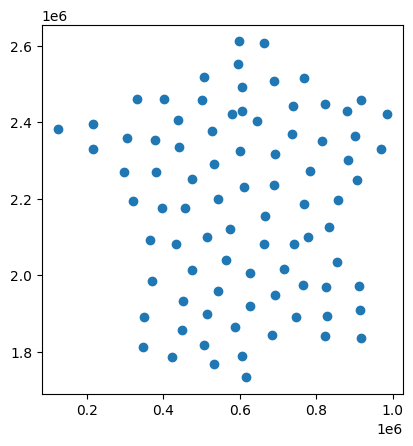

``` python
buffers = ctr.buffer(10000)

buffers
```

```         
0     POLYGON ((842852.279 2126600.576, 842804.126 2...
1     POLYGON ((698485.627 2507622.044, 698437.475 2...
2     POLYGON ((675510.138 2155203.452, 675461.986 2...
3     POLYGON ((922995.751 1908303.142, 922947.598 1...
4     POLYGON ((921433.897 1970311.894, 921385.745 1...
5     POLYGON ((775421.342 1974521.21, 775373.189 19...
6     POLYGON ((776676.638 2515626.684, 776628.486 2...
7     POLYGON ((541866.418 1769020.126, 541818.265 1...
8     POLYGON ((745432.699 2368846.89, 745384.546 23...
9     POLYGON ((616309.985 1788959.109, 616261.832 1...
10    POLYGON ((637416.659 1919941.034, 637368.507 1...
11    POLYGON ((832471.117 1842079.559, 832422.964 1...
12    POLYGON ((412723.656 2459126.284, 412675.503 2...
13    POLYGON ((636174.212 2005646.903, 636126.059 2...
14    POLYGON ((443800.194 2082007.626, 443752.041 2...
15    POLYGON ((375909.867 2091205.198, 375861.714 2...
16    POLYGON ((621728.939 2229456.227, 621680.786 2...
17    POLYGON ((573991.198 2039719.576, 573943.045 2...
18    POLYGON ((793740.64 2272308.158, 793692.487 22...
19    POLYGON ((225377.395 2395187.094, 225329.243 2...
20    POLYGON ((585426.97 2121172.922, 585378.817 21...
21    POLYGON ((484413.294 2012783.542, 484365.141 2...
22    POLYGON ((915029.178 2248422.693, 914981.025 2...
23    POLYGON ((834554.192 1968848.768, 834506.039 1...
24    POLYGON ((512094.781 2458132.967, 512046.629 2...
25    POLYGON ((538405.557 2376945.354, 538357.405 2...
26    POLYGON ((135581.685 2381812.622, 135533.532 2...
27    POLYGON ((758026.671 1889741.898, 757978.519 1...
28    POLYGON ((515488.785 1818042.002, 515440.632 1...
29    POLYGON ((457993.543 1856380.414, 457945.391 1...
30    POLYGON ((379673.086 1984761.456, 379624.933 1...
31    POLYGON ((693371.223 1842508.203, 693323.07 18...
32    POLYGON ((314328.125 2358046.536, 314279.973 2...
33    POLYGON ((551918.644 2197819.649, 551870.492 2...
34    POLYGON ((485497.738 2252225.451, 485449.585 2...
35    POLYGON ((864236.996 2034425.879, 864188.843 2...
36    POLYGON ((866827.166 2197534.908, 866779.013 2...
37    POLYGON ((359357.363 1889851.263, 359309.211 1...
38    POLYGON ((541812.605 2291172.204, 541764.452 2...
39    POLYGON ((752381.226 2082384.235, 752333.073 2...
40    POLYGON ((725668.105 2015246.04, 725619.952 20...
41    POLYGON ((306599.069 2270179.55, 306550.916 22...
42    POLYGON ((610575.529 2323620.281, 610527.377 2...
43    POLYGON ((551891.819 1958418.895, 551843.667 1...
44    POLYGON ((460349.957 1931402.396, 460301.804 1...
45    POLYGON ((702574.008 1946904.144, 702525.855 1...
46    POLYGON ((391070.79 2269736.948, 391022.637 22...
47    POLYGON ((342231.343 2459771.541, 342183.19 24...
48    POLYGON ((749398.849 2440695.138, 749350.696 2...
49    POLYGON ((825193.6 2349544.093, 825145.447 234...
50    POLYGON ((387185.846 2353983.825, 387137.693 2...
51    POLYGON ((891341.646 2427826.564, 891293.494 2...
52    POLYGON ((832960.251 2447828.994, 832912.098 2...
53    POLYGON ((225056.369 2328979.336, 225008.216 2...
54    POLYGON ((926382.211 2457503.19, 926334.058 24...
55    POLYGON ((698652.182 2235714.397, 698604.029 2...
56    POLYGON ((672890.221 2606198.808, 672842.068 2...
57    POLYGON ((616444.169 2490314.728, 616396.017 2...
58    POLYGON ((447195.226 2405054.844, 447147.073 2...
59    POLYGON ((606599.687 2610979.723, 606551.534 2...
60    POLYGON ((672604.872 2080922.991, 672556.72 20...
61    POLYGON ((358100.169 1810981.794, 358052.016 1...
62    POLYGON ((432654.385 1785805.57, 432606.232 17...
63    POLYGON ((625264.814 1732959.66, 625216.661 17...
64    POLYGON ((993954.925 2420757.869, 993906.772 2...
65    POLYGON ((979245.817 2329306.369, 979197.665 2...
66    POLYGON ((788930.881 2099300.365, 788882.728 2...
67    POLYGON ((891647.835 2300228.263, 891599.682 2...
68    POLYGON ((778824.096 2185121.665, 778775.943 2...
69    POLYGON ((452206.509 2334919.466, 452158.357 2...
70    POLYGON ((614900.2 2427750.063, 614852.047 242...
71    POLYGON ((515316.913 2518345.223, 515268.76 25...
72    POLYGON ((654034.202 2403285.04, 653986.049 24...
73    POLYGON ((588580.888 2420049.764, 588532.735 2...
74    POLYGON ((406568.749 2176272.956, 406520.597 2...
75    POLYGON ((605756.54 2551328.207, 605708.387 25...
76    POLYGON ((596275.285 1864878.053, 596227.132 1...
77    POLYGON ((525446.222 1898849.022, 525398.069 1...
78    POLYGON ((926704.277 1834463.794, 926656.124 1...
79    POLYGON ((838068.904 1893623.709, 838020.751 1...
80    POLYGON ((332059.477 2192535.348, 332011.324 2...
81    POLYGON ((466183.284 2175488.824, 466135.131 2...
82    POLYGON ((524516.691 2099653.307, 524468.538 2...
83    POLYGON ((910562.832 2363005.197, 910514.68 23...
84    POLYGON ((701913.683 2316341.407, 701865.53 23...
dtype: geometry
```

``` python
buffers.plot()
```

```         
<Axes: >
```

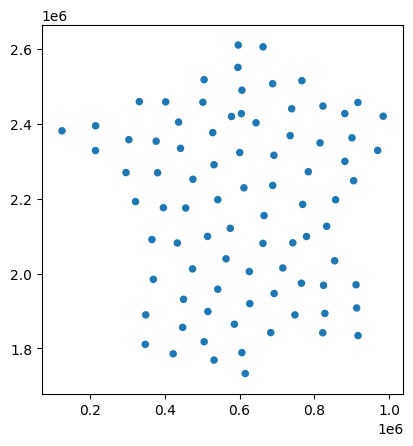